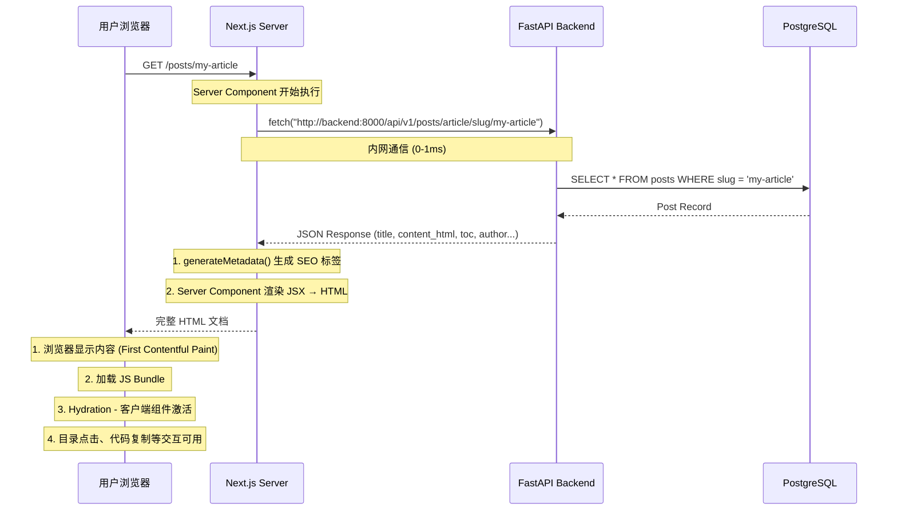
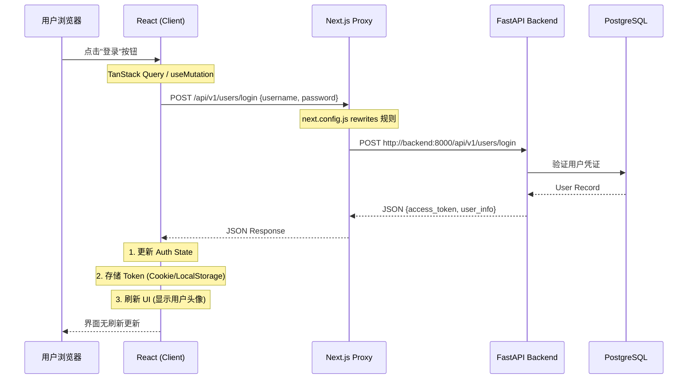
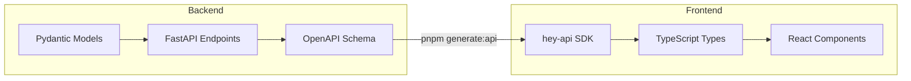

# FastAPI + Next.js 全栈架构数据流说明

本文档详细描述了 `blog_fr` 项目中 FastAPI（后端）与 Next.js（前端）之间的数据交互模式、架构设计理念以及开发注意事项。

---

## 目录

1. [架构概览](#架构概览)
2. [核心组件职责](#核心组件职责)
3. [数据流详解](#数据流详解)
   - [场景 A：服务端渲染（SSR）- 内容展示](#场景-a服务端渲染ssr---内容展示)
   - [场景 B：客户端渲染（CSR）- 用户交互](#场景-b客户端渲染csr---用户交互)
4. [请求代理机制](#请求代理机制)
5. [类型安全（End-to-End Type Safety）](#类型安全end-to-end-type-safety)
6. [开发注意事项](#开发注意事项)
7. [部署架构](#部署架构)

---

## 架构概览

```
┌─────────────────────────────────────────────────────────────────────────────┐
│                              用户浏览器 (Client)                              │
│  ┌─────────────────────────────────────────────────────────────────────────┐ │
│  │  React Components (CSR)  ←→  TanStack Query  ←→  hey-api SDK            │ │
│  └─────────────────────────────────────────────────────────────────────────┘ │
└──────────────────────────────────┬──────────────────────────────────────────┘
                                   │
                                   │ HTTP (Port 3000)
                                   ▼
┌─────────────────────────────────────────────────────────────────────────────┐
│                        Next.js Server (Node.js)                              │
│  ┌─────────────────────────┐    ┌─────────────────────────────────────────┐ │
│  │  Server Components      │    │  API Routes / Proxy                     │ │
│  │  (page.tsx - SSR)       │    │  (next.config.js rewrites)              │ │
│  │  - generateMetadata()   │    │  /api/* → http://backend:8000/api/*     │ │
│  │  - fetch data           │    └─────────────────────────────────────────┘ │
│  │  - render HTML          │                      │                         │
│  └───────────┬─────────────┘                      │                         │
│              │ Internal Fetch                     │ Proxy                   │
│              └────────────────────────────────────┼─────────────────────────┘
                                                    │
                                   │ HTTP (Port 8000, Internal Network)
                                   ▼
┌─────────────────────────────────────────────────────────────────────────────┐
│                         FastAPI Server (Python)                              │
│  ┌─────────────────────────┐    ┌─────────────────────────────────────────┐ │
│  │  API Endpoints          │    │  Business Logic                         │ │
│  │  - /api/v1/posts/...    │    │  - Authentication (JWT)                 │ │
│  │  - /api/v1/users/...    │    │  - Authorization                        │ │
│  │  - /api/v1/media/...    │    │  - Data Validation (Pydantic)           │ │
│  └───────────┬─────────────┘    └─────────────────────────────────────────┘ │
│              │                                                               │
│              │ SQLAlchemy ORM                                                │
│              ▼                                                               │
│  ┌─────────────────────────────────────────────────────────────────────────┐ │
│  │  PostgreSQL Database                                                     │ │
│  └─────────────────────────────────────────────────────────────────────────┘ │
└─────────────────────────────────────────────────────────────────────────────┘
```

---

## 核心组件职责

| 组件                | 技术栈                             | 核心职责                                  |
| ------------------- | ---------------------------------- | ----------------------------------------- |
| **FastAPI Backend** | Python, Pydantic, SQLAlchemy       | 数据存储、业务逻辑、API 接口、权限校验    |
| **Next.js Server**  | Node.js, React Server Components   | SEO 元数据生成、服务端数据预取、HTML 渲染 |
| **Next.js Client**  | React, TanStack Query, hey-api SDK | 用户交互、状态管理、动态更新              |
| **PostgreSQL**      | PostgreSQL 15+                     | 持久化存储                                |
| **Redis** (可选)    | Redis                              | 缓存、Session 存储                        |

---

## 数据流详解

### 场景 A：服务端渲染（SSR）- 内容展示

**典型场景**：用户访问文章详情页 `/posts/my-article`

这是 SEO 友好的核心路径，爬虫和用户首次访问都走这条路。



**关键代码位置**：

- `frontend/src/app/posts/[slug]/page.tsx` - 服务端组件
- `frontend/src/components/post/post-detail-view.tsx` - 客户端渲染组件

**优势**：

- ✅ 首屏加载极快（HTML 直出）
- ✅ SEO 完美（爬虫看到完整内容）
- ✅ 社交分享预览正常（OpenGraph 标签在 HTML 里）

---

### 场景 B：客户端渲染（CSR）- 用户交互

**典型场景**：用户登录、搜索文章、提交评论

这是需要实时交互的路径，无需刷新页面。



**关键代码位置**：

- `frontend/src/shared/api/generated/sdk.gen.ts` - 自动生成的 API 调用函数
- `frontend/src/hooks/use-auth.ts` - 认证状态管理
- `frontend/next.config.ts` - 代理配置

**优势**：

- ✅ 无刷新体验（SPA 级别流畅度）
- ✅ 乐观更新（先显示结果，后同步服务器）
- ✅ 自动重试和缓存（TanStack Query）

---

## 请求代理机制

为了避免浏览器直接请求后端产生的跨域问题（CORS），我们使用 Next.js 作为透明代理。

### 配置位置：`frontend/next.config.ts`

```typescript
// next.config.ts
const nextConfig = {
  async rewrites() {
    return [
      {
        source: "/api/:path*",
        destination: "http://backend:8000/api/:path*", // Docker 内部通信
      },
    ];
  },
};
```

### 请求路径转换

| 浏览器请求                                   | Next.js 代理后                             |
| -------------------------------------------- | ------------------------------------------ |
| `http://localhost:3000/api/v1/posts/article` | `http://backend:8000/api/v1/posts/article` |
| `http://localhost:3000/api/v1/users/login`   | `http://backend:8000/api/v1/users/login`   |

### 注意事项

1. **开发环境** (`npm run dev`)：

   - 如果 Next.js 不在 Docker 里运行，`backend` 主机名无法解析
   - 需要将 `destination` 改为 `http://127.0.0.1:8000/api/:path*`

2. **生产环境** (Docker Compose)：
   - 使用服务名 `backend` 作为主机名
   - 确保 `frontend` 和 `backend` 在同一 Docker 网络中

---

## 类型安全（End-to-End Type Safety）

本项目通过 OpenAPI 规范实现前后端类型共享。



### 工作流程

1. **后端定义模型**：

   ```python
   # backend/posts/schema.py
   class PostResponse(BaseModel):
       id: UUID
       title: str
       content_html: str
       toc: list[TocItem] | None
   ```

2. **自动生成 OpenAPI**：
   FastAPI 自动在 `/openapi.json` 暴露 Schema

3. **前端生成 SDK**：

   ```bash
   cd frontend
   pnpm generate:api  # 调用 @hey-api/openapi-ts
   ```

4. **类型安全调用**：
   ```typescript
   // 自动补全、类型检查
   const { data } = await getPostBySlug({
     path: { post_type: "article", slug: "my-post" },
   });
   // data.title ✅ 类型推断正确
   // data.titl  ❌ TypeScript 报错
   ```

### 优势

- 后端改字段名 → 前端编译失败 → 及时发现问题
- IDE 自动补全 → 开发效率提升
- 无需手动维护类型定义

---

## 开发注意事项

### 1. SSR 与 CSR 的选择原则

| 页面类型                   | 推荐方式                   | 原因                         |
| -------------------------- | -------------------------- | ---------------------------- |
| 文章详情、博客列表、关于页 | **SSR** (Server Component) | SEO 重要、首屏速度优先       |
| 用户仪表盘、设置页         | **CSR** (Client Component) | 无需 SEO、交互复杂           |
| 登录/注册弹窗              | **CSR**                    | 敏感信息不应出现在 HTML 源码 |

### 2. Next.js 15 的 Breaking Changes

**params 必须 await**：

```typescript
// ❌ 错误 (Next.js 14 及之前)
export default async function Page({ params }: { params: { slug: string } }) {
  const post = await getPost(params.slug);
}

// ✅ 正确 (Next.js 15+)
export default async function Page({
  params,
}: {
  params: Promise<{ slug: string }>;
}) {
  const { slug } = await params;
  const post = await getPost(slug);
}
```

### 3. 环境变量配置

| 变量名                 | 用途            | 开发默认值              | 生产默认值            |
| ---------------------- | --------------- | ----------------------- | --------------------- |
| `BACKEND_INTERNAL_URL` | SSR 时后端地址  | `http://127.0.0.1:8000` | `http://backend:8000` |
| `NEXT_PUBLIC_API_URL`  | 客户端 API 地址 | (不设置，用代理)        | (不设置，用代理)      |

### 4. 避免数据重复请求

Next.js 的 `fetch` 默认有 Request Deduplication。同一请求在同一渲染周期内只会执行一次。

```typescript
// generateMetadata 和 Page 组件都调用 getPost(slug)
// 实际只会发起 1 次网络请求
export async function generateMetadata({ params }) {
  const post = await getPost(slug); // 第 1 次调用
}

export default async function Page({ params }) {
  const post = await getPost(slug); // 使用缓存结果
}
```

### 5. 错误处理策略

| 错误类型         | 处理方式                                |
| ---------------- | --------------------------------------- |
| 404 Not Found    | 调用 `notFound()` 显示 Next.js 404 页面 |
| 401 Unauthorized | 重定向到登录页                          |
| 500 Server Error | 显示友好错误页面，记录日志              |

---

## 部署架构

### Docker Compose 网络拓扑

```
┌─────────────────────────────────────────────────────────────────┐
│                     Docker Network: blog_network                 │
│                                                                  │
│   ┌─────────────┐     ┌─────────────┐     ┌─────────────┐       │
│   │  frontend   │     │   backend   │     │  postgres   │       │
│   │  (Next.js)  │────▶│  (FastAPI)  │────▶│ (Database)  │       │
│   │  Port 3000  │     │  Port 8000  │     │  Port 5432  │       │
│   └─────────────┘     └─────────────┘     └─────────────┘       │
│         │                                                        │
└─────────┼────────────────────────────────────────────────────────┘
          │
          ▼ (Port 3000 映射到宿主机)
    ┌─────────────┐
    │  Nginx /    │
    │  Traefik    │──────▶ 外部用户
    │  (可选)     │
    └─────────────┘
```

### 关键配置

```yaml
# docker-compose.yml
services:
  frontend:
    build: ./frontend
    ports:
      - "3000:3000"
    environment:
      - BACKEND_INTERNAL_URL=http://backend:8000
    depends_on:
      - backend

  backend:
    build: ./backend
    expose:
      - "8000" # 不对外暴露，仅内网通信
    depends_on:
      - postgres

  postgres:
    image: postgres:15
    volumes:
      - postgres_data:/var/lib/postgresql/data
```

---

## 总结

本架构实现了：

1. **性能与 SEO 的完美平衡**：内容页 SSR，应用页 CSR
2. **开发效率最大化**：OpenAPI 自动生成 TypeScript SDK
3. **部署简单可靠**：Docker Compose 一键启动全栈
4. **语言解耦**：Python 做数据处理，TypeScript 做 UI 构建

如有疑问，请参考具体代码文件或提交 Issue。
