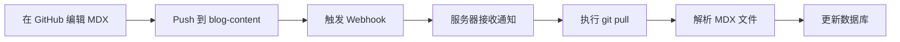
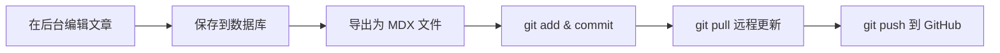
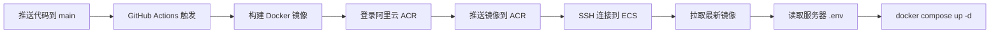

# 🚀 部署指南 - 环境变量配置

本文档说明如何在生产环境中正确配置环境变量。

---

## 📋 环境变量管理策略

### 1. 文件位置总览

```
项目结构：
├── .env.example                    # 开发环境模板（已提交到 Git）
├── .env.production.template        # 生产环境模板（已提交到 Git）
├── .env                           # ❌ 本地/服务器实际配置（不提交到 Git）
└── .github/workflows/
    └── deploy.yml                 # GitHub Actions 部署脚本
```

### 2. 环境变量配置位置

根据你的部署架构，环境变量需要配置在**两个地方**：

#### 📍 位置 1: 服务器上的 `.env` 文件（主要配置）

**路径**: `/home/tomy/blog_fr/.env`

**用途**:

- Docker Compose 在服务器上运行时读取
- 包含所有敏感信息（数据库密码、密钥等）
- 配置域名、数据库、后端、前端等所有服务

**创建步骤**:

```bash
# 1. SSH 登录到你的阿里云 ECS
ssh tomy@your-server-ip

# 2. 进入部署目录
cd /home/tomy/blog_fr

# 3. 创建 .env 文件（基于模板）
cp .env.production.template .env

# 4. 编辑配置文件
vim .env  # 或使用 nano .env
```

**必须修改的字段**:

```bash
# 域名配置
DOMAIN_NAME=www.yourdomain.com              # 前端域名
API_DOMAIN_NAME=api.yourdomain.com          # 后端 API 域名

# 数据库密码
POSTGRES_PASSWORD=your_strong_db_password

# 后端密钥（生成方法：openssl rand -hex 32）
SECRET_KEY=your_generated_secret_key
DATABASE_URL=postgresql://postgres:your_strong_db_password@db:5432/blog_fr

# 管理员密码
FIRST_SUPERUSER_PASSWORD=your_admin_password

# CORS 配置（使用你的真实域名）
BACKEND_CORS_ORIGINS=["https://www.yourdomain.com","https://api.yourdomain.com"]

# 前端配置
NEXT_PUBLIC_API_URL=https://api.yourdomain.com
FRONTEND_URL=https://www.yourdomain.com

# 认证密钥
AUTH_GATE_SECRET=your_auth_gate_secret
REVALIDATE_SECRET=your_revalidate_secret

# 媒体文件 URL
MEDIA_URL=https://api.yourdomain.com/media/
BASE_URL=https://api.yourdomain.com

# Git Webhook 密钥（用于 GitHub → 服务器同步）
WEBHOOK_SECRET=your_webhook_secret_key
```

#### 📍 位置 2: GitHub Secrets（CI/CD 配置）

**路径**: GitHub 仓库 → Settings → Secrets and variables → Actions

**用途**:

- GitHub Actions 部署时使用
- 主要用于构建时需要的变量和服务器连接信息

**需要配置的 Secrets**:

| Secret 名称           | 说明                        | 示例值                     |
| --------------------- | --------------------------- | -------------------------- |
| `ACR_USERNAME`        | 阿里云 ACR 用户名（推荐）   | nick1167443868             |
| `ACR_PASSWORD`        | 阿里云 ACR 固定密码（推荐） | your_acr_password          |
| `ECS_IP`              | 服务器 IP 地址              | 123.456.789.0              |
| `ECS_USER`            | SSH 用户名                  | tomy                       |
| `ECS_PASSWORD`        | SSH 密码                    | your_ssh_password          |
| `NEXT_PUBLIC_API_URL` | 前端构建时的 API 地址       | https://api.yourdomain.com |

**可选的 Secrets（AccessKey 方式，不推荐）**:

| Secret 名称        | 说明                    | 示例值    |
| ------------------ | ----------------------- | --------- |
| `ALIYUN_AK_ID`     | 阿里云 AccessKey ID     | LTAI5t... |
| `ALIYUN_AK_SECRET` | 阿里云 AccessKey Secret | xxxxxx    |

> **💡 推荐使用固定密码方式**：固定密码比 AccessKey 更简单、更稳定，适合容器镜像推送场景。

**配置步骤**:

1. **设置 ACR 固定密码**:

   - 登录阿里云容器镜像服务控制台
   - 进入"访问凭证"页面
   - 点击"设置固定密码"
   - 记下你的用户名（通常显示在页面顶部，如 `nick1167443868`）

2. **添加 GitHub Secrets**:
   - 访问: `https://github.com/你的用户名/blog_fr/settings/secrets/actions`
   - 点击 "New repository secret"
   - 逐个添加上述 Secrets

---

## � Git 双向同步配置

本项目支持 **双向 Git 同步**：

- **GitHub → 服务器**：通过 Webhook 自动同步文章内容
- **服务器 → GitHub**：管理后台编辑文章后自动推送到 GitHub

### 1. 配置 SSH 密钥（服务器 → GitHub）

在服务器上配置 SSH 密钥，用于自动推送到 GitHub：

```bash
# 1. SSH 登录到服务器
ssh tomy@your-server-ip

# 2. 生成 SSH 密钥（如果还没有）
ssh-keygen -t ed25519 -C "your_email@example.com"
# 按 Enter 使用默认路径，可以设置密码或留空

# 3. 查看公钥
cat ~/.ssh/id_ed25519.pub

# 4. 复制公钥内容，添加到 GitHub
# 访问：https://github.com/settings/keys
# 点击 "New SSH key"，粘贴公钥内容

# 5. 测试 SSH 连接
ssh -T git@github.com
# 应该看到：Hi username! You've successfully authenticated...
```

### 2. 初始化 content 子模块

```bash
# 在服务器的项目目录中
cd /home/tomy/blog_fr

# 初始化并更新子模块
git submodule update --init --recursive

# 进入 content 目录
cd content

# 配置 Git 用户信息（如果需要）
git config user.email "admin@blog.local"
git config user.name "Blog Admin"

# 验证远程仓库配置
git remote -v
# 应该显示 SSH URL：git@github.com:username/blog-content.git
```

### 3. 配置 GitHub Webhook（GitHub → 服务器）

在 blog-content 仓库中配置 Webhook：

1. **访问仓库设置**：

   - 打开：`https://github.com/username/blog-content/settings/hooks`
   - 点击 "Add webhook"

2. **配置 Webhook**：

   ```
   Payload URL: https://api.yourdomain.com/api/v1/ops/git/webhook
   Content type: application/json
   Secret: your_webhook_secret_key  # 与 .env 中的 WEBHOOK_SECRET 一致
   Events: Just the push event
   Active: ✓
   ```

3. **验证配置**：
   - 保存后，GitHub 会发送测试请求
   - 在 "Recent Deliveries" 中查看响应状态
   - 应该看到 200 响应

### 4. 工作流程说明

#### 场景 1：在 GitHub 上编辑文章



#### 场景 2：在管理后台编辑文章



### 5. 自动提交配置

后端会在以下操作时自动提交到 GitHub：

- **创建文章**：`feat: create post 'title'`
- **更新文章**：`chore: update post 'title'`
- **删除文章**：`chore: delete post 'title'`

Git 用户信息会自动配置为：

- Email: `admin@blog.local`
- Name: `Blog Admin`

如需自定义，可在容器中手动配置：

```bash
docker exec -it blog_fr-backend-1 bash
cd /app/content
git config --local user.email "your@email.com"
git config --local user.name "Your Name"
```

### 6. 故障排查

#### 问题 1: Webhook 返回 404

**检查**：

- URL 是否正确：`https://api.yourdomain.com/api/v1/ops/git/webhook`
- 后端服务是否正常运行
- Caddy 反向代理配置是否正确

#### 问题 2: 自动推送失败

**检查**：

```bash
# 1. 验证 SSH 密钥
docker exec -it blog_fr-backend-1 ssh -T git@github.com

# 2. 查看 Git 配置
docker exec -it blog_fr-backend-1 bash
cd /app/content
git config --list

# 3. 手动测试推送
git push origin main
```

#### 问题 3: Webhook Secret 验证失败

**检查**：

- `.env` 中的 `WEBHOOK_SECRET` 是否与 GitHub Webhook 配置一致
- 重启后端服务：`docker compose restart backend`

---

## 🔄 部署流程说明

### 当前部署流程



### 关键点

1. **ACR 认证**:

   - 推荐使用**固定密码**方式（`ACR_USERNAME` + `ACR_PASSWORD`）
   - 也可以使用 AccessKey 方式（`ALIYUN_AK_ID` + `ALIYUN_AK_SECRET`）
   - 固定密码更稳定，适合 CI/CD 场景

2. **构建阶段**:

   - Frontend 镜像构建时需要 `NEXT_PUBLIC_API_URL`（从 GitHub Secrets 读取）
   - Backend 镜像不需要构建时变量

3. **运行阶段**:
   - 所有运行时环境变量从服务器的 `.env` 文件读取
   - Docker Compose 自动加载 `.env` 文件

---

## ⚠️ 安全注意事项

### ✅ 应该做的

- ✅ 将 `.env` 添加到 `.gitignore`（已完成）
- ✅ 使用强密码和随机密钥
- ✅ 定期轮换密钥和密码
- ✅ 限制服务器 SSH 访问（使用密钥认证）
- ✅ 使用 GitHub Secrets 存储敏感信息

### ❌ 不应该做的

- ❌ 不要将 `.env` 文件提交到 Git
- ❌ 不要在代码中硬编码密钥
- ❌ 不要在公开的 Issue 或 PR 中暴露密钥
- ❌ 不要使用弱密码（如 `123456`、`password`）

---

## 🛠️ 常用命令

### 在服务器上查看环境变量

```bash
# 查看 .env 文件内容（注意保护敏感信息）
cat /home/tomy/blog_fr/.env

# 查看容器使用的环境变量
docker compose config

# 查看特定服务的环境变量
docker compose exec backend env
```

### 更新环境变量后重启服务

```bash
cd /home/tomy/blog_fr

# 重启所有服务
docker compose down
docker compose up -d

# 或只重启特定服务
docker compose restart backend
docker compose restart frontend
```

### 生成安全密钥

```bash
# 生成 SECRET_KEY
openssl rand -hex 32

# 生成随机密码
openssl rand -base64 24
```

---

## 🔍 故障排查

### 问题 1: GitHub Actions 部署失败 - ACR 认证错误

**错误信息**: `unauthorized: authentication required`

**原因**: 阿里云容器镜像服务认证失败

**解决方案**:

1. **检查 GitHub Secrets 是否正确配置**:

   - `ACR_USERNAME`: 你的 ACR 用户名（如 `nick1167443868`）
   - `ACR_PASSWORD`: 在 ACR 控制台设置的固定密码

2. **验证 ACR 固定密码**:

   ```bash
   # 在本地测试登录
   echo "your_password" | docker login \
     crpi-qvig00qix6yo4bi5.cn-hangzhou.personal.cr.aliyuncs.com \
     --username your_username \
     --password-stdin
   ```

3. **确认仓库已创建**:
   - 登录阿里云 ACR 控制台
   - 确认以下仓库存在：
     - `blog-project/blog-backend`
     - `blog-project/blog-frontend`
     - `blog-project/blog-caddy`

### 问题 2: 服务启动失败

**检查步骤**:

```bash
# 1. 查看服务日志
docker compose logs backend
docker compose logs frontend

# 2. 检查 .env 文件是否存在
ls -la /home/tomy/blog_fr/.env

# 3. 验证环境变量是否正确加载
docker compose config | grep -A 5 "environment"
```

### 问题 3: CORS 错误

**原因**: `BACKEND_CORS_ORIGINS` 配置不正确

**解决**:

```bash
# 编辑 .env 文件
vim /home/tomy/blog_fr/.env

# 确保使用 JSON 数组格式
BACKEND_CORS_ORIGINS=["https://www.yourdomain.com","https://api.yourdomain.com"]

# 重启后端服务
docker compose restart backend
```

### 问题 4: 前端无法连接后端

**检查清单**:

- [ ] `NEXT_PUBLIC_API_URL` 是否正确（应该是 `https://api.yourdomain.com`）
- [ ] `BACKEND_INTERNAL_URL` 是否正确（应该是 `http://backend:8000`）
- [ ] Caddy 是否正确配置了反向代理
- [ ] 防火墙是否开放了 80 和 443 端口

### 问题 5: Git 自动提交失败

**错误信息**: `Git push failed` 或 `fatal: could not read Username`

**解决步骤**:

```bash
# 1. 检查 SSH 密钥配置
docker exec -it blog_fr-backend-1 ssh -T git@github.com

# 2. 如果提示 "Permission denied"，重新配置 SSH 密钥
# 在宿主机上：
cat ~/.ssh/id_ed25519.pub
# 将公钥添加到 GitHub: https://github.com/settings/keys

# 3. 检查 content 目录的 Git 配置
docker exec -it blog_fr-backend-1 bash
cd /app/content
git config --local user.email
git config --local user.name

# 4. 如果未配置，会自动使用默认值：
# Email: admin@blog.local
# Name: Blog Admin

# 5. 手动测试推送
git push origin main

# 6. 查看后端日志
docker compose logs backend | grep -i git
```

### 问题 6: Webhook 同步失败

**检查步骤**:

```bash
# 1. 查看后端日志
docker compose logs backend | grep -i webhook

# 2. 验证 Webhook Secret
# 在 GitHub Webhook 设置中点击 "Recent Deliveries"
# 查看响应状态和错误信息

# 3. 手动触发同步
docker exec -it blog_fr-backend-1 python scripts/sync_git_content.py

# 4. 检查 content 目录权限
docker exec -it blog_fr-backend-1 ls -la /app/content
```

---

## 📚 相关文档

- [README.md](./README.md) - 项目介绍和快速开始
- [.env.production.template](./.env.production.template) - 生产环境配置模板
- [docker-compose.yml](./docker-compose.yml) - Docker Compose 配置
- [GitHub Actions 部署配置](./.github/workflows/deploy.yml)
- [Git 自动提交修复说明](./backend/docs/GIT_AUTO_COMMIT_FIX.md) - Git 双向同步技术细节

---

## 🆘 需要帮助？

如果遇到问题，请检查：

1. 服务器上的 `.env` 文件是否存在且配置正确
2. GitHub Secrets 是否都已配置
3. 域名 DNS 是否正确解析到服务器 IP
4. 服务器防火墙是否开放必要端口（80, 443）
5. Docker 容器日志中的错误信息
6. SSH 密钥是否正确配置（用于 Git 推送）
7. GitHub Webhook 是否正确配置（用于 Git 拉取）

---

**祝部署顺利！** 🎉
