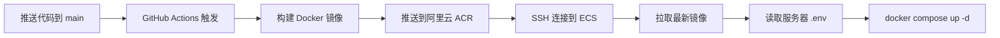

# 🚀 部署指南 - 环境变量配置

本文档说明如何在生产环境中正确配置环境变量。

---

## 📋 环境变量管理策略

### 1. 文件位置总览

```
项目结构：
├── .env.example                    # 开发环境模板（已提交到 Git）
├── .env.production.template        # 生产环境模板（已提交到 Git）
├── .env                           # ❌ 本地/服务器实际配置（不提交到 Git）
└── .github/workflows/
    └── deploy.yml                 # GitHub Actions 部署脚本
```

### 2. 环境变量配置位置

根据你的部署架构，环境变量需要配置在**两个地方**：

#### 📍 位置 1: 服务器上的 `.env` 文件（主要配置）

**路径**: `/home/tomy/blog_fr/.env`

**用途**:

- Docker Compose 在服务器上运行时读取
- 包含所有敏感信息（数据库密码、密钥等）
- 配置域名、数据库、后端、前端等所有服务

**创建步骤**:

```bash
# 1. SSH 登录到你的阿里云 ECS
ssh tomy@your-server-ip

# 2. 进入部署目录
cd /home/tomy/blog_fr

# 3. 创建 .env 文件（基于模板）
cp .env.production.template .env

# 4. 编辑配置文件
vim .env  # 或使用 nano .env
```

**必须修改的字段**:

```bash
# 域名配置
DOMAIN_NAME=www.yourdomain.com              # 前端域名
API_DOMAIN_NAME=api.yourdomain.com          # 后端 API 域名

# 数据库密码
POSTGRES_PASSWORD=your_strong_db_password

# 后端密钥（生成方法：openssl rand -hex 32）
SECRET_KEY=your_generated_secret_key
DATABASE_URL=postgresql://postgres:your_strong_db_password@db:5432/blog_fr

# 管理员密码
FIRST_SUPERUSER_PASSWORD=your_admin_password

# CORS 配置（使用你的真实域名）
BACKEND_CORS_ORIGINS="https://www.yourdomain.com,https://api.yourdomain.com"

# 前端配置
NEXT_PUBLIC_API_URL=https://api.yourdomain.com
FRONTEND_URL=https://www.yourdomain.com

# 认证密钥
AUTH_GATE_SECRET=your_auth_gate_secret
REVALIDATE_SECRET=your_revalidate_secret

# 媒体文件 URL
MEDIA_URL=https://api.yourdomain.com/media/
BASE_URL=https://api.yourdomain.com
```

#### 📍 位置 2: GitHub Secrets（CI/CD 配置）

**路径**: GitHub 仓库 → Settings → Secrets and variables → Actions

**用途**:

- GitHub Actions 部署时使用
- 主要用于构建时需要的变量和服务器连接信息

**需要配置的 Secrets**:

| Secret 名称           | 说明                    | 示例值                     |
| --------------------- | ----------------------- | -------------------------- |
| `ALIYUN_AK_ID`        | 阿里云 AccessKey ID     | LTAI5t...                  |
| `ALIYUN_AK_SECRET`    | 阿里云 AccessKey Secret | xxxxxx                     |
| `ECS_IP`              | 服务器 IP 地址          | 123.456.789.0              |
| `ECS_USER`            | SSH 用户名              | tomy                       |
| `ECS_PASSWORD`        | SSH 密码                | your_ssh_password          |
| `NEXT_PUBLIC_API_URL` | 前端构建时的 API 地址   | https://api.yourdomain.com |

**配置步骤**:

1. 访问: `https://github.com/你的用户名/blog_fr/settings/secrets/actions`
2. 点击 "New repository secret"
3. 逐个添加上述 Secrets

---

## 🔄 部署流程说明

### 当前部署流程



### 关键点

1. **构建阶段**:

   - Frontend 镜像构建时需要 `NEXT_PUBLIC_API_URL`（从 GitHub Secrets 读取）
   - Backend 镜像不需要构建时变量

2. **运行阶段**:
   - 所有运行时环境变量从服务器的 `.env` 文件读取
   - Docker Compose 自动加载 `.env` 文件

---

## ⚠️ 安全注意事项

### ✅ 应该做的

- ✅ 将 `.env` 添加到 `.gitignore`（已完成）
- ✅ 使用强密码和随机密钥
- ✅ 定期轮换密钥和密码
- ✅ 限制服务器 SSH 访问（使用密钥认证）
- ✅ 使用 GitHub Secrets 存储敏感信息

### ❌ 不应该做的

- ❌ 不要将 `.env` 文件提交到 Git
- ❌ 不要在代码中硬编码密钥
- ❌ 不要在公开的 Issue 或 PR 中暴露密钥
- ❌ 不要使用弱密码（如 `123456`、`password`）

---

## 🛠️ 常用命令

### 在服务器上查看环境变量

```bash
# 查看 .env 文件内容（注意保护敏感信息）
cat /home/tomy/blog_fr/.env

# 查看容器使用的环境变量
docker compose config

# 查看特定服务的环境变量
docker compose exec backend env
```

### 更新环境变量后重启服务

```bash
cd /home/tomy/blog_fr

# 重启所有服务
docker compose down
docker compose up -d

# 或只重启特定服务
docker compose restart backend
docker compose restart frontend
```

### 生成安全密钥

```bash
# 生成 SECRET_KEY
openssl rand -hex 32

# 生成随机密码
openssl rand -base64 24
```

---

## 🔍 故障排查

### 问题 1: 服务启动失败

**检查步骤**:

```bash
# 1. 查看服务日志
docker compose logs backend
docker compose logs frontend

# 2. 检查 .env 文件是否存在
ls -la /home/tomy/blog_fr/.env

# 3. 验证环境变量是否正确加载
docker compose config | grep -A 5 "environment"
```

### 问题 2: CORS 错误

**原因**: `BACKEND_CORS_ORIGINS` 配置不正确

**解决**:

```bash
# 编辑 .env 文件
vim /home/tomy/blog_fr/.env

# 确保包含你的前端域名
BACKEND_CORS_ORIGINS="https://www.yourdomain.com,https://api.yourdomain.com"

# 重启后端服务
docker compose restart backend
```

### 问题 3: 前端无法连接后端

**检查清单**:

- [ ] `NEXT_PUBLIC_API_URL` 是否正确（应该是 `https://api.yourdomain.com`）
- [ ] `BACKEND_INTERNAL_URL` 是否正确（应该是 `http://backend:8000`）
- [ ] Caddy 是否正确配置了反向代理
- [ ] 防火墙是否开放了 80 和 443 端口

---

## 📚 相关文档

- [README.md](./README.md) - 项目介绍和快速开始
- [.env.production.template](./.env.production.template) - 生产环境配置模板
- [docker-compose.yml](./docker-compose.yml) - Docker Compose 配置
- [GitHub Actions 部署配置](./.github/workflows/deploy.yml)

---

## 🆘 需要帮助？

如果遇到问题，请检查：

1. 服务器上的 `.env` 文件是否存在且配置正确
2. GitHub Secrets 是否都已配置
3. 域名 DNS 是否正确解析到服务器 IP
4. 服务器防火墙是否开放必要端口（80, 443）
5. Docker 容器日志中的错误信息

---

**祝部署顺利！** 🎉
