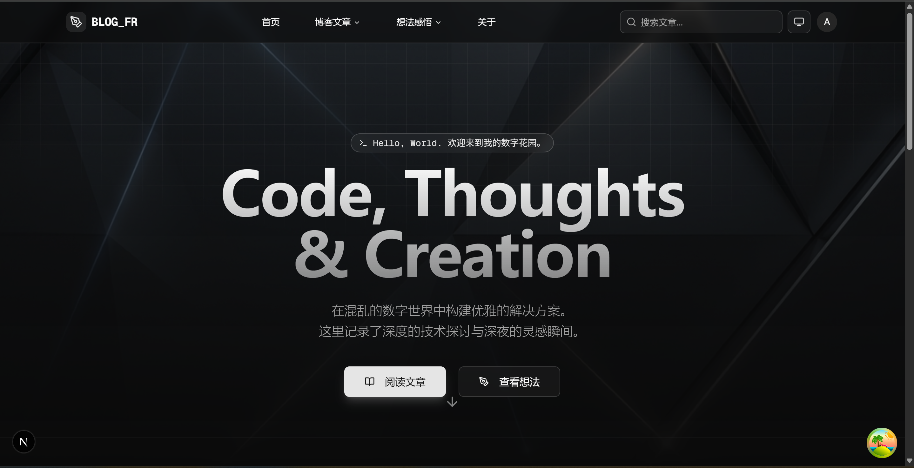

# 🚀 Blog FR - 现代全栈博客系统

[](https://github.com/sumanin5/blog_fr)
[](LICENSE)
[](https://www.python.org/)
[](https://nodejs.org/)
[](https://pnpm.io/)
[](https://github.com/astral-sh/uv)

**Blog FR** 是一个基于 **FastAPI** 和 **Next.js 16** 构建的现代全栈博客系统。它集成了高性能后端、React Server Components 以及丰富的 MDX 渲染能力，旨在提供极致的写作与阅读体验。

## 🌓 主题展示

支持深色和浅色两种主题模式，为用户提供舒适的阅读体验：

<table>
  <tr>
    <td width="50%" align="center">
      <b>☀️ 浅色主题</b><br/>
      
    </td>
    <td width="50%" align="center">
      <b>🌙 深色主题</b><br/>
      
    </td>
  </tr>
</table>

> 💡 基于 `next-themes` 实现，支持系统主题自动跟随，用户偏好自动保存。[查看更多功能展示 →](./SHOWCASE.md)

---

## ✨ 核心特性

- 🎨 **现代设计**: Tailwind CSS 4 + shadcn/ui，深色/浅色主题无缝切换，响应式布局
- 📝 **增强型 MDX**: Mermaid 图表、代码高亮 (highlight.js)、数学公式 (KaTeX)、交互式组件
- ⚡ **混合渲染架构**:
  - **SSR**: 博客文章页面，最佳 SEO 和首屏加载
  - **CSR**: 管理后台，流畅的 SPA 体验
  - **后端**: FastAPI + SQLModel，异步高性能
- 🔗 **OpenAPI 驱动**: hey-api 自动生成类型安全的前端 SDK
- 🖼️ **媒体管理**: 多规格缩略图自动生成，SVG 图标支持
- 🔍 **SEO 友好**: 语义化 HTML、动态元数据、OpenGraph 标签
- 🐳 **容器化部署**: Docker Compose 一键启动开发/生产环境
- 🧪 **质量保证**: Pytest 测试框架 + 代码覆盖率
- 🔄 **GitOps 同步**: 依赖注入容器模式，支持增量/全量同步
- 🛡️ **统一错误处理**: 标准化错误响应格式 + 全链路追踪

> 📸 **查看效果**: 想要直观了解这些特性？访问 [功能展示文档](./SHOWCASE.md) 查看完整的界面截图和功能演示！

---

## 🛠️ 技术栈

### 后端 (Backend)

- **框架**: [FastAPI](https://fastapi.tiangolo.com/) (Python 3.13+)
- **ORM**: [SQLModel](https://sqlmodel.tiangolo.com/) (SQLAlchemy + Pydantic)
- **迁移**: [Alembic](https://alembic.sqlalchemy.org/)
- **数据库**: [PostgreSQL 17](https://www.postgresql.org/)
- **包管理**: [UV](https://github.com/astral-sh/uv) (极速 Python 包管理器)
- **API 文档**: [Scalar](https://scalar.com/) + OpenAPI 3.0

### 前端 (Frontend)

- **框架**: [Next.js 16](https://nextjs.org/) (React 19 + App Router)
- **语言**: [TypeScript](https://www.typescriptlang.org/)
- **样式**: [Tailwind CSS 4](https://tailwindcss.com/), [Shadcn UI](https://ui.shadcn.com/)
- **状态管理**: [TanStack Query v5](https://tanstack.com/query)
- **数据获取**: [hey-api SDK](https://www.heypi.com/) (基于 OpenAPI 自动生成)
- **主题系统**: [next-themes](https://github.com/pacocoursey/next-themes) - 支持深色/浅色模式，自动跟随系统主题
- **内容渲染**: MDX + Mermaid + KaTeX + highlight.js

---

## 🚀 快速开始

### 1. 克隆项目

```bash
git clone https://github.com/sumanin5/blog_fr.git
cd blog_fr
```

### 2. 环境配置

复制环境变量模板并根据需要修改：

```bash
cp .env.example .env
cp frontend/.env.example frontend/.env
```

### 3. 一键启动 (Docker)

这是最快的方式，将同时启动数据库、后端、前端和管理工具：

```bash
# 开发环境（支持热重载）
docker compose -f docker-compose.dev.yml up

# 生产环境
docker compose up -d
```

访问：

- 前端: `http://localhost:3000` (开发) 或 `http://localhost:80` (生产)
- API 文档: `http://localhost:8000/scalar`
- 后端健康检查: `http://localhost:8000/`

---

## 💻 本地开发

### 前端开发

```bash
cd frontend
pnpm install
pnpm dev        # 启动开发服务器 (http://localhost:3000)
pnpm build      # 构建生产版本
./scripts/generate-api.sh  # 从 OpenAPI schema 生成类型安全的 SDK
```

### 后端开发

```bash
cd backend
uv sync            # 安装依赖
uv run fastapi dev app/main.py  # 启动开发服务器 (http://localhost:8000)
uv run pytest      # 运行测试
```

### 🔧 自动化开发脚本

项目在 `scripts/` 目录下提供了一系列脚本来简化日常开发任务：

| 脚本                          | 描述                   | 使用场景                                         |
| ----------------------------- | ---------------------- | ------------------------------------------------ |
| `./scripts/generate-api.sh`   | **全自动生成 API SDK** | 后端接口变更后，一键更新前端 TypeScript 类型定义 |
| `./scripts/db-migrate.sh`     | 数据库迁移辅助         | 创建新表或修改模型后使用                         |
| `./scripts/docker-rebuild.sh` | 重建所有 Docker 容器   | 修改了依赖或 Dockerfile 后使用                   |

### API SDK 生成

项目使用 OpenAPI 规范实现前后端类型安全：

1. 后端自动生成 OpenAPI schema: `http://localhost:8000/openapi.json`
2. 前端使用 hey-api/openapi-ts 自动生成 TypeScript SDK
3. 修改后端 API 后运行 `npm run api:generate` 更新前端类型

---

## 🗂️ 项目结构

```text
blog_fr/
├── backend/                      # FastAPI 后端服务
│   ├── app/
│   │   ├── core/                # 核心配置和工具
│   │   ├── users/               # 用户认证和授权
│   │   ├── posts/               # 文章管理
│   │   ├── media/               # 媒体文件管理
│   │   └── middleware/          # 自定义中间件
│   ├── tests/                   # Pytest 测试
│   ├── alembic/                 # 数据库迁移
│   └── pyproject.toml           # Python 项目配置
├── frontend/                     # Next.js 前端应用
│   ├── src/
│   │   ├── app/                 # Next.js App Router 页面
│   │   ├── components/          # React 组件
│   │   ├── shared/api/          # 自动生成的 API SDK
│   │   └── config/              # 配置文件
│   ├── public/                  # 静态资源
│   └── package.json             # Node.js 项目配置
├── scripts/                     # 自动化脚本
├── docker-compose.yml           # 生产环境配置
├── docker-compose.dev.yml       # 开发环境配置
├── ARCHITECTURE.md              # 架构详细文档
└── README.md                    # 本文件
```

### 架构亮点

- **混合渲染**: Next.js App Router 支持 SSR 和 CSR，根据页面特性自动选择最佳渲染策略
- **类型安全**: OpenAPI schema 自动生成 TypeScript SDK，确保前后端接口类型一致
- **模块化设计**: 后端按功能模块划分（users、posts、media、git_ops），前端按组件和功能组织
- **开发体验**: 支持 Hot Reload、TypeScript 检查、自动格式化

### GitOps 内容同步模块

`git_ops` 模块是一个基于**依赖注入容器模式**的内容同步引擎，实现了从 Git 仓库到数据库的自动化内容管理。

**核心特性**:

- 🔄 **增量同步**: 基于 Git Diff 的智能增量同步，显著提升性能
- 📦 **依赖注入容器**: 统一管理所有依赖关系，支持延迟加载和单例模式
- 🛡️ **显式错误处理**: 采用 Pythonic 的 try-except 块，控制流清晰
- 🔍 **全链路追踪**: 所有操作都有详细的日志和错误追踪
- 🧪 **易于测试**: 可以轻松 mock 整个容器或单个组件

**架构模式**:

```
GitOpsService (门面)
    ↓
GitOpsContainer (容器)
    ↓
服务层 (SyncService, PreviewService, etc.)
    ↓
核心组件 (Scanner, Serializer, GitClient)
```

详细文档:

- [GitOps 架构设计](./backend/app/git_ops/ARCHITECTURE.md)
- [依赖注入详解](./backend/app/git_ops/DEPENDENCY_INJECTION_EXPLAINED.md)
- [同步流程可视化](./backend/app/git_ops/SYNC_FLOW_WITH_DI.md)

### 错误处理模式

项目采用了 **FastAPI 全局异常处理器模式**，这是一个标准且优秀的企业级实践：

**核心特点**:

- ✅ **统一响应结构**: 所有错误都遵循统一的 JSON 格式
- ✅ **集中式处理**: 业务代码只需 `raise` 异常，不需要关心如何返回 JSON
- ✅ **环境隔离**: 开发环境返回详细错误，生产环境隐藏敏感信息
- ✅ **全链路追踪**: 所有错误响应都包含 `request_id`

详见 [后端 README - 错误处理模式](./backend/README.md#-错误处理模式)。

关于架构的详细说明，请参阅 [架构文档](./ARCHITECTURE.md)。

---

## 🧪 测试

### 后端测试

```bash
cd backend
# 运行所有测试
pytest

# 运行测试并生成覆盖率报告
pytest --cov=app --cov-report=html

# 运行特定模块的测试
pytest tests/api/posts/
pytest tests/api/users/
pytest tests/api/media/
```

### 数据库迁移

```bash
cd backend
# 创建新的迁移
alembic revision --autogenerate -m "描述"

# 应用迁移
alembic upgrade head

# 回滚迁移
alembic downgrade -1
```

---

## 🚀 部署

### 生产环境部署

```bash
# 构建并启动所有服务
docker compose up -d

# 查看日志
docker compose logs -f

# 停止服务
docker compose down
```

### 环境变量配置

主要环境变量（参考 `.env.example`）：

- **数据库**: `POSTGRES_USER`, `POSTGRES_PASSWORD`, `POSTGRES_DB`
- **后端**: `SECRET_KEY`, `ENVIRONMENT`, `API_PREFIX`
- **前端**: `NEXT_PUBLIC_API_URL`, `BACKEND_INTERNAL_URL`

### API 端点

后端提供的主要 API 接口：

- **用户认证**: `/api/v1/users/register`, `/api/v1/users/login`
- **文章管理**: `/api/v1/posts/`, `/api/v1/posts/article/{slug}`
- **媒体文件**: `/api/v1/media/upload`, `/api/v1/media/files/`
- **API 文档**: `/scalar` (交互式 API 文档)

---

## 📚 相关文档

- [功能展示](./SHOWCASE.md) - 界面截图和功能演示 ⭐
- [架构设计文档](./ARCHITECTURE.md) - 混合渲染架构和数据流详解
- [后端 API 文档](./backend/README.md) - FastAPI 开发指南
- [前端开发指南](./frontend/SETUP.md) - Next.js 开发环境配置
- [API 集成指南](./docs/api/FRONTEND_API_INTEGRATION_GUIDE.md) - 前端如何使用后端 API
- [错误处理协作指南](./frontend/ERROR_HANDLING.md) - 前后端错误处理机制详解

---

## 🤝 贡献指南

欢迎贡献！请随时提交 Issue 或 Pull Request。

1. Fork 本仓库
2. 创建特性分支 (`git checkout -b feature/AmazingFeature`)
3. 提交更改 (`git commit -m 'Add some AmazingFeature'`)
4. 推送到分支 (`git push origin feature/AmazingFeature`)
5. 开启 Pull Request

---

## 📄 许可证

本项目采用 [MIT](./LICENSE) 许可证。

---

**Happy Coding!** 🍕
