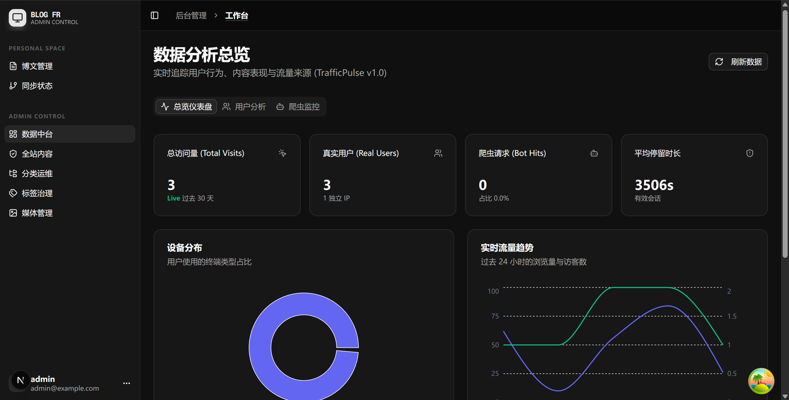
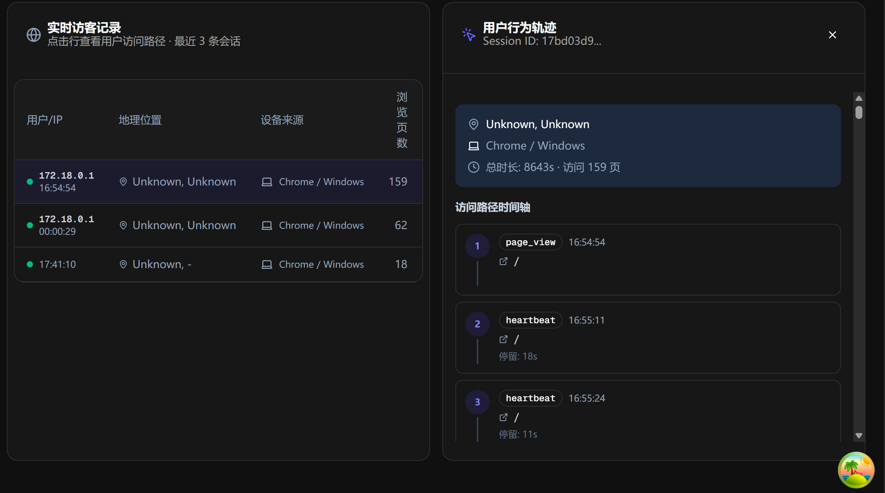
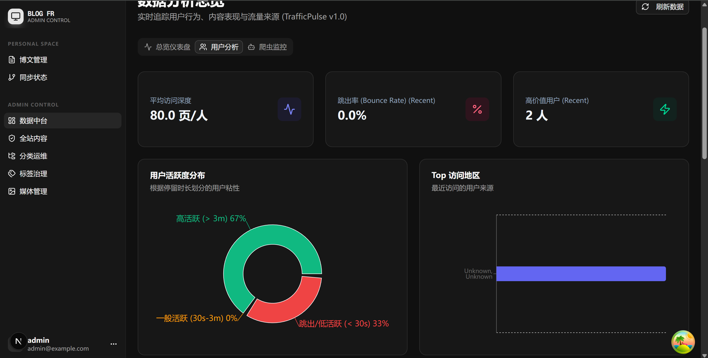
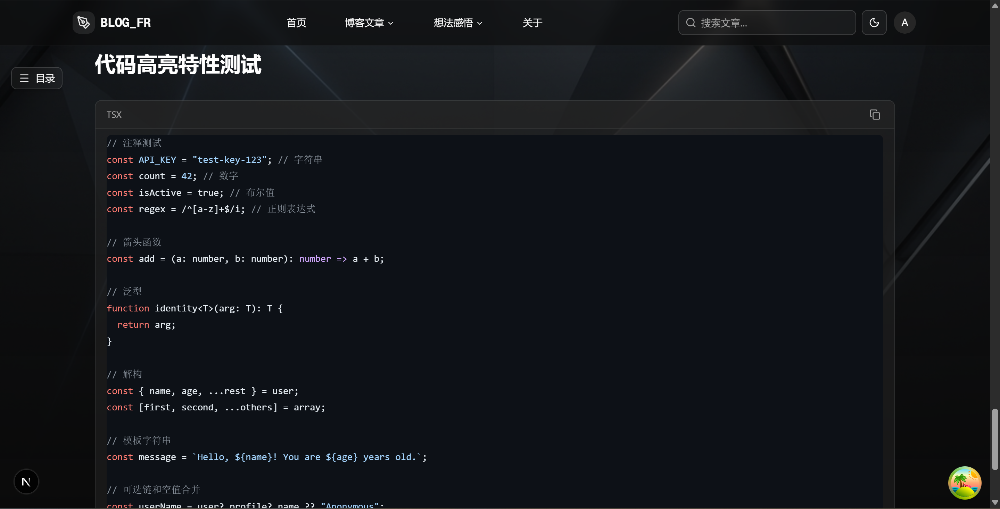
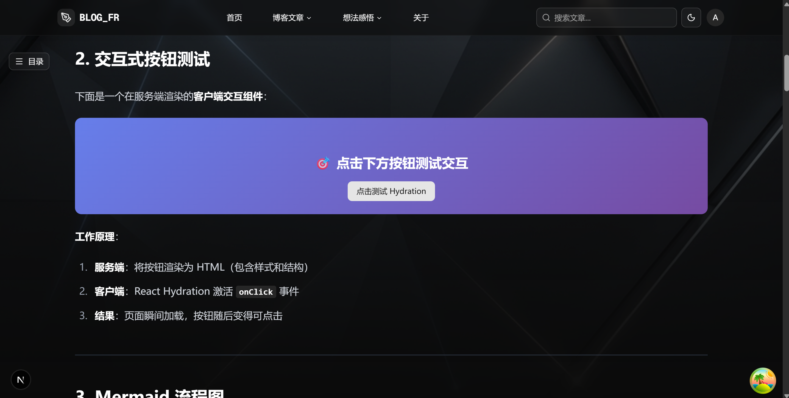
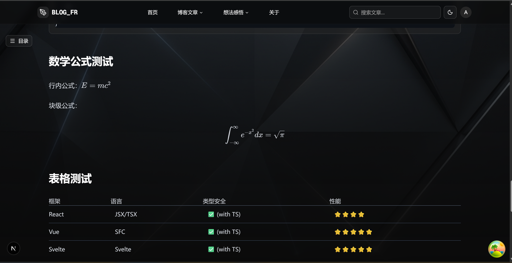
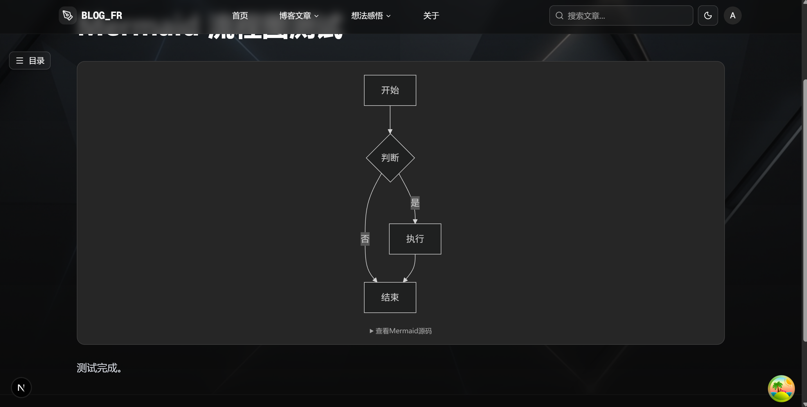

# 🎨 Blog FR - 功能展示

本文档展示 Blog FR 博客系统的核心功能和界面设计。

---

## 🌓 主题切换

Blog FR 支持深色和浅色两种主题模式，为用户提供舒适的阅读体验。

### 浅色主题

清新明亮的浅色主题，适合白天阅读：


### 深色主题

护眼舒适的深色主题，适合夜间阅读：


> 💡 **提示**: 主题切换基于 `next-themes` 实现，支持系统主题自动跟随，用户偏好会自动保存到本地存储。

---

## 🛠️ 管理后台

强大的管理后台，提供完整的内容管理功能。

### 管理界面总览



管理后台采用现代化的 SPA 架构，提供流畅的操作体验：

- 📝 文章创建与编辑
- 🖼️ 媒体文件管理
- 👥 用户权限管理
- 📊 数据统计分析

### 用户管理





用户管理功能包括：

- ✅ 用户列表查看与搜索
- ✅ 用户角色与权限配置
- ✅ 用户状态管理
- ✅ 批量操作支持

---

## 📝 MDX 增强功能

Blog FR 提供强大的 MDX 渲染能力，支持多种高级内容展示方式。

### 代码高亮



**特性**:

- 🎨 基于 `highlight.js` 的语法高亮
- 📋 一键复制代码
- 🔢 行号显示
- 🌈 多种主题支持（跟随系统主题）
- 💻 支持 100+ 编程语言

### 交互式组件



**特性**:

- ⚡ 自定义 React 组件嵌入
- 🎮 交互式演示和示例
- 📊 动态数据可视化
- 🔄 实时状态更新

### 数学公式渲染



**特性**:

- 📐 基于 KaTeX 的高性能数学公式渲染
- ✍️ 支持行内公式和块级公式
- 🔬 完整的 LaTeX 语法支持
- 🎯 精确的数学符号显示

### Mermaid 图表



**特性**:

- 📊 流程图、时序图、甘特图等多种图表类型
- 🎨 自动适配主题色彩
- 📱 响应式设计，移动端友好
- 🔄 支持复杂的关系图和架构图

---

## 🎯 技术亮点

### 混合渲染架构

- **SSR (服务端渲染)**: 博客文章页面使用 SSR，确保最佳的 SEO 和首屏加载速度
- **CSR (客户端渲染)**: 管理后台使用 CSR，提供流畅的单页应用体验

### 性能优化

- ⚡ Next.js 16 App Router 自动代码分割
- 🖼️ 图片自动优化和懒加载
- 📦 组件级别的按需加载
- 🚀 静态资源 CDN 加速

### 开发体验

- 🔧 TypeScript 全栈类型安全
- 🎨 Tailwind CSS 4 + shadcn/ui 组件库
- 📝 OpenAPI 自动生成 API SDK
- 🧪 完整的测试覆盖

---

## 🚀 快速开始

想要体验这些功能？查看 [README.md](./README.md) 了解如何快速启动项目。

### 一键启动

```bash
# 克隆项目
git clone https://github.com/sumanin5/blog_fr.git
cd blog_fr

# 使用 Docker Compose 启动
docker compose -f docker-compose.dev.yml up
```

访问 `http://localhost:3000` 即可体验完整功能！

---

## 📚 更多文档

- [README.md](./README.md) - 项目介绍和快速开始
- [ARCHITECTURE.md](./ARCHITECTURE.md) - 架构设计详解
- [前端开发指南](./frontend/SETUP.md) - Next.js 开发环境配置
- [后端 API 文档](./backend/README.md) - FastAPI 开发指南

---

**享受写作和阅读的乐趣！** ✨
