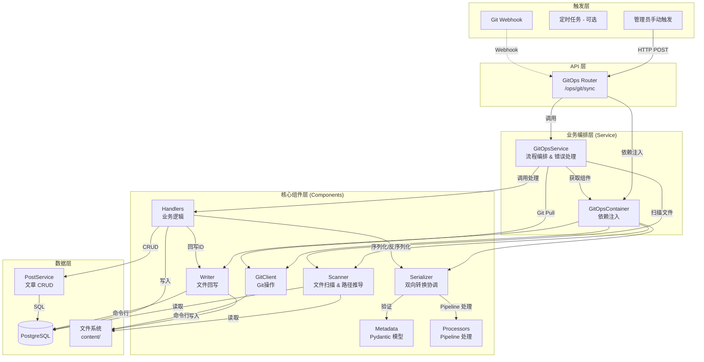

# GitOps 架构设计文档

## 📐 系统架构

### 整体架构图

---

## 🔄 核心设计决策

### 1. 组件化设计 (Component-based)

GitOps 模块采用了组件化设计，将复杂的功能拆分为独立的、可测试的单元：

- **Components (`app.git_ops.components`)**:
  - **Scanner**: 负责文件系统的遍历和哈希计算，支持并发扫描，从文件路径推导 post_type 和 category。
  - **Metadata**: 使用 Pydantic 定义 Frontmatter 数据模型，处理字段验证、类型转换和序列化。
  - **Serializer**: 核心转换器，协调 Metadata 和 Processor，实现 Post 模型和 Frontmatter 字典之间的双向转换。
  - **Processors**: 采用 Pipeline 模式，处理复杂的字段解析逻辑（author、cover、category、tags 等），每个 Processor 负责一个字段的处理。
  - **Writer**: 负责物理文件的写入操作，包括处理文件重命名和移动。

### 2. 依赖注入 (Dependency Injection)

通过 `GitOpsContainer` 类统一管理组件的依赖关系。Service 层不需要知道组件的具体实现细节，只需要从容器中获取即可。这大大提高了代码的可测试性，方便 mock 各种组件。

### 3. 显式错误处理

移除了隐式的 `error_handler` 封装，采用显式的 `try...except` 块：

- **业务逻辑错误 (`GitOpsSyncError`)**: 如必填字段缺失，记录为 Error 并跳过当前文件，但不中断整体同步。
- **配置错误 (`GitOpsConfigurationError`)**: 如目录不存在，直接中断流程。
- **系统错误**: 捕获所有 Exception，记录堆栈信息，确保单个文件的崩溃不会影响其他文件。

### 4. Processor Pipeline 模式

采用 Pipeline 模式处理字段解析，每个 Processor 负责一个字段的处理：

- **ContentProcessor**: 处理 content_mdx 和 title fallback
- **PostTypeProcessor**: 解析 post_type（优先使用路径推导）
- **AuthorProcessor**: 解析 author_id（支持用户名或 UUID）
- **CoverProcessor**: 解析 cover_media_id（支持路径或文件名）
- **CategoryProcessor**: 解析 category_id（优先使用路径推导，支持自动创建）
- **TagsProcessor**: 解析 tag_ids（支持自动创建）

Pipeline 按顺序执行，后续 Processor 可以依赖前面 Processor 的结果。

### 5. 统一 Schema 定义

通过 `schema.py` 和 `metadata.py` 统一管理数据结构：

- `schema.py`: 定义 API 接口模型 (Pydantic)。
- `metadata.py`: 定义 Frontmatter 数据模型，使用 Pydantic 的 validator 和 serializer 处理字段验证和转换。

### 6. 并发控制与一致性安全

- **并发锁 (Mutex Lock)**: `GitOpsService` 内部实现了基于 `asyncio.Lock` 的进程级互斥锁。这有效防止了 Webhook 频繁触发或与管理员手动操作冲突时可能引发的竞态条件 (Race Condition)。
- **统一入口 (Unified Entrypoint)**: 所有 Git 操作（包括后台自动提交）被强制收敛通过 `GitOpsService` 执行，确保所有操作都经过 `GitOpsContainer` 的统一配置和状态管理，消除了因绕过容器而产生的配置不一致风险。

---

## 🔄 同步流程详解

### 完整同步 (`sync_all`)

1. **初始化**: `GitOpsService` 启动，加载所有组件。
2. **Git Pull**: 尝试更新本地仓库。如果失败（如网络问题），记录警告并继续（降级为仅同步本地文件）。
3. **全量扫描**: `Scanner` 遍历 content 目录，生成 `ScannedPost` 列表。
4. **数据库对比**: 一次性查询所有已同步的文章 (`source_path is not null`)。
5. **处理循环**:
   - 遍历扫描到的文件。
   - **匹配策略**: 优先通过 `source_path` 匹配，其次通过 `slug` 匹配（检测文件重命名/移动）。
   - **更新/创建**: 根据匹配结果调用 `handle_post_update` 或 `handle_post_create`。
   - **异常捕获**: 每个文件的处理都在独立的 `try...except` 块中。
6. **删除检测**: 遍历数据库中的文章，如果在本次扫描中未找到对应的文件，则执行删除。
7. **统计与响应**: 返回包含新增、更新、删除、错误列表的 `SyncStats` 对象。

### 6. 增量同步 (Incremental Sync)

从 v3.2.0 开始，系统默认采用**增量同步**策略，显著提升性能：

- **状态记录**: 在 `content/.gitops_last_sync` 文件中持久化存储上一次成功同步的 Git Commit Hash。
- **差异获取**: 使用 `git diff --name-only <last_hash> HEAD` 获取变更文件列表。
- **增量处理**: 仅处理变更列表中的文件（新增/修改/删除）。
- **智能回退**: 如果本地没有 Hash 记录或获取 Diff 失败，自动降级为全量扫描模式 `sync_all`。

---

## 📊 数据模型

### Frontmatter 字段映射 (`metadata.py`)

| Frontmatter Key  | Post Model Attr  | 类型转换        | 说明                    |
| ---------------- | ---------------- | --------------- | ----------------------- |
| `title`          | `title`          | -               | 标题                    |
| `slug`           | `slug`           | -               | URL 标识                |
| `date`           | `published_at`   | str -> DateTime | 发布日期                |
| `status`         | `status`         | str -> Enum     | 状态 (published/draft)  |
| `post_type`      | `post_type`      | str -> Enum     | 内容类型 (优先路径推导) |
| `author_id`      | `author_id`      | str -> UUID     | 作者引用                |
| `cover_media_id` | `cover_media_id` | str -> UUID     | 封面引用                |
| `category_id`    | `category_id`    | str -> UUID     | 分类引用 (优先路径推导) |
| `featured`       | `is_featured`    | bool            | 是否推荐                |
| `tags`           | `tags`           | str/list        | 标签列表                |

### 字段处理优先级

1. **路径推导优先**: `post_type` 和 `category` 优先使用从文件路径推导的值
2. **Frontmatter 次之**: 如果路径没有推导出来，使用 frontmatter 中的值
3. **默认值兜底**: 如果都没有，使用默认值

### Processor Pipeline 执行顺序

1. **ContentProcessor**: 处理内容和 title
2. **PostTypeProcessor**: 确定 post_type（路径优先）
3. **AuthorProcessor**: 解析 author（数据库查询）
4. **CoverProcessor**: 解析 cover（数据库查询）
5. **CategoryProcessor**: 解析 category（路径优先 + 数据库查询）
6. **TagsProcessor**: 解析 tags（数据库查询 + 自动创建）

---

**最后更新**: 2026-01-21
**版本**: 3.2.0
