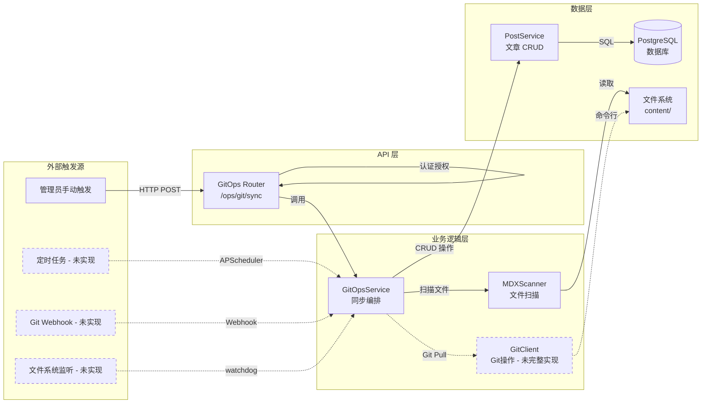
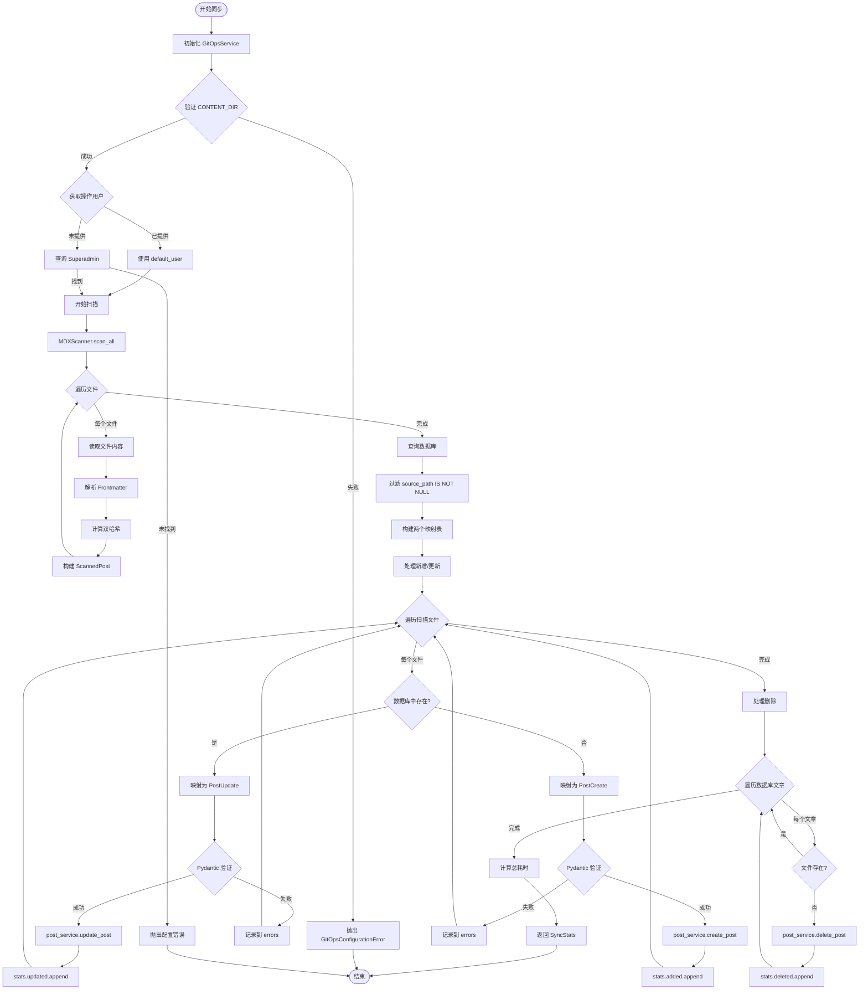
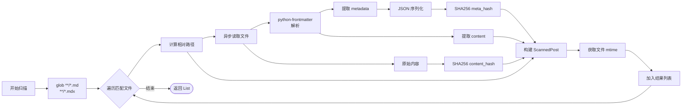
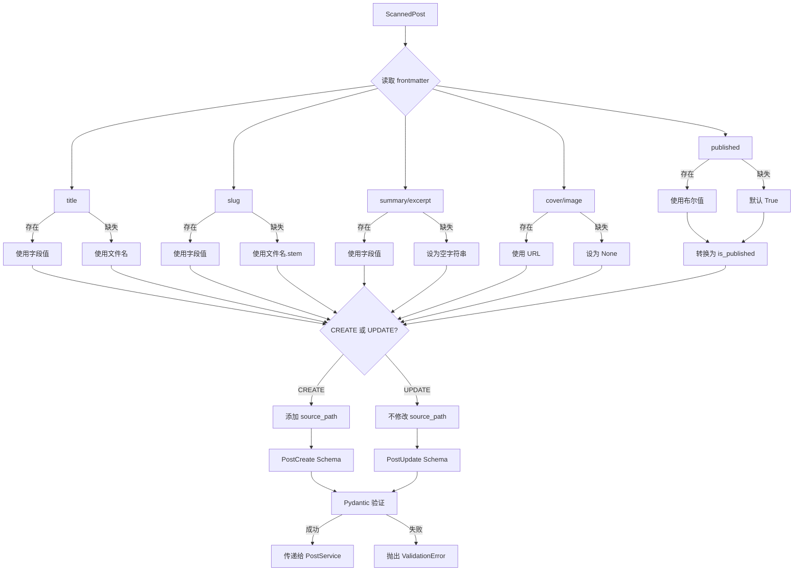
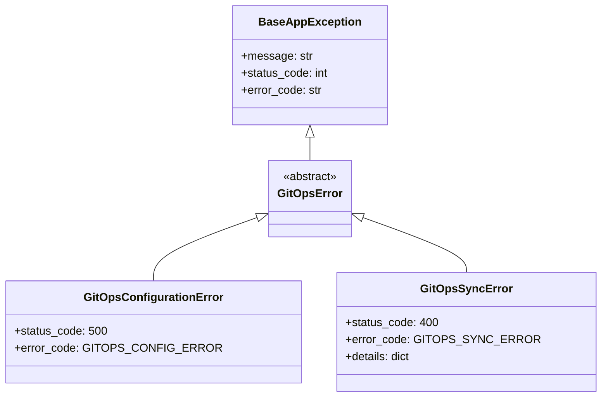
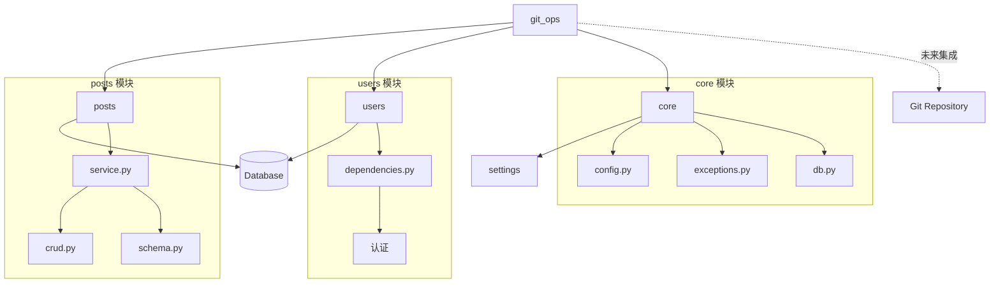
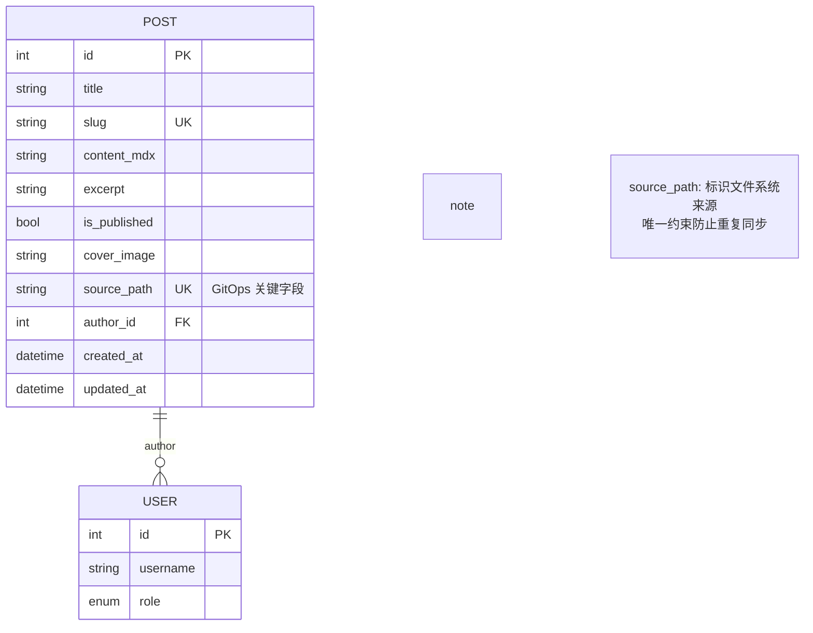

# GitOps 架构设计文档

## 📐 系统架构

### 整体架构图



---

## 🔄 核心流程设计

### 1. 完整同步流程



### 2. 文件扫描流程



### 3. Frontmatter 映射流程



---

## 🗂️ 模块职责划分

### 1. `router.py` - API 入口层

**职责：**
- 定义 HTTP 端点
- 权限认证（需要管理员）
- 依赖注入（Session、User）
- 调用 Service 层

**关键代码：**
```python
@router.post("/sync", response_model=SyncStats)
async def trigger_sync(
    current_user: User = Depends(get_current_adminuser),
    session: AsyncSession = Depends(get_async_session),
):
    service = GitOpsService(session)
    return await service.sync_all(default_user=current_user)
```

---

### 2. `service.py` - 业务逻辑层

**职责：**
- 同步流程编排
- 增删改查决策
- 错误处理与统计
- 调用 Scanner 和 PostService

**核心方法：**

| 方法 | 功能 |
|------|------|
| `sync_all()` | 主同步流程 |
| `_sync_single_file()` | 单文件同步逻辑 |
| `_map_frontmatter_to_post()` | 字段映射转换 |

**数据结构：**
```python
class SyncStats(BaseModel):
    added: List[str]      # 新增文件路径
    updated: List[str]    # 更新文件路径
    deleted: List[str]    # 删除文件路径
    skipped: int          # 跳过数量
    errors: List[str]     # 错误信息
    duration: float       # 总耗时（秒）
```

---

### 3. `scanner.py` - 文件扫描层

**职责：**
- 文件系统遍历
- Frontmatter 解析
- 哈希计算
- 异步 I/O 处理

**核心类：**
```python
class ScannedPost(BaseModel):
    file_path: str         # 相对路径
    content_hash: str      # 全文 SHA256
    meta_hash: str         # Frontmatter SHA256
    frontmatter: Dict      # 元数据
    content: str           # 正文
    updated_at: float      # 文件 mtime
```

**关键实现：**
- 使用 `asyncio.to_thread()` 避免阻塞
- `python-frontmatter` 库解析
- SHA256 哈希保证唯一性

---

### 4. `git_client.py` - Git 操作层（预留）

**职责：**
- 执行 Git 命令
- 非阻塞异步调用
- 错误处理

**已实现方法：**

| 方法 | 功能 | 状态 |
|------|------|------|
| `pull()` | 拉取最新代码 | ✅ 已实现 |
| `get_current_hash()` | 获取当前 commit | ✅ 已实现 |
| `get_changed_files()` | 获取变更文件列表 | ✅ 已实现 |
| `get_file_status()` | 工作区状态 | ✅ 已实现 |

**未集成原因：**
当前 `sync_all()` 为全量同步，未调用 GitClient。
计划在增量同步时集成：
```python
# 未来代码示例
before_hash = await git_client.get_current_hash()
await git_client.pull()
after_hash = await git_client.get_current_hash()
changed_files = await git_client.get_changed_files(before_hash)
```

---

### 5. `exceptions.py` - 异常定义

**异常层次结构：**



---

## 🔗 与其他模块的交互

### 依赖关系图



### 调用链分析

```
HTTP Request
    ↓
FastAPI Router (router.py)
    ↓ Depends(get_current_adminuser) ← users.dependencies
    ↓ Depends(get_async_session) ← core.db
    ↓
GitOpsService.sync_all() (service.py)
    ↓
MDXScanner.scan_all() (scanner.py)
    ↓ 遍历文件系统
    ↓
[对比数据库] ← Post 查询 (posts.model)
    ↓
post_service.create_post() ← posts.service
post_service.update_post() ← posts.service
post_service.delete_post() ← posts.service
    ↓
PostCRUD 操作 ← posts.crud
    ↓
SQLModel ORM → PostgreSQL
    ↓
返回 SyncStats
```

---

## 📊 数据模型关系

### Post 模型关键字段



### 同步状态判断

| 场景 | source_path (DB) | file_path (FS) | 操作 |
|------|------------------|----------------|------|
| 新文件 | NULL / 不存在 | 存在 | CREATE |
| 更新文件 | 存在 | 存在 | UPDATE |
| 删除文件 | 存在 | 不存在 | DELETE |
| 手动创建 | NULL | - | 忽略（不参与 GitOps）|

---

## ⚡ 性能优化策略

### 当前实现

1. **异步 I/O**
   - `asyncio.to_thread()` 文件读取
   - `AsyncSession` 数据库操作

2. **单次数据库查询**
   - 一次查询获取所有 GitOps 文章
   - 内存中构建映射表

### 优化建议

#### 1. 增量同步（重要）

```python
# 伪代码
before_hash = await git_client.get_current_hash()
await git_client.pull()
changed_files = await git_client.get_changed_files(before_hash)

# 只处理变更文件
for file in changed_files:
    await sync_single_file(file)
```

**预期收益：**
- 🚀 减少 95% 文件扫描时间
- 💾 降低 CPU 和内存占用

#### 2. 并发处理

```python
# 并发扫描文件
tasks = [scanner.scan_file(f) for f in files]
results = await asyncio.gather(*tasks)

# 并发创建/更新
tasks = [process_file(f) for f in to_process]
await asyncio.gather(*tasks, return_exceptions=True)
```

**预期收益：**
- ⚡ I/O 密集型任务提速 3-5 倍

#### 3. 缓存优化

```python
# 内存缓存文件哈希
cache = {
    "file.mdx": {
        "hash": "abc123...",
        "mtime": 1234567890.0
    }
}

# 跳过未修改文件
if file_mtime == cache[file]["mtime"]:
    skip_processing()
```

#### 4. 批量操作

```python
# 批量插入（未来优化）
await session.execute(
    insert(Post),
    [{"title": p.title, ...} for p in new_posts]
)
```

---

## 🧩 扩展点设计

### 1. 自定义字段映射

```python
class CustomMapper:
    def map_frontmatter(self, scanned: ScannedPost) -> Dict:
        # 自定义映射逻辑
        return {
            "title": scanned.frontmatter.get("heading"),
            "tags": self.parse_tags(scanned.frontmatter["keywords"]),
            ...
        }

# 在 Service 中注入
service = GitOpsService(session, mapper=CustomMapper())
```

### 2. 同步钩子（Hooks）

```python
class SyncHooks:
    async def before_sync(self, files: List[str]):
        # 同步前验证
        pass

    async def after_create(self, post: Post):
        # 创建后通知
        await send_webhook(post)

    async def after_sync(self, stats: SyncStats):
        # 同步完成后清理缓存
        await cache.clear()
```

### 3. 多仓库支持

```python
repos = [
    {"path": "content/blog", "category": "blog"},
    {"path": "content/docs", "category": "documentation"},
]

for repo in repos:
    service = GitOpsService(session, content_dir=repo["path"])
    await service.sync_all()
```

---

## 🔐 安全性设计

### 威胁模型

| 威胁 | 缓解措施 | 状态 |
|------|---------|------|
| 路径遍历攻击 | 限制在 CONTENT_DIR 内 | ✅ |
| 恶意 Frontmatter | Pydantic 验证 | ✅ |
| SQL 注入 | SQLModel ORM | ✅ |
| 权限提升 | 管理员认证 | ✅ |
| DDoS 同步 | 未实现速率限制 | ⚠️ |
| 敏感信息泄露 | 日志脱敏 | ⚠️ |

### 权限矩阵

| 操作 | 匿名 | 普通用户 | 管理员 | 超级管理员 |
|------|-----|---------|--------|-----------|
| 触发同步 | ❌ | ❌ | ✅ | ✅ |
| 查看同步历史 | ❌ | ❌ | ✅ | ✅ |
| 配置 CONTENT_DIR | ❌ | ❌ | ❌ | ✅ |

---

## 📈 监控与可观测性

### 建议添加的指标

```python
# Prometheus 指标示例
gitops_sync_duration_seconds = Histogram(...)
gitops_files_processed_total = Counter(...)
gitops_errors_total = Counter(...)
gitops_last_sync_timestamp = Gauge(...)
```

### 日志级别

| 事件 | 级别 | 示例 |
|------|-----|------|
| 同步开始 | INFO | `Starting GitOps sync...` |
| 文件扫描完成 | INFO | `Scanned 42 files.` |
| 文件处理失败 | WARNING | `Failed to sync file.mdx: ValidationError` |
| 配置错误 | ERROR | `CONTENT_DIR not found` |
| 同步完成 | INFO | `Sync completed in 1.23s` |

---

## 🔄 部署建议

### 方式一：定时任务

```python
# 使用 APScheduler
from apscheduler.schedulers.asyncio import AsyncIOScheduler

scheduler = AsyncIOScheduler()
scheduler.add_job(
    sync_task,
    'cron',
    hour='*/1',  # 每小时
)
scheduler.start()
```

### 方式二：Webhook

```python
@router.post("/webhook/github")
async def github_webhook(payload: GitHubWebhookPayload):
    # 验证签名
    verify_github_signature(payload)

    # 触发同步
    service = GitOpsService(session)
    await service.sync_all()
```

### 方式三：文件监听

```python
from watchdog.observers import Observer

observer = Observer()
observer.schedule(
    SyncHandler(),
    path='content/',
    recursive=True
)
observer.start()
```

---

## 📝 总结

### 架构亮点

✅ **关注点分离** - 清晰的分层架构
✅ **异步优先** - 全异步 I/O 设计
✅ **错误隔离** - 单文件失败不影响整体
✅ **可扩展性** - 预留多个扩展点

### 待改进点

🚧 **增量同步** - 当前为全量扫描
🚧 **并发处理** - 文件处理串行
🚧 **测试覆盖** - 缺少自动化测试
🚧 **监控指标** - 缺少可观测性

### 技术栈

- **语言**: Python 3.9+
- **框架**: FastAPI + SQLModel
- **解析**: python-frontmatter
- **数据库**: PostgreSQL
- **异步**: asyncio

---

**最后更新**: 2026-01-10
**文档版本**: 1.0.0
