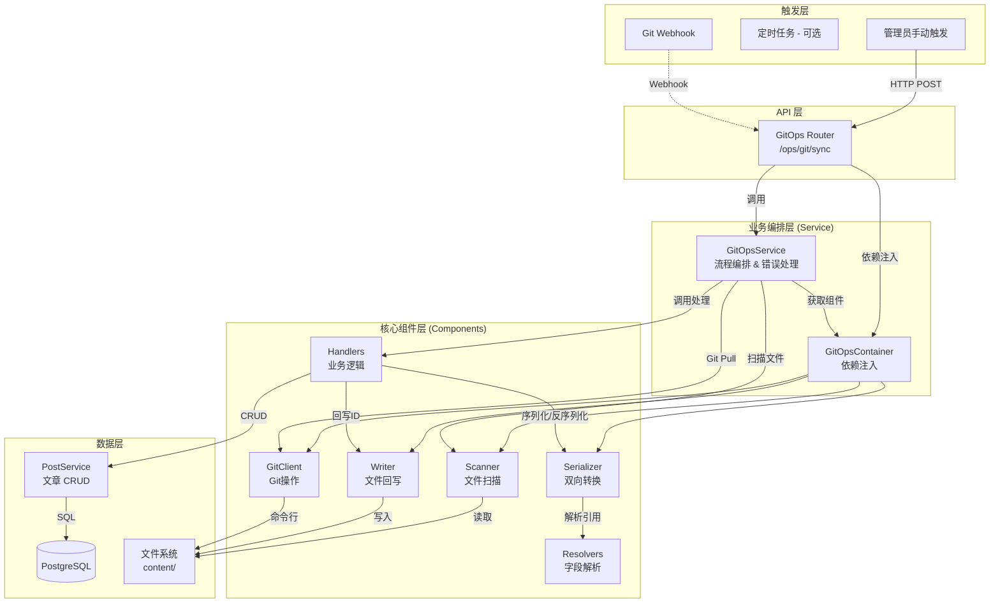

# GitOps 架构设计文档

## 📐 系统架构

### 整体架构图

---

## 🔄 核心设计决策

### 1. 组件化设计 (Component-based)

GitOps 模块采用了组件化设计，将复杂的功能拆分为独立的、可测试的单元：

- **Components (`app.git_ops.components`)**:
    - **Scanner**: 负责文件系统的遍历和哈希计算，支持并发扫描。
    - **Serializer**: 核心转换器，利用 `field_definitions.py` 定义的规则，在 Post 模型和 Frontmatter 字典之间进行双向转换。
    - **Resolvers**: 处理复杂的引用逻辑，如将用户名解析为 `author_id`，将图片路径解析为 `cover_media_id`。
    - **Writer**: 负责物理文件的写入操作，包括处理文件重命名和移动。

### 2. 依赖注入 (Dependency Injection)

通过 `GitOpsContainer` 类统一管理组件的依赖关系。Service 层不需要知道组件的具体实现细节，只需要从容器中获取即可。这大大提高了代码的可测试性，方便 mock 各种组件。

### 3. 显式错误处理

移除了隐式的 `error_handler` 封装，采用显式的 `try...except` 块：

- **业务逻辑错误 (`GitOpsSyncError`)**: 如必填字段缺失，记录为 Error 并跳过当前文件，但不中断整体同步。
- **配置错误 (`GitOpsConfigurationError`)**: 如目录不存在，直接中断流程。
- **系统错误**: 捕获所有 Exception，记录堆栈信息，确保单个文件的崩溃不会影响其他文件。

### 4. 统一 Schema 定义

通过 `schema.py` 和 `field_definitions.py` 统一管理数据结构：

- `schema.py`: 定义 API 接口模型 (Pydantic)。
- `field_definitions.py`: 定义业务字段映射规则。这使得添加新字段变得非常简单，只需在列表中添加一行配置即可自动支持解析和序列化。

---

## 🔄 同步流程详解

### 完整同步 (`sync_all`)

1. **初始化**: `GitOpsService` 启动，加载所有组件。
2. **Git Pull**: 尝试更新本地仓库。如果失败（如网络问题），记录警告并继续（降级为仅同步本地文件）。
3. **全量扫描**: `Scanner` 遍历 content 目录，生成 `ScannedPost` 列表。
4. **数据库对比**: 一次性查询所有已同步的文章 (`source_path is not null`)。
5. **处理循环**:
    - 遍历扫描到的文件。
    - **匹配策略**: 优先通过 `source_path` 匹配，其次通过 `slug` 匹配（检测文件重命名/移动）。
    - **更新/创建**: 根据匹配结果调用 `handle_post_update` 或 `handle_post_create`。
    - **异常捕获**: 每个文件的处理都在独立的 `try...except` 块中。
6. **删除检测**: 遍历数据库中的文章，如果在本次扫描中未找到对应的文件，则执行删除。
7. **统计与响应**: 返回包含新增、更新、删除、错误列表的 `SyncStats` 对象。

---

## 📊 数据模型

### 关键字段映射 (`field_definitions.py`)

| Frontmatter Key | Post Model Attr | 类型转换 | 说明 |
|-----------------|-----------------|----------|------|
| `title` | `title` | - | 标题 |
| `slug` | `slug` | - | URL 标识 |
| `date` | `created_at` | Date -> DateTime | 发布日期 |
| `status` | `status` | str -> Enum | 状态 (published/draft) |
| `author_id` | `author_id` | str -> UUID | 作者引用 |
| `cover_media_id`| `cover_media_id`| str -> UUID | 封面引用 |
| `category_id` | `category_id` | str -> UUID | 分类引用 |
| `featured` | `is_featured` | bool | 是否推荐 |

### 引用解析 (Resolvers)

- **Author**: 支持通过 UUID 或 用户名 解析。
- **Cover**: 支持通过 完整路径、文件名 或 相对路径 解析媒体文件。
- **Category**: 支持自动创建不存在的分类。
- **Tags**: 支持自动创建不存在的标签。

---

**最后更新**: 2026-01-19
**版本**: 2.1.0
