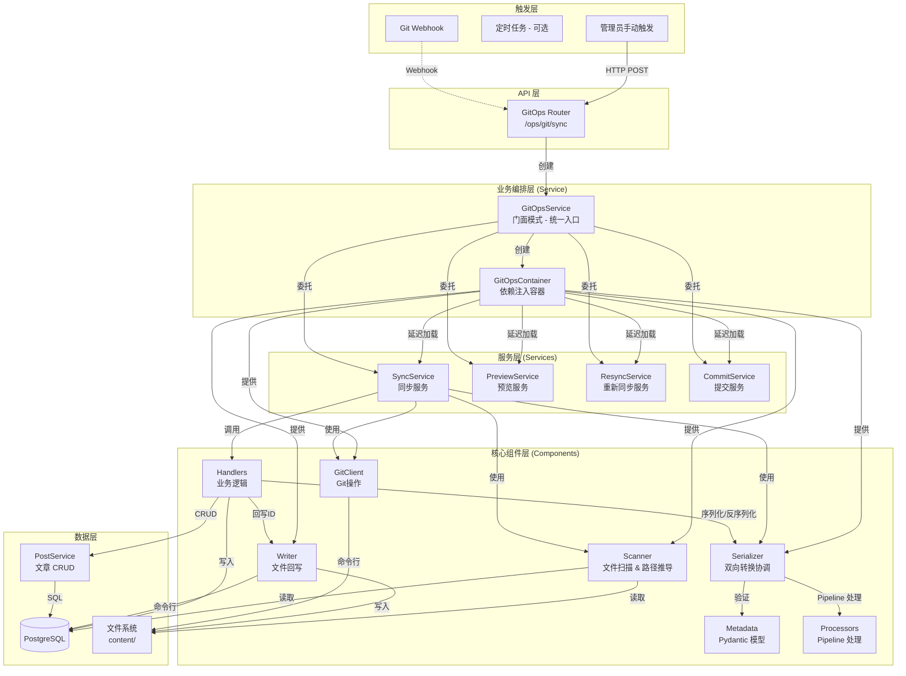

# GitOps 架构设计文档

## 📐 系统架构

### 整体架构图



---

## 🔄 核心设计决策

### 1. 组件化设计 (Component-based)

GitOps 模块采用了组件化设计，将复杂的功能拆分为独立的、可测试的单元：

- **Components (`app.git_ops.components`)**:
  - **Scanner**: 负责文件系统的遍历和哈希计算，支持并发扫描，从文件路径推导 post_type 和 category。
  - **Metadata**: 使用 Pydantic 定义 Frontmatter 数据模型，处理字段验证、类型转换和序列化。
  - **Serializer**: 核心转换器，协调 Metadata 和 Processor，实现 Post 模型和 Frontmatter 字典之间的双向转换。
  - **Processors**: 采用 Pipeline 模式，处理复杂的字段解析逻辑（author、cover、category、tags 等），每个 Processor 负责一个字段的处理。
  - **Writer**: 负责物理文件的写入操作，包括处理文件重命名和移动。

### 2. 依赖注入容器 (Dependency Injection Container)

采用**依赖注入容器模式**，通过 `GitOpsContainer` 类集中管理所有依赖关系：

#### 容器职责

- **对象工厂**: 负责创建所有核心组件和服务
- **依赖管理**: 管理组件之间的依赖关系
- **单例管理**: 确保每个服务只创建一次
- **延迟加载**: 服务按需创建，节省资源

#### 两层架构

```python
GitOpsContainer
├── 核心组件层（立即创建）
│   ├── scanner: MDXScanner          # 文件扫描器
│   ├── serializer: PostSerializer   # 序列化器
│   ├── writer: FileWriter           # 文件写入器
│   └── git_client: GitClient        # Git 客户端
└── 服务层（延迟加载 + 单例）
    ├── sync_service: SyncService       # 同步服务
    ├── preview_service: PreviewService # 预览服务
    ├── resync_service: ResyncService   # 重新同步服务
    └── commit_service: CommitService   # 提交服务
```

#### 优势

- ✅ **依赖共享**: 所有服务共享同一套核心组件，避免重复创建
- ✅ **单例模式**: 每个服务在容器中只创建一次
- ✅ **延迟加载**: 只在第一次访问时才创建服务
- ✅ **易于测试**: 可以 mock 整个容器或单个组件
- ✅ **集中管理**: 修改依赖关系只需改一处

#### 使用示例

```python
# 创建容器
container = GitOpsContainer(session)

# 访问核心组件（立即可用）
scanned = await container.scanner.scan_all()

# 访问服务（第一次访问时创建）
stats = await container.sync_service.sync_all()  # 创建 SyncService
preview = await container.preview_service.preview_sync()  # 创建 PreviewService

# 再次访问（返回已创建的实例）
stats2 = await container.sync_service.sync_all()  # 复用同一个 SyncService
```

### 3. 显式错误处理

移除了隐式的 `error_handler` 封装，采用显式的 `try...except` 块：

- **业务逻辑错误 (`GitOpsSyncError`)**: 如必填字段缺失，记录为 Error 并跳过当前文件，但不中断整体同步。
- **配置错误 (`GitOpsConfigurationError`)**: 如目录不存在，直接中断流程。
- **系统错误**: 捕获所有 Exception，记录堆栈信息，确保单个文件的崩溃不会影响其他文件。

### 4. Processor Pipeline 模式

采用 Pipeline 模式处理字段解析，每个 Processor 负责一个字段的处理：

- **ContentProcessor**: 处理 content_mdx 和 title fallback
- **PostTypeProcessor**: 解析 post_type（优先使用路径推导）
- **AuthorProcessor**: 解析 author_id（支持用户名或 UUID）
- **CoverProcessor**: 解析 cover_media_id（支持路径或文件名）
- **CategoryProcessor**: 解析 category_id（优先使用路径推导，支持自动创建）
- **TagsProcessor**: 解析 tag_ids（支持自动创建）

Pipeline 按顺序执行，后续 Processor 可以依赖前面 Processor 的结果。

### 5. 统一 Schema 定义

通过 `schema.py` 和 `metadata.py` 统一管理数据结构：

- `schema.py`: 定义 API 接口模型 (Pydantic)。
- `metadata.py`: 定义 Frontmatter 数据模型，使用 Pydantic 的 validator 和 serializer 处理字段验证和转换。

### 6. 服务拆分与职责单一

将原来 481 行的 `service.py` 拆分为多个职责单一的服务类：

- **SyncService** (~280 行): 负责全量和增量同步
- **PreviewService** (~80 行): 负责同步预览（Dry Run）
- **ResyncService** (~80 行): 负责重新同步单个文章
- **CommitService** (~30 行): 负责 Git 提交和推送
- **GitOpsService** (~70 行): 门面模式，协调各个子服务

每个服务继承自 `BaseGitOpsService`，通过容器获取依赖。

### 7. 并发控制与一致性安全

- **并发锁 (Mutex Lock)**: `SyncService` 内部实现了基于 `asyncio.Lock` 的进程级互斥锁。这有效防止了 Webhook 频繁触发或与管理员手动操作冲突时可能引发的竞态条件 (Race Condition)。
- **统一入口 (Unified Entrypoint)**: 所有 Git 操作（包括后台自动提交）被强制收敛通过 `GitOpsService` 执行，确保所有操作都经过 `GitOpsContainer` 的统一配置和状态管理，消除了因绕过容器而产生的配置不一致风险。

---

## 🔄 同步流程详解

### 完整同步 (`sync_all`)

1. **初始化**: `GitOpsService` 创建 `GitOpsContainer`，容器初始化所有核心组件。
2. **委托**: `GitOpsService.sync_all()` 委托给 `container.sync_service.sync_all()`。
3. **Git Pull**: `SyncService` 使用 `container.git_client` 尝试更新本地仓库。如果失败（如网络问题），记录警告并继续（降级为仅同步本地文件）。
4. **全量扫描**: 使用 `container.scanner` 遍历 content 目录，生成 `ScannedPost` 列表。
5. **数据库对比**: 一次性查询所有已同步的文章 (`source_path is not null`)。
6. **处理循环**:
   - 遍历扫描到的文件。
   - **匹配策略**: 使用 `container.serializer` 匹配，优先通过 `source_path` 匹配，其次通过 `slug` 匹配（检测文件重命名/移动）。
   - **更新/创建**: 根据匹配结果调用 `handle_post_update` 或 `handle_post_create`。
   - **异常捕获**: 每个文件的处理都在独立的 `try...except` 块中。
7. **删除检测**: 遍历数据库中的文章，如果在本次扫描中未找到对应的文件，则执行删除。
8. **统计与响应**: 返回包含新增、更新、删除、错误列表的 `SyncStats` 对象。

### 增量同步 (`sync_incremental`)

从 v3.2.0 开始，系统默认采用**增量同步**策略，显著提升性能：

1. **委托**: `GitOpsService.sync_incremental()` 委托给 `container.sync_service.sync_incremental()`。
2. **状态记录**: 在 `content/.gitops_last_sync` 文件中持久化存储上一次成功同步的 Git Commit Hash。
3. **差异获取**: 使用 `container.git_client.get_changed_files()` 获取变更文件列表。
4. **增量处理**: 仅处理变更列表中的文件（新增/修改/删除）。
5. **智能回退**: 如果本地没有 Hash 记录或获取 Diff 失败，自动降级为全量扫描模式 `sync_all`。

### 预览同步 (`preview_sync`)

1. **委托**: `GitOpsService.preview_sync()` 委托给 `container.preview_service.preview_sync()`。
2. **Dry Run**: 扫描文件并对比数据库，但不执行任何写操作。
3. **返回预览**: 返回 `PreviewResult`，包含待创建、更新、删除的文章列表。

### 重新同步 (`resync_post_metadata`)

1. **委托**: `GitOpsService.resync_post_metadata()` 委托给 `container.resync_service.resync_post_metadata()`。
2. **单篇同步**: 重新读取指定文章的 Frontmatter，更新数据库。
3. **用途**: 修复 frontmatter 错误、补全缺失的元数据。

---

## 📊 数据模型

### Frontmatter 字段映射 (`metadata.py`)

| Frontmatter Key  | Post Model Attr  | 类型转换        | 说明                    |
| ---------------- | ---------------- | --------------- | ----------------------- |
| `title`          | `title`          | -               | 标题                    |
| `slug`           | `slug`           | -               | URL 标识                |
| `date`           | `published_at`   | str -> DateTime | 发布日期                |
| `status`         | `status`         | str -> Enum     | 状态 (published/draft)  |
| `post_type`      | `post_type`      | str -> Enum     | 内容类型 (优先路径推导) |
| `author_id`      | `author_id`      | str -> UUID     | 作者引用                |
| `cover_media_id` | `cover_media_id` | str -> UUID     | 封面引用                |
| `category_id`    | `category_id`    | str -> UUID     | 分类引用 (优先路径推导) |
| `featured`       | `is_featured`    | bool            | 是否推荐                |
| `tags`           | `tags`           | str/list        | 标签列表                |

### 字段处理优先级

1. **路径推导优先**: `post_type` 和 `category` 优先使用从文件路径推导的值
2. **Frontmatter 次之**: 如果路径没有推导出来，使用 frontmatter 中的值
3. **默认值兜底**: 如果都没有，使用默认值

### Processor Pipeline 执行顺序

1. **ContentProcessor**: 处理内容和 title
2. **PostTypeProcessor**: 确定 post_type（路径优先）
3. **AuthorProcessor**: 解析 author（数据库查询）
4. **CoverProcessor**: 解析 cover（数据库查询）
5. **CategoryProcessor**: 解析 category（路径优先 + 数据库查询）
6. **TagsProcessor**: 解析 tags（数据库查询 + 自动创建）

---

---

## 🏛️ 依赖注入容器详解

### 容器模式的核心价值

**依赖注入容器 = 对象工厂 + 依赖管理器 + 单例管理器**

#### 问题场景（重构前）

```python
# ❌ 每个服务都要自己创建依赖
class GitOpsService:
    def __init__(self, session):
        # 重复创建
        self.scanner = MDXScanner(content_dir)
        self.serializer = PostSerializer(session)
        self.git_client = GitClient(content_dir)

    async def sync_all(self):
        scanned = await self.scanner.scan_all()

    async def preview_sync(self):
        # 又要创建一遍？
        scanner = MDXScanner(content_dir)  # 重复！
```

#### 容器解决方案（重构后）

```python
# ✅ 容器统一管理依赖
class GitOpsContainer:
    def __init__(self, session, content_dir):
        # 核心组件：容器创建并持有
        self.scanner = MDXScanner(content_dir)
        self.serializer = PostSerializer(session)
        self.git_client = GitClient(content_dir)

        # 服务层：延迟加载
        self._sync_service = None
        self._preview_service = None

    @property
    def sync_service(self):
        """单例模式：只创建一次"""
        if self._sync_service is None:
            self._sync_service = SyncService(self.session, self)
        return self._sync_service
```

### 调用流程

```
用户代码
    ↓
GitOpsService (门面)
    ↓
GitOpsContainer (容器)
    ↓
具体服务 (SyncService, PreviewService, etc.)
    ↓
核心组件 (Scanner, Serializer, GitClient)
```

### 测试优势

```python
# 可以 mock 整个容器
mock_container = MagicMock()
mock_container.scanner.scan_all.return_value = []
service = SyncService(session, mock_container)

# 或者只 mock 某个组件
container = GitOpsContainer(session)
container.scanner = mock_scanner
service = SyncService(session, container)
```

---

## 🛡️ 错误处理模式

### 显式错误处理策略

GitOps 模块采用**显式的 try-except 块**进行错误处理，移除了过度封装的 `error_handler` 装饰器。这种方式更加 Pythonic，控制流更清晰。

#### 错误分类

1. **配置错误** (`GitOpsConfigurationError`)

   - **场景**: content 目录不存在、Git 仓库未初始化
   - **处理**: 直接抛出，中断流程
   - **原因**: 无法继续执行，需要管理员介入

2. **业务逻辑错误** (`GitOpsSyncError`)

   - **场景**: 必填字段缺失、author 不存在、category 创建失败
   - **处理**: 记录错误日志，跳过当前文件，继续处理其他文件
   - **原因**: 单个文件的错误不应影响整体同步

3. **系统错误** (`Exception`)
   - **场景**: 数据库连接失败、文件读取权限问题、未预期的异常
   - **处理**: 记录完整堆栈信息，跳过当前文件
   - **原因**: 确保单个文件的崩溃不会影响其他文件

#### 错误处理代码示例

```python
# 在 SyncService.sync_all 中
for scanned in scanned_posts:
    try:
        # 处理文件
        matched_post, is_renamed = await self.serializer.match_post(...)

        if matched_post:
            await handle_post_update(...)
        else:
            await handle_post_create(...)

    except GitOpsSyncError as e:
        # 业务逻辑错误：记录并继续
        logger.error(f"同步文件失败: {scanned.file_path} - {e}")
        stats.errors.append({
            "file": str(scanned.file_path),
            "error": str(e),
            "type": "sync_error"
        })

    except Exception as e:
        # 系统错误：记录堆栈并继续
        logger.exception(f"处理文件时发生未预期错误: {scanned.file_path}")
        stats.errors.append({
            "file": str(scanned.file_path),
            "error": str(e),
            "type": "unexpected_error",
            "traceback": traceback.format_exc()
        })
```

#### 优势

- ✅ **控制流清晰**: 开发者能直观地看到错误是如何被捕获和处理的
- ✅ **灵活性**: 可以针对不同的错误类型采取不同的处理策略
- ✅ **可维护性**: 不需要理解复杂的装饰器逻辑
- ✅ **Pythonic**: 符合 Python 社区的最佳实践

### 全局异常处理（FastAPI 层）

项目在 FastAPI 层实现了统一的全局异常处理器（`app/core/error_handlers.py`），这是一个**标准且优秀**的模式：

#### 核心特点

1. **统一响应结构**

   ```json
   {
     "error": {
       "code": "ERROR_CODE",
       "message": "Human readable message",
       "details": { ... },
       "timestamp": "2026-01-24T10:00:00Z",
       "request_id": "uuid"
     }
   }
   ```

2. **集中式处理**

   - 在 `main.py` 中使用 `app.add_exception_handler` 注册
   - 业务代码只需 `raise` 异常，不需要关心如何返回 JSON

3. **环境隔离**

   - **开发环境**: 返回详细的报错信息和 Traceback
   - **生产环境**: 隐藏敏感信息，只返回通用错误消息

4. **全链路追踪**
   - 所有错误响应都包含 `request_id`
   - 可以通过 ID 在日志系统中追踪完整请求链路

#### 异常处理器类型

| 处理器                         | 捕获异常                 | HTTP 状态码 | 说明             |
| ------------------------------ | ------------------------ | ----------- | ---------------- |
| `app_exception_handler`        | `BaseAppException`       | 自定义      | 业务逻辑异常     |
| `validation_exception_handler` | `RequestValidationError` | 422         | 请求参数验证失败 |
| `database_exception_handler`   | `SQLAlchemyError`        | 500         | 数据库操作异常   |
| `unexpected_exception_handler` | `Exception`              | 500         | 未预期的系统异常 |

#### 为什么这是标准模式？

这套错误处理模式在 FastAPI 和现代 Python Web 开发中非常通用，它：

- ✅ **解耦**: 业务逻辑与错误响应格式分离
- ✅ **安全**: 生产环境隐藏敏感信息
- ✅ **可观测**: 通过 request_id 实现全链路追踪
- ✅ **前端友好**: 统一的响应格式降低前端处理复杂度
- ✅ **可扩展**: 易于添加新的异常类型和处理器

---

**最后更新**: 2026-01-24
**版本**: 3.3.0 (依赖注入容器重构 + 错误处理说明)
