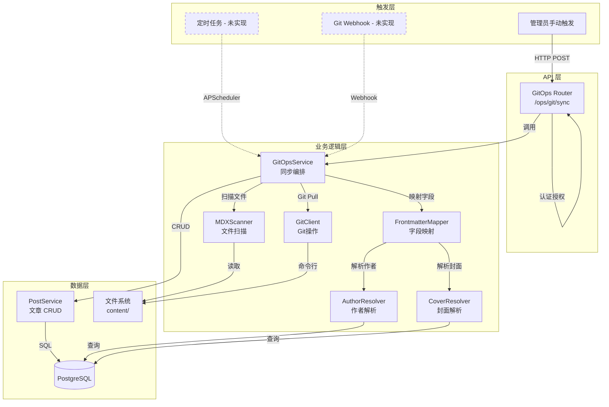
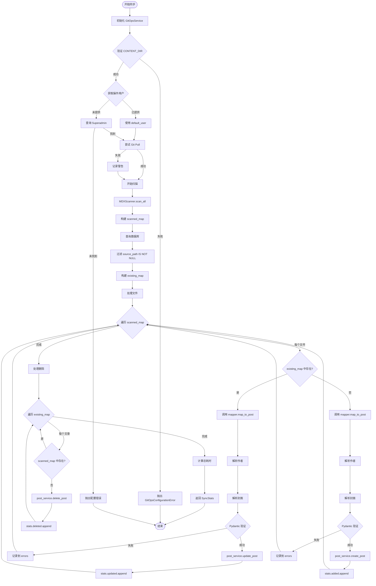
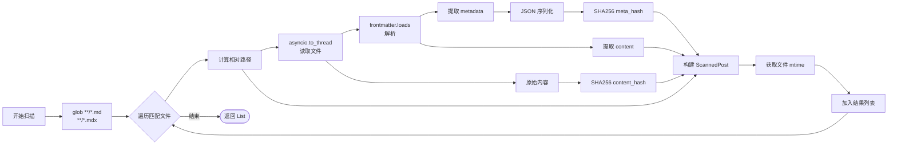
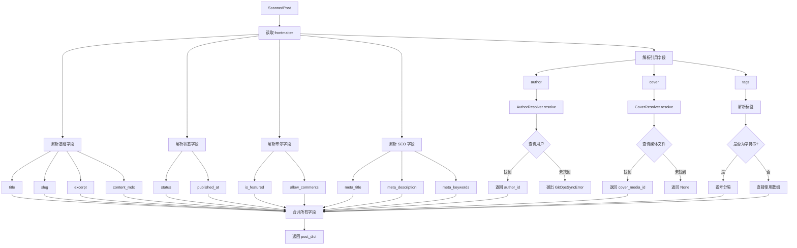
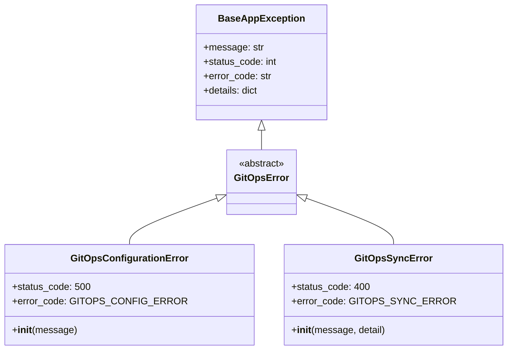
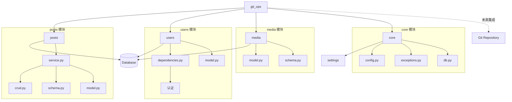
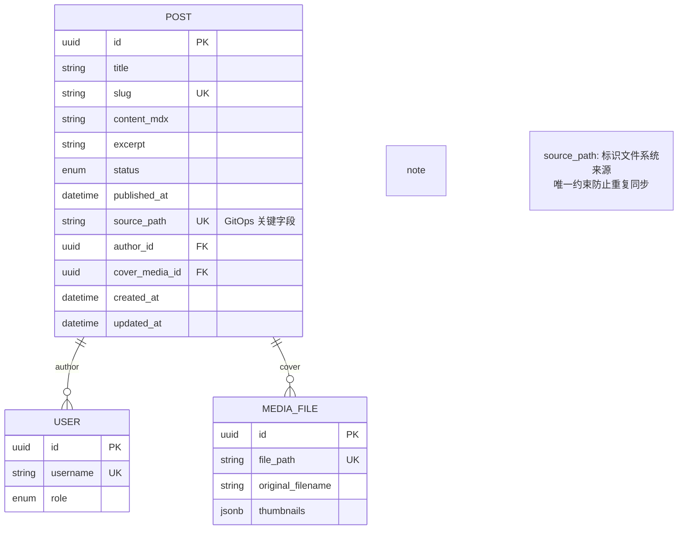

# GitOps 架构设计文档

## 📐 系统架构

### 整体架构图



---

## 🔄 核心流程设计

### 1. 完整同步流程



### 2. 文件扫描流程



### 3. Frontmatter 映射流程



---

## 🗂️ 模块职责划分

### 1. `router.py` - API 入口层

**职责**:

- 定义 HTTP 端点
- 权限认证（需要管理员）
- 依赖注入（Session、User）
- 调用 Service 层

**关键代码**:

```python
@router.post("/sync", response_model=SyncStats)
async def trigger_sync(
    current_user: User = Depends(get_current_adminuser),
    session: AsyncSession = Depends(get_async_session),
):
    service = GitOpsService(session)
    return await service.sync_all(default_user=current_user)
```

**设计原则**:

- **薄层设计**: Router 只负责 HTTP 层面的事情
- **依赖注入**: 使用 FastAPI 的 Depends 机制
- **权限控制**: 通过 `get_current_adminuser` 确保只有管理员可访问

---

### 2. `service.py` - 业务逻辑层

**职责**:

- 同步流程编排
- 增删改查决策
- 错误处理与统计
- 调用 Scanner、Mapper 和 PostService

**核心方法**:

| 方法                  | 功能           | 复杂度 |
| --------------------- | -------------- | ------ |
| `sync_all()`          | 主同步流程     | O(n)   |
| `_sync_single_file()` | 单文件同步逻辑 | O(1)   |

**数据结构**:

```python
class SyncStats(BaseModel):
    added: List[str]      # 新增文件路径
    updated: List[str]    # 更新文件路径
    deleted: List[str]    # 删除文件路径
    skipped: int          # 跳过数量
    errors: List[str]     # 错误信息
    duration: float       # 总耗时（秒）
```

**设计模式**:

- **编排者模式**: Service 作为编排者，协调各个组件
- **错误隔离**: 单文件失败不影响整体流程
- **统计收集**: 使用 `SyncStats` 收集所有操作结果

---

### 3. `scanner.py` - 文件扫描层

**职责**:

- 文件系统遍历
- Frontmatter 解析
- 哈希计算
- 异步 I/O 处理

**核心类**:

```python
class ScannedPost(BaseModel):
    file_path: str         # 相对路径
    content_hash: str      # 全文 SHA256
    meta_hash: str         # Frontmatter SHA256
    frontmatter: Dict      # 元数据
    content: str           # 正文
    updated_at: float      # 文件 mtime
```

**关键实现**:

- 使用 `asyncio.to_thread()` 避免阻塞
- `python-frontmatter` 库解析
- SHA256 哈希保证唯一性

**性能优化**:

```python
# 异步文件读取
raw_content = await asyncio.to_thread(
    full_path.read_text,
    encoding="utf-8"
)

# 哈希计算
content_hash = hashlib.sha256(raw_content.encode()).hexdigest()
meta_hash = hashlib.sha256(
    json.dumps(metadata, sort_keys=True).encode()
).hexdigest()
```

---

### 4. `mapper.py` - 字段映射层

**职责**:

- Frontmatter 到 Post 模型的字段转换
- 默认值处理
- 类型转换和验证

**映射策略**:

| 策略     | 说明                 | 示例                            |
| -------- | -------------------- | ------------------------------- |
| 直接映射 | 字段名相同           | `title` → `title`               |
| 别名映射 | 多个字段映射到同一个 | `summary`/`excerpt` → `excerpt` |
| 默认值   | 字段缺失时使用默认值 | `status` 默认 `PUBLISHED`       |
| 类型转换 | 字符串转枚举/日期    | `"draft"` → `PostStatus.DRAFT`  |
| 引用解析 | 字符串转 UUID        | `"admin"` → `UUID(...)`         |

**关键方法**:

```python
async def map_to_post(scanned: ScannedPost) -> Dict[str, Any]:
    # 1. 解析作者（必填）
    author_id = await self.author_resolver.resolve(meta.get("author"))

    # 2. 解析封面（可选）
    cover_media_id = await self.cover_resolver.resolve(meta.get("cover"))

    # 3. 构建字段映射
    return {
        "title": meta.get("title", Path(file_path).stem),
        "author_id": author_id,
        "cover_media_id": cover_media_id,
        "status": self._resolve_status(meta),
        "published_at": self._resolve_date(meta),
        ...
    }
```

---

### 5. `resolvers.py` - 引用解析层

**职责**:

- 将字符串引用转换为数据库 ID
- 处理多种查询策略
- 错误处理和日志记录

**解析器类型**:

#### AuthorResolver

```python
async def resolve(author_value: str) -> UUID:
    # 1. 尝试作为 UUID 解析
    if is_uuid_format(author_value):
        user = await query_by_id(author_value)
        if user:
            return user.id

    # 2. 作为用户名查询
    user = await query_by_username(author_value)
    if user:
        return user.id

    # 3. 未找到则抛出异常
    raise GitOpsSyncError(f"Author not found: {author_value}")
```

#### CoverResolver

```python
async def resolve(cover_path: str) -> Optional[UUID]:
    # 1. 精确匹配 file_path
    media = await query_by_path(cover_path)
    if media:
        return media.id

    # 2. 匹配 original_filename
    filename = Path(cover_path).name
    media = await query_by_filename(filename)
    if media:
        return media.id

    # 3. 后缀匹配 file_path
    media = await query_by_path_suffix(filename)
    if media:
        return media.id

    # 4. 未找到返回 None（不抛出异常）
    return None
```

**设计原则**:

- **多策略查询**: 提高匹配成功率
- **容错性**: 封面图找不到不影响同步
- **日志记录**: 记录匹配方式和失败原因

---

### 6. `git_client.py` - Git 操作层

**职责**:

- 执行 Git 命令
- 非阻塞异步调用
- 错误处理

**已实现方法**:

| 方法                  | 功能             | 状态      |
| --------------------- | ---------------- | --------- |
| `pull()`              | 拉取最新代码     | ✅ 已实现 |
| `get_current_hash()`  | 获取当前 commit  | ✅ 已实现 |
| `get_changed_files()` | 获取变更文件列表 | ✅ 已实现 |
| `get_file_status()`   | 工作区状态       | ✅ 已实现 |

**实现细节**:

```python
async def run(self, *args: str) -> Tuple[int, str, str]:
    cmd = ["git"] + list(args)
    process = await asyncio.create_subprocess_exec(
        *cmd,
        cwd=self.repo_path,
        stdout=asyncio.subprocess.PIPE,
        stderr=asyncio.subprocess.PIPE,
    )
    stdout, stderr = await process.communicate()
    return process.returncode, stdout.decode(), stderr.decode()
```

**未来集成**:
当前 `sync_all()` 为全量同步，未充分利用 GitClient。
计划在增量同步时集成：

```python
# 未来代码示例
before_hash = await git_client.get_current_hash()
await git_client.pull()
after_hash = await git_client.get_current_hash()

if before_hash != after_hash:
    changed_files = await git_client.get_changed_files(before_hash)
    # 只同步变更的文件
    for file in changed_files:
        await sync_single_file(file)
```

---

### 7. `exceptions.py` - 异常定义

**异常层次结构**:



**使用场景**:

| 异常                       | 使用场景             | 处理方式                 |
| -------------------------- | -------------------- | ------------------------ |
| `GitOpsConfigurationError` | 配置错误、目录不存在 | 中断同步，返回 500       |
| `GitOpsSyncError`          | 字段缺失、引用不存在 | 记录错误，继续同步       |
| `GitError`                 | Git 命令失败         | 记录警告，降级为本地同步 |

---

## 🔗 与其他模块的交互

### 依赖关系图



### 调用链分析

```
HTTP Request
    ↓
FastAPI Router (router.py)
    ↓ Depends(get_current_adminuser) ← users.dependencies
    ↓ Depends(get_async_session) ← core.db
    ↓
GitOpsService.sync_all() (service.py)
    ↓
    ├─→ GitClient.pull() (git_client.py)
    │       └─→ asyncio.create_subprocess_exec
    │
    ├─→ MDXScanner.scan_all() (scanner.py)
    │       ├─→ Path.glob() → 文件系统
    │       └─→ frontmatter.loads() → 解析
    │
    ├─→ FrontmatterMapper.map_to_post() (mapper.py)
    │       ├─→ AuthorResolver.resolve() (resolvers.py)
    │       │       └─→ SELECT User → PostgreSQL
    │       └─→ CoverResolver.resolve() (resolvers.py)
    │               └─→ SELECT MediaFile → PostgreSQL
    │
    └─→ PostService CRUD (posts.service)
            ├─→ create_post() → INSERT Post
            ├─→ update_post() → UPDATE Post
            └─→ delete_post() → DELETE Post
                    ↓
                PostgreSQL
```

---

## 📊 数据模型关系

### Post 模型关键字段



### 同步状态判断

| 场景     | source_path (DB) | file_path (FS) | 操作                  |
| -------- | ---------------- | -------------- | --------------------- |
| 新文件   | NULL / 不存在    | 存在           | CREATE                |
| 更新文件 | 存在             | 存在           | UPDATE                |
| 删除文件 | 存在             | 不存在         | DELETE                |
| 手动创建 | NULL             | -              | 忽略（不参与 GitOps） |

**关键设计**:

- `source_path` 为 `NULL` 的文章不参与 GitOps 同步
- `source_path` 有唯一约束，防止重复同步
- 删除操作只删除 `source_path` 不为 `NULL` 的文章

---

## ⚡ 性能优化策略

### 当前实现

1. **异步 I/O**

   - `asyncio.to_thread()` 文件读取
   - `AsyncSession` 数据库操作
   - `asyncio.create_subprocess_exec` Git 命令

2. **单次数据库查询**

   - 一次查询获取所有 GitOps 文章
   - 内存中构建映射表（O(1) 查找）

3. **错误隔离**
   - 单文件失败不影响整体流程
   - 使用 try-except 捕获异常

### 性能瓶颈分析

| 操作          | 当前实现 | 时间复杂度 | 瓶颈       |
| ------------- | -------- | ---------- | ---------- |
| 文件扫描      | 全量扫描 | O(n)       | I/O 密集   |
| 文件解析      | 串行处理 | O(n)       | CPU 密集   |
| 数据库查询    | 单次查询 | O(1)       | 网络延迟   |
| 文章创建/更新 | 串行处理 | O(n)       | 数据库写入 |

**n = 文件数量**

### 优化建议

#### 1. 增量同步（重要）⭐⭐⭐

**当前问题**: 每次同步扫描所有文件，即使只修改了一个文件

**优化方案**:

```python
# 记录上次同步的 commit hash
last_sync_hash = await get_last_sync_hash()

# Git pull
await git_client.pull()
current_hash = await git_client.get_current_hash()

# 只处理变更的文件
if last_sync_hash != current_hash:
    changed_files = await git_client.get_changed_files(last_sync_hash)

    for file in changed_files:
        if file.endswith(('.md', '.mdx')):
            await sync_single_file(file)

    # 更新 last_sync_hash
    await save_last_sync_hash(current_hash)
```

**预期收益**:

- 🚀 减少 95% 文件扫描时间
- 💾 降低 CPU 和内存占用
- ⚡ 同步速度提升 10-100 倍（取决于变更文件数量）

**实现复杂度**: 中等

---

#### 2. 并发处理 ⭐⭐

**当前问题**: 文件扫描和处理都是串行的

**优化方案**:

```python
# 并发扫描文件
async def scan_all_concurrent(files: List[Path]) -> List[ScannedPost]:
    tasks = [scanner.scan_file(str(f.relative_to(content_root))) for f in files]
    results = await asyncio.gather(*tasks, return_exceptions=True)

    # 过滤掉失败的文件
    return [r for r in results if isinstance(r, ScannedPost)]

# 并发处理文件
async def process_files_concurrent(files: List[ScannedPost]):
    tasks = [process_single_file(f) for f in files]
    await asyncio.gather(*tasks, return_exceptions=True)
```

**预期收益**:

- ⚡ I/O 密集型任务提速 3-5 倍
- 🔄 充分利用多核 CPU

**注意事项**:

- 需要处理并发数据库写入
- 可能需要使用信号量限制并发数

**实现复杂度**: 中等

---

#### 3. 缓存优化 ⭐

**当前问题**: 每次都重新计算文件哈希

**优化方案**:

```python
# 内存缓存文件哈希
cache = {
    "file.mdx": {
        "hash": "abc123...",
        "mtime": 1234567890.0
    }
}

async def scan_file_with_cache(file_path: str) -> Optional[ScannedPost]:
    full_path = content_root / file_path
    current_mtime = full_path.stat().st_mtime

    # 检查缓存
    if file_path in cache and cache[file_path]["mtime"] == current_mtime:
        logger.debug(f"Cache hit: {file_path}")
        return cache[file_path]["scanned"]

    # 扫描文件
    scanned = await scan_file(file_path)

    # 更新缓存
    cache[file_path] = {
        "mtime": current_mtime,
        "scanned": scanned
    }

    return scanned
```

**预期收益**:

- 🚀 跳过未修改文件的扫描
- 💾 减少文件 I/O

**实现复杂度**: 低

---

#### 4. 批量操作 ⭐⭐

**当前问题**: 文章创建/更新是逐个执行的

**优化方案**:

```python
# 批量插入（使用 SQLAlchemy Core）
from sqlalchemy import insert

async def batch_create_posts(posts: List[Dict]):
    stmt = insert(Post).values(posts)
    await session.execute(stmt)
    await session.commit()

# 批量更新
from sqlalchemy import update

async def batch_update_posts(updates: List[Tuple[UUID, Dict]]):
    for post_id, data in updates:
        stmt = update(Post).where(Post.id == post_id).values(**data)
        await session.execute(stmt)
    await session.commit()
```

**预期收益**:

- ⚡ 减少数据库往返次数
- 🔄 提升写入性能 2-3 倍

**注意事项**:

- 需要处理批量操作的错误
- 可能需要分批处理（避免单次操作过大）

**实现复杂度**: 高

---

#### 5. 数据库索引优化 ⭐

**当前问题**: 查询可能缺少索引

**优化方案**:

```sql
-- 为 source_path 添加索引（如果还没有）
CREATE INDEX idx_post_source_path ON posts(source_path) WHERE source_path IS NOT NULL;

-- 为 author_id 添加索引
CREATE INDEX idx_post_author_id ON posts(author_id);

-- 为 cover_media_id 添加索引
CREATE INDEX idx_post_cover_media_id ON posts(cover_media_id);

-- 为 MediaFile 的查询字段添加索引
CREATE INDEX idx_media_file_path ON media_files(file_path);
CREATE INDEX idx_media_original_filename ON media_files(original_filename);
```

**预期收益**:

- ⚡ 查询速度提升 10-100 倍
- 💾 减少数据库负载

**实现复杂度**: 低

---

### 性能对比（预估）

| 场景                  | 当前实现 | 增量同步 | 增量+并发 | 增量+并发+缓存 |
| --------------------- | -------- | -------- | --------- | -------------- |
| 100 个文件，1 个变更  | 10s      | 0.5s     | 0.3s      | 0.2s           |
| 100 个文件，10 个变更 | 10s      | 2s       | 1s        | 0.8s           |
| 100 个文件，全量变更  | 10s      | 10s      | 3s        | 2.5s           |
| 1000 个文件，1 个变更 | 100s     | 0.5s     | 0.3s      | 0.2s           |

**结论**: 增量同步是最重要的优化，可以带来 10-100 倍的性能提升

---

## 🧩 扩展点设计

### 1. 自定义字段映射

**场景**: 不同项目可能有不同的 Frontmatter 字段

**实现方式**:

```python
class CustomMapper(FrontmatterMapper):
    async def map_to_post(self, scanned: ScannedPost) -> Dict:
        # 调用父类方法获取基础映射
        result = await super().map_to_post(scanned)

        # 添加自定义映射
        meta = scanned.frontmatter
        result["custom_field"] = meta.get("my_custom_field")

        return result

# 在 Service 中注入
service = GitOpsService(session, mapper=CustomMapper(session))
```

---

### 2. 同步钩子（Hooks）

**场景**: 在同步的不同阶段执行自定义逻辑

**实现方式**:

```python
class SyncHooks:
    async def before_sync(self, files: List[str]):
        """同步前验证"""
        logger.info(f"About to sync {len(files)} files")

    async def after_create(self, post: Post):
        """创建后通知"""
        await send_webhook(post)
        await clear_cache(post.id)

    async def after_update(self, post: Post):
        """更新后处理"""
        await invalidate_cache(post.id)

    async def after_delete(self, post_id: UUID):
        """删除后清理"""
        await cleanup_related_data(post_id)

    async def after_sync(self, stats: SyncStats):
        """同步完成后处理"""
        await send_notification(stats)
        await update_metrics(stats)

# 在 Service 中使用
service = GitOpsService(session, hooks=SyncHooks())
```

---

### 3. 多仓库支持

**场景**: 支持从多个 Git 仓库同步内容

**实现方式**:

```python
repos = [
    {
        "path": "content/blog",
        "category": "blog",
        "author": "admin"
    },
    {
        "path": "content/docs",
        "category": "documentation",
        "author": "doc_writer"
    },
]

for repo in repos:
    service = GitOpsService(
        session,
        content_dir=repo["path"]
    )

    # 设置默认分类和作者
    default_user = await get_user(repo["author"])
    stats = await service.sync_all(default_user=default_user)

    # 为所有文章设置分类
    await set_category_for_repo(repo["category"], stats.added)
```

---

### 4. 自定义文件过滤

**场景**: 只同步特定类型或路径的文件

**实现方式**:

```python
class FilteredScanner(MDXScanner):
    def __init__(self, content_root: Path, filters: List[Callable]):
        super().__init__(content_root)
        self.filters = filters

    async def scan_all(self, glob_patterns: List[str] = None) -> List[ScannedPost]:
        results = await super().scan_all(glob_patterns)

        # 应用过滤器
        for filter_func in self.filters:
            results = [r for r in results if filter_func(r)]

        return results

# 使用示例
def only_published(scanned: ScannedPost) -> bool:
    return scanned.frontmatter.get("published", True)

def only_blog_posts(scanned: ScannedPost) -> bool:
    return scanned.file_path.startswith("blog/")

scanner = FilteredScanner(
    content_root,
    filters=[only_published, only_blog_posts]
)
```

---

## 🔐 安全性设计

### 威胁模型

| 威胁             | 描述                      | 缓解措施              | 状态 |
| ---------------- | ------------------------- | --------------------- | ---- |
| 路径遍历攻击     | 恶意文件路径访问系统文件  | 限制在 CONTENT_DIR 内 | ✅   |
| 恶意 Frontmatter | 注入恶意数据到数据库      | Pydantic 验证         | ✅   |
| SQL 注入         | 通过 Frontmatter 注入 SQL | SQLModel ORM          | ✅   |
| 权限提升         | 非管理员触发同步          | 管理员认证            | ✅   |
| DDoS 同步        | 频繁触发同步导致资源耗尽  | 未实现速率限制        | ⚠️   |
| 敏感信息泄露     | 日志中包含敏感信息        | 日志脱敏              | ⚠️   |
| 大文件攻击       | 上传超大文件导致内存溢出  | 未实现文件大小限制    | ⚠️   |

### 权限矩阵

| 操作             | 匿名 | 普通用户 | 管理员 | 超级管理员 |
| ---------------- | ---- | -------- | ------ | ---------- |
| 触发同步         | ❌   | ❌       | ✅     | ✅         |
| 查看同步历史     | ❌   | ❌       | ✅     | ✅         |
| 配置 CONTENT_DIR | ❌   | ❌       | ❌     | ✅         |
| 修改同步设置     | ❌   | ❌       | ❌     | ✅         |

### 安全最佳实践

1. **输入验证**

   ```python
   # 验证文件路径
   def validate_file_path(file_path: str) -> bool:
       # 确保路径在 content_root 内
       full_path = (content_root / file_path).resolve()
       return full_path.is_relative_to(content_root)
   ```

2. **日志脱敏**

   ```python
   def sanitize_log(message: str) -> str:
       # 移除敏感信息
       message = re.sub(r'password=\S+', 'password=***', message)
       message = re.sub(r'token=\S+', 'token=***', message)
       return message
   ```

3. **速率限制**

   ```python
   from fastapi_limiter import FastAPILimiter
   from fastapi_limiter.depends import RateLimiter

   @router.post("/sync", dependencies=[Depends(RateLimiter(times=10, minutes=1))])
   async def trigger_sync(...):
       ...
   ```

4. **文件大小限制**

   ```python
   MAX_FILE_SIZE = 10 * 1024 * 1024  # 10MB

   async def scan_file(file_path: str) -> Optional[ScannedPost]:
       full_path = content_root / file_path

       # 检查文件大小
       if full_path.stat().st_size > MAX_FILE_SIZE:
           logger.warning(f"File too large: {file_path}")
           return None

       ...
   ```

---

## 📈 监控与可观测性

### 建议添加的指标

```python
from prometheus_client import Counter, Histogram, Gauge

# 同步次数
gitops_sync_total = Counter(
    'gitops_sync_total',
    'Total number of sync operations',
    ['status']  # success, error
)

# 同步耗时
gitops_sync_duration_seconds = Histogram(
    'gitops_sync_duration_seconds',
    'Time spent in sync operation',
    buckets=[0.1, 0.5, 1.0, 2.0, 5.0, 10.0, 30.0, 60.0]
)

# 处理的文件数
gitops_files_processed_total = Counter(
    'gitops_files_processed_total',
    'Total number of files processed',
    ['operation']  # added, updated, deleted, skipped
)

# 错误数
gitops_errors_total = Counter(
    'gitops_errors_total',
    'Total number of errors',
    ['error_type']  # config, sync, validation
)

# 最后同步时间
gitops_last_sync_timestamp = Gauge(
    'gitops_last_sync_timestamp',
    'Timestamp of last successful sync'
)

# 使用示例
@router.post("/sync")
async def trigger_sync(...):
    with gitops_sync_duration_seconds.time():
        try:
            stats = await service.sync_all(...)
            gitops_sync_total.labels(status='success').inc()
            gitops_files_processed_total.labels(operation='added').inc(len(stats.added))
            gitops_files_processed_total.labels(operation='updated').inc(len(stats.updated))
            gitops_files_processed_total.labels(operation='deleted').inc(len(stats.deleted))
            gitops_last_sync_timestamp.set(time.time())
            return stats
        except Exception as e:
            gitops_sync_total.labels(status='error').inc()
            gitops_errors_total.labels(error_type='sync').inc()
            raise
```

### 日志级别

| 事件          | 级别    | 示例                                            |
| ------------- | ------- | ----------------------------------------------- |
| 同步开始      | INFO    | `Starting GitOps sync...`                       |
| 文件扫描完成  | INFO    | `Scanned 42 files.`                             |
| Git Pull 成功 | INFO    | `Git pull result: Already up to date.`          |
| Git Pull 失败 | WARNING | `Git pull skipped/failed: Not a git repository` |
| 文件处理失败  | WARNING | `Failed to sync file.mdx: ValidationError`      |
| 作者不存在    | WARNING | `Author not found: username`                    |
| 封面图未找到  | WARNING | `Cover image not found: cover.jpg`              |
| 配置错误      | ERROR   | `CONTENT_DIR not found: /path/to/content`       |
| 未预期的错误  | ERROR   | `Unexpected error syncing file.mdx: ...`        |
| 同步完成      | INFO    | `Sync completed in 1.23s: +2 ~3 -1`             |

### 分布式追踪

```python
from opentelemetry import trace
from opentelemetry.trace import Status, StatusCode

tracer = trace.get_tracer(__name__)

async def sync_all(self, default_user: User = None) -> SyncStats:
    with tracer.start_as_current_span("gitops.sync_all") as span:
        span.set_attribute("user.id", str(default_user.id))

        try:
            # Git Pull
            with tracer.start_as_current_span("gitops.git_pull"):
                await self.git_client.pull()

            # 扫描文件
            with tracer.start_as_current_span("gitops.scan_files") as scan_span:
                scanned_posts = await self.scanner.scan_all()
                scan_span.set_attribute("files.count", len(scanned_posts))

            # 处理文件
            with tracer.start_as_current_span("gitops.process_files"):
                ...

            span.set_status(Status(StatusCode.OK))
            return stats
        except Exception as e:
            span.set_status(Status(StatusCode.ERROR, str(e)))
            span.record_exception(e)
            raise
```

---

## 🔄 部署建议

### 方式一：定时任务

```python
from apscheduler.schedulers.asyncio import AsyncIOScheduler
from apscheduler.triggers.cron import CronTrigger

scheduler = AsyncIOScheduler()

async def sync_task():
    async for session in get_async_session():
        service = GitOpsService(session)
        admin = await get_admin_user(session)
        stats = await service.sync_all(default_user=admin)
        logger.info(f"Scheduled sync completed: {stats}")

# 每小时执行一次
scheduler.add_job(
    sync_task,
    CronTrigger(hour='*/1'),
    id='gitops_sync',
    name='GitOps Sync',
    replace_existing=True
)

scheduler.start()
```

### 方式二：Webhook

```python
import hmac
import hashlib

@router.post("/webhook/github")
async def github_webhook(
    request: Request,
    x_hub_signature_256: str = Header(...),
    session: AsyncSession = Depends(get_async_session),
):
    # 验证签名
    payload = await request.body()
    expected = hmac.new(
        settings.WEBHOOK_SECRET.encode(),
        payload,
        hashlib.sha256
    ).hexdigest()

    if not hmac.compare_digest(f"sha256={expected}", x_hub_signature_256):
        raise HTTPException(401, "Invalid signature")

    # 解析 payload
    data = await request.json()

    # 只处理 push 事件
    if data.get("ref") == "refs/heads/main":
        # 触发同步
        service = GitOpsService(session)
        admin = await get_admin_user(session)
        stats = await service.sync_all(default_user=admin)

        return {"status": "triggered", "stats": stats}

    return {"status": "ignored"}
```

### 方式三：文件监听

```python
from watchdog.observers import Observer
from watchdog.events import FileSystemEventHandler

class SyncHandler(FileSystemEventHandler):
    def __init__(self, service: GitOpsService):
        self.service = service

    def on_modified(self, event):
        if event.src_path.endswith(('.md', '.mdx')):
            asyncio.create_task(self.sync_file(event.src_path))

    async def sync_file(self, file_path: str):
        logger.info(f"File modified: {file_path}")
        # 触发同步
        await self.service.sync_single_file(file_path)

# 启动监听
observer = Observer()
observer.schedule(
    SyncHandler(service),
    path='content/',
    recursive=True
)
observer.start()
```

---

## 📝 总结

### 架构亮点

✅ **关注点分离** - 清晰的分层架构，每个模块职责单一
✅ **异步优先** - 全异步 I/O 设计，充分利用 asyncio
✅ **错误隔离** - 单文件失败不影响整体流程
✅ **可扩展性** - 预留多个扩展点，支持自定义
✅ **类型安全** - 使用 Pydantic 进行数据验证
✅ **可观测性** - 详细的日志和统计信息

### 待改进点

🚧 **增量同步** - 当前为全量扫描，需要优化
🚧 **并发处理** - 文件处理串行，可以并发优化
🚧 **测试覆盖** - 缺少自动化测试
🚧 **监控指标** - 缺少 Prometheus 指标
🚧 **速率限制** - 缺少 API 速率限制
🚧 **文件大小限制** - 缺少大文件保护

### 技术栈

- **语言**: Python 3.13+
- **框架**: FastAPI + SQLModel
- **解析**: python-frontmatter
- **数据库**: PostgreSQL
- **异步**: asyncio
- **Git**: GitPython / subprocess

---

**最后更新**: 2026-01-11
**文档版本**: 2.0.0
**维护者**: Blog Platform Team
