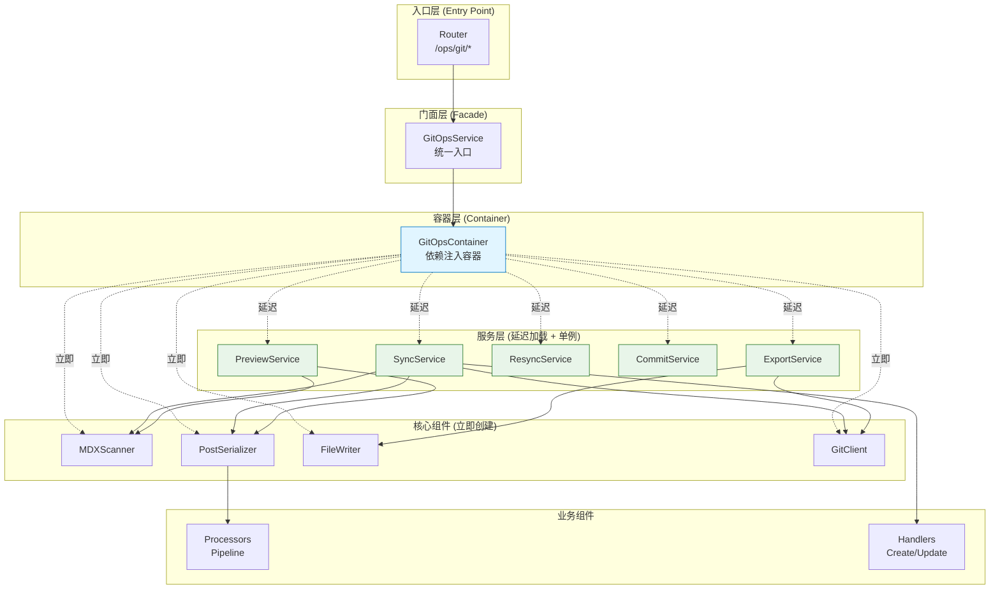
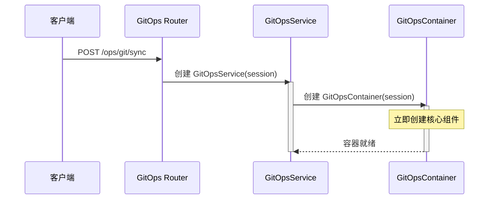
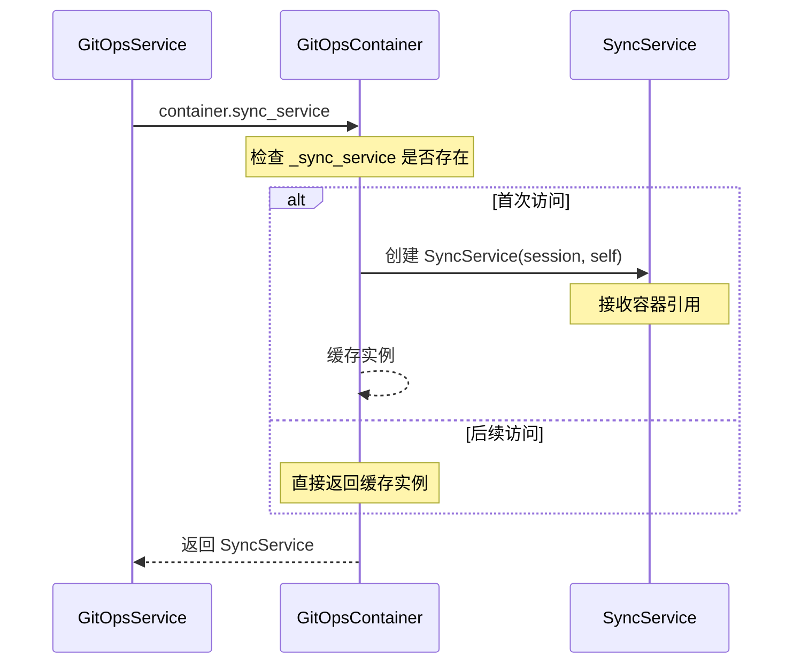
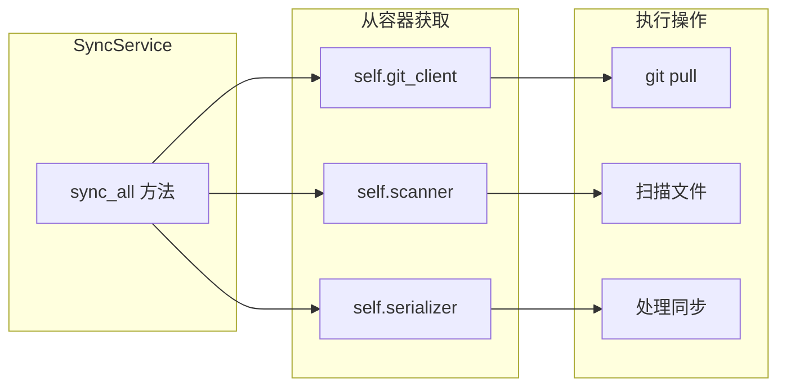
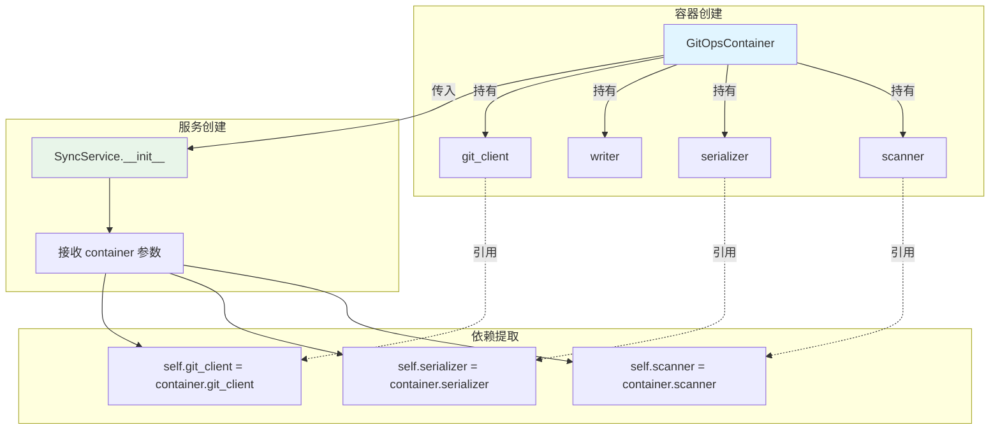
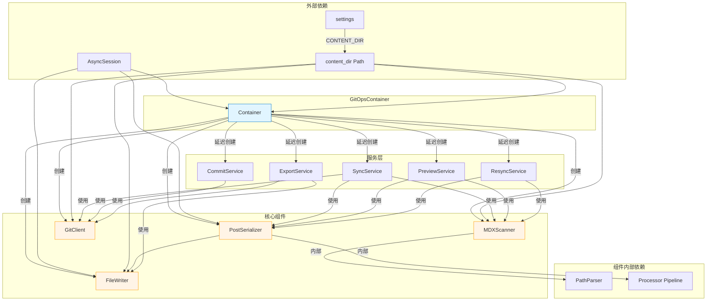
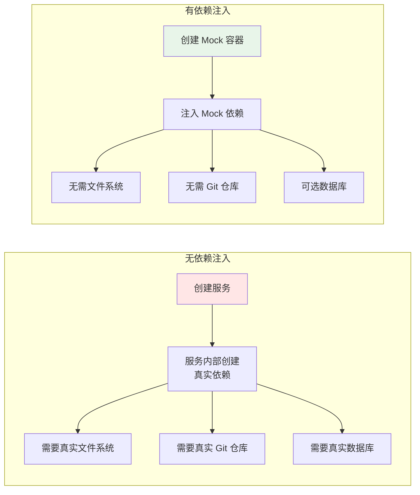

# GitOps 依赖注入详解

本文档深入解析 GitOps 模块的依赖注入机制，帮助理解系统如何管理复杂的对象依赖关系。

---

## 📐 整体架构概览



---

## 📦 什么会被注入？

`GitOpsContainer` 管理两类依赖：

### 1️⃣ 核心组件（立即创建）

这些是底层工具类，在容器初始化时立即创建：

```python
class GitOpsContainer:
    def __init__(self, session: AsyncSession, content_dir: Optional[Path] = None):
        self.session = session
        self.content_dir = content_dir or Path(settings.CONTENT_DIR)

        # 核心组件（立即创建）
        self.scanner = MDXScanner(self.content_dir)
        self.serializer = PostSerializer(session)
        self.writer = FileWriter(session, content_dir, self.serializer)
        self.git_client = GitClient(self.content_dir)
```

#### 核心组件详解

| 组件         | 类型             | 依赖                                   | 职责                                                              |
| ------------ | ---------------- | -------------------------------------- | ----------------------------------------------------------------- |
| `scanner`    | `MDXScanner`     | `content_dir`                          | 扫描文件系统，读取 MDX 文件，计算哈希，推导 post_type 和 category |
| `serializer` | `PostSerializer` | `session`                              | 双向转换：Frontmatter ↔ Post 对象，协调 Processor Pipeline        |
| `writer`     | `FileWriter`     | `session`, `content_dir`, `serializer` | 将数据库变更写回文件系统（回签 ID、导出文章）                     |
| `git_client` | `GitClient`      | `content_dir`                          | 执行 Git 命令（pull, commit, push, diff）                         |

### 2️⃣ 服务层（延迟加载 + 单例）

这些是高层业务逻辑，只在第一次访问时创建：

```python
class GitOpsContainer:
    def __init__(self, session, content_dir):
        # ... 核心组件初始化 ...

        # 服务层（延迟加载）
        self._sync_service = None
        self._preview_service = None
        self._resync_service = None
        self._commit_service = None
        self._export_service = None

    @property
    def sync_service(self):
        """获取同步服务（单例）"""
        if self._sync_service is None:
            from app.git_ops.services import SyncService
            self._sync_service = SyncService(self.session, self)
            #                                               ^^^^
            #                                       把容器自己传进去！
        return self._sync_service
```

#### 服务层详解

| 服务             | 类型             | 职责                         |
| ---------------- | ---------------- | ---------------------------- |
| `sync_service`   | `SyncService`    | 全量和增量同步 (Git → DB)    |
| `preview_service`| `PreviewService` | 同步预览（Dry Run）          |
| `resync_service` | `ResyncService`  | 重新同步单个文章的元数据     |
| `commit_service` | `CommitService`  | Git 提交和推送               |
| `export_service` | `ExportService`  | 导出同步 (DB → Git)          |

---

## 🔄 依赖注入流程

### 阶段 1: 请求到达



### 阶段 2: 服务延迟创建



### 阶段 3: 服务使用组件



---

## 💉 注入机制详解

### 服务基类的依赖提取

所有服务都继承自 `BaseGitOpsService`，它负责从容器中提取依赖：

```python
class BaseGitOpsService:
    def __init__(self, session: AsyncSession, container=None):
        self.session = session

        if container:
            # 从容器中提取依赖（属性注入）
            self.container = container
            self.content_dir = container.content_dir
            self.scanner = container.scanner
            self.serializer = container.serializer
            self.git_client = container.git_client
        else:
            # 向后兼容：如果没有容器，自己创建
            self.container = GitOpsContainer(session)
            # ... 同上 ...
```

### 依赖提取流程图



---

## 🎯 组件依赖关系图

### 完整依赖图



---

## 🔍 实际代码示例

### 示例 1: 通过门面使用服务

```python
from app.git_ops.service import GitOpsService

async def trigger_sync(session, current_user):
    # 创建门面服务（内部创建容器）
    service = GitOpsService(session)

    # 调用同步（内部延迟创建 SyncService）
    stats = await service.sync_all(default_user=current_user)
    print(f"同步完成: +{len(stats.added)} ~{len(stats.updated)} -{len(stats.deleted)}")
```

### 示例 2: 直接使用容器

```python
from app.git_ops.container import GitOpsContainer

async def advanced_usage(session):
    # 创建容器
    container = GitOpsContainer(session)

    # 直接使用核心组件
    scanned_posts = await container.scanner.scan_all()
    print(f"扫描到 {len(scanned_posts)} 个文件")

    # 第一次访问服务（创建）
    service1 = container.sync_service
    print(f"service1 id: {id(service1)}")

    # 第二次访问服务（返回同一实例）
    service2 = container.sync_service
    print(f"service2 id: {id(service2)}")

    assert service1 is service2  # ✅ 单例验证
```

### 示例 3: 服务内部如何使用依赖

```python
# SyncService 的实际实现
class SyncService(BaseGitOpsService):
    async def sync_all(self, default_user: User = None) -> SyncStats:
        async with self.sync_lock:
            stats = await self._sync_all_impl(default_user)
            current_hash = await self.git_client.get_current_hash()
            await self._save_last_hash(current_hash)
            return stats

    async def _sync_all_impl(self, default_user: User = None) -> SyncStats:
        # 使用注入的 git_client
        await self.git_client.pull()

        # 使用注入的 scanner
        scanned_posts = await self.scanner.scan_all()

        # 使用注入的 serializer
        for file_path, scanned in scanned_map.items():
            matched_post, is_move = await self.serializer.match_post(
                scanned, existing_posts
            )
            # ... 处理逻辑 ...
```

---

## 🧪 测试中的依赖注入

### 测试优势 1: Mock 整个容器

```python
from unittest.mock import MagicMock

# 创建 mock 容器
mock_container = MagicMock()
mock_container.scanner.scan_all.return_value = []
mock_container.serializer.match_post.return_value = (None, False)

# 创建服务（注入 mock 容器）
service = SyncService(session, mock_container)

# 测试
stats = await service.sync_all()
assert len(stats.added) == 0
```

### 测试优势 2: Mock 单个组件

```python
from unittest.mock import AsyncMock

async def test_sync_with_custom_scanner():
    # 创建真实容器
    container = GitOpsContainer(session)

    # 只 mock scanner
    mock_scanner = AsyncMock()
    mock_scanner.scan_all.return_value = [
        ScannedPost(
            file_path="articles/test/hello.mdx",
            frontmatter={"title": "Test Post", "slug": "test-post"},
            content="# Hello",
            content_hash="abc",
            meta_hash="def",
        )
    ]
    container.scanner = mock_scanner  # 替换 scanner

    # 创建服务
    service = SyncService(session, container)

    # 测试 - scanner 是 mock 的，但 serializer 是真实的
    stats = await service.sync_all()
```

### 测试优势 3: 使用 pytest fixture

```python
# conftest.py
import pytest
from unittest.mock import MagicMock, AsyncMock
from pathlib import Path

@pytest.fixture
def mock_container(db_session):
    """提供标准化的 mock 容器"""
    container = MagicMock()
    container.session = db_session
    container.content_dir = Path("/tmp/test-content")
    container.scanner = AsyncMock()
    container.scanner.scan_all.return_value = []
    container.serializer = AsyncMock()
    container.git_client = AsyncMock()
    container.git_client.get_current_hash.return_value = "test-hash"
    return container

# test_sync_service.py
async def test_sync_empty_directory(mock_container):
    """测试空目录同步"""
    service = SyncService(mock_container.session, mock_container)
    stats = await service.sync_all()

    assert len(stats.added) == 0
    assert len(stats.errors) == 0
    mock_container.scanner.scan_all.assert_called_once()
```

### 测试依赖注入的优势



---

## 🎓 设计模式总结

### 使用的设计模式

| 模式                       | 实现位置                   | 说明                                       |
| -------------------------- | -------------------------- | ------------------------------------------ |
| **依赖注入容器**           | `GitOpsContainer`          | 集中管理所有依赖的创建和生命周期           |
| **单例模式**               | `@property` + 缓存         | 每个服务在容器中只创建一次                 |
| **延迟加载模式**           | 服务的 `@property` 访问器  | 服务只在第一次访问时才创建                 |
| **门面模式**               | `GitOpsService`            | 隐藏容器和服务的复杂性，提供简洁 API       |
| **工厂模式**               | 容器的各个创建方法         | 容器负责创建所有对象                       |
| **管道模式**               | `PostSerializer.processors`| Processor Pipeline 按顺序处理字段          |

### 优势总结

| 优势         | 说明                                     | 示例                                                     |
| ------------ | ---------------------------------------- | -------------------------------------------------------- |
| **依赖共享** | 所有服务共享同一套核心组件               | `sync_service` 和 `preview_service` 使用同一个 `scanner` |
| **单例保证** | 每个服务只创建一次                       | 多次访问 `container.sync_service` 返回同一实例           |
| **延迟加载** | 按需创建，节省资源                       | 不用预览功能时，`preview_service` 永远不会被创建         |
| **易于测试** | 可以轻松 mock 依赖                       | Mock 整个容器或单个组件                                  |
| **集中管理** | 修改依赖关系只需改一处                   | 给 `scanner` 添加参数，只需修改容器                      |
| **解耦**     | 服务不需要知道依赖如何创建               | `SyncService` 不关心 `scanner` 是如何初始化的            |
| **向后兼容** | 门面模式保持 API 不变                    | `GitOpsService` 的接口完全兼容旧版本                     |

---

## 📚 相关文档

- [ARCHITECTURE.md](./ARCHITECTURE.md) - 整体架构设计
- [SYNC_FLOW_WITH_DI.md](./SYNC_FLOW_WITH_DI.md) - 同步流程详解
- [README.md](./README.md) - 模块使用指南
- [services/README.md](./services/README.md) - 服务层详细文档

---

**最后更新**: 2026-01-28
**文档版本**: 2.0.0
