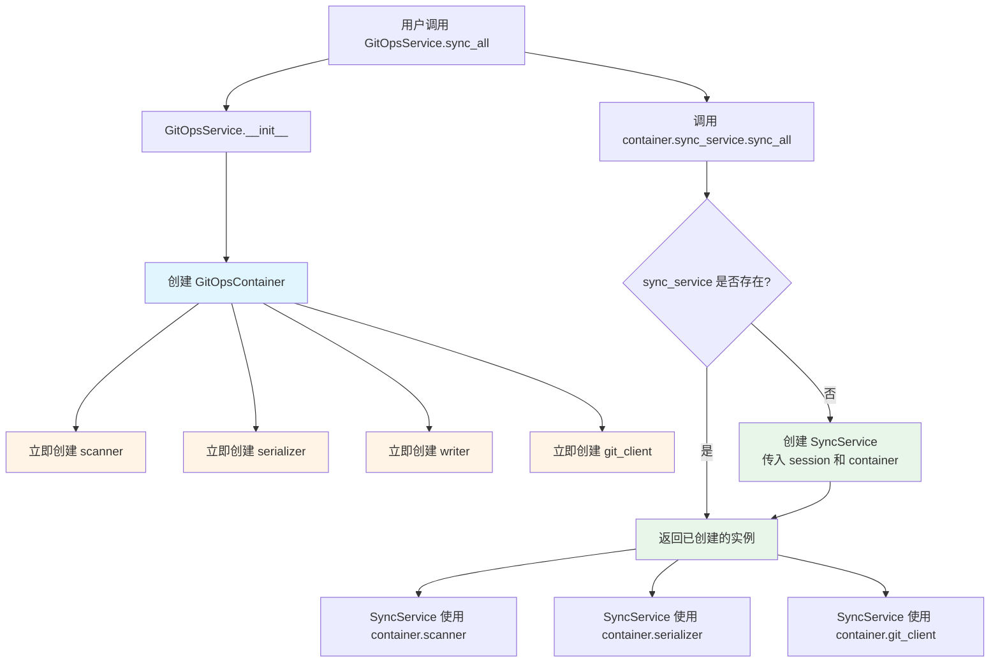

# GitOps 依赖注入详解

## 📦 什么会被注入？

`GitOpsContainer` 管理两类依赖：

### 1️⃣ 核心组件（立即创建）

这些是底层工具类，在容器初始化时立即创建：

```python
class GitOpsContainer:
    def __init__(self, session: AsyncSession, content_dir: Optional[Path] = None):
        # 基础依赖
        self.session = session                    # 数据库会话
        self.content_dir = content_dir            # 内容目录路径

        # 核心组件（立即创建）
        self.scanner = MDXScanner(self.content_dir)
        self.serializer = PostSerializer(session)
        self.writer = FileWriter(session, content_dir, self.serializer)
        self.git_client = GitClient(self.content_dir)
```

#### 核心组件详解

| 组件         | 类型             | 依赖                                   | 职责                                                              |
| ------------ | ---------------- | -------------------------------------- | ----------------------------------------------------------------- |
| `scanner`    | `MDXScanner`     | `content_dir`                          | 扫描文件系统，读取 MDX 文件，计算哈希，推导 post_type 和 category |
| `serializer` | `PostSerializer` | `session`                              | 双向转换：Frontmatter ↔ Post 对象，协调 Processor Pipeline        |
| `writer`     | `FileWriter`     | `session`, `content_dir`, `serializer` | 将数据库变更写回文件系统（回签 ID、移动文件）                     |
| `git_client` | `GitClient`      | `content_dir`                          | 执行 Git 命令（pull, commit, push, diff）                         |

### 2️⃣ 服务层（延迟加载 + 单例）

这些是高层业务逻辑，只在第一次访问时创建：

```python
class GitOpsContainer:
    def __init__(self, session, content_dir):
        # ... 核心组件初始化 ...

        # 服务层（延迟加载）
        self._sync_service = None
        self._preview_service = None
        self._resync_service = None
        self._commit_service = None

    @property
    def sync_service(self):
        """获取同步服务（单例）"""
        if self._sync_service is None:
            # 第一次访问时创建
            self._sync_service = SyncService(self.session, self)
            #                                                  ^^^^
            #                                          把容器自己传进去！
        return self._sync_service
```

#### 服务层详解

| 服务              | 类型             | 依赖                   | 职责                |
| ----------------- | ---------------- | ---------------------- | ------------------- |
| `sync_service`    | `SyncService`    | `session`, `container` | 全量和增量同步      |
| `preview_service` | `PreviewService` | `session`, `container` | 同步预览（Dry Run） |
| `resync_service`  | `ResyncService`  | `session`, `container` | 重新同步单个文章    |
| `commit_service`  | `CommitService`  | `session`, `container` | Git 提交和推送      |

---

## 🔄 依赖注入流程

### 完整调用链

```
用户代码
    ↓
GitOpsService (门面)
    ↓ 创建
GitOpsContainer (容器)
    ↓ 立即创建
核心组件 (scanner, serializer, writer, git_client)
    ↓ 延迟创建
服务层 (sync_service, preview_service, etc.)
    ↓ 使用
核心组件
```

### 详细流程图



---

## 💉 注入机制详解

### 方式 1: 构造函数注入（Constructor Injection）

这是最常见的注入方式，通过构造函数参数传递依赖。

#### 核心组件的注入

```python
# 容器创建核心组件时，注入它们需要的依赖
class GitOpsContainer:
    def __init__(self, session, content_dir):
        # scanner 需要 content_dir
        self.scanner = MDXScanner(content_dir)
        #                         ^^^^^^^^^^^
        #                         注入依赖

        # serializer 需要 session
        self.serializer = PostSerializer(session)
        #                                ^^^^^^^
        #                                注入依赖

        # writer 需要 session, content_dir, serializer
        self.writer = FileWriter(
            session=session,           # 注入依赖 1
            content_dir=content_dir,   # 注入依赖 2
            serializer=self.serializer # 注入依赖 3（组件间依赖）
        )

        # git_client 需要 content_dir
        self.git_client = GitClient(content_dir)
```

#### 服务层的注入

```python
# 容器创建服务时，把自己（容器）注入进去
class GitOpsContainer:
    @property
    def sync_service(self):
        if self._sync_service is None:
            self._sync_service = SyncService(
                self.session,  # 注入依赖 1: 数据库会话
                self           # 注入依赖 2: 容器自己！
            )
        return self._sync_service
```

### 方式 2: 属性注入（Property Injection）

服务通过容器获取核心组件。

```python
# 服务基类从容器中提取依赖
class BaseGitOpsService:
    def __init__(self, session: AsyncSession, container=None):
        self.session = session

        if container:
            # 从容器中提取依赖（属性注入）
            self.container = container
            self.scanner = container.scanner        # 提取 scanner
            self.serializer = container.serializer  # 提取 serializer
            self.git_client = container.git_client  # 提取 git_client
            self.content_dir = container.content_dir
```

---

## 🎯 依赖关系图

### 组件依赖关系

```
GitOpsContainer
├── session (外部传入)
├── content_dir (外部传入)
│
├── scanner (依赖 content_dir)
├── serializer (依赖 session)
├── writer (依赖 session, content_dir, serializer)
└── git_client (依赖 content_dir)
```

### 服务依赖关系

```
SyncService
├── session (外部传入)
├── container (外部传入)
│   ├── scanner (从容器获取)
│   ├── serializer (从容器获取)
│   ├── git_client (从容器获取)
│   └── content_dir (从容器获取)
└── 业务逻辑
```

---

## 🔍 实际代码示例

### 示例 1: 创建容器并使用核心组件

```python
from app.git_ops.container import GitOpsContainer

# 创建容器
container = GitOpsContainer(session)

# 直接使用核心组件（已经创建好了）
scanned_posts = await container.scanner.scan_all()
print(f"扫描到 {len(scanned_posts)} 个文件")

# 使用 serializer
for scanned in scanned_posts:
    post_dict = await container.serializer.from_frontmatter(scanned)
    print(f"转换后的文章: {post_dict['title']}")
```

### 示例 2: 通过容器访问服务

```python
from app.git_ops.container import GitOpsContainer

# 创建容器
container = GitOpsContainer(session)

# 第一次访问 sync_service（会创建）
print("第一次访问...")
service1 = container.sync_service  # 创建 SyncService
print(f"service1 id: {id(service1)}")

# 第二次访问 sync_service（返回已创建的）
print("第二次访问...")
service2 = container.sync_service  # 返回同一个实例
print(f"service2 id: {id(service2)}")

# 验证是同一个对象
assert service1 is service2  # True!
print("✅ 单例模式验证成功")

# 使用服务
stats = await container.sync_service.sync_all()
print(f"同步完成: +{len(stats.added)} ~{len(stats.updated)} -{len(stats.deleted)}")
```

### 示例 3: 服务如何使用注入的依赖

```python
# SyncService 的实现
class SyncService(BaseGitOpsService):
    async def sync_all(self, default_user: User = None):
        # 使用注入的 git_client
        await self.git_client.pull()

        # 使用注入的 scanner
        scanned_posts = await self.scanner.scan_all()

        # 使用注入的 serializer
        for scanned in scanned_posts:
            post_dict = await self.serializer.from_frontmatter(scanned)
            # ... 处理逻辑 ...
```

---

## 🧪 测试中的依赖注入

### 测试优势 1: Mock 整个容器

```python
from unittest.mock import MagicMock

# 创建 mock 容器
mock_container = MagicMock()
mock_container.scanner.scan_all.return_value = []
mock_container.serializer.match_post.return_value = (None, False)

# 创建服务（注入 mock 容器）
service = SyncService(session, mock_container)

# 测试
stats = await service.sync_all()
assert len(stats.added) == 0
```

### 测试优势 2: Mock 单个组件

```python
from unittest.mock import AsyncMock

# 创建真实容器
container = GitOpsContainer(session)

# 只 mock scanner
mock_scanner = AsyncMock()
mock_scanner.scan_all.return_value = [
    ScannedPost(file_path="test.mdx", frontmatter={...})
]
container.scanner = mock_scanner  # 替换 scanner

# 创建服务（使用部分 mock 的容器）
service = SyncService(session, container)

# 测试
stats = await service.sync_all()
# scanner 是 mock 的，但 serializer 是真实的
```

### 测试优势 3: 使用 pytest fixture

```python
# conftest.py
@pytest.fixture
def mock_container(db_session):
    """提供 mock 容器"""
    container = MagicMock()
    container.session = db_session
    container.scanner = AsyncMock()
    container.serializer = AsyncMock()
    container.git_client = AsyncMock()
    return container

# test_sync.py
async def test_sync_all(mock_container):
    """测试同步功能"""
    service = SyncService(session, mock_container)
    stats = await service.sync_all()

    # 验证调用
    mock_container.scanner.scan_all.assert_called_once()
```

---

## 🎓 设计模式总结

### 使用的设计模式

1. **依赖注入容器模式** (Dependency Injection Container)

   - 集中管理所有依赖的创建和生命周期

2. **单例模式** (Singleton Pattern)

   - 每个服务在容器中只创建一次

3. **延迟加载模式** (Lazy Loading Pattern)

   - 服务只在第一次访问时才创建

4. **门面模式** (Facade Pattern)

   - `GitOpsService` 作为门面，隐藏容器和服务的复杂性

5. **工厂模式** (Factory Pattern)
   - 容器负责创建所有对象

### 优势总结

| 优势         | 说明                       | 示例                                                     |
| ------------ | -------------------------- | -------------------------------------------------------- |
| **依赖共享** | 所有服务共享同一套核心组件 | `sync_service` 和 `preview_service` 使用同一个 `scanner` |
| **单例保证** | 每个服务只创建一次         | 多次访问 `container.sync_service` 返回同一个实例         |
| **延迟加载** | 按需创建，节省资源         | 如果不用预览功能，`preview_service` 永远不会被创建       |
| **易于测试** | 可以轻松 mock 依赖         | Mock 整个容器或单个组件                                  |
| **集中管理** | 修改依赖关系只需改一处     | 给 `scanner` 添加参数，只需修改容器                      |
| **解耦**     | 服务不需要知道依赖如何创建 | `SyncService` 不关心 `scanner` 是如何初始化的            |

---

## 📚 相关文档

- [ARCHITECTURE.md](./ARCHITECTURE.md) - 整体架构设计
- [README.md](./README.md) - 模块使用指南
- [services/README.md](./services/README.md) - 服务层详细文档

---

**最后更新**: 2026-01-23
**文档版本**: 1.0.0
