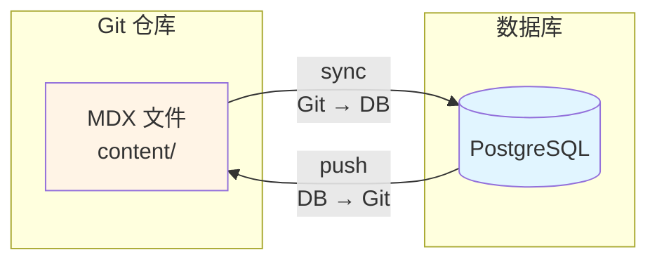
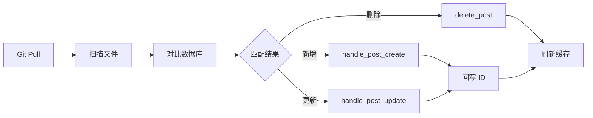
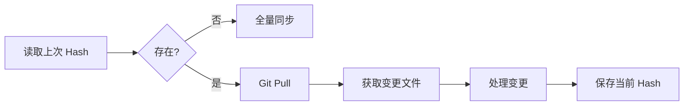
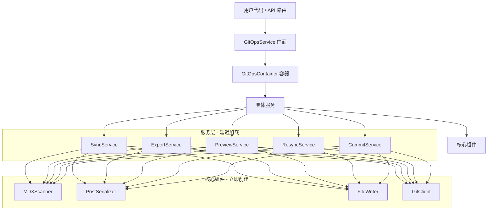

# GitOps 模块 - 完整文档

## 📖 概述

GitOps 模块是一个**双向内容同步引擎**，实现了文件系统（Git 仓库）与数据库之间的自动化内容管理流程。它支持：

- **Git → DB 同步**: 将 Markdown/MDX 文件同步到数据库
- **DB → Git 导出**: 将数据库文章导出为 MDX 文件

### 核心理念

- **Infrastructure as Code (IaC)** - 内容即代码
- **Bidirectional Sync** - 双向同步，灵活管理
- **声明式管理** - 文件系统状态与数据库状态保持一致
- **版本控制友好** - 所有内容变更可追溯、可回滚

### 同步方向



---

## 🏗️ 模块结构

```
git_ops/
├── __init__.py           # 模块入口
├── components/           # 核心业务组件
│   ├── handlers/         # 业务处理逻辑 (创建/更新/分类同步)
│   ├── processors/       # 字段处理器 (Pipeline 模式)
│   ├── scanner/          # 文件扫描器
│   ├── writer/           # 文件写入器
│   ├── metadata.py       # Frontmatter 数据模型 (Pydantic)
│   ├── serializer.py     # 统一序列化器
│   ├── cache.py          # Next.js 缓存失效
│   ├── comparator.py     # 文章对比器
│   └── webhook.py        # GitHub Webhook 验证
├── services/             # 服务层（职责单一）
│   ├── __init__.py       # 服务导出
│   ├── base.py           # 服务基类
│   ├── sync_service.py   # 同步服务 (Git → DB)
│   ├── export_service.py # 导出服务 (DB → Git) ⭐
│   ├── preview_service.py # 预览服务
│   ├── resync_service.py # 重新同步服务
│   ├── commit_service.py # 提交服务
│   └── README.md         # 服务层文档
├── background_tasks.py   # 后台任务
├── container.py          # 依赖注入容器 ⭐
├── exceptions.py         # 自定义异常类
├── git_client.py         # Git 操作客户端
├── router.py             # FastAPI 路由定义
├── schema.py             # API 数据模型 (Pydantic)
├── service.py            # 主服务（门面模式）⭐
├── README.md             # 本文档
└── ARCHITECTURE.md       # 架构设计文档
```

---

## 📁 文件详解

### 1. `components/` - 核心组件

存放所有核心业务逻辑组件，按职责分离。

- **`scanner/`**: 负责扫描文件系统中的 MDX 文件，计算哈希值，推导 post_type 和 category。
- **`metadata.py`**: Frontmatter 数据模型，使用 Pydantic 定义字段结构、验证规则和序列化逻辑。
- **`serializer.py`**: 核心序列化器，协调 Frontmatter 和 Processor，实现 Post 模型与 Frontmatter 之间的双向转换。
- **`processors/`**: 字段处理器（Pipeline 模式），处理复杂的字段解析逻辑（author、cover、category、tags 等）。
- **`writer/`**: 负责将数据库变更写回文件系统（如回签 ID）。
- **`handlers/`**: 具体的业务处理逻辑，如 `handle_post_create`, `handle_post_update`, `validate_post_for_resync`。
- **`cache.py`**: Next.js 缓存失效逻辑。
- **`comparator.py`**: 文章对比器，检测文章变化。
- **`webhook.py`**: GitHub Webhook 签名验证。

### 2. `container.py` - 依赖注入容器 ⭐

**核心类**: `GitOpsContainer`

**职责**: 集中管理所有依赖关系，实现依赖注入容器模式。

**管理的核心组件**（立即创建）:

- `scanner`: MDXScanner - 文件扫描器
- `serializer`: PostSerializer - 序列化器
- `writer`: FileWriter - 文件写入器
- `git_client`: GitClient - Git 客户端

**管理的服务**（延迟加载 + 单例）:

- `sync_service`: SyncService - 同步服务 (Git → DB)
- `export_service`: ExportService - 导出服务 (DB → Git) ⭐
- `preview_service`: PreviewService - 预览服务
- `resync_service`: ResyncService - 重新同步服务
- `commit_service`: CommitService - 提交服务

**优势**:

- ✅ **依赖共享**: 所有服务共享同一套核心组件
- ✅ **单例模式**: 每个服务只创建一次
- ✅ **延迟加载**: 按需创建服务，节省资源
- ✅ **易于测试**: 可以 mock 整个容器或单个组件

**使用示例**:

```python
# 创建容器
container = GitOpsContainer(session)

# 访问核心组件
scanned = await container.scanner.scan_all()

# 访问服务（第一次访问时创建）
stats = await container.sync_service.sync_all()
```

### 3. `service.py` - 主服务（门面模式）⭐

**核心类**: `GitOpsService`

**职责**: 协调各个子服务，提供统一的 API 接口。

**设计模式**: 门面模式（Facade Pattern）

**实现**:

```python
class GitOpsService:
    def __init__(self, session: AsyncSession):
        # 创建容器
        self.container = GitOpsContainer(session)

    async def sync_all(self, default_user: User = None):
        # 委托给容器中的服务
        return await self.container.sync_service.sync_all(default_user)
```

**优点**:

- 向后兼容：保持原有 API 不变
- 简化接口：隐藏子服务的复杂性
- 统一入口：所有 GitOps 操作通过主服务

### 4. `services/` - 服务层

职责单一的服务类：

| 服务             | 文件                  | 职责                           |
| ---------------- | --------------------- | ------------------------------ |
| `SyncService`    | `sync_service.py`     | 全量和增量同步 (Git → DB)      |
| `ExportService`  | `export_service.py`   | 导出数据库文章 (DB → Git) ⭐   |
| `PreviewService` | `preview_service.py`  | 同步预览（Dry Run）            |
| `ResyncService`  | `resync_service.py`   | 重新同步单个文章元数据         |
| `CommitService`  | `commit_service.py`   | Git 提交和推送                 |
| `BaseGitOpsService` | `base.py`          | 服务基类，提供共享逻辑         |

每个服务继承自 `BaseGitOpsService`，通过容器获取依赖。

### 5. `schema.py` & `metadata.py`

- **`schema.py`**: 定义 API 交互的数据模型，如 `SyncStats` (同步统计) 和 `PreviewResult` (预览结果)。
- **`metadata.py`**: **单一真实来源**，使用 Pydantic 定义 Frontmatter 字段结构、验证规则、类型转换和序列化逻辑。

### 6. `git_client.py` - Git 操作客户端

封装了 Git 命令行操作，提供异步接口用于与 Git 仓库交互。

- `pull()`: 拉取最新代码。
- `get_current_hash()`: 获取当前 Commit Hash。
- `get_changed_files()`: 获取两个 commit 之间的变更文件。
- `add()`, `commit()`, `push()`: 支持回写操作。

### 7. `exceptions.py` - 异常定义

定义了 `GitOpsError`, `GitOpsConfigurationError`, `GitOpsSyncError` 等异常类。

### 8. `background_tasks.py` - 后台任务

定义了后台任务函数：

- `run_background_sync()`: 后台执行同步
- `run_background_commit()`: 后台执行 Git 提交

---

## 🔄 核心流程

### API 端点概览

| 端点                              | 方法 | 服务              | 说明                     |
| --------------------------------- | ---- | ----------------- | ------------------------ |
| `/ops/git/sync`                   | POST | `SyncService`     | 增量同步（默认）         |
| `/ops/git/sync?force_full=true`   | POST | `SyncService`     | 强制全量同步             |
| `/ops/git/push`                   | POST | `ExportService`   | 导出数据库文章到 Git     |
| `/ops/git/preview`                | GET  | `PreviewService`  | 预览同步变更（Dry Run）  |
| `/ops/git/posts/{id}/resync-metadata` | POST | `ResyncService` | 重新同步单篇元数据       |
| `/ops/git/webhook`                | POST | `SyncService`     | GitHub Webhook 入口      |

### 全量同步流程 (sync_all)



1. **触发**: 管理员调用 API `/ops/git/sync?force_full=true`
2. **Pull**: 使用 `git_client` 拉取最新代码
3. **扫描**: 使用 `scanner` 扫描所有 MDX 文件
4. **对比**: 查询数据库已同步文章
5. **处理**: 新增/更新/删除
6. **回写**: 将生成的 UUID 回写到 Frontmatter
7. **缓存**: 刷新 Next.js 前端缓存

### 增量同步流程 (sync_incremental)



1. **读取状态**: 从 `.gitops_last_sync` 获取上次 Commit Hash
2. **差异获取**: 使用 `git_client.get_changed_files()` 获取变更
3. **增量处理**: 仅处理变更的文件
4. **智能回退**: 无记录则降级为全量同步

### 导出同步流程 (export_to_git) ⭐


1. **触发**: 管理员调用 API `/ops/git/push`
2. **查询**: 获取需要导出的文章（无 source_path 的新文章）
3. **写入**: 使用 `FileWriter` 生成 MDX 文件
4. **关联**: 更新数据库的 `source_path` 字段
5. **提交**: Git add + commit + push

### 预览流程 (preview_sync)

1. **触发**: 调用 API `/ops/git/preview`
2. **Dry Run**: 扫描文件并对比，不执行写操作
3. **返回**: `PreviewResult` 包含待创建/更新/删除的文章列表

### 重新同步流程 (resync_post_metadata)

1. **触发**: 调用 API `/ops/git/posts/{post_id}/resync-metadata`
2. **读取**: 重新读取指定文章的 MDX 文件
3. **更新**: 将 Frontmatter 同步到数据库
4. **用途**: 修复 frontmatter 错误、补全元数据

---

## 🏛️ 依赖注入容器详解

### 为什么需要容器？

#### 问题场景（重构前）

```python
# ❌ 每个服务都要自己创建依赖
class GitOpsService:
    def __init__(self, session):
        # 重复创建
        self.scanner = MDXScanner(content_dir)
        self.serializer = PostSerializer(session)
        self.git_client = GitClient(content_dir)
```

**问题**:

1. 依赖创建逻辑分散在各处
2. 重复创建相同的对象（浪费资源）
3. 难以测试（无法轻松 mock 依赖）
4. 修改依赖关系时要改很多地方

#### 容器解决方案（重构后）

```python
# ✅ 容器统一管理依赖
class GitOpsContainer:
    def __init__(self, session, content_dir):
        # 核心组件：容器创建并持有
        self.scanner = MDXScanner(content_dir)
        self.serializer = PostSerializer(session)
        self.writer = FileWriter(content_dir)
        self.git_client = GitClient(content_dir)

        # 服务层：延迟加载
        self._sync_service = None
        self._export_service = None
        # ... 其他服务

    @property
    def sync_service(self):
        """单例模式：只创建一次"""
        if self._sync_service is None:
            self._sync_service = SyncService(self.session, self)
        return self._sync_service

    @property
    def export_service(self):
        if self._export_service is None:
            self._export_service = ExportService(self.session, self)
        return self._export_service
```

### 调用流程



### 核心优势

1. **依赖共享**: 所有服务共享同一套核心组件，避免重复创建
2. **单例模式**: 每个服务在容器中只创建一次
3. **延迟加载**: 只在第一次访问时才创建服务
4. **易于测试**: 可以 mock 整个容器或单个组件
5. **集中管理**: 修改依赖关系只需改一处
6. **双向同步**: 支持 Git → DB 和 DB → Git 两个方向

### 测试示例

```python
# Mock 整个容器
mock_container = MagicMock()
mock_container.scanner.scan_all.return_value = []
service = SyncService(session, mock_container)

# 或者只 mock 某个组件
container = GitOpsContainer(session, content_dir)
container.scanner = mock_scanner
service = SyncService(session, container)
```

---

## 🔧 常见问题

### 为什么删除了 `error_handler.py`?

为了保持代码的 Pythonic 和简洁性，我们移除了过度封装的 `safe_operation` 和 `handle_sync_error` 函数。现在的错误处理采用 **`collect_errors` 上下文管理器**，这是一种优雅的封装方式，既保持了代码的清晰性，又避免了大量重复的 try-except 块。

```python
# exceptions.py 中定义
@asynccontextmanager
async def collect_errors(stats: SyncStats, context: str = ""):
    """收集错误但不中断流程"""
    try:
        yield
    except GitOpsError as e:
        stats.errors.append(str(e))
        logger.warning(f"GitOps error in {context}: {e}")
    except Exception as e:
        stats.errors.append(f"Unexpected error: {e}")
        logger.error(f"Unexpected error in {context}: {e}", exc_info=True)

# 服务中使用
async def sync_all(self) -> SyncStats:
    for file_path in files:
        async with collect_errors(stats, f"processing {file_path}"):
            await self._process_single_file(file_path)
    return stats
```

### 为什么要拆分服务？

原来的 `service.py` 有 481 行，包含了同步、预览、重新同步、提交等多个功能。拆分后：

- 每个服务类只负责一个功能领域（单一职责原则）
- 代码更易于理解和维护
- 测试更加聚焦
- 修改一个功能不影响其他功能

### 如何向后兼容？

`GitOpsService` 保持了原有的 API 不变，所有现有代码无需修改。内部实现改为委托给容器中的服务,对外部调用者完全透明。

### 错误处理采用什么模式？

GitOps 模块采用 **`collect_errors` 上下文管理器** 进行错误处理。这种方式具有以下优点：

- **简洁**: 避免在每个操作中重复写 try-except 块
- **非阻塞**: 单个文件处理失败不影响其他文件
- **可追踪**: 所有错误都被收集到 `stats.errors` 列表中返回

**错误分类**:

- **`GitOpsError`**: 业务逻辑错误，记录 warning 日志
- **其他异常**: 意外错误，记录完整堆栈信息

**全局异常处理**: 项目在 FastAPI 层实现了统一的全局异常处理器（`app/core/error_handlers.py`），提供统一的错误响应格式、环境隔离和全链路追踪。

详见 [ARCHITECTURE.md](./ARCHITECTURE.md#-错误处理模式)。

---

## 📚 相关文档

- [ARCHITECTURE.md](./ARCHITECTURE.md) - 整体架构设计和错误处理模式
- [DEPENDENCY_INJECTION_EXPLAINED.md](./DEPENDENCY_INJECTION_EXPLAINED.md) - 依赖注入详解
- [SYNC_FLOW_WITH_DI.md](./SYNC_FLOW_WITH_DI.md) - 同步流程可视化（含依赖注入）
- [services/README.md](./services/README.md) - 服务层详细文档

---

**最后更新**: 2026-01-28
**文档版本**: 3.4.0 (双向同步文档更新 + 流程图增强)
