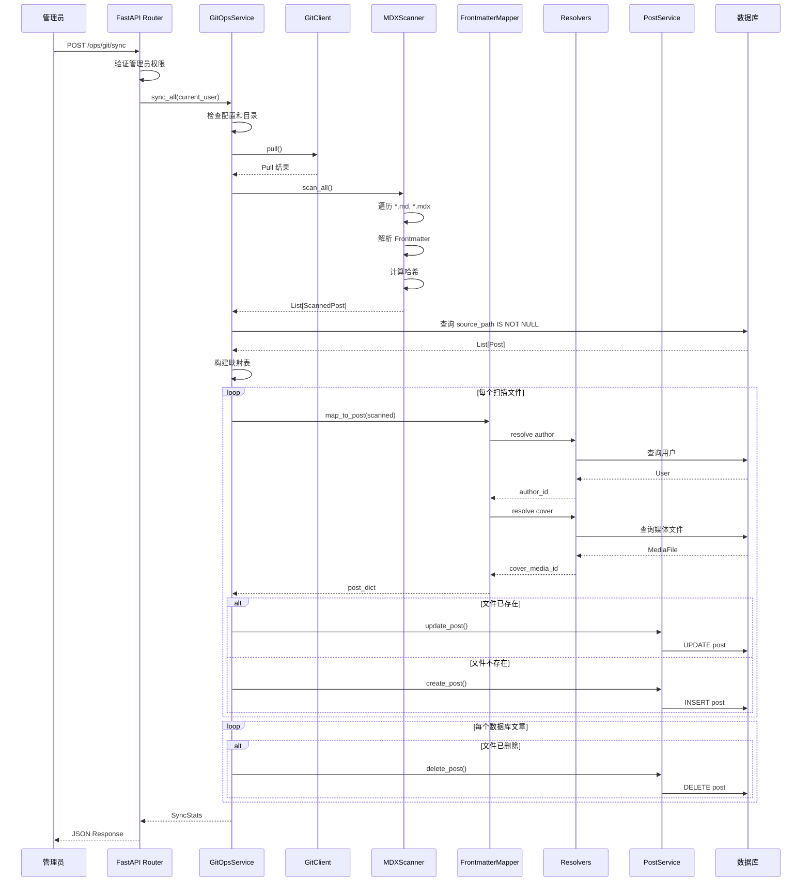

# GitOps 模块 - 完整文档

## 📖 概述

GitOps 模块是一个**内容同步引擎**，实现了从文件系统（Git 仓库）到数据库的自动化内容管理流程。它允许博客内容以 Markdown/MDX 文件的形式存储在 Git 中，通过扫描和解析这些文件，自动同步到数据库中。

### 核心理念

- **Infrastructure as Code (IaC)** - 内容即代码
- **Single Source of Truth** - Git 仓库作为内容的唯一真实来源
- **声明式管理** - 文件系统状态决定数据库状态
- **版本控制友好** - 所有内容变更可追溯、可回滚

---

## 🏗️ 模块结构

```
git_ops/
├── __init__.py           # 模块入口
├── exceptions.py         # 自定义异常类
├── git_client.py         # Git 操作客户端
├── scanner.py            # MDX 文件扫描与解析
├── mapper.py             # Frontmatter 字段映射
├── resolvers.py          # 引用解析器（作者、封面）
├── service.py            # 同步业务逻辑编排
├── router.py             # FastAPI 路由定义
├── README.md             # 本文档
└── ARCHITECTURE.md       # 架构设计文档
```

---

## 📁 文件详解

### 1. `exceptions.py` - 异常定义

定义了 GitOps 模块专用的异常类型，用于错误处理和日志记录。

#### 类层次结构

```python
BaseAppException (core.exceptions)
    └── GitOpsError
            ├── GitOpsConfigurationError  # 配置错误（致命）
            └── GitOpsSyncError           # 同步错误（非致命）
```

#### 异常类说明

**`GitOpsError`**

- **用途**: GitOps 模块的基础异常类
- **继承**: `BaseAppException`
- **说明**: 所有 GitOps 相关异常的父类

**`GitOpsConfigurationError`**

- **用途**: 配置或环境错误（致命错误）
- **HTTP 状态码**: 500 Internal Server Error
- **错误代码**: `GITOPS_CONFIG_ERROR`
- **使用场景**:
  - `CONTENT_DIR` 未配置
  - 内容目录不存在
  - 找不到默认用户
- **示例**:
  ```python
  raise GitOpsConfigurationError("Content directory not found: /path/to/content")
  ```

**`GitOpsSyncError`**

- **用途**: 同步过程中的非致命错误
- **HTTP 状态码**: 400 Bad Request
- **错误代码**: `GITOPS_SYNC_ERROR`
- **使用场景**:
  - Frontmatter 字段缺失
  - 作者不存在
  - 数据验证失败
- **特点**: 通常被捕获并记录到 `stats.errors`，不中断整个同步流程
- **示例**:
  ```python
  raise GitOpsSyncError(
      "Missing required field 'author'",
      detail="Every post must specify an author"
  )
  ```

---

### 2. `git_client.py` - Git 操作客户端

封装了 Git 命令行操作，提供异步接口用于与 Git 仓库交互。

#### 类：`GitClient`

**初始化**

```python
def __init__(self, repo_path: Path)
```

- **参数**: `repo_path` - Git 仓库根目录路径
- **说明**: 初始化时会检查 `.git` 目录是否存在，如果不存在会记录警告日志

#### 核心方法

**`async def run(*args: str) -> Tuple[int, str, str]`**

- **用途**: 执行任意 Git 命令（非阻塞）
- **参数**: `*args` - Git 命令参数（不包含 `git` 本身）
- **返回**: `(返回码, stdout, stderr)` 元组
- **异常**:
  - `GitError` - Git 命令未找到或执行失败
- **实现细节**:
  - 使用 `asyncio.create_subprocess_exec` 实现异步执行
  - 自动设置工作目录为 `repo_path`
  - 捕获标准输出和标准错误
- **示例**:
  ```python
  code, out, err = await git_client.run("status", "--short")
  ```

**`async def pull() -> str`**

- **用途**: 执行 `git pull` 拉取最新代码
- **返回**: Git pull 的输出信息
- **异常**:
  - `GitError` - Pull 失败（如不是 Git 仓库、网络错误等）
- **错误处理**:
  - 检测 "not a git repository" 错误
  - 返回详细的错误信息
- **示例**:
  ```python
  try:
      output = await git_client.pull()
      logger.info(f"Pull successful: {output}")
  except GitError as e:
      logger.warning(f"Pull failed: {e}")
  ```

**`async def get_current_hash() -> str`**

- **用途**: 获取当前 HEAD 的 commit hash
- **返回**: 完整的 SHA-1 hash（40 字符）
- **实现**: 执行 `git rev-parse HEAD`
- **用途场景**:
  - 记录同步时的 Git 版本
  - 增量同步时比较版本差异
- **示例**:
  ```python
  current_hash = await git_client.get_current_hash()
  # "a1b2c3d4e5f6..."
  ```

**`async def get_changed_files(since_hash: str) -> List[str]`**

- **用途**: 获取自指定 commit 以来变更的文件列表
- **参数**: `since_hash` - 起始 commit hash
- **返回**: 变更文件的相对路径列表
- **实现**: 执行 `git diff --name-only <hash>..HEAD`
- **用途场景**: 增量同步（只处理变更的文件）
- **示例**:
  ```python
  changed = await git_client.get_changed_files("abc123...")
  # ["content/post1.md", "content/post2.md"]
  ```

**`async def get_file_status() -> List[Tuple[str, str]]`**

- **用途**: 获取工作区文件状态
- **返回**: `[(状态码, 文件路径)]` 列表
- **实现**: 执行 `git status --porcelain`
- **状态码说明**:
  - `M` - 已修改
  - `A` - 新增
  - `D` - 已删除
  - `??` - 未跟踪
- **示例**:
  ```python
  status = await git_client.get_file_status()
  # [('M', 'README.md'), ('??', 'new_file.md')]
  ```

#### 异常类：`GitError`

- **用途**: Git 操作相关的异常
- **继承**: `Exception`
- **使用场景**: Git 命令执行失败时抛出

---

### 3. `scanner.py` - 文件扫描与解析

负责扫描文件系统中的 MDX 文件，解析 Frontmatter 元数据和正文内容。

#### 数据模型：`ScannedPost`

```python
class ScannedPost(BaseModel):
    file_path: str          # 相对路径（如 "posts/my-post.md"）
    content_hash: str       # 全文 SHA256 哈希（用于变更检测）
    meta_hash: str          # Frontmatter SHA256 哈希
    frontmatter: Dict       # 元数据字典
    content: str            # 正文内容（不包含 Frontmatter）
    updated_at: float       # 文件修改时间戳（mtime）
```

**字段说明**:

- `content_hash`: 整个文件的指纹，任何修改都会改变
- `meta_hash`: 仅 Frontmatter 的指纹，用于判断是否只修改了元数据
- `updated_at`: 文件系统的修改时间，用于排序和缓存判断

#### 类：`MDXScanner`

**初始化**

```python
def __init__(self, content_root: Path)
```

- **参数**: `content_root` - 内容根目录（如 `content/`）
- **说明**: 如果目录不存在会记录警告日志

#### 核心方法

**`async def scan_file(rel_path: str) -> Optional[ScannedPost]`**

- **用途**: 扫描并解析单个 MDX 文件
- **参数**: `rel_path` - 相对于 `content_root` 的路径
- **返回**: `ScannedPost` 对象，失败返回 `None`
- **处理流程**:
  1. 使用 `asyncio.to_thread` 异步读取文件内容
  2. 使用 `python-frontmatter` 库解析 Frontmatter
  3. 计算两个哈希值：
     - `content_hash`: 原始文件内容的 SHA256
     - `meta_hash`: Frontmatter JSON 序列化后的 SHA256
  4. 获取文件的 `mtime`（修改时间）
  5. 构建 `ScannedPost` 对象
- **错误处理**: 捕获所有异常，记录错误日志并返回 `None`
- **性能优化**: 使用 `asyncio.to_thread` 避免阻塞事件循环
- **示例**:
  ```python
  scanned = await scanner.scan_file("posts/my-post.md")
  if scanned:
      print(f"Title: {scanned.frontmatter.get('title')}")
      print(f"Hash: {scanned.content_hash}")
  ```

**`async def scan_all(glob_patterns: List[str] = None) -> List[ScannedPost]`**

- **用途**: 扫描所有匹配的 MDX 文件
- **参数**: `glob_patterns` - 文件匹配模式列表，默认 `["**/*.md", "**/*.mdx"]`
- **返回**: `ScannedPost` 对象列表
- **处理流程**:
  1. 遍历每个 glob 模式
  2. 使用 `Path.glob()` 查找匹配文件
  3. 对每个文件调用 `scan_file()`
  4. 过滤掉失败的文件（返回 `None` 的）
- **性能考虑**:
  - `glob()` 是同步操作，但通常很快
  - 文件读取使用异步 I/O
- **示例**:

  ```python
  # 扫描所有 Markdown 文件
  posts = await scanner.scan_all()
  print(f"Found {len(posts)} posts")

  # 自定义模式
  posts = await scanner.scan_all(["blog/**/*.md", "docs/**/*.mdx"])
  ```

#### 私有方法

**`def _calc_hash(content: str | bytes) -> str`**

- **用途**: 计算内容的 SHA256 哈希
- **参数**: `content` - 字符串或字节内容
- **返回**: 十六进制哈希字符串（64 字符）
- **实现**: 使用 `hashlib.sha256`
- **用途**:
  - 计算文件内容哈希（变更检测）
  - 计算元数据哈希（判断是否只改了 Frontmatter）

---

### 4. `mapper.py` - Frontmatter 字段映射

负责将 MDX Frontmatter 元数据映射为 Post 模型字段，处理字段转换、默认值和验证。

#### 类：`FrontmatterMapper`

**初始化**

```python
def __init__(self, session: AsyncSession)
```

- **参数**: `session` - 数据库会话
- **说明**: 初始化时创建 `AuthorResolver` 和 `CoverResolver` 实例

#### 核心方法

**`async def map_to_post(scanned: ScannedPost) -> Dict[str, Any]`**

- **用途**: 将扫描到的文件数据映射为 Post 模型字段
- **参数**: `scanned` - 扫描结果对象
- **返回**: Post 模型字段的字典（可用于 `PostCreate` 或 `PostUpdate`）
- **异常**: `GitOpsSyncError` - 必填字段缺失或无效
- **映射规则**:

| Frontmatter 字段                       | Post 字段          | 默认值      | 说明            |
| -------------------------------------- | ------------------ | ----------- | --------------- |
| `title`                                | `title`            | 文件名      | 文章标题        |
| `slug`                                 | `slug`             | -           | URL 标识符      |
| `summary` / `excerpt` / `description`  | `excerpt`          | 空字符串    | 文章摘要        |
| `content` (正文)                       | `content_mdx`      | -           | MDX 内容        |
| `status`                               | `status`           | `PUBLISHED` | 文章状态        |
| `published`                            | `status`           | `PUBLISHED` | 向后兼容        |
| `date` / `published_at`                | `published_at`     | 当前时间    | 发布日期        |
| `cover` / `image`                      | `cover_media_id`   | `None`      | 封面图 ID       |
| `author`                               | `author_id`        | -           | 作者 ID（必填） |
| `type` / `post_type`                   | `post_type`        | `ARTICLE`   | 文章类型        |
| `featured` / `is_featured`             | `is_featured`      | `False`     | 是否精选        |
| `allow_comments` / `comments`          | `allow_comments`   | `True`      | 是否允许评论    |
| `meta_title` / `seo_title`             | `meta_title`       | 空字符串    | SEO 标题        |
| `meta_description` / `seo_description` | `meta_description` | 空字符串    | SEO 描述        |
| `meta_keywords` / `keywords`           | `meta_keywords`    | 空字符串    | SEO 关键词      |
| `tags`                                 | `tags`             | `[]`        | 标签列表        |

- **特殊处理**:
  - **作者解析**: 调用 `AuthorResolver` 查询用户
  - **封面解析**: 调用 `CoverResolver` 查询媒体文件
  - **标签解析**: 支持数组或逗号分隔字符串
  - **布尔字段**: 正确处理 `False` 值（避免被 `or` 运算符覆盖）
- **示例**:
  ```python
  mapper = FrontmatterMapper(session)
  post_dict = await mapper.map_to_post(scanned)
  # {
  #     "title": "My Post",
  #     "author_id": UUID("..."),
  #     "status": "PUBLISHED",
  #     ...
  # }
  ```

#### 私有方法

**`def _resolve_post_type(meta: Dict) -> str`**

- **用途**: 解析文章类型
- **支持的类型**: `article`（默认）、`idea`
- **字段**: `type` 或 `post_type`
- **验证**: 无效类型会记录警告并使用默认值
- **示例**:
  ```python
  # Frontmatter: type: idea
  post_type = mapper._resolve_post_type(meta)  # "idea"
  ```

**`def _resolve_status(meta: Dict) -> str`**

- **用途**: 解析文章状态
- **优先级**:
  1. `status` 字段（直接指定 `DRAFT` 或 `PUBLISHED`）
  2. `published` 布尔字段（向后兼容）
  3. 默认 `PUBLISHED`
- **验证**: 无效状态会记录警告并使用默认值
- **示例**:

  ```python
  # Frontmatter: status: draft
  status = mapper._resolve_status(meta)  # "DRAFT"

  # Frontmatter: published: false
  status = mapper._resolve_status(meta)  # "DRAFT"
  ```

**`def _resolve_date(meta: Dict) -> Optional[datetime]`**

- **用途**: 解析发布日期
- **优先级**:
  1. `date` 字段
  2. `published_at` 字段
  3. 如果都没有且状态为 `PUBLISHED`，使用当前时间
  4. 如果状态为 `DRAFT`，返回 `None`
- **支持的格式**:
  - ISO 8601: `"2024-01-15T10:30:00"`
  - 日期字符串: `"2024-01-15"`
  - `datetime` 对象（YAML 自动解析）
- **错误处理**: 解析失败时记录警告并使用当前时间
- **示例**:

  ```python
  # Frontmatter: date: 2024-01-15
  date = mapper._resolve_date(meta)  # datetime(2024, 1, 15)

  # 无日期且为草稿
  date = mapper._resolve_date({"status": "draft"})  # None
  ```

---

### 5. `resolvers.py` - 引用解析器

负责解析 Frontmatter 中的引用（作者、封面图等），将字符串值转换为数据库 ID。

#### 类：`AuthorResolver`

**用途**: 根据用户名或 UUID 查询作者

**初始化**

```python
def __init__(self, session: AsyncSession)
```

**核心方法**

**`async def resolve(author_value: str) -> UUID`**

- **用途**: 查询作者并返回用户 ID
- **参数**: `author_value` - 用户名或 UUID 字符串
- **返回**: 用户 ID（UUID）
- **异常**: `GitOpsSyncError` - 作者不存在或值为空
- **查询策略**:
  1. 检查是否为 UUID 格式（36 字符，4 个连字符）
  2. 如果是 UUID，按 ID 查询
  3. 如果不是 UUID，按用户名查询
  4. 都找不到则抛出异常
- **日志**: 成功匹配时记录 INFO 日志，失败时记录 WARNING
- **示例**:

  ```python
  resolver = AuthorResolver(session)

  # 通过用户名查询
  user_id = await resolver.resolve("admin")

  # 通过 UUID 查询
  user_id = await resolver.resolve("123e4567-e89b-12d3-a456-426614174000")

  # 作者不存在
  try:
      user_id = await resolver.resolve("nonexistent")
  except GitOpsSyncError as e:
      print(e.message)  # "Author not found: nonexistent"
  ```

#### 类：`CoverResolver`

**用途**: 根据文件路径查询媒体库中的封面图

**初始化**

```python
def __init__(self, session: AsyncSession)
```

**核心方法**

**`async def resolve(cover_path: str) -> Optional[UUID]`**

- **用途**: 查询封面图并返回媒体文件 ID
- **参数**: `cover_path` - 封面图路径（相对路径或文件名）
- **返回**: 媒体文件 ID（UUID）或 `None`（未找到）
- **查询策略**（按优先级）:
  1. **精确匹配 `file_path`**: 完全匹配存储路径
  2. **匹配 `original_filename`**: 按原始文件名查询
  3. **后缀匹配 `file_path`**: 匹配路径末尾（如 `uploads/xxx/file.png` 匹配 `file.png`）
  4. **全名匹配 `file_path`**: 处理 `file_path` 只是文件名的情况
- **日志**:
  - 成功匹配时记录 INFO 日志（包含匹配方式）
  - 未找到时记录 WARNING 日志
- **容错性**: 找不到封面图不会抛出异常，只返回 `None`
- **示例**:

  ```python
  resolver = CoverResolver(session)

  # 通过完整路径查询
  media_id = await resolver.resolve("uploads/2025/01/cover.jpg")

  # 通过文件名查询
  media_id = await resolver.resolve("cover.jpg")

  # 未找到
  media_id = await resolver.resolve("nonexistent.jpg")  # None
  ```

**查询逻辑详解**:

```python
# 1. 精确匹配路径
SELECT * FROM media_file WHERE file_path = 'uploads/2025/01/cover.jpg'

# 2. 匹配原始文件名
SELECT * FROM media_file WHERE original_filename = 'cover.jpg'

# 3. 后缀匹配（解决路径前缀不同的问题）
SELECT * FROM media_file WHERE file_path LIKE '%/cover.jpg'

# 4. 全名匹配（处理 file_path 只是文件名的情况）
SELECT * FROM media_file WHERE file_path = 'cover.jpg'
```

---

### 6. `service.py` - 同步业务逻辑

核心服务类，负责编排整个同步流程，协调各个组件完成文件到数据库的同步。

#### 数据模型：`SyncStats`

```python
class SyncStats(BaseModel):
    added: List[str] = []      # 新增文件路径列表
    updated: List[str] = []    # 更新文件路径列表
    deleted: List[str] = []    # 删除文件路径列表
    skipped: int = 0           # 跳过数量
    errors: List[str] = []     # 错误信息列表
    duration: float = 0.0      # 总耗时（秒）
```

**用途**: 记录同步操作的统计信息，作为 API 响应返回给客户端

#### 类：`GitOpsService`

**初始化**

```python
def __init__(self, session: AsyncSession)
```

- **参数**: `session` - 数据库会话
- **初始化流程**:
  1. 检查 `settings.CONTENT_DIR` 是否配置
  2. 验证内容目录是否存在
  3. 创建 `MDXScanner` 实例
  4. 创建 `FrontmatterMapper` 实例
  5. 创建 `GitClient` 实例
- **异常**: `GitOpsConfigurationError` - 配置错误或目录不存在

#### 核心方法

**`async def sync_all(default_user: User = None) -> SyncStats`**

- **用途**: 执行完整的同步流程（主入口方法）
- **参数**: `default_user` - 默认作者（可选，未提供时查询 Superadmin）
- **返回**: `SyncStats` - 同步统计信息
- **异常**: `GitOpsConfigurationError` - 找不到操作用户

**完整流程**:

1. **准备阶段**

   ```python
   # 记录开始时间
   start_time = time.time()

   # 确定操作用户（作者）
   if not default_user:
       # 查询 Superadmin
       stmt = select(User).where(User.role == UserRole.SUPERADMIN).limit(1)
       operating_user = await session.exec(stmt).first()
   ```

2. **Git Pull（可选）**

   ```python
   try:
       pull_output = await self.git_client.pull()
       logger.info(f"Git pull result: {pull_output}")
   except GitError as e:
       # 允许失败，降级为仅同步本地
       logger.warning(f"Git pull skipped/failed: {e}")
   ```

3. **扫描文件系统**

   ```python
   scanned_posts = await self.scanner.scan_all()
   scanned_map = {p.file_path: p for p in scanned_posts}
   logger.info(f"Scanned {len(scanned_posts)} files.")
   ```

4. **查询数据库现状**

   ```python
   stmt = select(Post).where(Post.source_path.isnot(None))
   existing_posts = await session.exec(stmt).all()
   existing_map = {p.source_path: p for p in existing_posts}
   ```

5. **处理新增和更新**

   ```python
   for file_path, scanned in scanned_map.items():
       try:
           await self._sync_single_file(
               file_path, scanned, existing_map,
               operating_user, stats
           )
       except GitOpsSyncError as e:
           # 记录错误但继续处理其他文件
           stats.errors.append(f"{file_path}: {e.message}")
       except Exception as e:
           # 捕获未预期的错误
           stats.errors.append(f"{file_path}: {str(e)}")
   ```

6. **处理删除**

   ```python
   for source_path, post in existing_map.items():
       if source_path not in scanned_map:
           # 文件已删除，删除数据库记录
           await post_service.delete_post(
               session, post.id, current_user=operating_user
           )
           stats.deleted.append(source_path)
   ```

7. **计算统计信息**
   ```python
   stats.duration = time.time() - start_time
   logger.info(
       f"Sync completed in {stats.duration:.2f}s: "
       f"+{len(stats.added)} ~{len(stats.updated)} -{len(stats.deleted)}"
   )
   return stats
   ```

**错误处理策略**:

- **单文件失败不中断**: 使用 try-except 捕获每个文件的错误
- **错误记录**: 所有错误记录到 `stats.errors` 列表
- **日志记录**: 使用 `logger.error()` 和 `logger.exception()` 记录详细信息
- **配置错误致命**: `GitOpsConfigurationError` 会中断整个流程

**性能特点**:

- **全量扫描**: 当前实现扫描所有文件（未来可优化为增量）
- **串行处理**: 文件按顺序处理（未来可并发优化）
- **单次数据库查询**: 一次查询获取所有 GitOps 文章
- **内存映射**: 使用字典构建映射表，O(1) 查找

**`async def _sync_single_file(...) -> None`**

- **用途**: 处理单个文件的同步逻辑（CREATE 或 UPDATE）
- **参数**:
  - `file_path`: 文件相对路径
  - `scanned`: 扫描结果
  - `existing_map`: 数据库文章映射表
  - `default_author`: 默认作者
  - `stats`: 统计信息对象（会被修改）
- **逻辑**:

  ```python
  if file_path in existing_map:
      # === UPDATE ===
      existing_post = existing_map[file_path]
      update_dict = await self.mapper.map_to_post(scanned)
      post_in = PostUpdate(**update_dict)
      await post_service.update_post(
          session, existing_post.id, post_in, current_user=default_author
      )
      stats.updated.append(file_path)
  else:
      # === CREATE ===
      create_dict = await self.mapper.map_to_post(scanned)
      create_dict["source_path"] = file_path

      # Slug Fallback
      if not create_dict.get("slug"):
          create_dict["slug"] = Path(file_path).stem

      post_in = PostCreate(**create_dict)
      await post_service.create_post(
          session, post_in, author_id=create_dict["author_id"]
      )
      stats.added.append(file_path)
  ```

**关键点**:

- **source_path 设置**: 仅在 CREATE 时设置，UPDATE 时不修改
- **Slug 回退**: 如果 Frontmatter 没有 slug，使用文件名
- **Pydantic 验证**: 使用 `PostCreate` 和 `PostUpdate` Schema 验证数据
- **调用 PostService**: 复用现有的文章 CRUD 逻辑

---

### 7. `router.py` - API 路由

定义 FastAPI 路由端点，提供 HTTP 接口触发同步操作。

#### 路由定义

**`POST /ops/git/sync`**

- **用途**: 手动触发 Git 同步
- **权限**: 需要管理员权限（`ADMIN` 或 `SUPERADMIN`）
- **请求**: 无请求体
- **响应**: `SyncStats` 对象
- **依赖注入**:
  - `current_user`: 通过 `get_current_adminuser` 获取当前管理员用户
  - `session`: 通过 `get_async_session` 获取数据库会话
- **实现**:
  ```python
  @router.post("/sync", response_model=SyncStats, summary="手动触发 Git 同步")
  async def trigger_sync(
      current_user: Annotated[User, Depends(get_current_adminuser)],
      session: Annotated[AsyncSession, Depends(get_async_session)],
  ):
      service = GitOpsService(session)
      return await service.sync_all(default_user=current_user)
  ```

**响应示例**:

```json
{
  "added": ["posts/new-post.md"],
  "updated": ["posts/updated-post.md"],
  "deleted": ["posts/deleted-post.md"],
  "skipped": 0,
  "errors": [],
  "duration": 1.23
}
```

**错误响应**:

- **401 Unauthorized**: 未登录或 Token 无效
- **403 Forbidden**: 非管理员用户
- **500 Internal Server Error**: 配置错误或同步失败

---

## 🔄 完整同步流程图



---

## 📋 Frontmatter 字段完整映射表

| Frontmatter 字段   | 类型            | Post 字段          | 默认值      | 必填 | 说明                        |
| ------------------ | --------------- | ------------------ | ----------- | ---- | --------------------------- |
| `title`            | string          | `title`            | 文件名      | ❌   | 文章标题                    |
| `slug`             | string          | `slug`             | 文件名      | ❌   | URL 标识符                  |
| `author`           | string          | `author_id`        | -           | ✅   | 作者用户名或 UUID           |
| `summary`          | string          | `excerpt`          | ""          | ❌   | 文章摘要（优先级最高）      |
| `excerpt`          | string          | `excerpt`          | ""          | ❌   | 文章摘要（优先级中）        |
| `description`      | string          | `excerpt`          | ""          | ❌   | 文章摘要（优先级最低）      |
| `content`          | string          | `content_mdx`      | -           | ✅   | MDX 正文内容                |
| `status`           | string          | `status`           | `PUBLISHED` | ❌   | `DRAFT` 或 `PUBLISHED`      |
| `published`        | boolean         | `status`           | `true`      | ❌   | 向后兼容，`false` = `DRAFT` |
| `date`             | string/datetime | `published_at`     | 当前时间    | ❌   | 发布日期                    |
| `published_at`     | string/datetime | `published_at`     | 当前时间    | ❌   | 发布日期（别名）            |
| `cover`            | string          | `cover_media_id`   | `null`      | ❌   | 封面图路径或文件名          |
| `image`            | string          | `cover_media_id`   | `null`      | ❌   | 封面图路径（别名）          |
| `type`             | string          | `post_type`        | `ARTICLE`   | ❌   | `article` 或 `idea`         |
| `post_type`        | string          | `post_type`        | `ARTICLE`   | ❌   | 文章类型（别名）            |
| `featured`         | boolean         | `is_featured`      | `false`     | ❌   | 是否精选                    |
| `is_featured`      | boolean         | `is_featured`      | `false`     | ❌   | 是否精选（别名）            |
| `allow_comments`   | boolean         | `allow_comments`   | `true`      | ❌   | 是否允许评论                |
| `comments`         | boolean         | `allow_comments`   | `true`      | ❌   | 是否允许评论（别名）        |
| `meta_title`       | string          | `meta_title`       | ""          | ❌   | SEO 标题                    |
| `seo_title`        | string          | `meta_title`       | ""          | ❌   | SEO 标题（别名）            |
| `meta_description` | string          | `meta_description` | ""          | ❌   | SEO 描述                    |
| `seo_description`  | string          | `meta_description` | ""          | ❌   | SEO 描述（别名）            |
| `meta_keywords`    | string          | `meta_keywords`    | ""          | ❌   | SEO 关键词                  |
| `keywords`         | string          | `meta_keywords`    | ""          | ❌   | SEO 关键词（别名）          |
| `tags`             | array/string    | `tags`             | `[]`        | ❌   | 标签列表（支持逗号分隔）    |

---

## 🔧 使用指南

### 1. 环境配置

在 `.env` 文件中配置：

```bash
# 内容目录（相对于项目根目录）
CONTENT_DIR=./content

# 或使用绝对路径
CONTENT_DIR=/path/to/content
```

### 2. 创建内容文件

在 `content/` 目录下创建 MDX 文件：

````markdown
---
title: "我的第一篇文章"
slug: "my-first-post"
author: "admin"
summary: "这是一篇测试文章"
status: "published"
date: "2024-01-15"
cover: "cover.jpg"
tags: ["技术", "博客"]
featured: true
allow_comments: true
meta_title: "我的第一篇文章 - 博客"
meta_description: "这是一篇关于博客的测试文章"
---

# 文章标题

这是文章正文内容，支持 **Markdown** 和 MDX 语法。

## 二级标题

- 列表项 1
- 列表项 2

```python
# 代码块
print("Hello, World!")
```
````

````

### 3. 触发同步

**方式一：通过 API（推荐）**

```bash
curl -X POST http://localhost:8000/api/v1/ops/git/sync \
  -H "Authorization: Bearer YOUR_ADMIN_TOKEN" \
  -H "Content-Type: application/json"
````

**方式二：通过 Python 脚本**

```python
# scripts/sync_git_content.py
import asyncio
from app.core.db import get_async_session
from app.git_ops.service import GitOpsService
from app.users.model import User
from sqlmodel import select

async def main():
    async for session in get_async_session():
        # 查询管理员用户
        stmt = select(User).where(User.username == "admin")
        result = await session.exec(stmt)
        admin = result.first()

        # 执行同步
        service = GitOpsService(session)
        stats = await service.sync_all(default_user=admin)

        print(f"同步完成:")
        print(f"  新增: {len(stats.added)}")
        print(f"  更新: {len(stats.updated)}")
        print(f"  删除: {len(stats.deleted)}")
        print(f"  错误: {len(stats.errors)}")
        print(f"  耗时: {stats.duration:.2f}s")

if __name__ == "__main__":
    asyncio.run(main())
```

### 4. 查看同步结果

响应示例：

```json
{
  "added": ["posts/new-post-1.md", "posts/new-post-2.md"],
  "updated": ["posts/updated-post.md"],
  "deleted": ["posts/old-post.md"],
  "skipped": 0,
  "errors": ["posts/invalid.md: Missing required field 'author'"],
  "duration": 1.23
}
```

---

## 🐛 常见问题

### Q1: 同步后文章丢失

**原因**: 文件被删除或 `source_path` 字段不匹配

**解决**:

1. 检查文件是否存在于 `content/` 目录
2. 查询数据库 `source_path` 字段是否正确
3. 检查文件路径是否使用了正确的相对路径

### Q2: Frontmatter 解析失败

**原因**: YAML 格式错误

**解决**:

1. 确保使用三个短横线包裹 Frontmatter
2. 使用 YAML 验证器检查语法
3. 注意缩进和引号

**正确格式**:

```yaml
---
title: "My Post"
tags: ["tag1", "tag2"]
---
```

**错误格式**:

```yaml
--
title: My Post  # 缺少引号可能导致解析错误
tags: [tag1, tag2  # 缺少闭合括号
--
```

### Q3: 作者不存在错误

**错误信息**: `Author not found: username`

**解决**:

1. 确认用户在数据库中存在
2. 检查用户名拼写是否正确
3. 或使用用户 UUID 代替用户名

### Q4: 封面图未关联

**原因**: 封面图文件未上传到媒体库

**解决**:

1. 先通过媒体管理上传封面图
2. 在 Frontmatter 中使用正确的文件名或路径
3. 支持的格式：
   - 文件名: `cover.jpg`
   - 相对路径: `uploads/2025/01/cover.jpg`
   - 完整路径: `uploads/2025/01/15_123456_abc123.jpg`

### Q5: 权限不足

**错误信息**: `403 Forbidden`

**解决**:

1. 确认当前用户具有 `ADMIN` 或 `SUPERADMIN` 角色
2. 检查 Token 是否有效
3. 使用管理员账号登录

---

## 📊 性能优化建议

### 当前性能特点

- **全量扫描**: 每次同步扫描所有文件
- **串行处理**: 文件按顺序处理
- **单次查询**: 一次查询获取所有 GitOps 文章

### 优化方向

1. **增量同步**（重要）

   ```python
   # 使用 Git diff 只处理变更文件
   before_hash = await git_client.get_current_hash()
   await git_client.pull()
   changed_files = await git_client.get_changed_files(before_hash)

   # 只同步变更的文件
   for file in changed_files:
       await sync_single_file(file)
   ```

2. **并发处理**

   ```python
   # 并发扫描文件
   tasks = [scanner.scan_file(f) for f in files]
   results = await asyncio.gather(*tasks)

   # 并发处理文件
   tasks = [process_file(f) for f in to_process]
   await asyncio.gather(*tasks, return_exceptions=True)
   ```

3. **缓存优化**

   ```python
   # 缓存文件哈希，跳过未修改的文件
   if file_mtime == cache[file]["mtime"]:
       skip_processing()
   ```

4. **批量操作**
   ```python
   # 批量插入（未来优化）
   await session.execute(
       insert(Post),
       [{"title": p.title, ...} for p in new_posts]
   )
   ```

---

## 🔒 安全性

### 权限控制

- **同步触发**: 需要管理员权限
- **文章作者**: 默认为触发用户或 Superadmin
- **路径限制**: 仅扫描 `CONTENT_DIR` 内文件

### 安全措施

1. **路径遍历防护**: 使用 `Path.relative_to()` 确保文件在内容目录内
2. **数据验证**: Pydantic Schema 验证防止恶意数据
3. **错误隔离**: 单文件失败不影响整体流程
4. **日志审计**: 所有同步操作记录详细日志

---

## 📚 相关文档

- [ARCHITECTURE.md](./ARCHITECTURE.md) - 架构设计文档
- [GIT_SYNC_GUIDE.md](../../../GIT_SYNC_GUIDE.md) - Git 同步使用指南
- [FastAPI 文档](https://fastapi.tiangolo.com/)
- [SQLModel 文档](https://sqlmodel.tiangolo.com/)
- [Python Frontmatter](https://python-frontmatter.readthedocs.io/)

---

**最后更新**: 2026-01-11
**文档版本**: 2.0.0
**维护者**: Blog Platform Team
