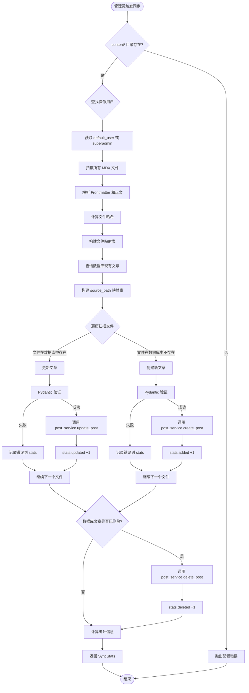
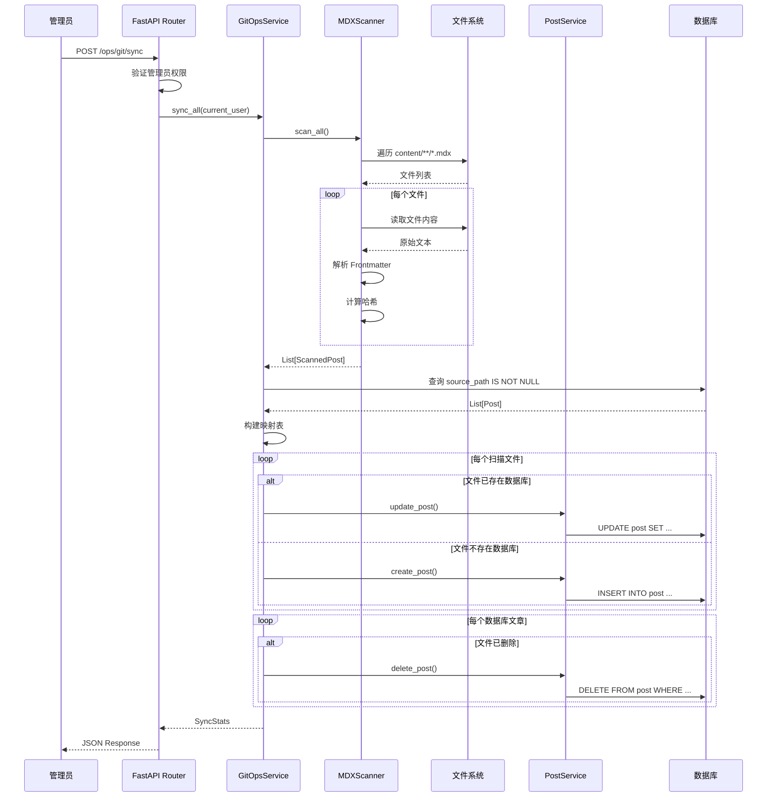

# GitOps 模块 - 基于文件系统的内容管理

## 📖 概述

GitOps 模块是一个**内容同步引擎**，实现了从文件系统（Git 仓库）到数据库的自动化内容管理流程。它允许博客内容以 Markdown/MDX 文件的形式存储在 Git 中，通过扫描和解析这些文件，自动同步到数据库中。

### 核心理念

- **Infrastructure as Code (IaC)** - 内容即代码
- **Single Source of Truth** - Git 仓库作为内容的唯一真实来源
- **声明式管理** - 文件系统状态决定数据库状态
- **版本控制友好** - 所有内容变更可追溯、可回滚

---

## 🎯 功能特性

### ✅ 已实现

1. **MDX 文件扫描**

   - 递归扫描 `content/` 目录下的 `.md` 和 `.mdx` 文件
   - 解析 Frontmatter 元数据（标题、摘要、封面等）
   - 提取正文内容

2. **内容哈希计算**

   - 全文哈希（`content_hash`）- 用于变更检测
   - 元数据哈希（`meta_hash`）- 用于判断是否仅修改了 frontmatter

3. **增量同步逻辑**

   - **新增** - 文件存在但数据库中无记录
   - **更新** - 文件已存在且数据库中有对应记录
   - **删除** - 数据库中有记录但文件已被删除

4. **手动触发接口**

   - `POST /api/v1/ops/git/sync` - 管理员触发同步
   - 返回详细统计信息（新增/更新/删除数量、错误列表）

5. **错误处理与日志**
   - 单文件失败不影响整体流程
   - 详细错误日志记录
   - Pydantic 数据验证

### 🚧 待实现

1. **Git 集成**（已预留 `GitClient` 类）

   - 自动 `git pull` 拉取最新内容
   - 检测文件变更（`git diff`）- 只同步变更的文件
   - 获取 commit 信息

2. **自动化触发**

   - 定时任务（Cron / APScheduler）
   - Webhook 监听（GitHub/GitLab Webhooks）
   - 文件系统监听（watchdog）

3. **高级功能**

   - 增量同步优化（只处理变更文件）
   - 并发处理（asyncio.gather）
   - 同步历史记录
   - 冲突解决策略
   - 草稿/发布状态管理

4. **Frontmatter 映射增强**

   - 标签（tags）自动关联
   - 分类（category）自动创建/关联
   - 自定义字段映射
   - SEO 元数据提取

5. **测试覆盖**
   - 单元测试
   - 集成测试
   - 边界情况测试

---

## 🏗️ 架构设计

### 模块结构

```
git_ops/
├── __init__.py           # 模块入口
├── exceptions.py         # 自定义异常
├── git_client.py         # Git 操作客户端（预留）
├── scanner.py            # 文件扫描与解析
├── service.py            # 同步业务逻辑
└── router.py             # API 路由
```

### 核心流程图



### 数据流图



---

## 🔧 使用指南

### 1. 配置环境变量

在 `.env` 文件中配置内容目录：

```bash
CONTENT_DIR=./content  # 相对于项目根目录
```

### 2. 创建内容文件

在 `content/` 目录下创建 MDX 文件：

```markdown
---
title: "我的第一篇文章"
slug: "my-first-post"
summary: "这是一篇测试文章"
published: true
cover: "https://example.com/cover.jpg"
---

# 文章标题

这是文章正文内容，支持 **Markdown** 和 MDX 语法。
```

### 3. 触发同步

**方式一：命令行脚本（推荐）**

```bash
# 在 backend 目录下执行
python scripts/sync_git_content.py

# 或者
python -m scripts.sync_git_content
```

**方式二：通过 API**

```bash
curl -X POST http://localhost:8000/api/v1/ops/git/sync \
  -H "Authorization: Bearer YOUR_ADMIN_TOKEN"
```

**方式三：通过代码**

```python
from app.git_ops.service import GitOpsService

service = GitOpsService(session)
stats = await service.sync_all(default_user=admin_user)
print(f"Added: {len(stats.added)}, Updated: {len(stats.updated)}")
```

### 4. 查看同步结果

返回的 `SyncStats` 包含：

```json
{
  "added": ["posts/new-post.mdx"],
  "updated": ["posts/updated-post.mdx"],
  "deleted": ["posts/old-post.mdx"],
  "skipped": 0,
  "errors": [],
  "duration": 1.23
}
```

---

## 📁 Frontmatter 字段映射

| Frontmatter 字段      | Post 模型字段  | 说明                     |
| --------------------- | -------------- | ------------------------ |
| `title`               | `title`        | 文章标题                 |
| `slug`                | `slug`         | URL 友好标识符           |
| `summary` / `excerpt` | `excerpt`      | 文章摘要                 |
| `published`           | `is_published` | 发布状态（默认 true）    |
| `cover` / `image`     | `cover_image`  | 封面图片 URL             |
| `content` (正文)      | `content_mdx`  | MDX 格式正文             |
| -                     | `source_path`  | 文件相对路径（自动填充） |

**待支持字段：**

- `tags` → 标签关联
- `category` → 分类关联
- `date` → 创建时间覆盖
- `author` → 作者指定

---

## 🔒 安全性与权限

### 权限要求

- **同步触发** - 需要管理员权限（`ADMIN` 或 `SUPERADMIN`）
- **文章作者** - 同步创建的文章默认作者为触发用户或 superadmin

### 安全考量

1. **路径遍历防护** - 仅扫描 `CONTENT_DIR` 内文件
2. **验证增强** - Pydantic Schema 验证防止恶意数据
3. **错误隔离** - 单文件失败不影响整体流程
4. **日志审计** - 所有同步操作记录详细日志

---

## 🐛 错误处理

### 异常类型

| 异常                       | HTTP 状态码 | 说明                   |
| -------------------------- | ----------- | ---------------------- |
| `GitOpsConfigurationError` | 500         | 配置或环境错误（致命） |
| `GitOpsSyncError`          | 400         | 同步过程中的非致命错误 |
| `ValidationError`          | 422         | Pydantic 验证失败      |

### 常见问题

**问题：同步后文章丢失**

- 检查文件 `source_path` 字段是否正确
- 确认文件未被意外删除

**问题：Frontmatter 解析失败**

- 确保 YAML 格式正确（三个短横线包裹）
- 使用 YAML 验证器检查语法

**问题：权限不足**

- 确认当前用户具有 ADMIN 或 SUPERADMIN 角色

---

## 🚀 未来路线图

### Phase 1: 基础增强（当前）

- ✅ 基础文件扫描
- ✅ CRUD 同步
- 🚧 标签/分类映射

### Phase 2: Git 集成

- 实现 `git pull` 自动拉取
- 基于 `git diff` 的增量同步
- Commit 信息记录

### Phase 3: 自动化

- 后台定时任务
- Webhook 触发
- 文件系统监听

### Phase 4: 高级特性

- 冲突解决策略
- 多仓库支持
- 同步历史查询
- 性能优化（并发处理）

---

## 🧪 测试建议

### 测试用例

1. **功能测试**

   - 新文件同步（CREATE）
   - 文件更新同步（UPDATE）
   - 文件删除同步（DELETE）
   - Frontmatter 字段映射
   - 哈希计算正确性

2. **边界测试**

   - 空目录处理
   - 无效 Frontmatter
   - 超大文件处理
   - 特殊字符文件名

3. **错误处理**
   - 文件读取失败
   - 数据库操作失败
   - 权限不足
   - 并发同步冲突

---

## 📚 参考资料

- [GitOps 概念](https://www.gitops.tech/)
- [Python Frontmatter](https://python-frontmatter.readthedocs.io/)
- [FastAPI 异步编程](https://fastapi.tiangolo.com/async/)
- [SQLModel 文档](https://sqlmodel.tiangolo.com/)

---

## 👥 贡献指南

1. 遵循项目代码风格
2. 编写单元测试
3. 更新相关文档
4. 提交清晰的 commit 信息

---

**最后更新**: 2026-01-10
**维护者**: Blog Platform Team
