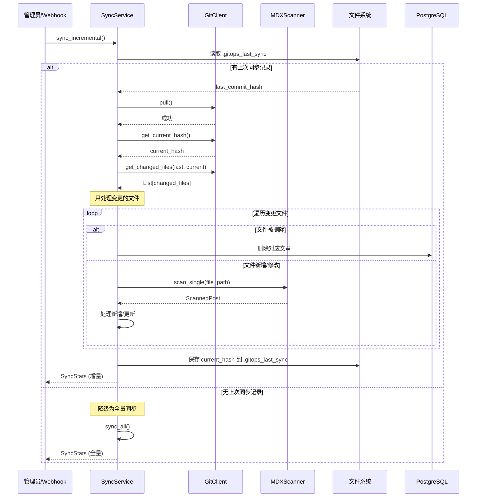
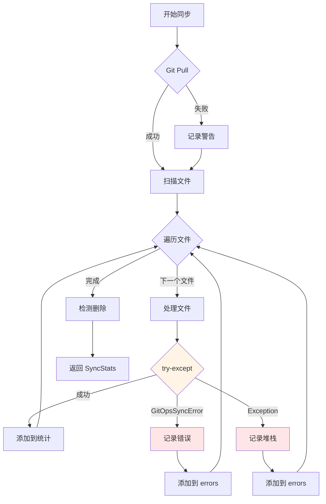

# GitOps 同步流程详解（含依赖注入）

本文档详细说明了 GitOps 模块的完整同步流程，重点展示依赖注入容器如何在实际业务中发挥作用。

---

## 🔄 完整同步流程图


---

## 📦 依赖注入在流程中的体现

### 阶段 1: 容器初始化

```python
# 在 GitOpsService.__init__ 中
class GitOpsService:
    def __init__(self, session: AsyncSession):
        # 创建容器，立即初始化核心组件
        self.container = GitOpsContainer(session)
        # 此时已创建:
        # - self.container.scanner
        # - self.container.serializer
        # - self.container.git_client
        # - self.container.writer
```

**关键点**:

- 容器在门面服务创建时立即初始化
- 核心组件在容器构造函数中立即创建
- 服务层尚未创建（延迟加载）

### 阶段 2: 服务延迟创建

```python
# 在 GitOpsService.sync_all 中
async def sync_all(self, default_user: User = None):
    # 第一次访问 sync_service 时才创建
    return await self.container.sync_service.sync_all(default_user)
    #                          ^^^^^^^^^^^^
    #                          触发 @property 延迟加载
```

**容器内部**:

```python
@property
def sync_service(self):
    if self._sync_service is None:
        # 创建服务，注入 session 和容器自己
        self._sync_service = SyncService(self.session, self)
        #                                               ^^^^
        #                                        把容器传进去！
    return self._sync_service
```

**关键点**:

- 服务只在第一次访问时创建（延迟加载）
- 服务创建时注入容器引用
- 后续访问返回同一个实例（单例）

### 阶段 3: 服务使用注入的组件

```python
# 在 SyncService.sync_all 中
class SyncService(BaseGitOpsService):
    async def sync_all(self, default_user: User = None):
        # 使用注入的 git_client
        await self.git_client.pull()
        #         ^^^^^^^^^^^^
        #         从容器注入的

        # 使用注入的 scanner
        scanned_posts = await self.scanner.scan_all()
        #                         ^^^^^^^^
        #                         从容器注入的

        # 使用注入的 serializer
        for scanned in scanned_posts:
            matched_post, is_renamed = await self.serializer.match_post(
                #                                  ^^^^^^^^^^
                #                                  从容器注入的
                scanned, db_posts
            )
```

**关键点**:

- 服务不需要自己创建依赖
- 所有依赖都从容器获取
- 多个服务共享同一套组件

---

## 🎯 增量同步流程（v3.2.0+）



---

## 🔍 错误处理流程



### 错误处理策略

1. **配置错误** (`GitOpsConfigurationError`)

   - 示例: content 目录不存在
   - 处理: 直接抛出，中断流程
   - 原因: 无法继续执行

2. **业务逻辑错误** (`GitOpsSyncError`)

   - 示例: 必填字段缺失、author 不存在
   - 处理: 记录错误，跳过当前文件，继续处理其他文件
   - 原因: 单个文件的错误不应影响整体同步

3. **系统错误** (`Exception`)
   - 示例: 数据库连接失败、文件读取权限问题
   - 处理: 记录完整堆栈，跳过当前文件
   - 原因: 确保单个文件的崩溃不会影响其他文件

### 错误处理代码示例

```python
# 在 SyncService.sync_all 中
for scanned in scanned_posts:
    try:
        # 处理文件
        matched_post, is_renamed = await self.serializer.match_post(...)

        if matched_post:
            await handle_post_update(...)
        else:
            await handle_post_create(...)

    except GitOpsSyncError as e:
        # 业务逻辑错误：记录并继续
        logger.error(f"同步文件失败: {scanned.file_path} - {e}")
        stats.errors.append({
            "file": str(scanned.file_path),
            "error": str(e),
            "type": "sync_error"
        })

    except Exception as e:
        # 系统错误：记录堆栈并继续
        logger.exception(f"处理文件时发生未预期错误: {scanned.file_path}")
        stats.errors.append({
            "file": str(scanned.file_path),
            "error": str(e),
            "type": "unexpected_error",
            "traceback": traceback.format_exc()
        })
```

---

## 🧪 测试中的依赖注入

### Mock 整个容器

```python
from unittest.mock import MagicMock, AsyncMock

async def test_sync_all_with_mock_container():
    # 创建 mock 容器
    mock_container = MagicMock()
    mock_container.scanner.scan_all = AsyncMock(return_value=[])
    mock_container.git_client.pull = AsyncMock()

    # 创建服务（注入 mock 容器）
    service = SyncService(session, mock_container)

    # 执行测试
    stats = await service.sync_all()

    # 验证调用
    mock_container.git_client.pull.assert_called_once()
    mock_container.scanner.scan_all.assert_called_once()
```

### Mock 单个组件

```python
async def test_sync_all_with_partial_mock():
    # 创建真实容器
    container = GitOpsContainer(session)

    # 只 mock scanner
    mock_scanner = AsyncMock()
    mock_scanner.scan_all.return_value = [
        ScannedPost(file_path="test.mdx", frontmatter={...})
    ]
    container.scanner = mock_scanner

    # 创建服务（使用部分 mock 的容器）
    service = SyncService(session, container)

    # 测试
    stats = await service.sync_all()
    # scanner 是 mock 的，但 serializer 是真实的
```

---

## 📊 性能优化

### 并发扫描

```python
# Scanner 内部使用 asyncio.gather 并发扫描
async def scan_all(self) -> List[ScannedPost]:
    tasks = [self._scan_file(file_path) for file_path in all_files]
    results = await asyncio.gather(*tasks, return_exceptions=True)
    return [r for r in results if isinstance(r, ScannedPost)]
```

### 增量同步优势

| 指标       | 全量同步           | 增量同步          |
| ---------- | ------------------ | ----------------- |
| 扫描文件数 | 所有文件 (~100+)   | 仅变更文件 (~5)   |
| 数据库查询 | 查询所有文章       | 仅查询变更文章    |
| 处理时间   | ~10s               | ~1s               |
| 适用场景   | 首次同步、修复数据 | 日常 Webhook 触发 |

---

## 🔗 相关文档

- [ARCHITECTURE.md](./ARCHITECTURE.md) - 整体架构设计
- [DEPENDENCY_INJECTION_EXPLAINED.md](./DEPENDENCY_INJECTION_EXPLAINED.md) - 依赖注入详解
- [README.md](./README.md) - 模块使用指南

---

**最后更新**: 2026-01-24
**文档版本**: 1.0.0
