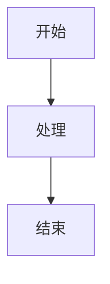
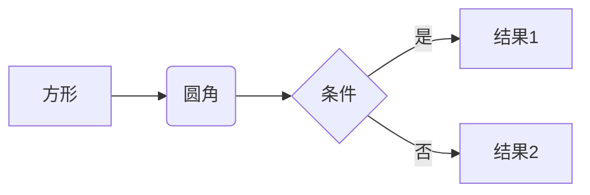

# 图表渲染说明

## 后端处理流程

`PostProcessor` 会将图表代码块转换为特殊的 HTML 结构：

### 输入（MDX）

````markdown

````

````

### 输出（HTML）
```html
<div class="diagram-container" data-type="mermaid">
  <div class="diagram-render mermaid">
graph TD
    A[开始] --> B[处理]
    B --> C[结束]
  </div>
  <details class="diagram-source">
    <summary>查看源码</summary>
    <pre><code class="language-mermaid">graph TD
    A[开始] --> B[处理]
    B --> C[结束]</code></pre>
  </details>
</div>
````

## 前端渲染实现

### 1. 安装依赖

```bash
npm install mermaid
# 可选：其他图表库
npm install plantuml-encoder  # PlantUML
```

### 2. React 组件实现

```tsx
// components/DiagramRenderer.tsx
import { useEffect, useRef } from "react";
import mermaid from "mermaid";

// 初始化 Mermaid
mermaid.initialize({
  startOnLoad: false,
  theme: "default",
  securityLevel: "loose",
});

export function DiagramRenderer({ html }: { html: string }) {
  const containerRef = useRef<HTMLDivElement>(null);

  useEffect(() => {
    if (!containerRef.current) return;

    // 查找所有 Mermaid 图表
    const mermaidDiagrams = containerRef.current.querySelectorAll(
      ".diagram-render.mermaid"
    );

    mermaidDiagrams.forEach(async (element, index) => {
      const code = element.textContent || "";
      const id = `mermaid-${Date.now()}-${index}`;

      try {
        const { svg } = await mermaid.render(id, code);
        element.innerHTML = svg;
      } catch (error) {
        console.error("Mermaid rendering error:", error);
        element.innerHTML = `<div class="diagram-error">图表渲染失败</div>`;
      }
    });

    // 处理其他类型的图表（PlantUML、Graphviz 等）
    // ...
  }, [html]);

  return <div ref={containerRef} dangerouslySetInnerHTML={{ __html: html }} />;
}
```

### 3. CSS 样式

```css
/* styles/diagram.css */

/* 图表容器 */
.diagram-container {
  margin: 2rem 0;
  border: 1px solid #e5e7eb;
  border-radius: 0.5rem;
  overflow: hidden;
  background: #f9fafb;
}

/* 图表渲染区域 */
.diagram-render {
  padding: 2rem;
  background: white;
  overflow-x: auto;
}

/* Mermaid 图表样式 */
.diagram-render.mermaid svg {
  max-width: 100%;
  height: auto;
}

/* 源码折叠区域 */
.diagram-source {
  border-top: 1px solid #e5e7eb;
  background: #f3f4f6;
}

.diagram-source summary {
  padding: 0.75rem 1rem;
  cursor: pointer;
  user-select: none;
  font-size: 0.875rem;
  color: #6b7280;
  transition: all 0.2s;
}

.diagram-source summary:hover {
  background: #e5e7eb;
  color: #374151;
}

.diagram-source summary::marker {
  content: "▶ ";
}

.diagram-source[open] summary::marker {
  content: "▼ ";
}

.diagram-source pre {
  margin: 0;
  padding: 1rem;
  background: #1f2937;
  overflow-x: auto;
}

.diagram-source code {
  color: #e5e7eb;
  font-family: "Fira Code", "Consolas", monospace;
  font-size: 0.875rem;
  line-height: 1.5;
}

/* 错误提示 */
.diagram-error {
  padding: 1rem;
  color: #dc2626;
  background: #fee2e2;
  border-radius: 0.25rem;
  font-size: 0.875rem;
}

/* 深色模式 */
@media (prefers-color-scheme: dark) {
  .diagram-container {
    border-color: #374151;
    background: #1f2937;
  }

  .diagram-render {
    background: #111827;
  }

  .diagram-source {
    border-color: #374151;
    background: #1f2937;
  }

  .diagram-source summary {
    color: #9ca3af;
  }

  .diagram-source summary:hover {
    background: #374151;
    color: #d1d5db;
  }
}
```

### 4. 使用示例

```tsx
// pages/posts/[slug].tsx
import { DiagramRenderer } from "@/components/DiagramRenderer";

export default function PostPage({ post }) {
  return (
    <article>
      <h1>{post.title}</h1>

      {/* 渲染包含图表的 HTML */}
      <DiagramRenderer html={post.content_html} />
    </article>
  );
}
```

## 支持的图表类型

### 1. Mermaid（推荐）

````markdown

````

````

**支持的图表：**
- 流程图（Flowchart）
- 时序图（Sequence Diagram）
- 甘特图（Gantt Chart）
- 类图（Class Diagram）
- 状态图（State Diagram）
- 饼图（Pie Chart）
- Git 图（Git Graph）

### 2. PlantUML

```markdown

```plantuml
@startuml
Alice -> Bob: 认证请求
Bob --> Alice: 认证响应
@enduml
````

````

**需要额外配置：**
- 使用 PlantUML 服务器渲染
- 或使用 plantuml-encoder 转换为图片 URL

### 3. Graphviz/DOT

```markdown
```dot
digraph G {
    A -> B;
    B -> C;
    C -> A;
}
````

````

## 性能优化建议

### 1. 懒加载

```tsx
import dynamic from 'next/dynamic';

const DiagramRenderer = dynamic(
  () => import('@/components/DiagramRenderer'),
  { ssr: false }  // 仅在客户端渲染
);
````

### 2. 缓存渲染结果

```tsx
const [renderedSvg, setRenderedSvg] = useState<string>("");

useEffect(() => {
  const cacheKey = `diagram-${hash(code)}`;
  const cached = localStorage.getItem(cacheKey);

  if (cached) {
    setRenderedSvg(cached);
  } else {
    mermaid.render(id, code).then(({ svg }) => {
      setRenderedSvg(svg);
      localStorage.setItem(cacheKey, svg);
    });
  }
}, [code]);
```


### 3. 服务端预渲染（可选）

如果需要更好的 SEO 和首屏性能，可以在后端使用 Puppeteer 预渲染：

```python
# 需要安装：pip install playwright
from playwright.async_api import async_playwright

async def render_mermaid_to_svg(code: str) -> str:
    """使用 Playwright 在服务端渲染 Mermaid 图表"""
    async with async_playwright() as p:
        browser = await p.chromium.launch()
        page = await browser.new_page()

        html = f"""
        <script src="https://cdn.jsdelivr.net/npm/mermaid/dist/mermaid.min.js"></script>
        <div class="mermaid">{code}</div>
        <script>mermaid.initialize({{ startOnLoad: true }});</script>
        """

        await page.set_content(html)
        await page.wait_for_selector('.mermaid svg')

        svg = await page.inner_html('.mermaid')
        await browser.close()

        return svg
```

## 故障排查

### 图表不显示

1. 检查 Mermaid 是否正确初始化
2. 查看浏览器控制台错误
3. 确认图表语法正确

### 源码显示异常

1. 检查 HTML 转义是否正确
2. 确认 `<details>` 标签支持

### 样式问题

1. 确保 CSS 文件已导入
2. 检查 CSS 选择器优先级
3. 查看深色模式适配

## 示例效果

访问测试页面查看效果：

- 开发环境：http://localhost:3000/test-diagrams
- 生产环境：https://your-domain.com/test-diagrams
