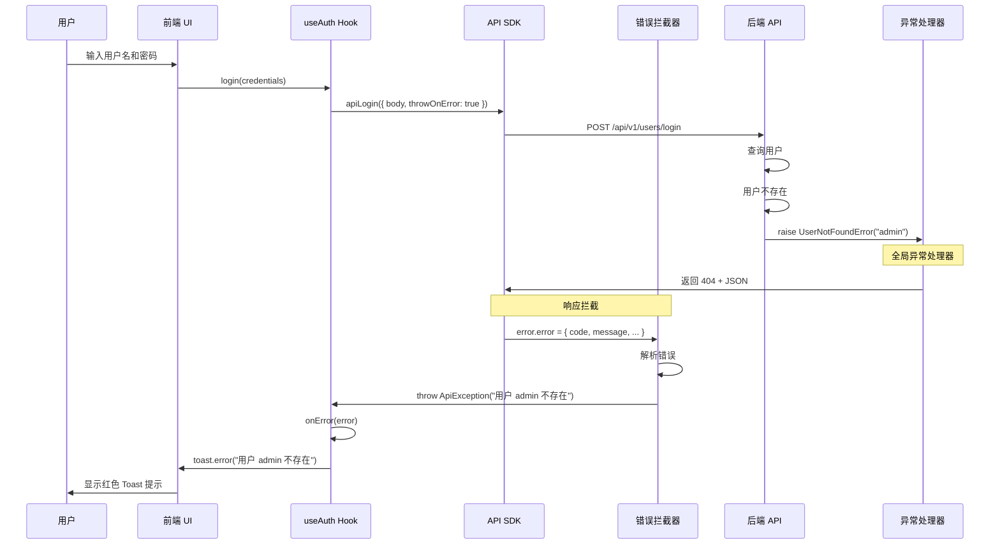

# 前后端错误处理协作指南

本文档说明了 Blog FR 项目中前后端如何协作处理错误，以及这种模式带来的好处。

---

## 📋 目录

- [后端错误处理机制](#后端错误处理机制)
- [前端错误处理机制](#前端错误处理机制)
- [完整的错误处理流程](#完整的错误处理流程)
- [实际使用示例](#实际使用示例)
- [核心优势](#核心优势)

---

## 🔧 后端错误处理机制

### 统一的错误响应格式

后端使用 FastAPI 全局异常处理器，确保**所有错误**都返回统一的 JSON 格式：

```json
{
  "error": {
    "code": "ERROR_CODE",
    "message": "用户友好的错误消息",
    "details": {
      "validation_errors": [
        {
          "field": "username",
          "message": "用户名已存在",
          "type": "value_error"
        }
      ]
    },
    "timestamp": "2026-01-24T10:00:00Z",
    "request_id": "uuid-xxxx-xxxx"
  }
}
```

### 错误分类

后端定义了 4 种异常处理器：

| 处理器                         | 捕获异常                 | HTTP 状态码 | 错误码示例                         | 说明             |
| ------------------------------ | ------------------------ | ----------- | ---------------------------------- | ---------------- |
| `app_exception_handler`        | `BaseAppException`       | 自定义      | `USER_NOT_FOUND`, `POST_NOT_FOUND` | 业务逻辑异常     |
| `validation_exception_handler` | `RequestValidationError` | 422         | `VALIDATION_ERROR`                 | 请求参数验证失败 |
| `database_exception_handler`   | `SQLAlchemyError`        | 500         | `DATABASE_ERROR`                   | 数据库操作异常   |
| `unexpected_exception_handler` | `Exception`              | 500         | `INTERNAL_ERROR`                   | 未预期的系统异常 |

### 后端代码示例

```python
# backend/app/users/exceptions.py
from app.core.exceptions import BaseAppException

class UserNotFoundError(BaseAppException):
    def __init__(self, username: str):
        super().__init__(
            message=f"用户 {username} 不存在",
            status_code=404,
            error_code="USER_NOT_FOUND"
        )

# backend/app/users/router.py
@router.post("/login")
async def login(credentials: LoginRequest):
    user = await user_service.get_by_username(credentials.username)
    if not user:
        raise UserNotFoundError(credentials.username)  # ← 自动转换为 JSON
    # ...
```

---

## 🎨 前端错误处理机制

### 1. API 客户端配置

前端使用 `@hey-api/openapi-ts` 自动生成的 SDK，并在 `src/shared/api/config.ts` 中配置了拦截器。

#### 错误拦截器

```typescript
// frontend/src/shared/api/config.ts

// 定义后端错误结构
interface ApiError {
  code: string;
  message: string;
  details?: any;
  request_id?: string;
  timestamp?: string;
}

// 自定义异常类
class ApiException extends Error {
  code: string;
  status?: number;

  constructor(message: string, code: string, status?: number) {
    super(message);
    this.code = code;
    this.status = status;
  }
}

// 错误拦截器：将后端错误转换为前端友好的异常
client.interceptors.error.use((error: any, response) => {
  if (error?.error) {
    const apiError = error.error as ApiError;
    let finalMessage = apiError.message;

    // 特殊处理 422 校验错误
    if (
      apiError.code === "VALIDATION_ERROR" &&
      apiError.details?.validation_errors
    ) {
      const details = apiError.details.validation_errors
        .map((err) => `${err.field}: ${err.message}`)
        .join("; ");
      finalMessage = `校验失败: ${details}`;
    }

    // 抛出自定义异常
    throw new ApiException(finalMessage, apiError.code, response?.status);
  }

  return error;
});
```

### 2. React Query + Toast 通知

在 React 组件中使用 TanStack Query 的 `useMutation`，配合 `sonner` 显示错误提示。

#### 登录示例

```typescript
// frontend/src/hooks/use-auth.ts

export function useAuth() {
  const loginMutation = useMutation({
    mutationFn: async (credentials: BodyLogin) => {
      const response = await apiLogin({
        body: credentials,
        throwOnError: true, // ← 让 SDK 抛出异常
      });
      // 处理成功逻辑...
    },
    onSuccess: () => {
      toast.success("欢迎回来！");
      queryClient.invalidateQueries({ queryKey: authKeys.currentUser() });
    },
    onError: (error) => {
      // error.message 已经是后端返回的友好消息
      toast.error(error.message); // ← 直接显示给用户
    },
  });

  return {
    login: loginMutation.mutateAsync,
    isLoggingIn: loginMutation.isPending,
  };
}
```

### 3. 服务端渲染 (SSR) 的错误处理

在 Next.js 服务端组件中，错误处理更加简洁：

```typescript
// frontend/src/lib/post-api.ts

export async function getPosts(
  postType: PostType,
  page = 1,
  size = 10
): Promise<ApiData<PagePostShortResponse> | null> {
  try {
    const { data: response, error } = await listPostsByType({
      path: { post_type: postType },
      query: { page, size },
      client: serverClient,
    });

    if (error) {
      console.error("Failed to fetch posts:", error);
      return null; // ← SSR 中返回 null，让页面显示空状态
    }

    return response as unknown as ApiData<PagePostShortResponse>;
  } catch (error) {
    console.error("Failed to fetch posts:", error);
    return null;
  }
}
```

---

## 🔄 完整的错误处理流程

### 场景 1: 用户登录失败（用户名不存在）



**关键点**:

1. 后端抛出 `UserNotFoundError`
2. 全局异常处理器转换为统一 JSON 格式
3. 前端错误拦截器解析 JSON，抛出 `ApiException`
4. `useMutation` 的 `onError` 捕获异常
5. 使用 `toast.error()` 显示给用户

### 场景 2: 表单验证失败（422 错误）

```mermaid
sequenceDiagram
    participant User as 用户
    participant UI as 注册表单
    participant Hook as useAuth Hook
    participant SDK as API SDK
    participant Interceptor as 错误拦截器
    participant Backend as 后端 API
    participant Validator as Pydantic 验证器

    User->>UI: 提交注册表单
    UI->>Hook: register({ username: "a", email: "invalid" })
    Hook->>SDK: apiRegister({ body, throwOnError: true })
    SDK->>Backend: POST /api/v1/users/register

    Backend->>Validator: 验证请求体
    Validator->>Validator: username 太短
    Validator->>Validator: email 格式错误
    Validator->>Backend: raise RequestValidationError

    Backend->>Backend: validation_exception_handler
    Backend->>SDK: 返回 422 + JSON

    Note over SDK,Interceptor: 错误拦截器处理
    Interceptor->>Interceptor: 检测到 VALIDATION_ERROR
    Interceptor->>Interceptor: 拼接 validation_errors
    Interceptor->>Hook: throw ApiException("校验失败: username: 太短; email: 格式错误")

    Hook->>Hook: onError(error)
    Hook->>UI: toast.error("校验失败: ...")
    UI->>User: 显示详细的验证错误
```

**关键点**:

1. Pydantic 自动验证请求体
2. 后端返回结构化的 `validation_errors` 数组
3. 前端拦截器将数组拼接成一句话
4. 用户看到清晰的错误提示

---

## 💡 实际使用示例

### 示例 1: 客户端组件 (CSR)

```tsx
// frontend/src/app/(auth)/login/page.tsx
"use client";

import { useAuth } from "@/hooks/use-auth";
import { toast } from "sonner";

export default function LoginPage() {
  const { login, isLoggingIn } = useAuth();

  const handleSubmit = async (e: React.FormEvent) => {
    e.preventDefault();

    try {
      await login({
        username: "admin",
        password: "wrong_password",
      });
      // 成功后的逻辑（通常不会执行，因为会跳转）
    } catch (error) {
      // ❌ 不需要手动处理！
      // useAuth 的 onError 已经自动显示 toast
    }
  };

  return (
    <form onSubmit={handleSubmit}>
      {/* 表单字段 */}
      <button disabled={isLoggingIn}>
        {isLoggingIn ? "登录中..." : "登录"}
      </button>
    </form>
  );
}
```

**用户体验**:

- 点击登录按钮
- 按钮变为 "登录中..."（禁用状态）
- 后端返回错误
- 自动显示红色 Toast: "用户 admin 不存在" 或 "密码错误"
- 按钮恢复可点击状态

### 示例 2: 服务端组件 (SSR)

```tsx
// frontend/src/app/(blog)/article/[slug]/page.tsx

import { getPostDetail } from "@/lib/post-api";
import { notFound } from "next/navigation";

export default async function ArticlePage({
  params,
}: {
  params: { slug: string };
}) {
  const post = await getPostDetail("article", params.slug);

  if (!post) {
    notFound(); // ← 显示 Next.js 的 404 页面
  }

  return (
    <article>
      <h1>{post.data.title}</h1>
      {/* 渲染文章内容 */}
    </article>
  );
}
```

**用户体验**:

- 访问不存在的文章 URL
- 后端返回 404
- SSR 函数返回 `null`
- Next.js 显示 404 页面

### 示例 3: 手动处理特定错误

```tsx
// frontend/src/components/post-editor.tsx
"use client";

import { useMutation } from "@tanstack/react-query";
import { createPost } from "@/shared/api";
import { toast } from "sonner";

export function PostEditor() {
  const createMutation = useMutation({
    mutationFn: async (data: PostCreate) => {
      return await createPost({
        body: data,
        throwOnError: true,
      });
    },
    onSuccess: () => {
      toast.success("文章创建成功！");
    },
    onError: (error: any) => {
      // 根据错误码进行不同处理
      if (error.code === "INSUFFICIENT_PERMISSIONS") {
        toast.error("您没有权限创建文章", {
          description: "请联系管理员开通权限",
          action: {
            label: "联系管理员",
            onClick: () => (window.location.href = "/contact"),
          },
        });
      } else if (error.code === "VALIDATION_ERROR") {
        toast.error(error.message); // 显示详细的验证错误
      } else {
        toast.error("创建失败，请稍后重试");
      }
    },
  });

  return (
    <button onClick={() => createMutation.mutate(formData)}>创建文章</button>
  );
}
```

---

## ✨ 核心优势

### 1. 开发体验 (DX)

#### ✅ 后端开发者

- **只需抛出异常**: 不需要手动构造 JSON 响应
- **类型安全**: 使用 Pydantic 定义异常类
- **集中管理**: 所有错误处理逻辑在 `error_handlers.py`

```python
# 后端代码简洁
if not user:
    raise UserNotFoundError(username)  # 完成！
```

#### ✅ 前端开发者

- **自动类型推导**: TypeScript 自动推导错误类型
- **统一处理**: 错误拦截器自动转换
- **开箱即用**: 配合 React Query 无需额外代码

```typescript
// 前端代码简洁
const { login } = useAuth();
await login(credentials); // 错误自动显示 Toast
```

### 2. 用户体验 (UX)

| 场景         | 后端返回                                               | 前端显示                                           | 用户感知      |
| ------------ | ------------------------------------------------------ | -------------------------------------------------- | ------------- |
| 用户名不存在 | `{ error: { message: "用户 admin 不存在" } }`          | Toast: "用户 admin 不存在"                         | ✅ 清晰明了   |
| 密码错误     | `{ error: { message: "密码错误" } }`                   | Toast: "密码错误"                                  | ✅ 直接反馈   |
| 表单验证失败 | `{ error: { details: { validation_errors: [...] } } }` | Toast: "校验失败: username: 太短; email: 格式错误" | ✅ 详细提示   |
| 权限不足     | `{ error: { code: "INSUFFICIENT_PERMISSIONS" } }`      | Toast + 操作按钮                                   | ✅ 可操作     |
| 服务器崩溃   | `{ error: { message: "Internal server error" } }`      | Toast: "服务器错误，请稍后重试"                    | ✅ 不暴露细节 |

### 3. 可维护性

#### ✅ 统一的错误格式

- 前后端都遵循同一套错误结构
- 新增错误类型无需修改前端代码
- OpenAPI 自动生成类型定义

#### ✅ 环境隔离

- **开发环境**: 返回详细的堆栈信息，方便调试
- **生产环境**: 隐藏敏感信息，只返回通用错误

```python
# backend/app/core/error_handlers.py
if settings.environment == "production":
    message = "Internal server error"
    details = {}
else:
    message = f"Unexpected error: {str(exc)}"
    details = {"traceback": traceback.format_exc()}
```

#### ✅ 全链路追踪

- 每个错误都包含 `request_id`
- 可以在日志系统中追踪完整请求链路
- 方便排查生产环境问题

```json
{
  "error": {
    "code": "DATABASE_ERROR",
    "message": "Database operation failed",
    "request_id": "uuid-xxxx-xxxx", // ← 用于日志追踪
    "timestamp": "2026-01-24T10:00:00Z"
  }
}
```

### 4. 可扩展性

#### ✅ 轻松添加新的错误类型

**后端**:

```python
# 1. 定义新异常
class PostNotFoundError(BaseAppException):
    def __init__(self, post_id: str):
        super().__init__(
            message=f"文章 {post_id} 不存在",
            status_code=404,
            error_code="POST_NOT_FOUND"
        )

# 2. 在业务代码中使用
if not post:
    raise PostNotFoundError(post_id)
```

**前端**:

```typescript
// 无需修改！错误拦截器自动处理
// 如果需要特殊处理，可以检查 error.code
onError: (error: any) => {
  if (error.code === "POST_NOT_FOUND") {
    // 特殊处理
  } else {
    toast.error(error.message);
  }
};
```

---

## 📚 相关文档

- [后端错误处理详解](../backend/README.md#-错误处理模式)
- [GitOps 错误处理](../backend/app/git_ops/ARCHITECTURE.md#-错误处理模式)
- [前端 API 集成指南](./docs/api/FRONTEND_API_INTEGRATION_GUIDE.md)

---

## 🎯 最佳实践总结

### 后端

1. ✅ 使用自定义异常类继承 `BaseAppException`
2. ✅ 提供清晰的错误消息（面向用户）
3. ✅ 使用语义化的错误码（如 `USER_NOT_FOUND`）
4. ✅ 在开发环境返回详细信息，生产环境隐藏敏感信息

### 前端

1. ✅ 使用 `throwOnError: true` 让 SDK 抛出异常
2. ✅ 在 `useMutation` 的 `onError` 中统一处理
3. ✅ 使用 `toast.error()` 显示错误消息
4. ✅ 对于特殊错误码，提供自定义处理逻辑

### 团队协作

1. ✅ 后端修改错误消息时，前端无需改动
2. ✅ 新增错误类型时，通过 OpenAPI 自动同步
3. ✅ 使用 `request_id` 协作排查生产问题

---

**最后更新**: 2026-01-24
**文档版本**: 1.0.0
