# 流程图实现方案对比分析

## 📊 方案概览

### 方案一：Markdown 代码块 (Mermaid)

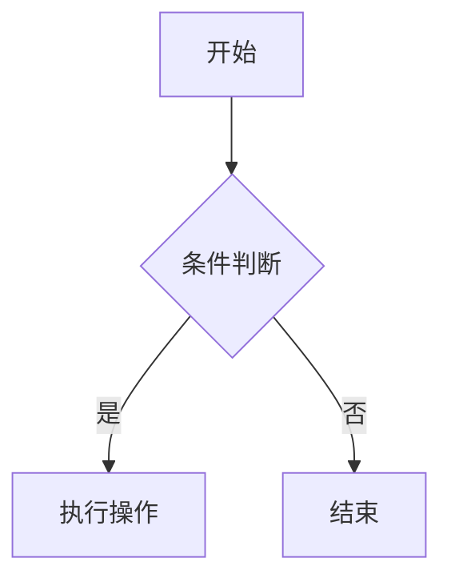

### 方案二：JSX 组件 (React Flow)

```jsx
<ReactFlowChart nodes={nodes} edges={edges} interactive={true} />
```

## 🔍 详细对比

### 1. 易用性 📝

#### Markdown (Mermaid) ✅ 更优

**优点：**

- 语法简单，学习成本低
- 纯文本，易于版本控制
- 支持多种图表类型（流程图、时序图、甘特图等）
- 可以直接在 Markdown 文件中编写
- 非技术人员也能快速上手

**缺点：**

- 样式定制能力有限
- 复杂交互功能受限

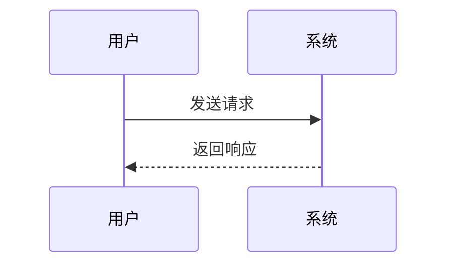

#### JSX 组件 (React Flow) ⚠️ 复杂

**优点：**

- 完全可定制
- 强大的交互功能
- 与 React 生态完美集成

**缺点：**

- 需要编程知识
- 配置复杂，代码量大
- 维护成本高

### 2. 性能表现 ⚡

#### Markdown (Mermaid) ✅ 更优

- **渲染性能**：轻量级，渲染快速
- **包体积**：相对较小
- **内存占用**：低
- **加载速度**：快

#### JSX 组件 (React Flow) ⚠️ 较重

- **渲染性能**：功能丰富但相对较重
- **包体积**：较大（~500KB+）
- **内存占用**：较高
- **加载速度**：相对较慢

### 3. 功能丰富度 🎯

#### Markdown (Mermaid) ⭐⭐⭐⭐

**支持的图表类型：**

- 流程图 (Flowchart)
- 时序图 (Sequence Diagram)
- 甘特图 (Gantt Chart)
- 类图 (Class Diagram)
- 状态图 (State Diagram)
- 饼图 (Pie Chart)
- Git 图 (Git Graph)
- 用户旅程图 (User Journey)
- 实体关系图 (ER Diagram)

**交互功能：**

- 基本的缩放和平移
- 点击事件（有限）
- 主题切换

#### JSX 组件 (React Flow) ⭐⭐⭐⭐⭐

**功能特性：**

- 完全自定义节点和边
- 拖拽和编辑
- 实时数据绑定
- 复杂的交互逻辑
- 动画效果
- 插件系统

### 4. 维护成本 💰

#### Markdown (Mermaid) ✅ 低成本

- 语法稳定，向后兼容性好
- 社区活跃，文档完善
- 更新频率适中
- 调试简单

#### JSX 组件 (React Flow) ⚠️ 高成本

- 需要跟随 React 生态更新
- 复杂的状态管理
- 调试相对困难
- 需要专业的前端开发技能

### 5. 使用场景适配 🎪

#### Markdown (Mermaid) 适合：

✅ **文档驱动的项目**

- 技术文档
- API 文档
- 流程说明
- 架构图
- 简单的业务流程

✅ **内容管理系统**

- 博客文章
- 知识库
- 教程和指南

✅ **快速原型**

- 概念验证
- 需求分析
- 设计草图

#### JSX 组件 (React Flow) 适合：

✅ **交互式应用**

- 流程设计器
- 数据可视化仪表板
- 工作流编辑器
- 思维导图工具

✅ **复杂业务逻辑**

- 实时数据展示
- 用户可编辑的图表
- 复杂的状态管理

## 🏆 推荐方案

### 对于你的博客项目：**推荐 Markdown (Mermaid)** ✅

**理由：**

1. **符合博客特性**：博客主要是内容展示，Mermaid 完全满足需求
2. **易于创作**：写博客时可以直接在 Markdown 中插入图表
3. **维护简单**：不需要复杂的组件管理
4. **性能优秀**：加载快，用户体验好
5. **SEO 友好**：静态内容，搜索引擎友好

### 混合方案 🎯

如果需要更丰富的功能，可以采用混合方案：

````markdown
# 文章标题

## 基本流程图（使用 Mermaid）

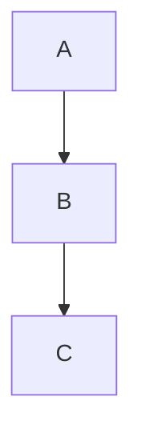

## 交互式图表（使用 JSX 组件）

<InteractiveFlowChart data={complexData} />
```

## 📋 实施建议

### 1. 当前阶段：专注 Mermaid

- 先解决现有的 Mermaid 渲染问题
- 完善 Markdown 流程图功能
- 建立稳定的基础

### 2. 未来扩展：按需添加 JSX

- 当需要复杂交互时再考虑 React Flow
- 可以为特定页面添加交互式组件
- 保持架构的灵活性

### 3. 最佳实践

````typescript
// 简单图表：使用 Mermaid
const SimpleChart = () => (
  <div>
    ```mermaid
    graph TD
        A --> B
```
  </div>
);

// 复杂交互：使用 React Flow
const ComplexChart = () => (
  <ReactFlowChart
    nodes={dynamicNodes}
    onNodeClick={handleNodeClick}
    editable={true}
  />
);
```

## 🎯 结论

**对于博客项目，Markdown (Mermaid) 是更好的选择**，因为：

- ✅ 符合内容创作的工作流
- ✅ 性能优秀，用户体验好
- ✅ 维护成本低
- ✅ 功能足够满足大部分需求
- ✅ 易于学习和使用

**只有在需要复杂交互功能时，才考虑引入 JSX 组件方案。**

````

## 📊 流程图和图表展示

### Mermaid 流程图

#### 基本流程图

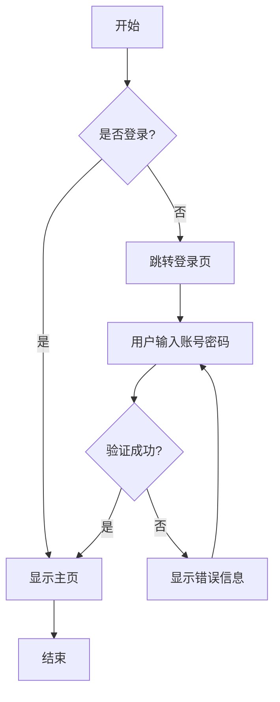

#### 时序图

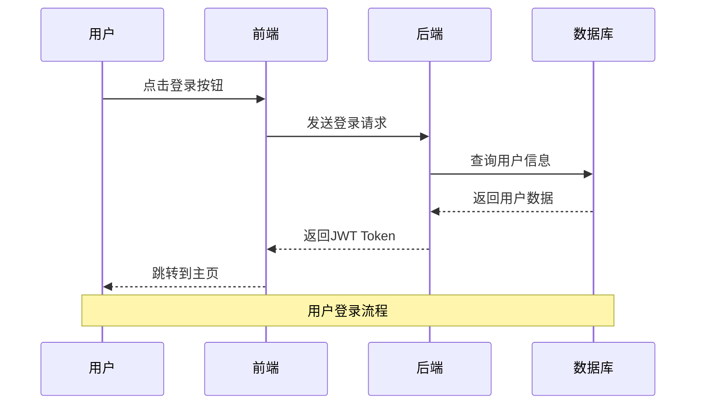

#### 甘特图

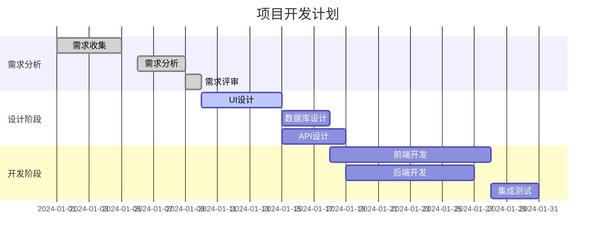

#### 类图

```mermaid
classDiagram
    class User {
        +String id
        +String name
        +String email
        +String password
        +Date createdAt
        +login()
        +logout()
        +updateProfile()
    }

    class Post {
        +String id
        +String title
        +String content
        +String authorId
        +Date createdAt
        +Date updatedAt
        +publish()
        +unpublish()
    }

    class Comment {
        +String id
        +String content
        +String postId
        +String authorId
        +Date createdAt
        +reply()
        +delete()
    }

    User ||--o{ Post : creates
    User ||--o{ Comment : writes
    Post ||--o{ Comment : has
```

#### 状态图

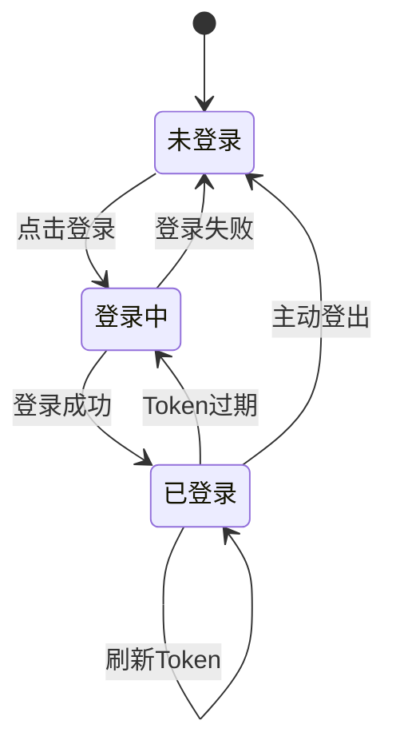

#### 饼图

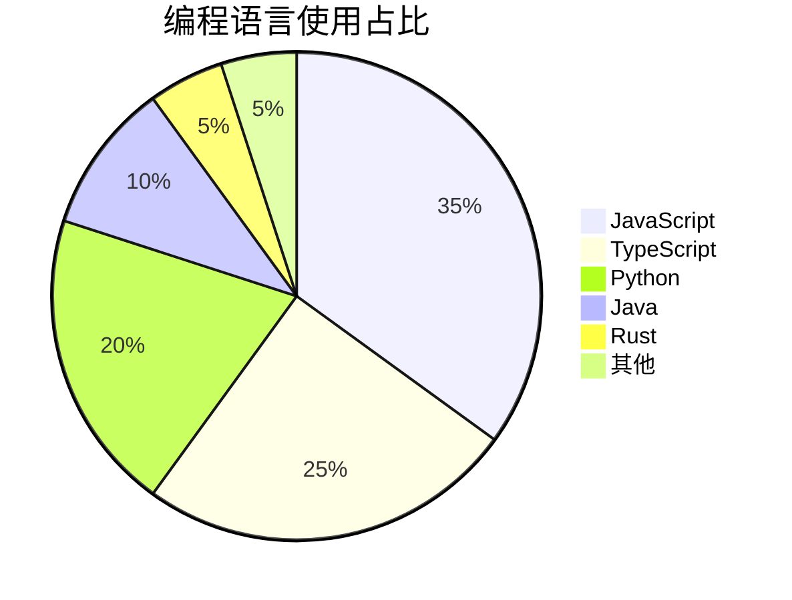

#### Git 流程图

```mermaid
gitgraph
    commit id: "Initial"
    branch develop
    checkout develop
    commit id: "Add feature A"
    commit id: "Add feature B"
    checkout main
    merge develop
    commit id: "Release v1.0"
    branch hotfix
    checkout hotfix
    commit id: "Fix critical bug"
    checkout main
    merge hotfix
    commit id: "Release v1.0.1"
```

#### 实体关系图

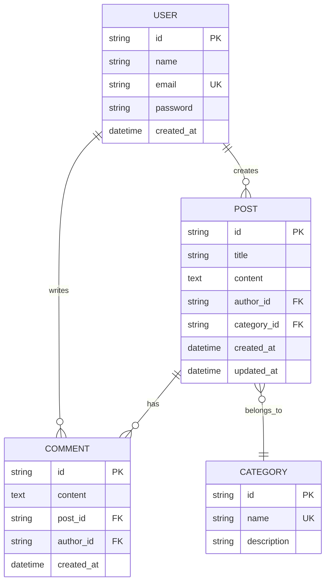

#### 用户旅程图

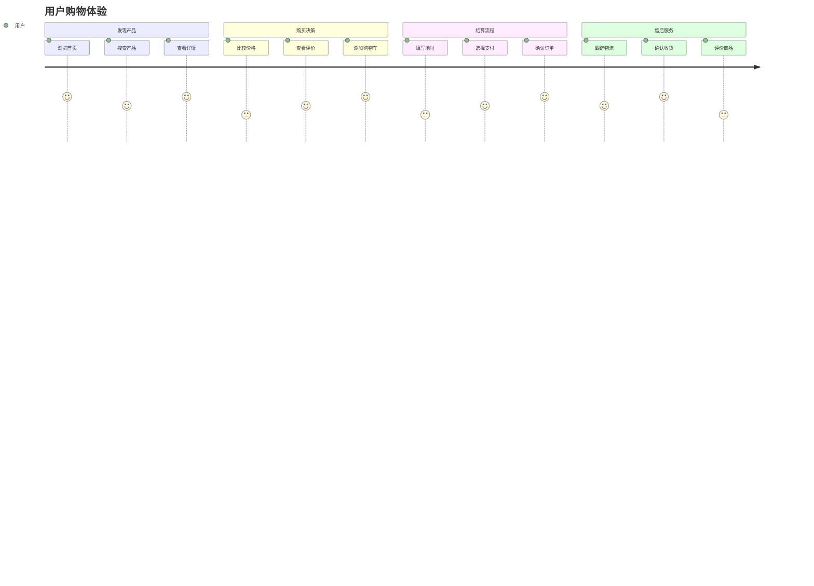

### PlantUML 图表

#### 用例图

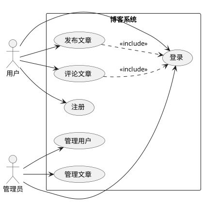

#### 活动图

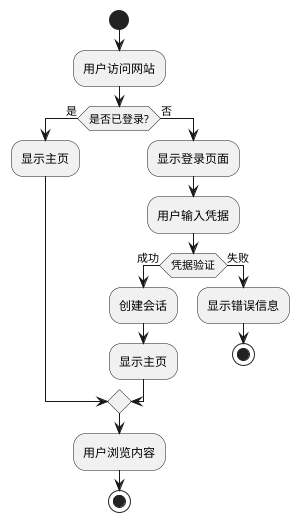

### Graphviz DOT 图

#### 系统架构图

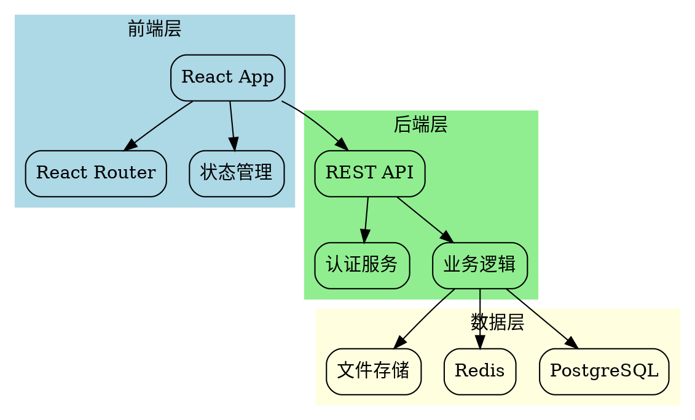

### D3.js 图表

#### 力导向图

```javascript
// D3.js 力导向图示例
const nodes = [
  {id: "React", group: 1},
  {id: "Vue", group: 1},
  {id: "Angular", group: 1},
  {id: "JavaScript", group: 2},
  {id: "TypeScript", group: 2},
  {id: "Node.js", group: 3},
  {id: "Express", group: 3},
  {id: "MongoDB", group: 4},
  {id: "PostgreSQL", group: 4}
];

const links = [
  {source: "React", target: "JavaScript"},
  {source: "Vue", target: "JavaScript"},
  {source: "Angular", target: "TypeScript"},
  {source: "Node.js", target: "JavaScript"},
  {source: "Express", target: "Node.js"},
  {source: "MongoDB", target: "Node.js"},
  {source: "PostgreSQL", target: "Node.js"}
];
```

### ASCII 流程图

```
用户请求流程：

┌─────────┐    HTTP请求    ┌─────────┐    查询数据    ┌─────────┐
│  用户   │ ──────────────> │  服务器  │ ──────────────> │ 数据库  │
└─────────┘                └─────────┘                └─────────┘
     ^                           │                           │
     │         HTTP响应          │                           │
     └───────────────────────────┘                           │
                                 │         返回结果          │
                                 └───────────────────────────┘

API 调用链：

Client ──> Gateway ──> Auth Service ──> Business Service ──> Database
   │                        │                    │               │
   │                        │                    │               │
   └── Response ←─── Token ←─── Validation ←──── Data ←─────────┘
```

### 思维导图

```
前端技术栈
├── 框架
│   ├── React
│   │   ├── Hooks
│   │   ├── Context
│   │   └── Suspense
│   ├── Vue
│   │   ├── Composition API
│   │   ├── Vuex/Pinia
│   │   └── Vue Router
│   └── Angular
│       ├── Components
│       ├── Services
│       └── RxJS
├── 构建工具
│   ├── Vite
│   ├── Webpack
│   └── Rollup
├── 样式
│   ├── CSS
│   ├── Sass/SCSS
│   ├── Tailwind CSS
│   └── Styled Components
└── 测试
    ├── Jest
    ├── Vitest
    ├── Cypress
    └── Playwright
```

### React Flow 交互式图表

#### 简单流程图

<SimpleFlowExample />

#### 系统架构图

<SystemArchExample />
