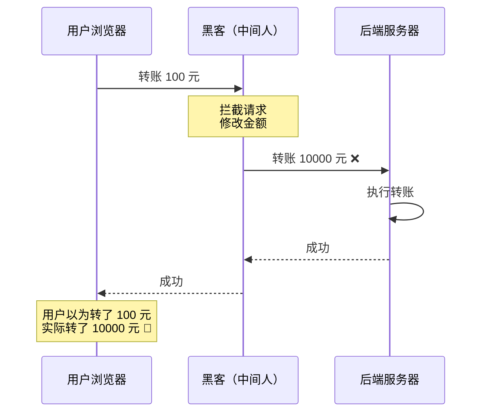
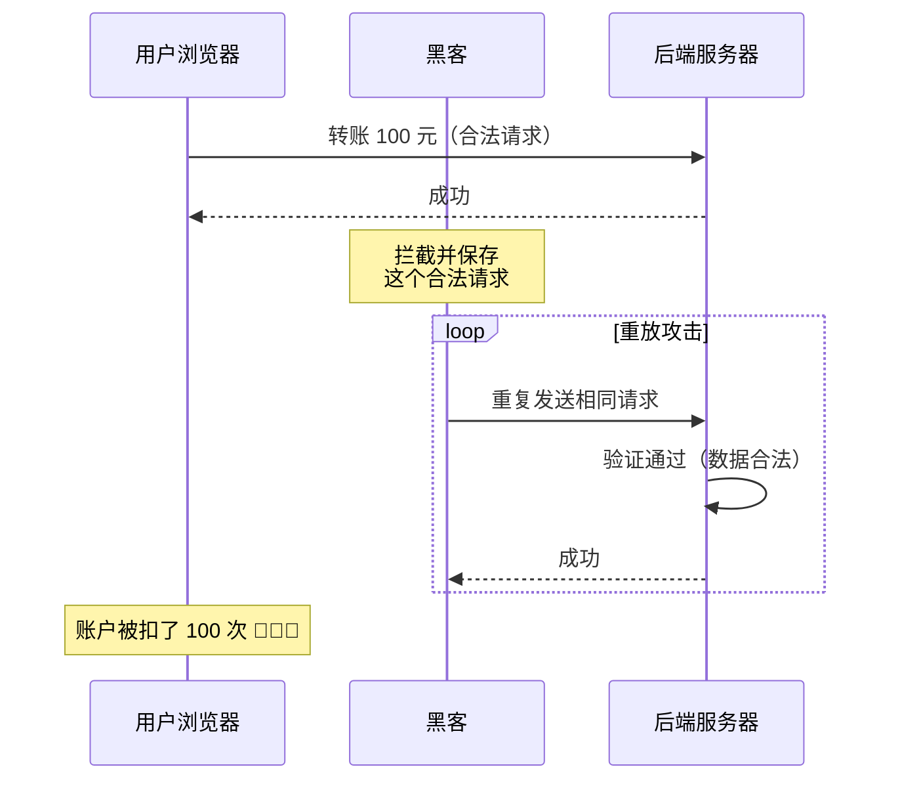
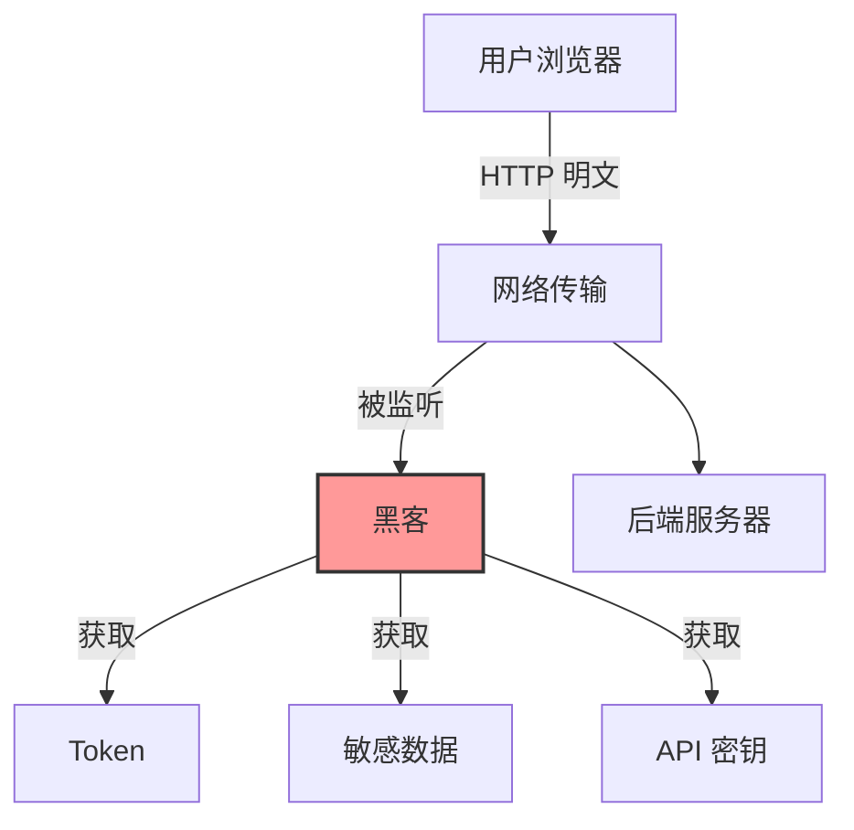
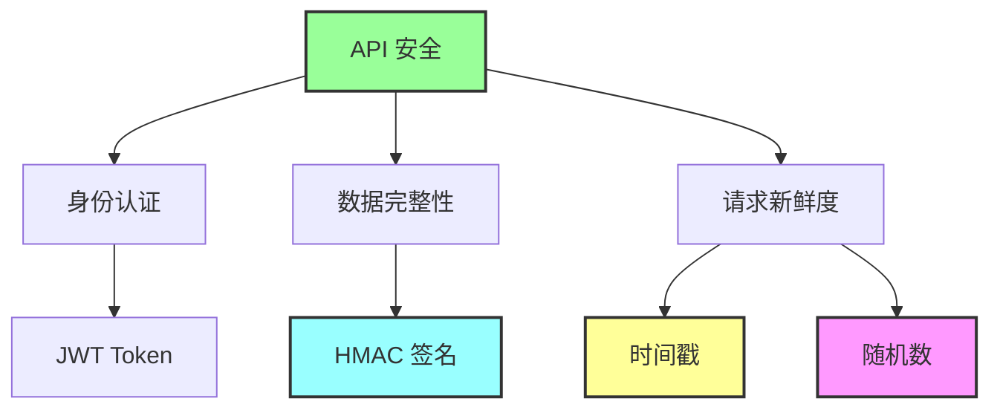
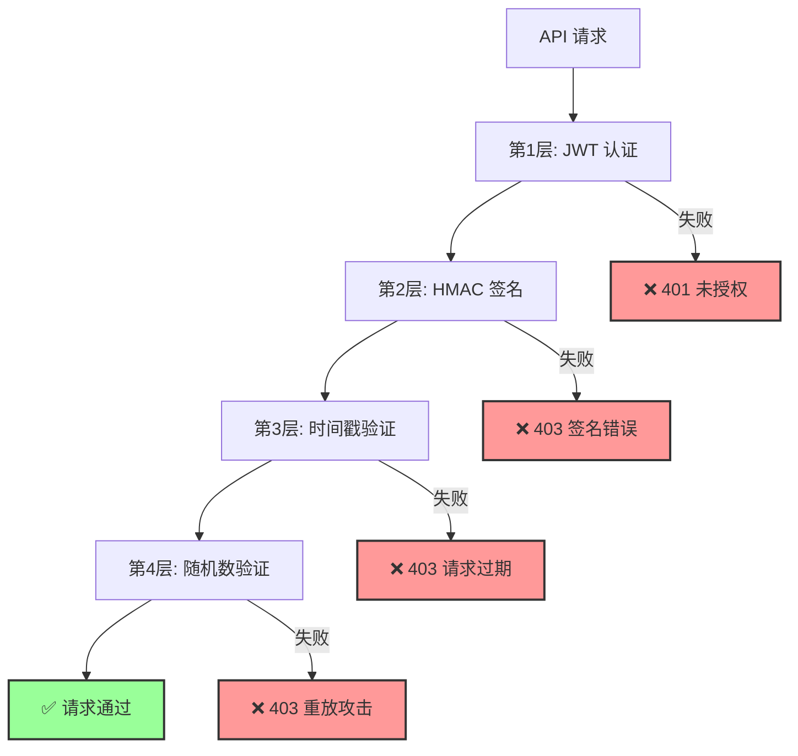

# API 安全机制 - 背景介绍

## 📋 为什么需要 API 安全机制？

在前后端分离的架构中（Next.js + FastAPI），前端和后端通过 HTTP API 通信。这种通信方式面临着严重的安全威胁。

## 🎯 核心问题

### 问题 1：数据可能被篡改



**场景**：

```json
// 用户发送
POST /api/transfer
{
  "to": "张三",
  "amount": 100
}

// 黑客拦截后修改
POST /api/transfer
{
  "to": "黑客账户",
  "amount": 10000
}
```

**后果**：

- 用户资金损失
- 数据被恶意修改
- 系统信任崩溃

### 问题 2：请求可能被重放



**场景**：

```bash
# 黑客抓包得到合法请求
POST /api/transfer
Authorization: Bearer valid_token
{
  "to": "张三",
  "amount": 100
}

# 黑客在 1 秒内重放 100 次
for i in {1..100}; do
  curl -X POST /api/transfer \
    -H "Authorization: Bearer valid_token" \
    -d '{"to":"张三","amount":100}'
done

# 结果：用户被扣款 10000 元
```

**后果**：

- 重复扣款
- 重复操作
- 资源耗尽

### 问题 3：敏感信息可能泄露



## 🏗️ 传统方案的局限性

### 方案 1：仅使用 HTTPS

```
✅ 优点：
- 加密传输
- 防止监听

❌ 局限：
- 无法防止篡改（HTTPS 只加密，不验证内容）
- 无法防止重放（合法请求可以重复发送）
- 无法防止中间人攻击（如果证书被伪造）
```

### 方案 2：仅使用 JWT Token

```
✅ 优点：
- 身份认证
- 无状态

❌ 局限：
- 无法防止请求内容被篡改
- 无法防止重放攻击
- Token 泄露后无法立即失效
```

### 方案 3：仅使用 API Key

```
✅ 优点：
- 简单
- 易于实现

❌ 局限：
- 密钥容易泄露
- 无法防止重放
- 无法验证请求完整性
```

## 💡 我们需要什么？

### 核心需求



### 1. 防篡改（Anti-Tamper）

**需求**：确保请求内容没有被修改

**解决方案**：HMAC 签名

- 使用共享密钥
- 对请求内容生成签名
- 后端验证签名

### 2. 防重放（Anti-Replay）

**需求**：确保请求只能使用一次

**解决方案**：时间戳 + 随机数

- 时间戳：限制请求有效期
- 随机数：确保请求唯一性
- Redis：记录已使用的请求

### 3. 身份认证（Authentication）

**需求**：确保请求来自合法用户

**解决方案**：JWT Token

- 用户登录后获取 Token
- 每次请求携带 Token
- 后端验证 Token 有效性

## 🎯 完整的安全方案



### 多层防御

| 层级 | 机制      | 防御目标   | 失败响应         |
| ---- | --------- | ---------- | ---------------- |
| 1    | JWT Token | 身份认证   | 401 Unauthorized |
| 2    | HMAC 签名 | 数据完整性 | 403 Forbidden    |
| 3    | 时间戳    | 请求时效性 | 403 Forbidden    |
| 4    | 随机数    | 请求唯一性 | 403 Forbidden    |

## 📊 安全等级对比

### 无安全机制

```
安全等级：⭐
防篡改：❌
防重放：❌
防监听：❌

适用场景：
- 公开 API
- 无敏感数据
- 测试环境
```

### 仅 HTTPS

```
安全等级：⭐⭐
防篡改：❌
防重放：❌
防监听：✅

适用场景：
- 公开内容
- 只读 API
```

### HTTPS + JWT

```
安全等级：⭐⭐⭐
防篡改：❌
防重放：❌
防监听：✅
身份认证：✅

适用场景：
- 一般应用
- 用户系统
```

### HTTPS + JWT + HMAC + 防重放（推荐）

```
安全等级：⭐⭐⭐⭐⭐
防篡改：✅
防重放：✅
防监听：✅
身份认证：✅

适用场景：
- 金融系统
- 支付系统
- 敏感数据
- 高安全要求
```

## 🔍 实际案例

### 案例 1：支付宝转账

```
安全机制：
✅ HTTPS 加密
✅ 数字签名（类似 HMAC）
✅ 时间戳验证
✅ 请求序列号（类似 Nonce）
✅ 设备指纹
✅ 风控系统

结果：
- 极少发生盗刷
- 即使发生也能追溯
```

### 案例 2：微信支付

```
安全机制：
✅ HTTPS 加密
✅ 签名验证
✅ 时间戳
✅ 随机字符串
✅ 证书验证

结果：
- 支付安全可靠
- 防止重复扣款
```

### 案例 3：AWS API

```
安全机制：
✅ HTTPS
✅ AWS Signature V4（类似 HMAC）
✅ 时间戳
✅ 请求哈希

结果：
- 企业级安全
- 防止 API 滥用
```

## 📚 本系列文档结构

```
01-background.md          ← 当前文档（背景介绍）
02-hmac-signature.md      → HMAC 签名机制（防篡改）
03-timestamp.md           → 时间戳验证（防过期）
04-nonce.md               → 随机数验证（防重放）
05-implementation.md      → 完整实现（Next.js + FastAPI）
06-advanced-topics.md     → 高级话题（时间同步、密钥轮转）
07-summary.md             → 总结与最佳实践
```

## 🎯 学习目标

通过本系列文档，你将学会：

1. ✅ 理解 API 安全的核心威胁
2. ✅ 掌握 HMAC 签名原理
3. ✅ 实现防重放机制
4. ✅ 在 Next.js + FastAPI 中落地
5. ✅ 处理高级运维问题

## 💡 关键概念预览

### HMAC（Hash-based Message Authentication Code）

```
作用：验证消息完整性和真实性
原理：使用共享密钥生成消息摘要
特点：单向、不可逆、确定性
```

### 时间戳（Timestamp）

```
作用：限制请求有效期
原理：检查请求时间与服务器时间差
特点：简单、有效、需要时间同步
```

### 随机数（Nonce）

```
作用：确保请求唯一性
原理：每个请求使用唯一的随机字符串
特点：配合 Redis 实现去重
```

## 🚀 下一步

现在你已经了解了为什么需要这些安全机制，以及它们要解决的核心问题。

**下一篇**：[HMAC 签名机制](./02-hmac-signature.md) - 深入理解如何防止数据篡改

---

**最后更新**：2025-01-14
**作者**：Blog Platform Team
