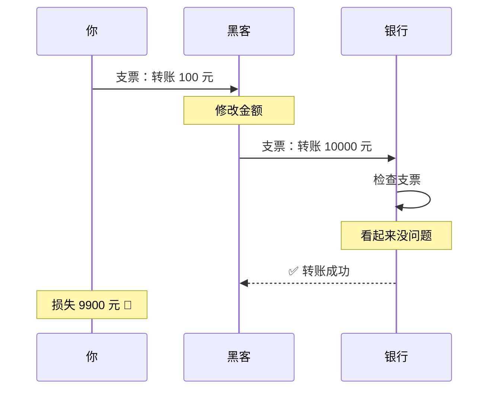
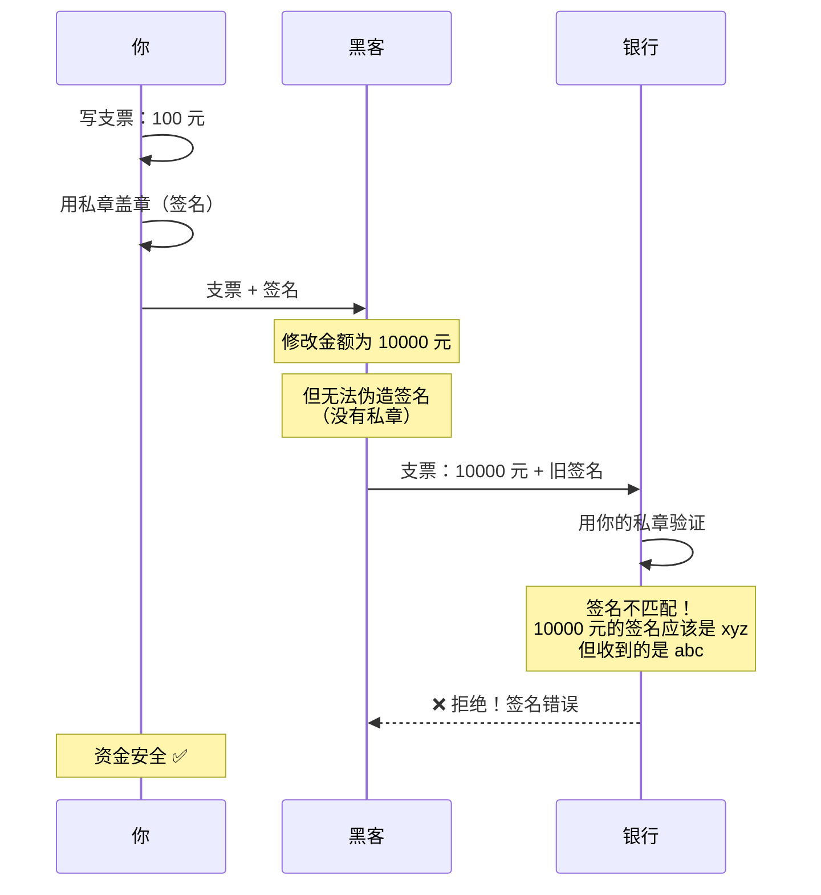
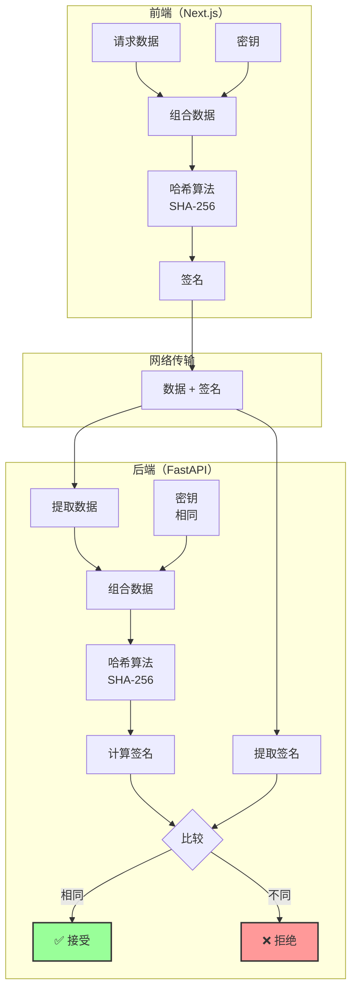
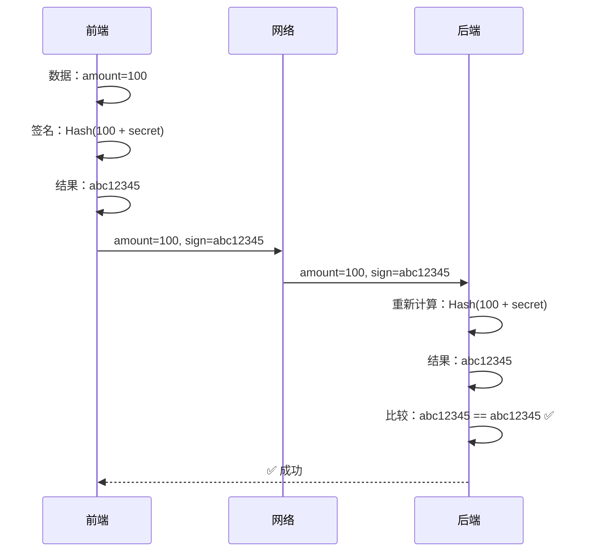
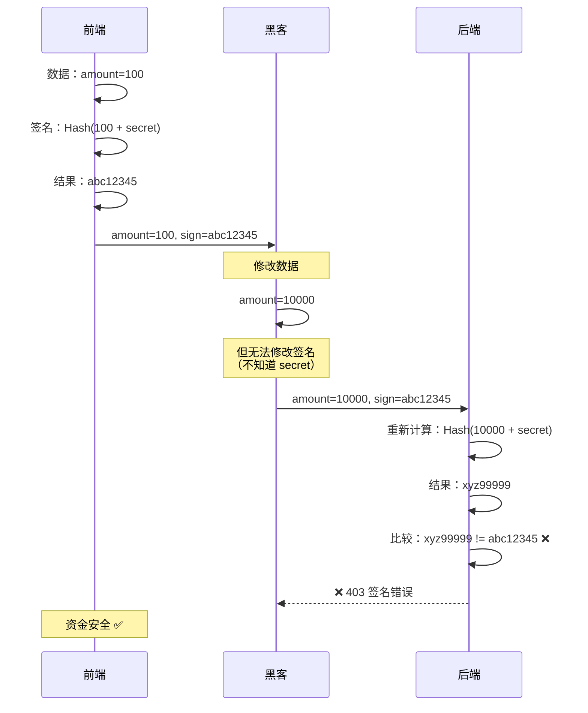
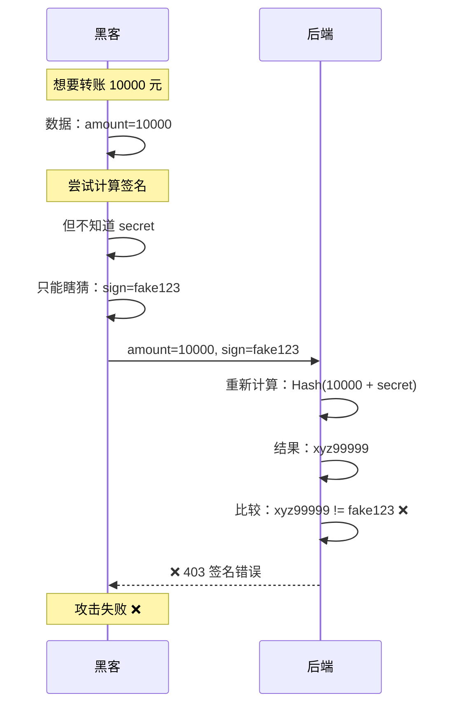
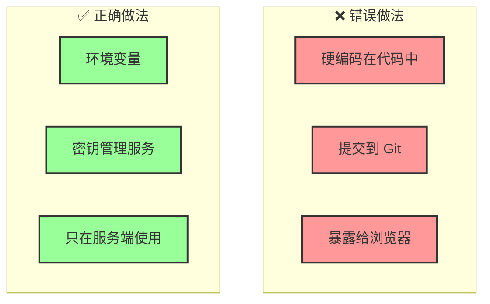

# HMAC 签名机制 - 防篡改

## 📋 什么是 HMAC？

**HMAC** = Hash-based Message Authentication Code（基于哈希的消息认证码）

**核心思想**：使用一个只有你和服务器知道的**密钥**，对消息生成一个**唯一的指纹**。

## 🎭 银行支票的比喻

### 传统支票（无签名）



**问题**：任何人都可以修改支票内容

### 带签名的支票（HMAC）



## 🔐 HMAC 工作原理

### 基本流程



### 详细步骤

#### 步骤 1：前端生成签名

```typescript
// 1. 准备数据
const data = {
  to: "张三",
  amount: 100,
};

// 2. 获取密钥（只在服务端，不能暴露给浏览器）
const secret = process.env.API_SECRET; // "my_secret_key_888"

// 3. 组合数据
const message = JSON.stringify(data); // '{"to":"张三","amount":100}'

// 4. 计算 HMAC 签名
import crypto from "crypto";
const signature = crypto
  .createHmac("sha256", secret)
  .update(message)
  .digest("hex");

// 结果：signature = "abc12345..."

// 5. 发送请求
fetch("/api/transfer", {
  method: "POST",
  headers: {
    "X-Signature": signature, // 签名放在请求头
  },
  body: JSON.stringify(data),
});
```

#### 步骤 2：后端验证签名

```python
# 1. 接收请求
@app.post("/api/transfer")
async def transfer(request: Request):
    # 2. 提取数据和签名
    body = await request.body()
    client_signature = request.headers.get("X-Signature")

    # 3. 获取密钥（与前端相同）
    secret = settings.API_SECRET  # "my_secret_key_888"

    # 4. 重新计算签名
    import hmac
    import hashlib

    server_signature = hmac.new(
        secret.encode(),
        body,
        hashlib.sha256
    ).hexdigest()

    # 5. 比较签名
    if server_signature != client_signature:
        raise HTTPException(403, "签名错误！数据可能被篡改")

    # 6. 签名正确，处理业务逻辑
    data = json.loads(body)
    # 执行转账...
```

## 🛡️ 防篡改演示

### 场景 1：正常请求



### 场景 2：黑客篡改数据



### 场景 3：黑客尝试伪造签名



## 🔑 密钥管理

### 密钥的特点

```
1. 共享性：前端和后端使用相同的密钥
2. 保密性：密钥永远不通过网络传输
3. 唯一性：每个应用使用不同的密钥
4. 复杂性：足够长且随机
```

### 密钥存储



### 配置示例

```bash
# backend/.env
API_SECRET=a1b2c3d4e5f6g7h8i9j0k1l2m3n4o5p6  # 32字节随机字符串

# frontend/.env.local（仅服务端）
API_SECRET=a1b2c3d4e5f6g7h8i9j0k1l2m3n4o5p6  # 与后端相同
```

**生成密钥**：

```bash
# 方法 1：OpenSSL
openssl rand -hex 32

# 方法 2：Node.js
node -e "console.log(require('crypto').randomBytes(32).toString('hex'))"

# 方法 3：Python
python -c "import secrets; print(secrets.token_hex(32))"
```

## 📝 代码实现

### Next.js 前端（Server Action）

```typescript
// app/actions/transfer.ts
"use server";

import crypto from "crypto";

const API_SECRET = process.env.API_SECRET!;

function generateSignature(data: any): string {
  const message = JSON.stringify(data);
  return crypto.createHmac("sha256", API_SECRET).update(message).digest("hex");
}

export async function transferMoney(to: string, amount: number) {
  const data = { to, amount };
  const signature = generateSignature(data);

  const response = await fetch("http://backend:8000/api/transfer", {
    method: "POST",
    headers: {
      "Content-Type": "application/json",
      "X-Signature": signature,
    },
    body: JSON.stringify(data),
  });

  if (!response.ok) {
    throw new Error("Transfer failed");
  }

  return response.json();
}
```

### FastAPI 后端（Middleware）

```python
# backend/app/middleware/signature.py
import hmac
import hashlib
from fastapi import Request, HTTPException
from app.core.config import settings

async def verify_signature(request: Request):
    """验证 HMAC 签名"""

    # 1. 获取客户端签名
    client_signature = request.headers.get("X-Signature")
    if not client_signature:
        raise HTTPException(403, "缺少签名")

    # 2. 读取请求体
    body = await request.body()

    # 3. 计算服务端签名
    server_signature = hmac.new(
        settings.API_SECRET.encode(),
        body,
        hashlib.sha256
    ).hexdigest()

    # 4. 比较签名（防止时序攻击）
    if not hmac.compare_digest(server_signature, client_signature):
        raise HTTPException(403, "签名错误！数据可能被篡改")

    return True


# 应用到路由
@app.post("/api/transfer")
async def transfer(
    request: Request,
    data: TransferRequest,
    _: bool = Depends(verify_signature)  # 依赖注入
):
    # 签名验证通过，执行业务逻辑
    return {"status": "success"}
```

## 🔍 常见问题

### Q1：为什么不直接加密数据？

```
加密 vs 签名：

加密（Encryption）：
- 目的：保密性（别人看不到）
- 可逆：可以解密
- 例子：HTTPS

签名（Signature）：
- 目的：完整性（别人改不了）
- 不可逆：无法从签名还原数据
- 例子：HMAC

结论：
HTTPS 已经加密了，我们需要的是验证完整性
```

### Q2：黑客能否暴力破解密钥？

```
理论上可以，但实际上不可能：

假设密钥长度：32 字节 = 256 位
可能性：2^256 ≈ 10^77

对比：
- 宇宙中的原子数：10^80
- 暴力破解时间：数十亿年

结论：
只要密钥足够长且随机，暴力破解不可行
```

### Q3：签名会增加多少性能开销？

```
HMAC-SHA256 性能：
- 计算时间：< 1ms
- CPU 占用：极低
- 内存占用：极低

对比：
- 数据库查询：10-100ms
- 网络请求：50-500ms

结论：
签名开销可以忽略不计
```

## 📊 安全性分析

### HMAC 的优势

| 特性         | 说明                                   | 安全性     |
| ------------ | -------------------------------------- | ---------- |
| **单向性**   | 无法从签名还原数据                     | ⭐⭐⭐⭐⭐ |
| **确定性**   | 相同输入产生相同签名                   | ⭐⭐⭐⭐⭐ |
| **雪崩效应** | 微小改动导致签名完全不同               | ⭐⭐⭐⭐⭐ |
| **抗碰撞**   | 几乎不可能找到两个不同输入产生相同签名 | ⭐⭐⭐⭐⭐ |

### 雪崩效应演示

```typescript
const secret = "my_secret_key";

// 原始数据
const data1 = "amount=100";
const sign1 = hmac(data1, secret);
// 结果：abc12345...

// 微小改动（100 → 101）
const data2 = "amount=101";
const sign2 = hmac(data2, secret);
// 结果：xyz99999...（完全不同）

// 结论：黑客无法通过修改数据来"调整"签名
```

## 🎯 总结

### HMAC 解决的问题

```
✅ 防止数据篡改
✅ 验证数据完整性
✅ 确认数据来源
✅ 无需加密（HTTPS 已加密）
```

### HMAC 无法解决的问题

```
❌ 防止重放攻击（需要时间戳 + 随机数）
❌ 防止密钥泄露（需要密钥轮转）
❌ 防止时序攻击（需要 constant-time 比较）
```

### 关键要点

1. **密钥管理**：密钥必须保密，永不传输
2. **签名位置**：通常放在 HTTP 头部
3. **签名内容**：包含所有需要保护的数据
4. **比较方法**：使用 constant-time 比较防止时序攻击

## 🚀 下一步

HMAC 签名解决了**防篡改**问题，但还有一个重要问题：**防重放**。

即使签名正确，黑客仍然可以重复发送同一个合法请求。

**下一篇**：[时间戳验证](./03-timestamp.md) - 限制请求有效期

---

**最后更新**：2025-01-14
**作者**：Blog Platform Team
