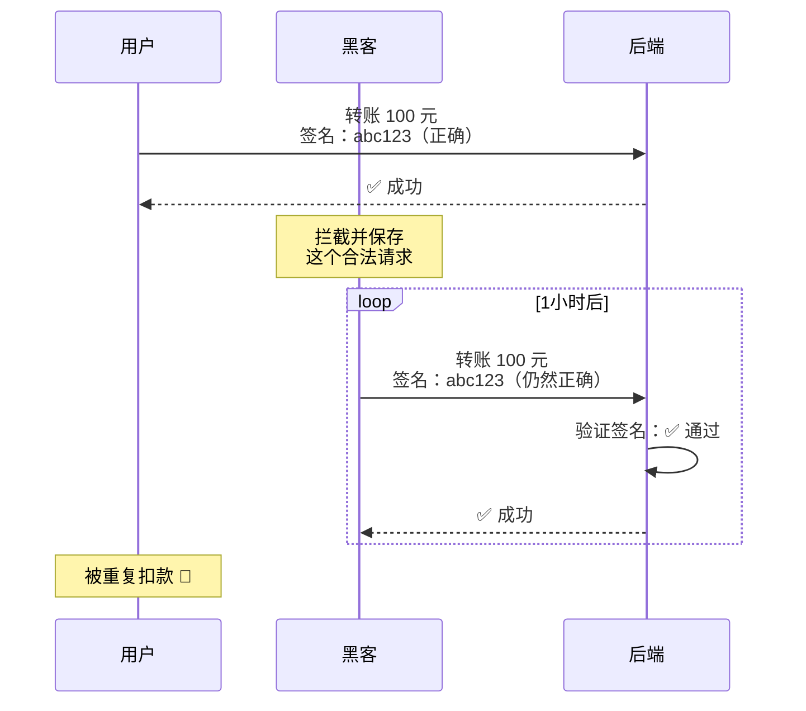
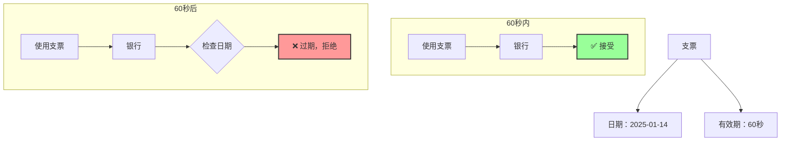
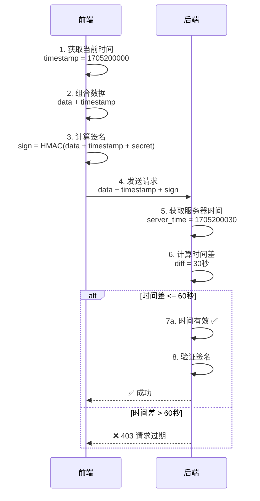
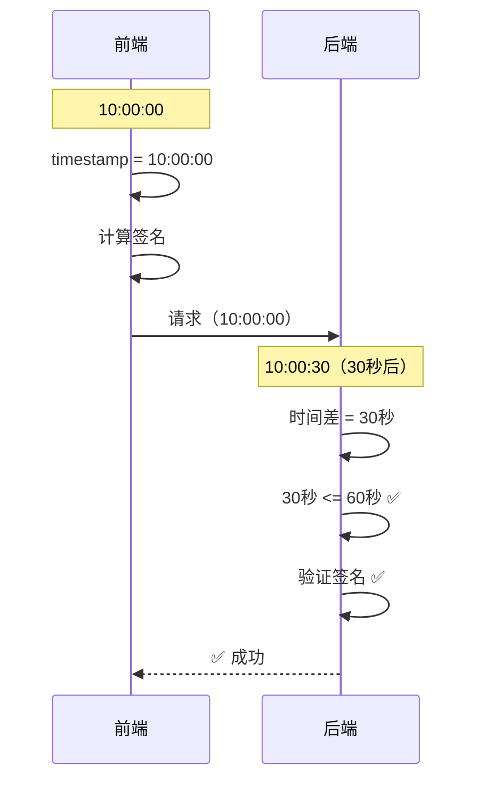
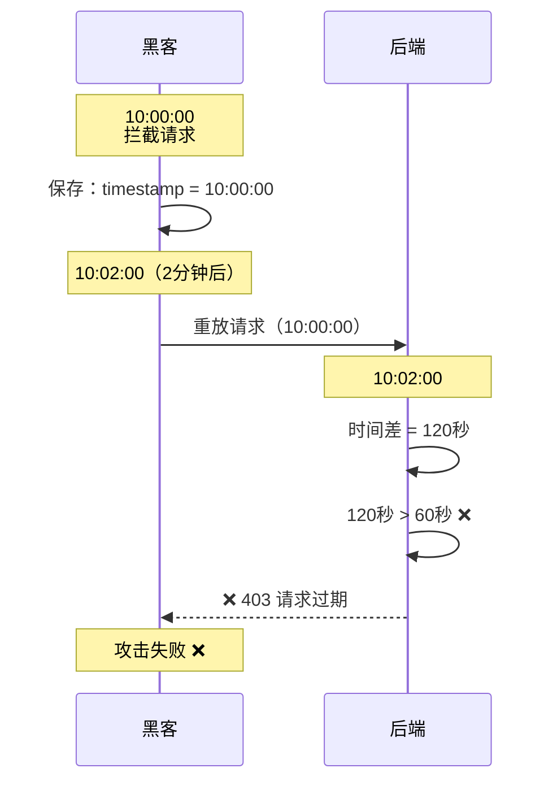
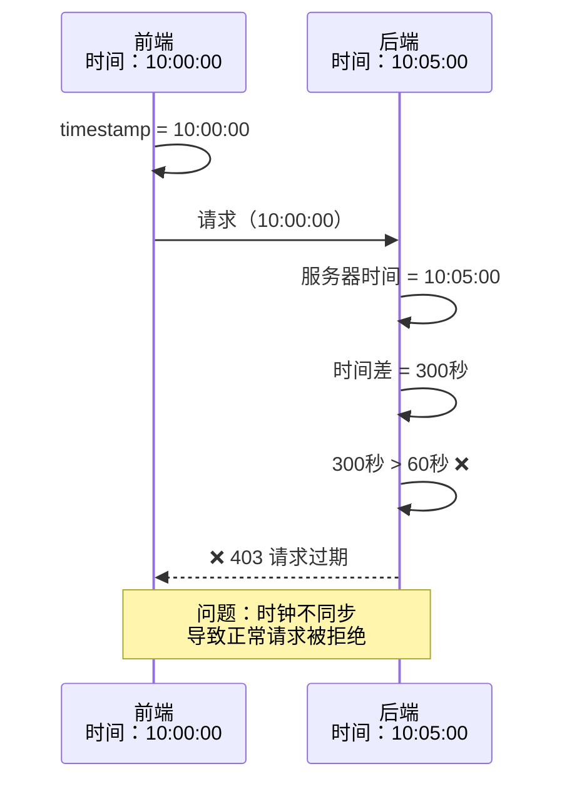
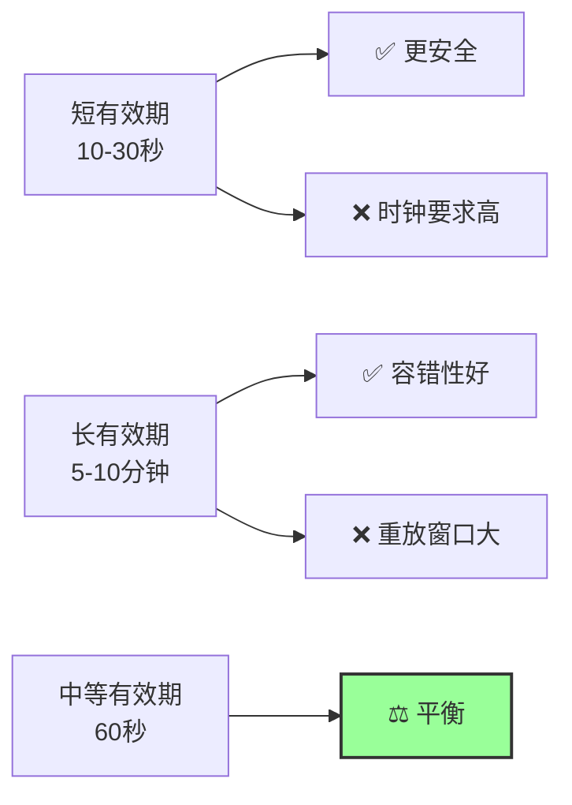
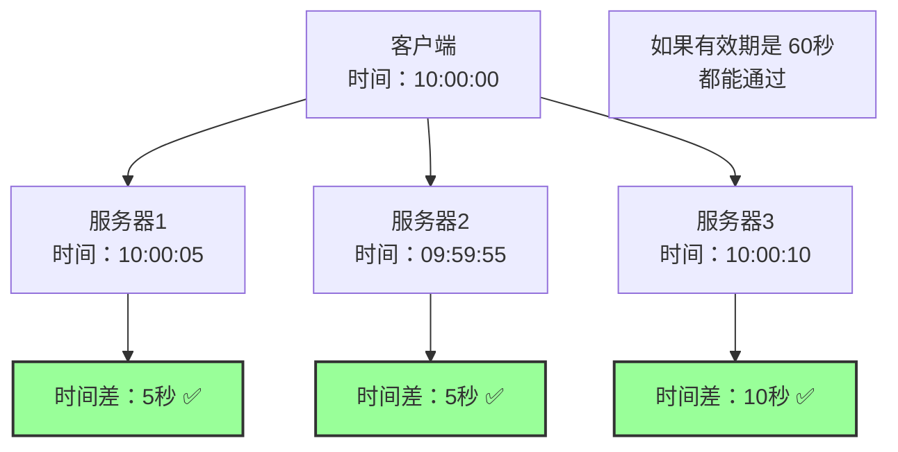

# 时间戳验证 - 防过期请求

## 📋 问题：HMAC 签名的局限性

虽然 HMAC 签名可以防止数据篡改，但它无法防止**重放攻击**。

### 重放攻击场景



**问题**：

- 签名是正确的
- 数据没有被篡改
- 但请求被重复使用了

## 🕐 时间戳的作用

**核心思想**：给每个请求加上"有效期"，过期的请求自动失效。

### 支票的有效期比喻



## 🔐 时间戳工作原理

### 完整流程



### 详细步骤

#### 步骤 1：前端生成时间戳

```typescript
// 1. 获取当前时间（Unix 时间戳，毫秒）
const timestamp = Date.now(); // 1705200000000

// 2. 准备数据
const data = {
  to: "张三",
  amount: 100,
};

// 3. 组合数据（包含时间戳）
const message = JSON.stringify(data) + timestamp;

// 4. 计算签名
const signature = crypto
  .createHmac("sha256", secret)
  .update(message)
  .digest("hex");

// 5. 发送请求
fetch("/api/transfer", {
  method: "POST",
  headers: {
    "X-Timestamp": timestamp.toString(),
    "X-Signature": signature,
  },
  body: JSON.stringify(data),
});
```

#### 步骤 2：后端验证时间戳

```python
from fastapi import Request, HTTPException
import time

@app.post("/api/transfer")
async def transfer(request: Request):
    # 1. 获取客户端时间戳
    client_timestamp = request.headers.get("X-Timestamp")
    if not client_timestamp:
        raise HTTPException(403, "缺少时间戳")

    client_time = int(client_timestamp) / 1000  # 转换为秒

    # 2. 获取服务器当前时间
    server_time = time.time()

    # 3. 计算时间差（绝对值）
    time_diff = abs(server_time - client_time)

    # 4. 检查是否在有效期内（60秒）
    if time_diff > 60:
        raise HTTPException(
            403,
            f"请求过期！时间差：{time_diff}秒"
        )

    # 5. 时间有效，继续验证签名
    # ...
```

## 🛡️ 防重放演示

### 场景 1：正常请求（60 秒内）



### 场景 2：过期请求（超过 60 秒）



### 场景 3：时钟不同步



## ⚙️ 配置参数

### 有效期设置

```python
# 不同场景的有效期建议

# 1. 高安全场景（支付、转账）
TIMESTAMP_TOLERANCE = 30  # 30秒

# 2. 一般场景（数据提交）
TIMESTAMP_TOLERANCE = 60  # 60秒

# 3. 低安全场景（查询）
TIMESTAMP_TOLERANCE = 300  # 5分钟

# 4. 内网环境（时钟同步好）
TIMESTAMP_TOLERANCE = 10  # 10秒
```

### 权衡考虑



## 🕐 时间同步问题

### 问题：服务器时钟不一致



### 解决方案：NTP 时间同步

```bash
# Linux 服务器配置 NTP
sudo apt-get install ntp
sudo systemctl start ntp
sudo systemctl enable ntp

# 检查时间同步状态
ntpq -p

# 手动同步时间
sudo ntpdate pool.ntp.org
```

### Docker 容器时间同步

```yaml
# docker-compose.yml
services:
  backend:
    image: backend:latest
    volumes:
      - /etc/localtime:/etc/localtime:ro # 同步宿主机时间
      - /etc/timezone:/etc/timezone:ro
```

## 📝 代码实现

### Next.js 前端

```typescript
// lib/api-client.ts
import crypto from "crypto";

const API_SECRET = process.env.API_SECRET!;

export async function secureRequest(url: string, data: any) {
  // 1. 生成时间戳
  const timestamp = Date.now();

  // 2. 组合消息（数据 + 时间戳）
  const message = JSON.stringify(data) + timestamp;

  // 3. 计算签名
  const signature = crypto
    .createHmac("sha256", API_SECRET)
    .update(message)
    .digest("hex");

  // 4. 发送请求
  const response = await fetch(url, {
    method: "POST",
    headers: {
      "Content-Type": "application/json",
      "X-Timestamp": timestamp.toString(),
      "X-Signature": signature,
    },
    body: JSON.stringify(data),
  });

  if (!response.ok) {
    const error = await response.json();
    throw new Error(error.detail || "Request failed");
  }

  return response.json();
}
```

### FastAPI 后端

```python
# middleware/timestamp.py
import time
from fastapi import Request, HTTPException
from app.core.config import settings

TIMESTAMP_TOLERANCE = 60  # 60秒有效期

async def verify_timestamp(request: Request):
    """验证时间戳"""

    # 1. 获取客户端时间戳
    client_timestamp = request.headers.get("X-Timestamp")
    if not client_timestamp:
        raise HTTPException(403, "缺少时间戳")

    try:
        client_time = int(client_timestamp) / 1000  # 毫秒转秒
    except ValueError:
        raise HTTPException(403, "时间戳格式错误")

    # 2. 获取服务器时间
    server_time = time.time()

    # 3. 计算时间差（绝对值，允许客户端时间快或慢）
    time_diff = abs(server_time - client_time)

    # 4. 检查是否在有效期内
    if time_diff > TIMESTAMP_TOLERANCE:
        raise HTTPException(
            403,
            f"请求过期！时间差：{time_diff:.0f}秒，"
            f"允许范围：{TIMESTAMP_TOLERANCE}秒"
        )

    return True


# 应用到路由
from fastapi import Depends

@app.post("/api/transfer")
async def transfer(
    request: Request,
    data: TransferRequest,
    _: bool = Depends(verify_timestamp)  # 时间戳验证
):
    # 时间戳验证通过，继续处理
    return {"status": "success"}
```

## 🔍 常见问题

### Q1：为什么使用绝对值计算时间差？

```python
# 允许客户端时间快或慢
time_diff = abs(server_time - client_time)

# 场景 1：客户端时间慢
client_time = 10:00:00
server_time = 10:00:30
diff = abs(10:00:30 - 10:00:00) = 30秒 ✅

# 场景 2：客户端时间快
client_time = 10:00:30
server_time = 10:00:00
diff = abs(10:00:00 - 10:00:30) = 30秒 ✅

# 结论：容错性更好
```

### Q2：时间戳应该放在哪里？

```
选项 1：HTTP 头部（推荐）
✅ 不污染业务数据
✅ 易于提取
✅ 标准做法

选项 2：请求体
❌ 混入业务数据
❌ 需要解析 JSON
⚠️ 可以用，但不推荐

选项 3：URL 参数
❌ 暴露在 URL 中
❌ 日志中可见
❌ 不推荐
```

### Q3：时间戳精度应该是多少？

```
毫秒（推荐）：
timestamp = Date.now()  // 1705200000000
✅ 精度高
✅ JavaScript 原生支持
✅ 足够使用

秒：
timestamp = Math.floor(Date.now() / 1000)  // 1705200000
⚠️ 精度低
⚠️ 同一秒内的请求无法区分

微秒：
❌ 过度设计
❌ 大部分语言不原生支持
```

## 📊 安全性分析

### 时间戳的优势

| 特性           | 说明                 | 效果       |
| -------------- | -------------------- | ---------- |
| **限制有效期** | 请求只在短时间内有效 | ⭐⭐⭐⭐⭐ |
| **简单高效**   | 实现简单，性能开销小 | ⭐⭐⭐⭐⭐ |
| **无需存储**   | 不需要数据库或 Redis | ⭐⭐⭐⭐   |

### 时间戳的局限

| 问题         | 说明               | 解决方案      |
| ------------ | ------------------ | ------------- |
| **时钟同步** | 需要服务器时间一致 | NTP 同步      |
| **重放窗口** | 有效期内仍可重放   | 配合随机数    |
| **时区问题** | 不同时区可能混淆   | 使用 UTC 时间 |

## 🎯 最佳实践

### 1. 使用 UTC 时间

```typescript
// ✅ 推荐：UTC 时间
const timestamp = Date.now(); // 始终是 UTC

// ❌ 不推荐：本地时间
const timestamp = new Date().getTime(); // 可能受时区影响
```

### 2. 配置合理的有效期

```python
# 根据场景调整
if is_payment_api:
    TOLERANCE = 30  # 支付：30秒
elif is_sensitive_api:
    TOLERANCE = 60  # 敏感操作：60秒
else:
    TOLERANCE = 300  # 一般操作：5分钟
```

### 3. 记录时间差日志

```python
# 记录时间差，便于调试
logger.info(
    f"Timestamp validation: "
    f"client={client_time}, "
    f"server={server_time}, "
    f"diff={time_diff:.2f}s"
)
```

### 4. 提供友好的错误信息

```python
if time_diff > TOLERANCE:
    raise HTTPException(
        403,
        f"请求过期！"
        f"时间差：{time_diff:.0f}秒，"
        f"允许范围：{TOLERANCE}秒。"
        f"请检查系统时间是否正确。"
    )
```

## 🚀 总结

### 时间戳解决的问题

```
✅ 限制请求有效期
✅ 缩小重放攻击窗口
✅ 实现简单高效
✅ 无需额外存储
```

### 时间戳无法完全解决的问题

```
❌ 有效期内的重放攻击（需要随机数）
❌ 时钟不同步问题（需要 NTP）
❌ 分布式系统的时间一致性（需要时间同步服务）
```

### 关键要点

1. **有效期设置**：根据安全需求和容错性平衡
2. **时间同步**：使用 NTP 确保服务器时间一致
3. **绝对值计算**：允许客户端时间快或慢
4. **UTC 时间**：避免时区问题

## 🔜 下一步

时间戳缩小了重放攻击的窗口，但在有效期内（如 60 秒），黑客仍然可以重放请求。

要完全防止重放攻击，我们需要引入**随机数（Nonce）**机制。

**下一篇**：[随机数验证](./04-nonce.md) - 确保请求唯一性

---

**最后更新**：2025-01-14
**作者**：Blog Platform Team
