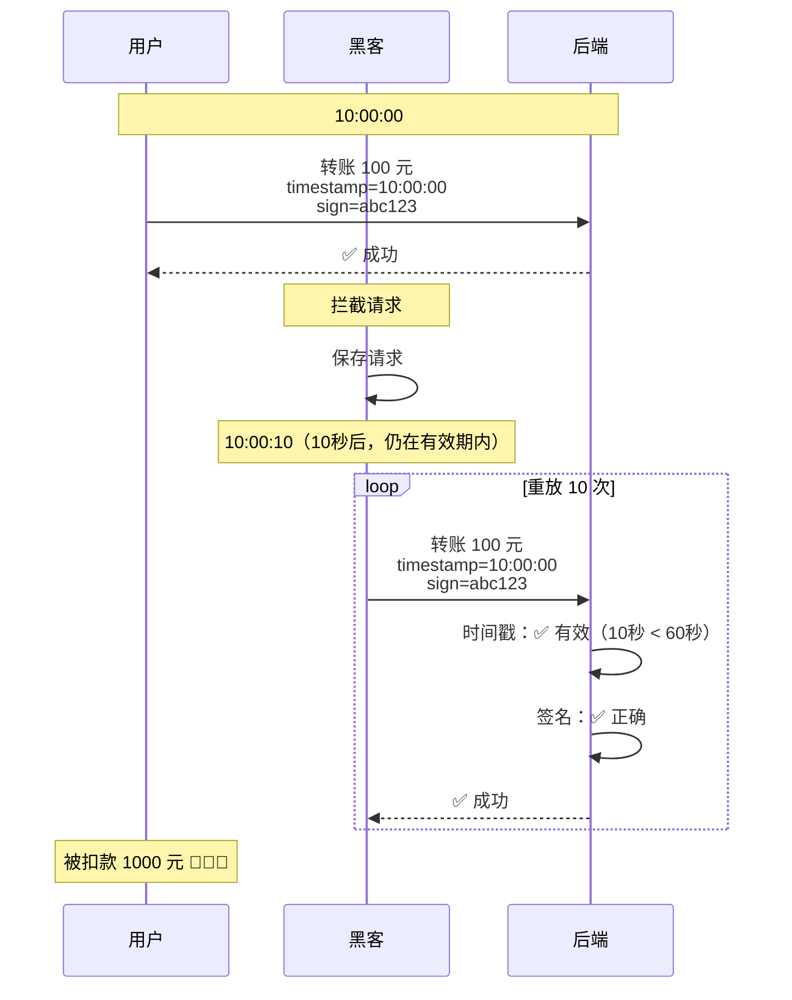
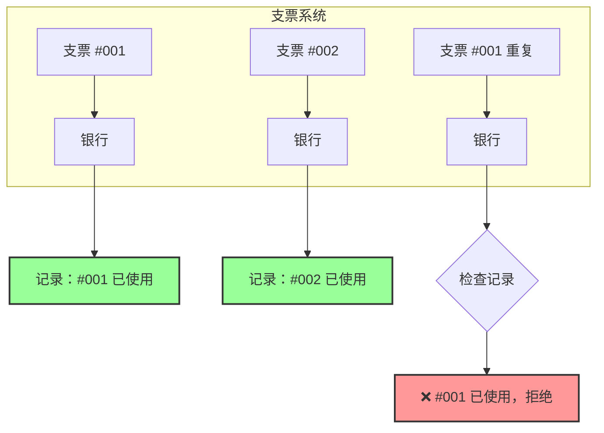
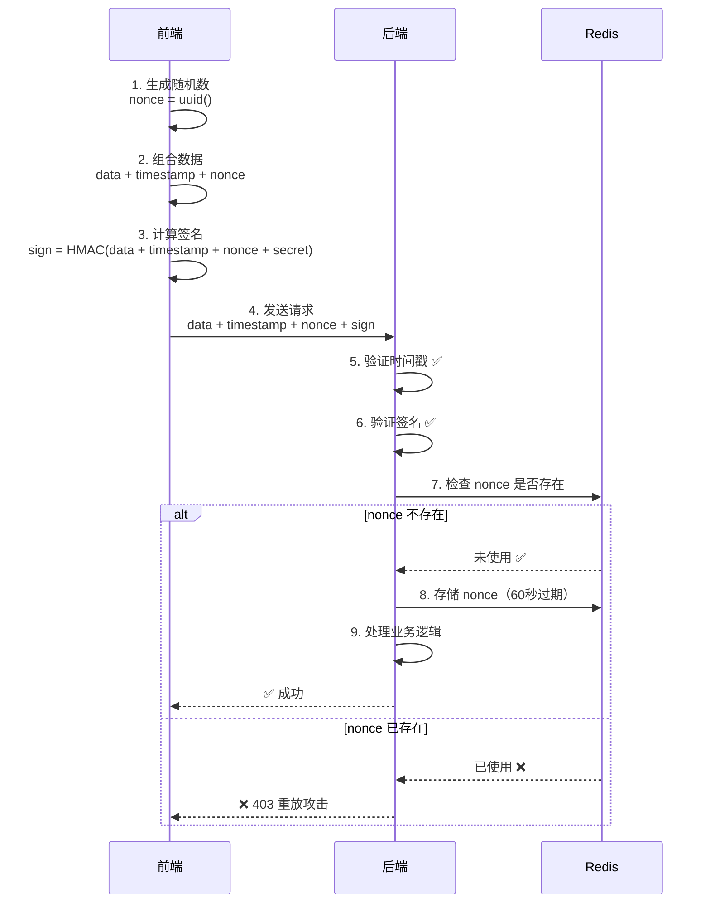
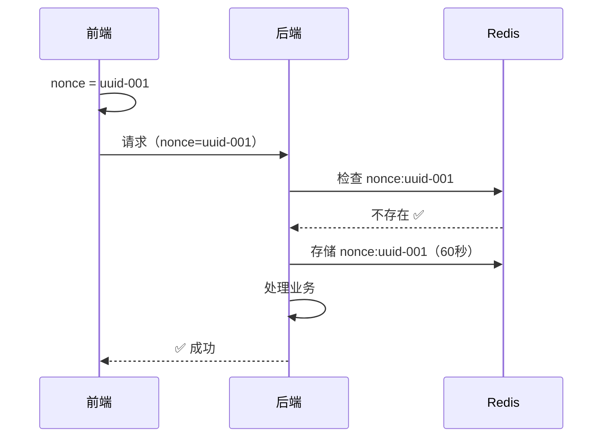
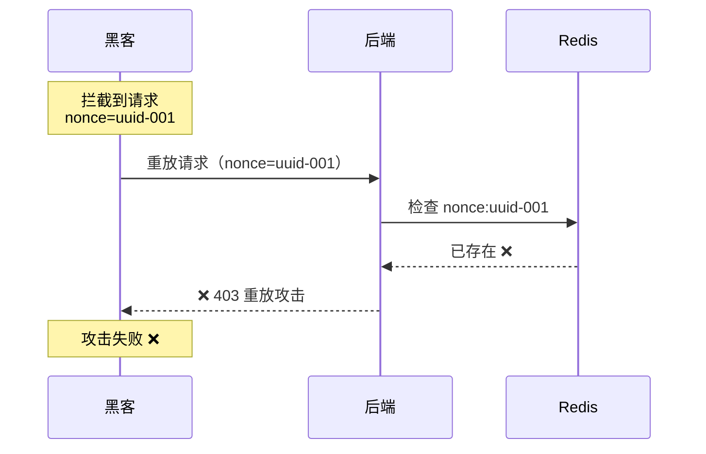
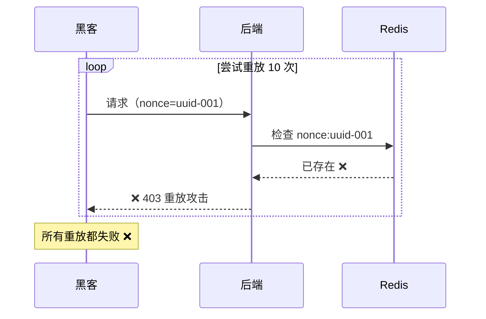
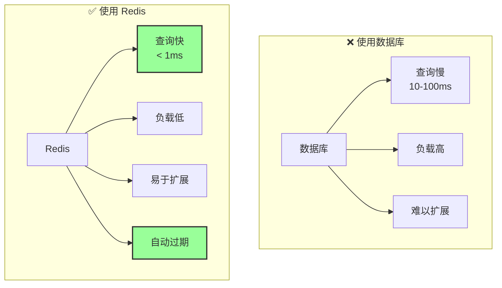

# 随机数验证 - 防重放攻击

## 📋 问题：时间戳的局限性

虽然时间戳限制了请求的有效期，但在有效期内（如 60 秒），黑客仍然可以重复发送同一个请求。

### 有效期内的重放攻击



**问题**：

- 时间戳在有效期内
- 签名是正确的
- 但请求被重复使用了

## 🎲 随机数（Nonce）的作用

**Nonce** = Number used ONCE（只使用一次的数字）

**核心思想**：给每个请求一个**唯一的编号**，服务器记录所有用过的编号，拒绝重复的请求。

### 支票编号的比喻



## 🔐 Nonce 工作原理

### 完整流程



### 详细步骤

#### 步骤 1：前端生成随机数

```typescript
import { v4 as uuidv4 } from "uuid";
import crypto from "crypto";

// 1. 生成随机数（UUID v4）
const nonce = uuidv4(); // "550e8400-e29b-41d4-a716-446655440000"

// 或者使用随机字符串
const nonce = crypto.randomBytes(16).toString("hex"); // "a1b2c3d4..."

// 2. 获取时间戳
const timestamp = Date.now();

// 3. 准备数据
const data = {
  to: "张三",
  amount: 100,
};

// 4. 组合消息（包含 nonce）
const message = JSON.stringify(data) + timestamp + nonce;

// 5. 计算签名
const signature = crypto
  .createHmac("sha256", secret)
  .update(message)
  .digest("hex");

// 6. 发送请求
fetch("/api/transfer", {
  method: "POST",
  headers: {
    "X-Timestamp": timestamp.toString(),
    "X-Nonce": nonce,
    "X-Signature": signature,
  },
  body: JSON.stringify(data),
});
```

#### 步骤 2：后端验证随机数

```python
from fastapi import Request, HTTPException
import redis
import time

# Redis 连接
redis_client = redis.Redis(host='localhost', port=6379, db=0)

@app.post("/api/transfer")
async def transfer(request: Request):
    # 1. 获取 nonce
    nonce = request.headers.get("X-Nonce")
    if not nonce:
        raise HTTPException(403, "缺少随机数")

    # 2. 检查 nonce 是否已使用
    redis_key = f"nonce:{nonce}"
    if redis_client.exists(redis_key):
        raise HTTPException(403, "重放攻击！该请求已被使用")

    # 3. 验证时间戳（假设已通过）
    # ...

    # 4. 验证签名（假设已通过）
    # ...

    # 5. 存储 nonce（60秒过期，与时间戳有效期一致）
    redis_client.setex(redis_key, 60, "used")

    # 6. 处理业务逻辑
    # ...

    return {"status": "success"}
```

## 🛡️ 防重放演示

### 场景 1：正常请求



### 场景 2：重放攻击（相同 nonce）



### 场景 3：多次重放（都被拒绝）



## 🔑 Nonce 生成方法

### 方法 1：UUID v4（推荐）

```typescript
import { v4 as uuidv4 } from "uuid";

const nonce = uuidv4();
// "550e8400-e29b-41d4-a716-446655440000"

// 优点：
// ✅ 全局唯一
// ✅ 标准格式
// ✅ 库支持好

// 缺点：
// ⚠️ 较长（36字符）
```

### 方法 2：随机字符串

```typescript
import crypto from "crypto";

const nonce = crypto.randomBytes(16).toString("hex");
// "a1b2c3d4e5f6g7h8i9j0k1l2m3n4o5p6"

// 优点：
// ✅ 简洁
// ✅ 高度随机

// 缺点：
// ⚠️ 需要确保长度足够（至少16字节）
```

### 方法 3：时间戳 + 随机数

```typescript
const nonce = `${Date.now()}-${crypto.randomBytes(8).toString("hex")}`;
// "1705200000000-a1b2c3d4e5f6g7h8"

// 优点：
// ✅ 包含时间信息
// ✅ 易于调试

// 缺点：
// ⚠️ 可预测性稍高
```

### 方法对比

| 方法        | 长度    | 唯一性     | 随机性     | 推荐度     |
| ----------- | ------- | ---------- | ---------- | ---------- |
| UUID v4     | 36 字符 | ⭐⭐⭐⭐⭐ | ⭐⭐⭐⭐⭐ | ⭐⭐⭐⭐⭐ |
| 随机字符串  | 32 字符 | ⭐⭐⭐⭐⭐ | ⭐⭐⭐⭐⭐ | ⭐⭐⭐⭐   |
| 时间戳+随机 | 30 字符 | ⭐⭐⭐⭐   | ⭐⭐⭐⭐   | ⭐⭐⭐     |

## 💾 Redis 存储策略

### 存储结构

```
Key: nonce:{nonce_value}
Value: "used" 或 {timestamp, user_id, ...}
TTL: 60秒（与时间戳有效期一致）
```

### 为什么使用 Redis？



### Redis 配置

```python
# backend/app/core/redis.py
import redis
from app.core.config import settings

redis_client = redis.Redis(
    host=settings.REDIS_HOST,
    port=settings.REDIS_PORT,
    db=settings.REDIS_DB,
    decode_responses=True
)

def check_nonce(nonce: str) -> bool:
    """检查 nonce 是否已使用"""
    key = f"nonce:{nonce}"
    return redis_client.exists(key) > 0

def store_nonce(nonce: str, ttl: int = 60):
    """存储 nonce"""
    key = f"nonce:{nonce}"
    redis_client.setex(key, ttl, "used")
```

## 📝 完整代码实现

### Next.js 前端

```typescript
// lib/secure-request.ts
import { v4 as uuidv4 } from "uuid";
import crypto from "crypto";

const API_SECRET = process.env.API_SECRET!;

export async function secureRequest(url: string, data: any) {
  // 1. 生成时间戳和随机数
  const timestamp = Date.now();
  const nonce = uuidv4();

  // 2. 组合消息
  const message = JSON.stringify(data) + timestamp + nonce;

  // 3. 计算签名
  const signature = crypto
    .createHmac("sha256", API_SECRET)
    .update(message)
    .digest("hex");

  // 4. 发送请求
  const response = await fetch(url, {
    method: "POST",
    headers: {
      "Content-Type": "application/json",
      "X-Timestamp": timestamp.toString(),
      "X-Nonce": nonce,
      "X-Signature": signature,
    },
    body: JSON.stringify(data),
  });

  if (!response.ok) {
    const error = await response.json();
    throw new Error(error.detail || "Request failed");
  }

  return response.json();
}

// 使用示例
export async function transferMoney(to: string, amount: number) {
  return secureRequest("http://backend:8000/api/transfer", {
    to,
    amount,
  });
}
```

### FastAPI 后端

```python
# middleware/security.py
import hmac
import hashlib
import time
from fastapi import Request, HTTPException, Depends
from app.core.config import settings
from app.core.redis import redis_client

TIMESTAMP_TOLERANCE = 60  # 60秒

async def verify_security(request: Request):
    """完整的安全验证：时间戳 + 签名 + nonce"""

    # 1. 获取请求头
    timestamp_str = request.headers.get("X-Timestamp")
    nonce = request.headers.get("X-Nonce")
    client_signature = request.headers.get("X-Signature")

    if not all([timestamp_str, nonce, client_signature]):
        raise HTTPException(403, "缺少安全头部")

    # 2. 验证时间戳
    try:
        client_time = int(timestamp_str) / 1000
    except ValueError:
        raise HTTPException(403, "时间戳格式错误")

    server_time = time.time()
    time_diff = abs(server_time - client_time)

    if time_diff > TIMESTAMP_TOLERANCE:
        raise HTTPException(
            403,
            f"请求过期！时间差：{time_diff:.0f}秒"
        )

    # 3. 验证 nonce（防重放）
    nonce_key = f"nonce:{nonce}"
    if redis_client.exists(nonce_key):
        raise HTTPException(403, "重放攻击！该请求已被使用")

    # 4. 验证签名
    body = await request.body()
    message = body + timestamp_str.encode() + nonce.encode()

    server_signature = hmac.new(
        settings.API_SECRET.encode(),
        message,
        hashlib.sha256
    ).hexdigest()

    if not hmac.compare_digest(server_signature, client_signature):
        raise HTTPException(403, "签名错误！数据可能被篡改")

    # 5. 所有验证通过，存储 nonce
    redis_client.setex(nonce_key, TIMESTAMP_TOLERANCE, "used")

    return True


# 应用到路由
@app.post("/api/transfer")
async def transfer(
    request: Request,
    data: TransferRequest,
    _: bool = Depends(verify_security)  # 完整安全验证
):
    # 所有安全检查通过，处理业务逻辑
    return {"status": "success"}
```

## 🔍 常见问题

### Q1：Redis 挂了怎么办？

```python
# 方案 1：降级处理（不推荐）
try:
    if redis_client.exists(nonce_key):
        raise HTTPException(403, "重放攻击")
except redis.ConnectionError:
    # Redis 挂了，跳过 nonce 检查
    logger.warning("Redis unavailable, skipping nonce check")
    pass

# 方案 2：拒绝请求（推荐）
try:
    if redis_client.exists(nonce_key):
        raise HTTPException(403, "重放攻击")
except redis.ConnectionError:
    # Redis 挂了，拒绝所有请求
    raise HTTPException(503, "Service temporarily unavailable")

# 方案 3：使用 Redis 集群（最佳）
# 配置 Redis 主从复制或集群，确保高可用
```

### Q2：Nonce 存储会占用多少内存？

```
假设：
- 每个 nonce：36字节（UUID）+ 开销 = 约 100字节
- 每秒 1000 个请求
- 有效期 60秒

内存占用：
1000 请求/秒 × 60秒 × 100字节 = 6MB

结论：
即使高并发，内存占用也很小
```

### Q3：为什么 nonce 的 TTL 要和时间戳有效期一致？

```
时间戳有效期：60秒
Nonce TTL：60秒

原因：
1. 超过 60秒的请求会被时间戳验证拒绝
2. 不需要保留更久的 nonce
3. 自动清理，节省内存

如果 Nonce TTL > 时间戳有效期：
- 浪费内存
- 无意义（请求已过期）

如果 Nonce TTL < 时间戳有效期：
- 可能导致重放攻击
- 不安全
```

## 📊 性能分析

### Redis 性能

```
Redis GET 操作：
- 延迟：< 1ms
- 吞吐量：100,000+ ops/s

对比数据库：
- 延迟：10-100ms
- 吞吐量：1,000-10,000 ops/s

结论：
Redis 比数据库快 10-100 倍
```

### 完整请求流程耗时

```
1. 验证时间戳：< 0.1ms
2. 验证 nonce（Redis）：< 1ms
3. 验证签名：< 1ms
4. 业务逻辑：10-100ms

总计：约 12-102ms

安全验证开销：< 2ms（可忽略）
```

## 🎯 最佳实践

### 1. Nonce 长度

```typescript
// ✅ 推荐：UUID v4（36字符）
const nonce = uuidv4();

// ✅ 可以：32字节随机字符串
const nonce = crypto.randomBytes(16).toString("hex");

// ❌ 不推荐：太短（容易碰撞）
const nonce = Math.random().toString();
```

### 2. Redis 键命名

```python
# ✅ 推荐：使用前缀
key = f"nonce:{nonce}"

# ✅ 可以：包含更多信息
key = f"nonce:{user_id}:{nonce}"

# ❌ 不推荐：直接使用 nonce
key = nonce
```

### 3. 错误处理

```python
# ✅ 推荐：详细的错误信息
if redis_client.exists(nonce_key):
    raise HTTPException(
        403,
        "重放攻击！该请求已被使用。"
        "如果这是正常请求，请重新生成请求。"
    )

# ❌ 不推荐：模糊的错误
if redis_client.exists(nonce_key):
    raise HTTPException(403, "Invalid request")
```

### 4. 监控和日志

```python
# 记录重放攻击
if redis_client.exists(nonce_key):
    logger.warning(
        f"Replay attack detected: "
        f"nonce={nonce}, "
        f"ip={request.client.host}, "
        f"user_agent={request.headers.get('user-agent')}"
    )
    raise HTTPException(403, "重放攻击")
```

## 🚀 总结

### Nonce 解决的问题

```
✅ 完全防止重放攻击
✅ 确保请求唯一性
✅ 配合时间戳和签名，形成完整防御
```

### 关键要点

1. **唯一性**：每个请求使用唯一的 nonce
2. **存储**：使用 Redis 记录已使用的 nonce
3. **过期**：nonce TTL 与时间戳有效期一致
4. **性能**：Redis 查询极快，开销可忽略

### 完整的安全机制

```
第1层：JWT Token（身份认证）
第2层：HMAC 签名（防篡改）
第3层：时间戳（限制有效期）
第4层：随机数（防重放）← 当前

= 完整的 API 安全防护 ✅
```

## 🔜 下一步

现在你已经了解了完整的安全机制：

- HMAC 签名（防篡改）
- 时间戳（限制有效期）
- 随机数（防重放）

**下一篇**：[完整实现](./05-implementation.md) - 在 Next.js + FastAPI 中落地

---

**最后更新**：2025-01-14
**作者**：Blog Platform Team
