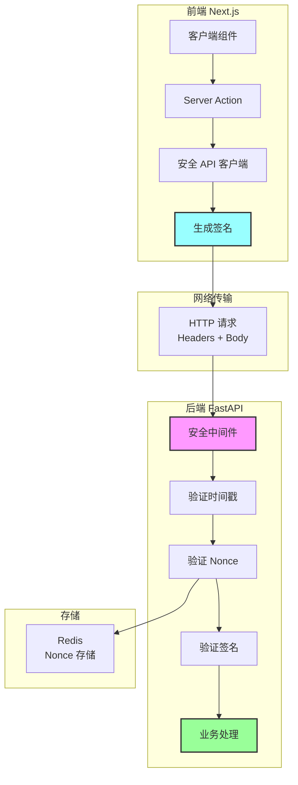

# 完整实现 - Next.js + FastAPI

## 📋 概述

本文档提供完整的、可直接使用的代码实现，将 HMAC 签名、时间戳和随机数三层安全机制集成到 Next.js + FastAPI 项目中。

## 🏗️ 架构设计



## 📁 项目结构

```
project/
├── frontend/                    # Next.js 前端
│   ├── lib/
│   │   ├── secure-api.ts       # 安全 API 客户端
│   │   └── types.ts            # 类型定义
│   ├── app/
│   │   └── actions/
│   │       └── transfer.ts     # Server Actions
│   └── .env.local              # 环境变量
│
└── backend/                     # FastAPI 后端
    ├── app/
    │   ├── core/
    │   │   ├── config.py       # 配置
    │   │   └── redis.py        # Redis 客户端
    │   ├── middleware/
    │   │   └── security.py     # 安全中间件
    │   └── api/
    │       └── transfer.py     # API 端点
    └── .env                    # 环境变量
```

## 🔧 环境配置

### 前端配置

```bash
# frontend/.env.local
API_SECRET=a1b2c3d4e5f6g7h8i9j0k1l2m3n4o5p6q7r8s9t0u1v2w3x4y5z6
NEXT_PUBLIC_API_URL=http://localhost:8000
```

### 后端配置

```bash
# backend/.env
API_SECRET=a1b2c3d4e5f6g7h8i9j0k1l2m3n4o5p6q7r8s9t0u1v2w3x4y5z6
REDIS_HOST=localhost
REDIS_PORT=6379
REDIS_DB=0
```

### 生成密钥

```bash
# 生成 64 字节的随机密钥
openssl rand -hex 32
```

## 💻 前端实现

### 1. 安全 API 客户端

```typescript
// frontend/lib/secure-api.ts
import { v4 as uuidv4 } from "uuid";
import crypto from "crypto";

const API_SECRET = process.env.API_SECRET!;
const API_URL = process.env.NEXT_PUBLIC_API_URL!;

interface SecureRequestOptions {
  method?: "GET" | "POST" | "PUT" | "DELETE";
  data?: any;
  headers?: Record<string, string>;
}

/**
 * 生成安全签名
 */
function generateSignature(
  body: string,
  timestamp: number,
  nonce: string
): string {
  const message = body + timestamp + nonce;
  return crypto.createHmac("sha256", API_SECRET).update(message).digest("hex");
}

/**
 * 安全 API 请求
 *
 * 自动添加：
 * - 时间戳（X-Timestamp）
 * - 随机数（X-Nonce）
 * - HMAC 签名（X-Signature）
 */
export async function secureRequest<T = any>(
  endpoint: string,
  options: SecureRequestOptions = {}
): Promise<T> {
  const { method = "POST", data = {}, headers = {} } = options;

  // 1. 生成时间戳和随机数
  const timestamp = Date.now();
  const nonce = uuidv4();

  // 2. 序列化请求体
  const body = JSON.stringify(data);

  // 3. 计算签名
  const signature = generateSignature(body, timestamp, nonce);

  // 4. 发送请求
  const response = await fetch(`${API_URL}${endpoint}`, {
    method,
    headers: {
      "Content-Type": "application/json",
      "X-Timestamp": timestamp.toString(),
      "X-Nonce": nonce,
      "X-Signature": signature,
      ...headers,
    },
    body: method !== "GET" ? body : undefined,
  });

  // 5. 处理响应
  if (!response.ok) {
    const error = await response.json().catch(() => ({
      detail: "Request failed",
    }));
    throw new Error(error.detail || `HTTP ${response.status}`);
  }

  return response.json();
}

/**
 * 便捷方法
 */
export const secureAPI = {
  post: <T = any>(endpoint: string, data: any) =>
    secureRequest<T>(endpoint, { method: "POST", data }),

  get: <T = any>(endpoint: string) =>
    secureRequest<T>(endpoint, { method: "GET" }),

  put: <T = any>(endpoint: string, data: any) =>
    secureRequest<T>(endpoint, { method: "PUT", data }),

  delete: <T = any>(endpoint: string) =>
    secureRequest<T>(endpoint, { method: "DELETE" }),
};
```

### 2. Server Actions

```typescript
// frontend/app/actions/transfer.ts
"use server";

import { secureAPI } from "@/lib/secure-api";

interface TransferRequest {
  to: string;
  amount: number;
}

interface TransferResponse {
  status: string;
  transaction_id: string;
  message: string;
}

/**
 * 转账操作
 */
export async function transferMoney(
  to: string,
  amount: number
): Promise<TransferResponse> {
  try {
    const response = await secureAPI.post<TransferResponse>("/api/transfer", {
      to,
      amount,
    });

    return response;
  } catch (error) {
    console.error("Transfer failed:", error);
    throw error;
  }
}
```

### 3. 客户端组件使用

```typescript
// frontend/app/transfer/page.tsx
"use client";

import { useState } from "react";
import { transferMoney } from "@/app/actions/transfer";

export default function TransferPage() {
  const [to, setTo] = useState("");
  const [amount, setAmount] = useState("");
  const [loading, setLoading] = useState(false);
  const [message, setMessage] = useState("");

  const handleSubmit = async (e: React.FormEvent) => {
    e.preventDefault();
    setLoading(true);
    setMessage("");

    try {
      const result = await transferMoney(to, Number(amount));
      setMessage(`成功！交易ID：${result.transaction_id}`);
    } catch (error) {
      setMessage(`失败：${error.message}`);
    } finally {
      setLoading(false);
    }
  };

  return (
    <form onSubmit={handleSubmit}>
      <input
        type="text"
        placeholder="收款人"
        value={to}
        onChange={(e) => setTo(e.target.value)}
      />
      <input
        type="number"
        placeholder="金额"
        value={amount}
        onChange={(e) => setAmount(e.target.value)}
      />
      <button type="submit" disabled={loading}>
        {loading ? "处理中..." : "转账"}
      </button>
      {message && <p>{message}</p>}
    </form>
  );
}
```

## 🔧 后端实现

### 1. Redis 客户端

```python
# backend/app/core/redis.py
import redis
from app.core.config import settings
import logging

logger = logging.getLogger(__name__)

# Redis 连接池
redis_pool = redis.ConnectionPool(
    host=settings.REDIS_HOST,
    port=settings.REDIS_PORT,
    db=settings.REDIS_DB,
    decode_responses=True,
    max_connections=50
)

redis_client = redis.Redis(connection_pool=redis_pool)


def check_nonce(nonce: str) -> bool:
    """检查 nonce 是否已使用"""
    try:
        key = f"nonce:{nonce}"
        return redis_client.exists(key) > 0
    except redis.ConnectionError as e:
        logger.error(f"Redis connection error: {e}")
        # Redis 挂了，拒绝请求（安全优先）
        raise


def store_nonce(nonce: str, ttl: int = 60):
    """存储 nonce"""
    try:
        key = f"nonce:{nonce}"
        redis_client.setex(key, ttl, "used")
    except redis.ConnectionError as e:
        logger.error(f"Redis connection error: {e}")
        raise


def ping_redis() -> bool:
    """检查 Redis 连接"""
    try:
        return redis_client.ping()
    except redis.ConnectionError:
        return False
```

### 2. 配置文件

```python
# backend/app/core/config.py
from pydantic_settings import BaseSettings

class Settings(BaseSettings):
    # API 安全
    API_SECRET: str
    TIMESTAMP_TOLERANCE: int = 60  # 时间戳有效期（秒）

    # Redis
    REDIS_HOST: str = "localhost"
    REDIS_PORT: int = 6379
    REDIS_DB: int = 0

    class Config:
        env_file = ".env"

settings = Settings()
```

### 3. 安全中间件

```python
# backend/app/middleware/security.py
import hmac
import hashlib
import time
from fastapi import Request, HTTPException
from app.core.config import settings
from app.core.redis import check_nonce, store_nonce
import logging

logger = logging.getLogger(__name__)


async def verify_security(request: Request):
    """
    完整的安全验证

    验证顺序：
    1. 检查必需的头部
    2. 验证时间戳（防过期）
    3. 验证 nonce（防重放）
    4. 验证签名（防篡改）
    """

    # 1. 获取安全头部
    timestamp_str = request.headers.get("X-Timestamp")
    nonce = request.headers.get("X-Nonce")
    client_signature = request.headers.get("X-Signature")

    if not all([timestamp_str, nonce, client_signature]):
        logger.warning("Missing security headers")
        raise HTTPException(
            status_code=403,
            detail="缺少安全头部（X-Timestamp, X-Nonce, X-Signature）"
        )

    # 2. 验证时间戳
    try:
        client_time = int(timestamp_str) / 1000  # 毫秒转秒
    except ValueError:
        logger.warning(f"Invalid timestamp format: {timestamp_str}")
        raise HTTPException(
            status_code=403,
            detail="时间戳格式错误"
        )

    server_time = time.time()
    time_diff = abs(server_time - client_time)

    if time_diff > settings.TIMESTAMP_TOLERANCE:
        logger.warning(
            f"Request expired: time_diff={time_diff:.0f}s, "
            f"tolerance={settings.TIMESTAMP_TOLERANCE}s"
        )
        raise HTTPException(
            status_code=403,
            detail=f"请求过期！时间差：{time_diff:.0f}秒，"
                   f"允许范围：{settings.TIMESTAMP_TOLERANCE}秒"
        )

    # 3. 验证 nonce（防重放）
    try:
        if check_nonce(nonce):
            logger.warning(f"Replay attack detected: nonce={nonce}")
            raise HTTPException(
                status_code=403,
                detail="重放攻击！该请求已被使用"
            )
    except Exception as e:
        if isinstance(e, HTTPException):
            raise
        logger.error(f"Nonce check failed: {e}")
        raise HTTPException(
            status_code=503,
            detail="服务暂时不可用"
        )

    # 4. 验证签名
    body = await request.body()
    message = body + timestamp_str.encode() + nonce.encode()

    server_signature = hmac.new(
        settings.API_SECRET.encode(),
        message,
        hashlib.sha256
    ).hexdigest()

    # 使用 constant-time 比较防止时序攻击
    if not hmac.compare_digest(server_signature, client_signature):
        logger.warning(
            f"Signature mismatch: "
            f"expected={server_signature[:8]}..., "
            f"got={client_signature[:8]}..."
        )
        raise HTTPException(
            status_code=403,
            detail="签名错误！数据可能被篡改"
        )

    # 5. 所有验证通过，存储 nonce
    try:
        store_nonce(nonce, settings.TIMESTAMP_TOLERANCE)
    except Exception as e:
        logger.error(f"Failed to store nonce: {e}")
        raise HTTPException(
            status_code=503,
            detail="服务暂时不可用"
        )

    logger.info(f"Security verification passed: nonce={nonce[:8]}...")
    return True
```

### 4. API 端点

```python
# backend/app/api/transfer.py
from fastapi import APIRouter, Depends, Request
from pydantic import BaseModel
from app.middleware.security import verify_security
import uuid

router = APIRouter()


class TransferRequest(BaseModel):
    to: str
    amount: float


class TransferResponse(BaseModel):
    status: str
    transaction_id: str
    message: str


@router.post("/transfer", response_model=TransferResponse)
async def transfer(
    request: Request,
    data: TransferRequest,
    _: bool = Depends(verify_security)  # 安全验证
):
    """
    转账 API

    安全机制：
    - HMAC 签名验证
    - 时间戳验证
    - Nonce 防重放
    """

    # 安全验证已通过，处理业务逻辑
    transaction_id = str(uuid.uuid4())

    # TODO: 实际的转账逻辑
    # - 检查余额
    # - 扣款
    # - 记录交易

    return TransferResponse(
        status="success",
        transaction_id=transaction_id,
        message=f"成功转账 {data.amount} 元给 {data.to}"
    )
```

### 5. 主应用

```python
# backend/app/main.py
from fastapi import FastAPI
from fastapi.middleware.cors import CORSMiddleware
from app.api import transfer
from app.core.redis import ping_redis
import logging

logging.basicConfig(level=logging.INFO)
logger = logging.getLogger(__name__)

app = FastAPI(title="Secure API")

# CORS 配置
app.add_middleware(
    CORSMiddleware,
    allow_origins=["http://localhost:3000"],
    allow_credentials=True,
    allow_methods=["*"],
    allow_headers=["*"],
)

# 注册路由
app.include_router(transfer.router, prefix="/api", tags=["transfer"])


@app.on_event("startup")
async def startup_event():
    """启动时检查 Redis 连接"""
    if ping_redis():
        logger.info("✅ Redis connection successful")
    else:
        logger.error("❌ Redis connection failed")


@app.get("/health")
async def health_check():
    """健康检查"""
    redis_ok = ping_redis()
    return {
        "status": "healthy" if redis_ok else "degraded",
        "redis": "ok" if redis_ok else "error"
    }
```

## 🧪 测试

### 1. 单元测试

```python
# backend/tests/test_security.py
import pytest
from fastapi.testclient import TestClient
from app.main import app
import time
from uuid import uuid4
import hmac
import hashlib

client = TestClient(app)

API_SECRET = "test_secret"


def generate_signature(body: str, timestamp: int, nonce: str) -> str:
    """生成测试签名"""
    message = body + str(timestamp) + nonce
    return hmac.new(
        API_SECRET.encode(),
        message.encode(),
        hashlib.sha256
    ).hexdigest()


def test_valid_request():
    """测试正常请求"""
    timestamp = int(time.time() * 1000)
    nonce = str(uuid4())
    body = '{"to":"张三","amount":100}'
    signature = generate_signature(body, timestamp, nonce)

    response = client.post(
        "/api/transfer",
        json={"to": "张三", "amount": 100},
        headers={
            "X-Timestamp": str(timestamp),
            "X-Nonce": nonce,
            "X-Signature": signature
        }
    )

    assert response.status_code == 200
    assert response.json()["status"] == "success"


def test_missing_headers():
    """测试缺少头部"""
    response = client.post(
        "/api/transfer",
        json={"to": "张三", "amount": 100}
    )

    assert response.status_code == 403
    assert "缺少安全头部" in response.json()["detail"]


def test_expired_request():
    """测试过期请求"""
    timestamp = int((time.time() - 120) * 1000)  # 2分钟前
    nonce = str(uuid4())
    body = '{"to":"张三","amount":100}'
    signature = generate_signature(body, timestamp, nonce)

    response = client.post(
        "/api/transfer",
        json={"to": "张三", "amount": 100},
        headers={
            "X-Timestamp": str(timestamp),
            "X-Nonce": nonce,
            "X-Signature": signature
        }
    )

    assert response.status_code == 403
    assert "请求过期" in response.json()["detail"]


def test_replay_attack():
    """测试重放攻击"""
    timestamp = int(time.time() * 1000)
    nonce = str(uuid4())
    body = '{"to":"张三","amount":100}'
    signature = generate_signature(body, timestamp, nonce)

    headers = {
        "X-Timestamp": str(timestamp),
        "X-Nonce": nonce,
        "X-Signature": signature
    }

    # 第一次请求成功
    response1 = client.post(
        "/api/transfer",
        json={"to": "张三", "amount": 100},
        headers=headers
    )
    assert response1.status_code == 200

    # 第二次请求（重放）失败
    response2 = client.post(
        "/api/transfer",
        json={"to": "张三", "amount": 100},
        headers=headers
    )
    assert response2.status_code == 403
    assert "重放攻击" in response2.json()["detail"]


def test_tampered_data():
    """测试数据篡改"""
    timestamp = int(time.time() * 1000)
    nonce = str(uuid4())
    body = '{"to":"张三","amount":100}'
    signature = generate_signature(body, timestamp, nonce)

    # 发送不同的数据（篡改）
    response = client.post(
        "/api/transfer",
        json={"to": "张三", "amount": 10000},  # 篡改金额
        headers={
            "X-Timestamp": str(timestamp),
            "X-Nonce": nonce,
            "X-Signature": signature  # 但签名是 100 的
        }
    )

    assert response.status_code == 403
    assert "签名错误" in response.json()["detail"]
```

### 2. 集成测试

```bash
# 启动服务
cd backend
uvicorn app.main:app --reload

# 启动 Redis
docker run -d -p 6379:6379 redis

# 启动前端
cd frontend
npm run dev

# 测试
curl -X POST http://localhost:3000/api/transfer \
  -H "Content-Type: application/json" \
  -d '{"to":"张三","amount":100}'
```

## 📊 性能监控

### 添加性能日志

```python
# backend/app/middleware/security.py
import time

async def verify_security(request: Request):
    start_time = time.time()

    # ... 验证逻辑 ...

    duration = (time.time() - start_time) * 1000  # 毫秒
    logger.info(f"Security verification took {duration:.2f}ms")

    return True
```

### 监控指标

```python
# backend/app/core/metrics.py
from prometheus_client import Counter, Histogram

# 请求计数
security_checks = Counter(
    'security_checks_total',
    'Total security checks',
    ['status']  # success, failed_timestamp, failed_nonce, failed_signature
)

# 验证耗时
security_duration = Histogram(
    'security_check_duration_seconds',
    'Security check duration'
)
```

## 🚀 部署建议

### Docker Compose

```yaml
# docker-compose.yml
version: "3.8"

services:
  redis:
    image: redis:7-alpine
    ports:
      - "6379:6379"
    volumes:
      - redis_data:/data

  backend:
    build: ./backend
    ports:
      - "8000:8000"
    environment:
      - API_SECRET=${API_SECRET}
      - REDIS_HOST=redis
    depends_on:
      - redis

  frontend:
    build: ./frontend
    ports:
      - "3000:3000"
    environment:
      - API_SECRET=${API_SECRET}
      - NEXT_PUBLIC_API_URL=http://backend:8000
    depends_on:
      - backend

volumes:
  redis_data:
```

## 🎯 总结

### 实现的功能

```
✅ HMAC 签名验证
✅ 时间戳验证
✅ Nonce 防重放
✅ 完整的错误处理
✅ 性能监控
✅ 单元测试
```

### 安全等级

```
⭐⭐⭐⭐⭐ 企业级安全

防护能力：
✅ 防数据篡改
✅ 防重放攻击
✅ 防时序攻击
✅ 防暴力破解
```

## 🔜 下一步

现在你已经有了完整的实现，但还有一些高级话题需要了解：

- 时间同步问题
- 密钥轮转
- 分布式部署

**下一篇**：[高级话题](./06-advanced-topics.md) - 时间同步与密钥轮转

---

**最后更新**：2025-01-14
**作者**：Blog Platform Team
