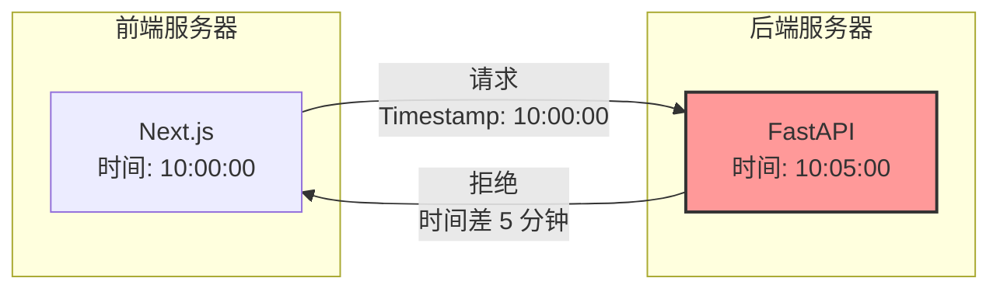
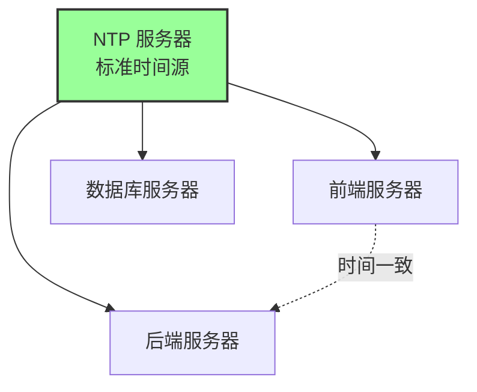
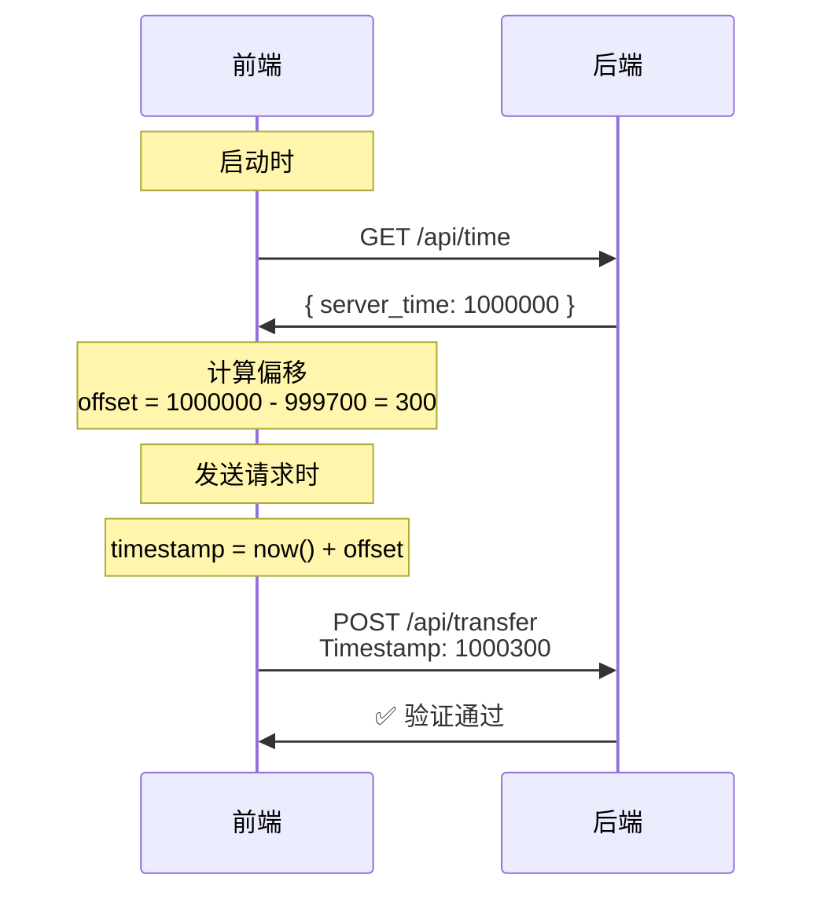
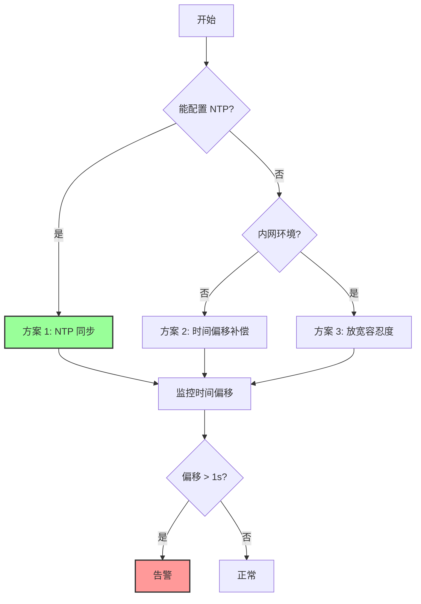
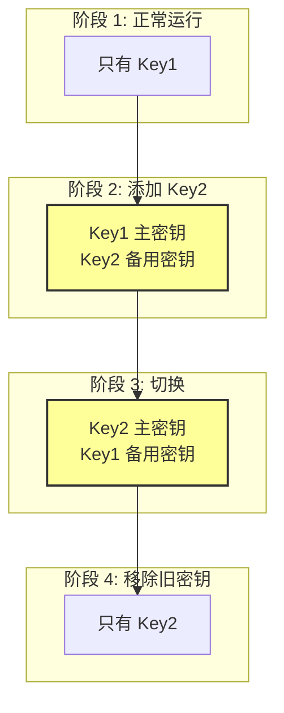
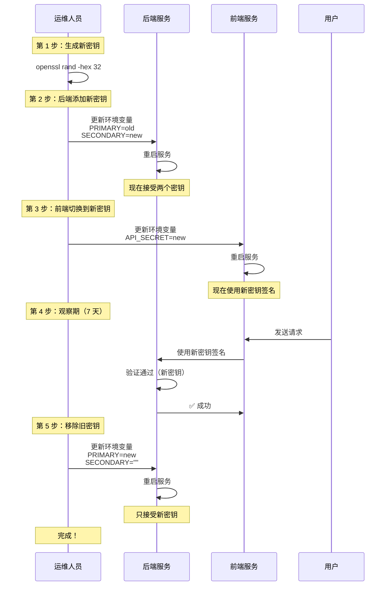
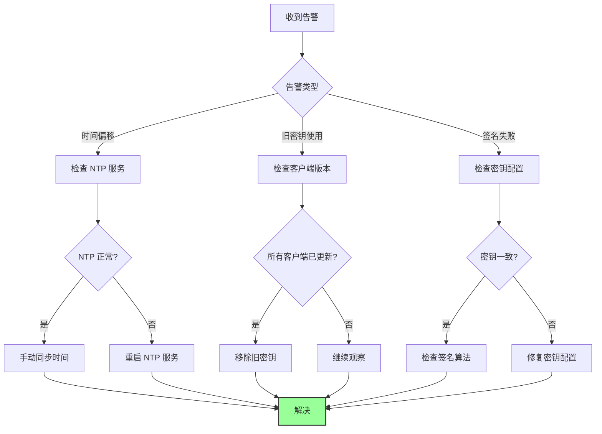

# 高级话题 - 时间同步与密钥轮转

## 📋 概述

在生产环境中，HMAC 安全机制会面临两个关键挑战：

1. **时间同步问题**：分布式系统中服务器时间不一致
2. **密钥轮转问题**：长期使用同一密钥的安全风险

本文档深入探讨这两个高级运维问题的解决方案。

## ⏰ 问题 1：时间同步（Time Synchronization）

### 场景描述



**问题**：

- 前端服务器时间：`10:00:00`
- 后端服务器时间：`10:05:00`
- 时间差：5 分钟
- 配置的容忍度：60 秒

**结果**：所有请求都被拒绝！

### 生活化比喻

想象你去银行取钱，你的手表显示 10:00，但银行的钟显示 10:05。

银行规定："支票必须在 1 分钟内使用"。

你拿着 10:00 的支票，银行看了看自己的钟："这是 5 分钟前的支票，过期了！"

你说："可我刚写的啊！"

银行说："对不起，我们只看我们的钟。"

### 解决方案

#### 方案 1：NTP 时间同步（推荐）

**原理**：让所有服务器都从同一个"标准钟"对时。



**实施步骤**：

```bash
# Ubuntu/Debian
sudo apt-get install ntp
sudo systemctl enable ntp
sudo systemctl start ntp

# 配置 NTP 服务器
sudo nano /etc/ntp.conf

# 添加可靠的 NTP 服务器
server 0.pool.ntp.org
server 1.pool.ntp.org
server 2.pool.ntp.org

# 重启服务
sudo systemctl restart ntp

# 检查同步状态
ntpq -p
```

**Docker 环境**：

```yaml
# docker-compose.yml
version: "3.8"

services:
  frontend:
    image: node:18
    volumes:
      - /etc/localtime:/etc/localtime:ro # 共享主机时间
      - /etc/timezone:/etc/timezone:ro

  backend:
    image: python:3.11
    volumes:
      - /etc/localtime:/etc/localtime:ro
      - /etc/timezone:/etc/timezone:ro
```

**优点**：

- ✅ 彻底解决问题
- ✅ 行业标准方案
- ✅ 误差通常 < 10ms

**缺点**：

- ❌ 需要运维配置
- ❌ 依赖外部服务

#### 方案 2：时间偏移补偿

**原理**：前端主动获取后端时间，计算偏移量。



**前端实现**：

```typescript
// frontend/lib/time-sync.ts
let timeOffset = 0;

/**
 * 同步服务器时间
 */
export async function syncServerTime() {
  const clientTime = Date.now();

  const response = await fetch(`${API_URL}/api/time`);
  const { server_time } = await response.json();

  // 计算偏移量（考虑网络延迟）
  const networkDelay = (Date.now() - clientTime) / 2;
  timeOffset = server_time - clientTime - networkDelay;

  console.log(`Time offset: ${timeOffset}ms`);
}

/**
 * 获取同步后的时间戳
 */
export function getSyncedTimestamp(): number {
  return Date.now() + timeOffset;
}

// 应用启动时同步
syncServerTime();

// 每小时重新同步
setInterval(syncServerTime, 60 * 60 * 1000);
```

**后端实现**：

```python
# backend/app/api/time.py
from fastapi import APIRouter
import time

router = APIRouter()

@router.get("/time")
async def get_server_time():
    """返回服务器时间戳（毫秒）"""
    return {
        "server_time": int(time.time() * 1000)
    }
```

**修改签名生成**：

```typescript
// frontend/lib/secure-api.ts
import { getSyncedTimestamp } from './time-sync';

function generateSignature(...) {
  // 使用同步后的时间戳
  const timestamp = getSyncedTimestamp();
  // ...
}
```

**优点**：

- ✅ 无需运维配置
- ✅ 自动适应时间偏移

**缺点**：

- ❌ 依赖网络延迟估算
- ❌ 需要额外的 API 调用

#### 方案 3：放宽时间容忍度

**原理**：增加时间戳的有效期。

```python
# backend/app/core/config.py
class Settings(BaseSettings):
    # 从 60 秒增加到 300 秒（5 分钟）
    TIMESTAMP_TOLERANCE: int = 300
```

**优点**：

- ✅ 实施简单

**缺点**：

- ❌ 降低安全性
- ❌ 重放攻击窗口变大
- ❌ Redis 存储压力增加

**适用场景**：

- 内网环境
- 时间同步困难的场景
- 安全要求不高的场景

### 最佳实践



**推荐组合**：

1. **生产环境**：NTP 同步 + 监控告警
2. **开发环境**：时间偏移补偿
3. **内网环境**：放宽容忍度（300 秒）

## 🔑 问题 2：密钥轮转（Key Rotation）

### 为什么需要密钥轮转？

**场景 1：密钥泄露**

```
某天，一个离职员工的笔记本被盗。
笔记本里有 .env 文件，包含 API_SECRET。
黑客现在可以伪造任何请求！
```

**场景 2：长期使用风险**

```
同一个密钥用了 3 年。
如果密钥被破解，所有历史数据都不安全。
```

**场景 3：合规要求**

```
某些行业（金融、医疗）要求：
"密钥必须每 90 天轮转一次"
```

### 生活化比喻

密钥轮转就像换门锁：

- **旧锁**：用了 10 年，钥匙丢过几次，不知道谁有备份
- **新锁**：全新的，只有你有钥匙

但问题是：**换锁的时候，你还要能进门！**

### 解决方案：双密钥机制

**核心思想**：同时支持新旧两个密钥，平滑过渡。



### 实现步骤

#### 1. 配置多密钥支持

```python
# backend/app/core/config.py
from typing import List

class Settings(BaseSettings):
    # 主密钥（用于生成签名）
    API_SECRET_PRIMARY: str

    # 备用密钥（用于验证旧签名）
    API_SECRET_SECONDARY: str = ""

    @property
    def api_secrets(self) -> List[str]:
        """返回所有有效密钥"""
        secrets = [self.API_SECRET_PRIMARY]
        if self.API_SECRET_SECONDARY:
            secrets.append(self.API_SECRET_SECONDARY)
        return secrets

settings = Settings()
```

#### 2. 修改验证逻辑

```python
# backend/app/middleware/security.py
import hmac
import hashlib
from app.core.config import settings

async def verify_security(request: Request):
    # ... 前面的验证逻辑 ...

    # 获取客户端签名
    client_signature = request.headers.get("X-Signature")

    # 准备消息
    body = await request.body()
    message = body + timestamp_str.encode() + nonce.encode()

    # 尝试所有密钥
    signature_valid = False
    used_key_index = -1

    for i, secret in enumerate(settings.api_secrets):
        server_signature = hmac.new(
            secret.encode(),
            message,
            hashlib.sha256
        ).hexdigest()

        if hmac.compare_digest(server_signature, client_signature):
            signature_valid = True
            used_key_index = i
            break

    if not signature_valid:
        logger.warning("Signature mismatch with all keys")
        raise HTTPException(
            status_code=403,
            detail="签名错误！数据可能被篡改"
        )

    # 记录使用的密钥（用于监控）
    if used_key_index > 0:
        logger.warning(
            f"Request using secondary key (index={used_key_index}). "
            "Consider updating client."
        )

    # ... 后续逻辑 ...
```

#### 3. 轮转流程



**详细步骤**：

```bash
# 第 1 步：生成新密钥
NEW_KEY=$(openssl rand -hex 32)
echo "新密钥: $NEW_KEY"

# 第 2 步：后端添加新密钥（作为备用）
# backend/.env
API_SECRET_PRIMARY=old_key_here
API_SECRET_SECONDARY=new_key_here

# 重启后端
docker-compose restart backend

# 第 3 步：前端切换到新密钥
# frontend/.env.local
API_SECRET=new_key_here

# 重启前端
docker-compose restart frontend

# 第 4 步：观察 7 天，检查日志
# 如果看到 "using secondary key" 的警告，说明还有旧客户端

# 第 5 步：移除旧密钥
# backend/.env
API_SECRET_PRIMARY=new_key_here
API_SECRET_SECONDARY=

# 重启后端
docker-compose restart backend
```

#### 4. 自动化脚本

```python
# scripts/rotate_key.py
import os
import secrets
from datetime import datetime

def generate_key() -> str:
    """生成 64 字节的随机密钥"""
    return secrets.token_hex(32)

def rotate_key():
    """密钥轮转脚本"""

    # 1. 读取当前密钥
    current_primary = os.getenv("API_SECRET_PRIMARY")

    # 2. 生成新密钥
    new_key = generate_key()

    # 3. 输出配置
    print("=" * 60)
    print("密钥轮转配置")
    print("=" * 60)
    print(f"时间: {datetime.now()}")
    print(f"\n新密钥: {new_key}")
    print("\n第 1 步：更新后端配置")
    print(f"API_SECRET_PRIMARY={current_primary}")
    print(f"API_SECRET_SECONDARY={new_key}")
    print("\n第 2 步：更新前端配置")
    print(f"API_SECRET={new_key}")
    print("\n第 3 步：7 天后移除旧密钥")
    print(f"API_SECRET_PRIMARY={new_key}")
    print(f"API_SECRET_SECONDARY=")
    print("=" * 60)

if __name__ == "__main__":
    rotate_key()
```

### 监控与告警

```python
# backend/app/middleware/security.py
from prometheus_client import Counter

# 密钥使用计数
key_usage = Counter(
    'api_key_usage_total',
    'API key usage',
    ['key_index']
)

async def verify_security(request: Request):
    # ... 验证逻辑 ...

    # 记录密钥使用
    key_usage.labels(key_index=used_key_index).inc()

    # 如果使用备用密钥，发送告警
    if used_key_index > 0:
        # 发送到监控系统
        alert_manager.send_alert(
            severity="warning",
            message=f"Client using old API key (index={used_key_index})"
        )
```

### 最佳实践

```
✅ 定期轮转：每 90 天
✅ 应急轮转：密钥泄露后立即执行
✅ 监控告警：跟踪旧密钥使用情况
✅ 文档记录：记录每次轮转的时间和原因
✅ 自动化：使用脚本减少人为错误
```

## 🎯 综合方案

### 生产环境配置清单

```yaml
# 时间同步
✅ 所有服务器配置 NTP
✅ 监控时间偏移（告警阈值：1 秒）
✅ 时间戳容忍度：60 秒

# 密钥管理
✅ 使用密钥管理服务（AWS KMS / HashiCorp Vault）
✅ 定期轮转：每 90 天
✅ 双密钥支持：平滑过渡
✅ 监控旧密钥使用情况

# 监控告警
✅ 时间偏移告警
✅ 旧密钥使用告警
✅ 签名失败率告警
✅ Redis 连接告警
```

### 故障处理流程



## 📚 参考资源

- [NTP 官方文档](https://www.ntp.org/)
- [AWS KMS 密钥轮转](https://docs.aws.amazon.com/kms/latest/developerguide/rotate-keys.html)
- [NIST 密钥管理指南](https://csrc.nist.gov/publications/detail/sp/800-57-part-1/rev-5/final)

---

**下一篇**：[总结与最佳实践](./07-summary.md)

---

**最后更新**：2025-01-15
**作者**：Blog Platform Team
