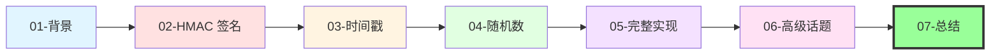
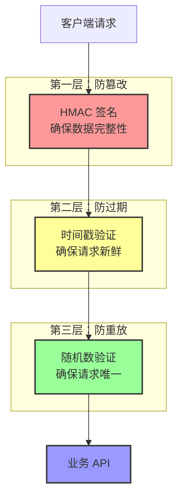
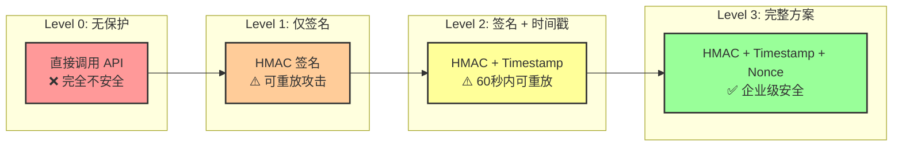
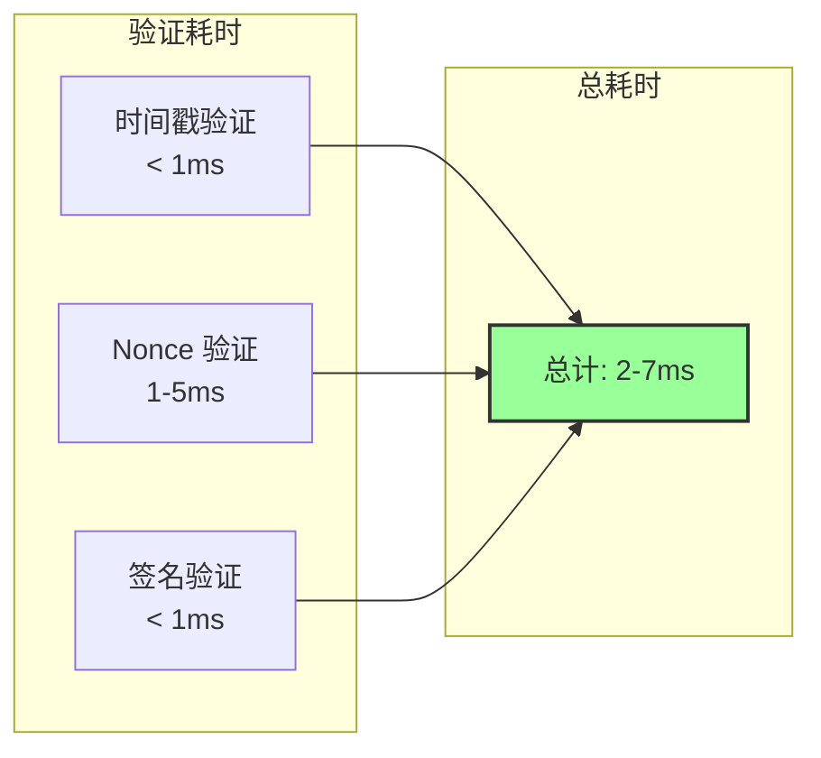
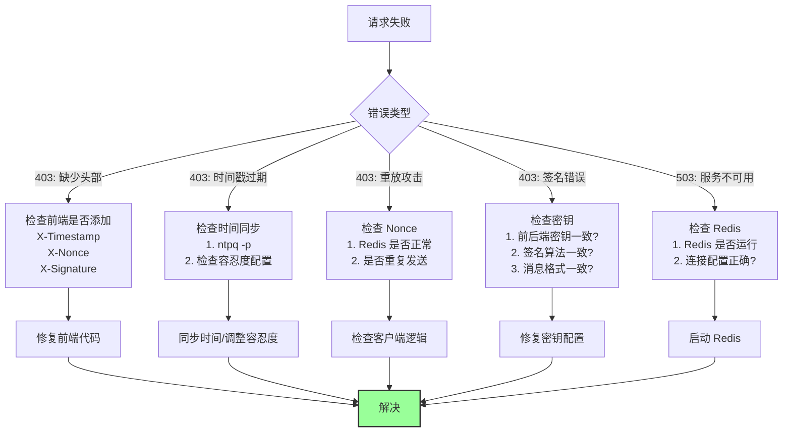
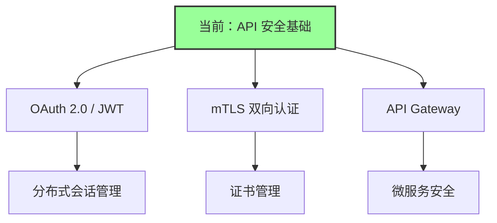
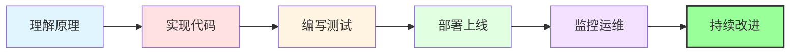

# 总结与最佳实践

## 📋 回顾整个安全体系

我们从零开始，构建了一套完整的 API 安全机制。让我们回顾一下这个旅程：



## 🛡️ 三层防护机制

### 核心原理



### 生活化总结

把 API 安全想象成**银行支票系统**：

| 安全机制      | 银行支票类比 | 防护目标               |
| ------------- | ------------ | ---------------------- |
| **HMAC 签名** | 你的私章     | 防止别人伪造支票       |
| **时间戳**    | 支票有效期   | 防止使用过期支票       |
| **随机数**    | 支票编号     | 防止重复使用同一张支票 |

**完整流程**：

1. 你写支票（生成请求）
2. 盖上私章（HMAC 签名）
3. 标注日期（时间戳）
4. 写上唯一编号（Nonce）
5. 银行验证：章对不对？过期没？用过没？
6. 全部通过，才能取钱（执行业务逻辑）

## 📊 安全等级对比

### 不同方案的安全性



### 安全评分

| 方案        | 防篡改 | 防重放 | 性能       | 复杂度   | 推荐度 |
| ----------- | ------ | ------ | ---------- | -------- | ------ |
| 无保护      | ❌     | ❌     | ⭐⭐⭐⭐⭐ | ⭐       | ❌     |
| 仅签名      | ✅     | ❌     | ⭐⭐⭐⭐   | ⭐⭐     | ⚠️     |
| 签名+时间戳 | ✅     | ⚠️     | ⭐⭐⭐⭐   | ⭐⭐⭐   | ⚠️     |
| 完整方案    | ✅     | ✅     | ⭐⭐⭐     | ⭐⭐⭐⭐ | ✅     |

## 🎯 最佳实践清单

### 开发阶段

```
✅ 使用环境变量存储密钥
✅ 密钥长度至少 32 字节
✅ 使用 HMAC-SHA256 算法
✅ 时间戳使用毫秒精度
✅ Nonce 使用 UUID v4
✅ 签名使用 constant-time 比较
✅ 编写完整的单元测试
```

### 部署阶段

```
✅ 配置 NTP 时间同步
✅ 使用密钥管理服务（KMS/Vault）
✅ 配置 Redis 持久化
✅ 设置监控告警
✅ 准备密钥轮转流程
✅ 配置日志记录
✅ 设置速率限制
```

### 运维阶段

```
✅ 定期检查时间同步状态
✅ 每 90 天轮转密钥
✅ 监控签名失败率
✅ 监控 Redis 性能
✅ 定期审查日志
✅ 定期安全审计
```

## 🚀 性能优化

### 性能指标



### 优化建议

**1. Redis 优化**

```python
# 使用连接池
redis_pool = redis.ConnectionPool(
    host=settings.REDIS_HOST,
    max_connections=50,  # 连接池大小
    decode_responses=True
)

# 使用 Pipeline 批量操作
pipe = redis_client.pipeline()
pipe.exists(f"nonce:{nonce}")
pipe.setex(f"nonce:{nonce}", 60, "used")
results = pipe.execute()
```

**2. 签名计算优化**

```python
# 预编译 HMAC 对象
hmac_obj = hmac.new(
    settings.API_SECRET.encode(),
    digestmod=hashlib.sha256
)

# 复用对象
hmac_copy = hmac_obj.copy()
hmac_copy.update(message)
signature = hmac_copy.hexdigest()
```

**3. 缓存优化**

```python
# 缓存密钥对象
from functools import lru_cache

@lru_cache(maxsize=10)
def get_hmac_key(secret: str):
    return secret.encode()
```

## 🔍 故障排查指南

### 常见问题



### 调试技巧

**1. 启用详细日志**

```python
# backend/app/middleware/security.py
import logging

logger = logging.getLogger(__name__)
logger.setLevel(logging.DEBUG)

async def verify_security(request: Request):
    logger.debug(f"Timestamp: {timestamp_str}")
    logger.debug(f"Nonce: {nonce}")
    logger.debug(f"Client Signature: {client_signature[:8]}...")
    logger.debug(f"Server Signature: {server_signature[:8]}...")
```

**2. 使用测试工具**

```bash
# 生成测试签名
python scripts/generate_signature.py \
  --body '{"to":"张三","amount":100}' \
  --timestamp 1705300000000 \
  --nonce "test-nonce-123" \
  --secret "your-secret-key"

# 输出：
# Signature: abc123def456...
```

**3. 验证时间同步**

```bash
# 检查服务器时间
date

# 检查 NTP 同步状态
ntpq -p

# 手动同步
sudo ntpdate -u pool.ntp.org
```

## 📈 监控指标

### 关键指标

```yaml
# Prometheus 指标
metrics:
  # 请求计数
  - security_checks_total{status="success"}
  - security_checks_total{status="failed_timestamp"}
  - security_checks_total{status="failed_nonce"}
  - security_checks_total{status="failed_signature"}

  # 验证耗时
  - security_check_duration_seconds

  # 密钥使用
  - api_key_usage_total{key_index="0"} # 主密钥
  - api_key_usage_total{key_index="1"} # 备用密钥

  # Redis 性能
  - redis_command_duration_seconds{command="exists"}
  - redis_command_duration_seconds{command="setex"}
```

### 告警规则

```yaml
# Prometheus 告警规则
groups:
  - name: api_security
    rules:
      # 签名失败率过高
      - alert: HighSignatureFailureRate
        expr: |
          rate(security_checks_total{status="failed_signature"}[5m]) > 0.1
        for: 5m
        annotations:
          summary: "签名失败率过高"
          description: "过去 5 分钟签名失败率 > 10%"

      # 时间偏移过大
      - alert: TimeOffsetTooLarge
        expr: |
          rate(security_checks_total{status="failed_timestamp"}[5m]) > 0.05
        for: 5m
        annotations:
          summary: "时间偏移过大"
          description: "过去 5 分钟时间戳验证失败率 > 5%"

      # 使用旧密钥
      - alert: UsingOldAPIKey
        expr: |
          api_key_usage_total{key_index="1"} > 0
        for: 1h
        annotations:
          summary: "检测到使用旧密钥"
          description: "仍有客户端使用旧密钥，请尽快更新"
```

## 🔐 安全加固

### 额外的安全措施

**1. 速率限制**

```python
# backend/app/middleware/rate_limit.py
from slowapi import Limiter
from slowapi.util import get_remote_address

limiter = Limiter(key_func=get_remote_address)

@app.post("/api/transfer")
@limiter.limit("10/minute")  # 每分钟最多 10 次
async def transfer(...):
    pass
```

**2. IP 白名单**

```python
# backend/app/middleware/ip_whitelist.py
ALLOWED_IPS = ["192.168.1.100", "10.0.0.50"]

async def check_ip(request: Request):
    client_ip = request.client.host
    if client_ip not in ALLOWED_IPS:
        raise HTTPException(status_code=403, detail="IP 不在白名单")
```

**3. 请求体大小限制**

```python
# backend/app/main.py
app.add_middleware(
    RequestSizeLimitMiddleware,
    max_size=1024 * 1024  # 1MB
)
```

**4. HTTPS 强制**

```python
# backend/app/middleware/https.py
async def force_https(request: Request, call_next):
    if request.url.scheme != "https":
        raise HTTPException(
            status_code=403,
            detail="必须使用 HTTPS"
        )
    return await call_next(request)
```

## 📚 学习路径

### 进阶主题



### 推荐资源

**书籍**：

- 《Web 安全深度剖析》
- 《密码学原理与实践》
- 《API 安全实战》

**在线资源**：

- [OWASP API Security Top 10](https://owasp.org/www-project-api-security/)
- [NIST 密码学标准](https://csrc.nist.gov/)
- [RFC 2104 - HMAC](https://www.rfc-editor.org/rfc/rfc2104)

**工具**：

- [Postman](https://www.postman.com/) - API 测试
- [Burp Suite](https://portswigger.net/burp) - 安全测试
- [OWASP ZAP](https://www.zaproxy.org/) - 漏洞扫描

## 🎓 知识检验

### 自测问题

1. **HMAC 签名的核心原理是什么？**
   <details>
   <summary>答案</summary>
   使用共享密钥和哈希算法生成消息认证码，确保数据完整性和来源可信。密钥永不通过网络传输。
   </details>

2. **为什么需要时间戳验证？**
   <details>
   <summary>答案</summary>
   限制请求的有效期，防止攻击者长期持有并重放旧请求。
   </details>

3. **Nonce 的作用是什么？**
   <details>
   <summary>答案</summary>
   确保每个请求的唯一性，防止在时间戳有效期内的重放攻击。
   </details>

4. **为什么要使用 constant-time 比较？**
   <details>
   <summary>答案</summary>
   防止时序攻击（Timing Attack）。普通字符串比较会在第一个不匹配字符处提前返回，攻击者可以通过测量响应时间逐字节破解签名。
   </details>

5. **密钥轮转的最佳实践是什么？**
   <details>
   <summary>答案</summary>
   使用双密钥机制，平滑过渡。定期轮转（90 天），监控旧密钥使用情况，确保所有客户端更新后再移除旧密钥。
   </details>

## 🎉 总结

### 你已经掌握了

```
✅ HMAC 签名的原理和实现
✅ 时间戳验证的配置和优化
✅ Nonce 防重放机制
✅ 完整的 Next.js + FastAPI 实现
✅ 时间同步问题的解决方案
✅ 密钥轮转的最佳实践
✅ 监控、告警和故障排查
```

### 安全等级

```
🛡️ 你的 API 现在拥有：

⭐⭐⭐⭐⭐ 企业级安全

防护能力：
✅ 防数据篡改
✅ 防重放攻击
✅ 防时序攻击
✅ 防暴力破解
✅ 可监控、可审计
✅ 符合行业标准
```

### 最后的建议



**记住**：

1. **安全是一个过程，不是一个产品**

   - 定期审查和更新
   - 关注最新的安全漏洞
   - 持续学习和改进

2. **平衡安全性和可用性**

   - 不要过度设计
   - 考虑用户体验
   - 根据实际需求调整

3. **文档和监控同样重要**
   - 记录所有配置和变更
   - 设置完善的监控告警
   - 定期进行安全审计

## 🚀 下一步

现在你已经掌握了 API 安全的核心知识，可以：

1. **应用到实际项目**

   - 在你的 Next.js + FastAPI 项目中实施
   - 根据实际需求调整配置
   - 编写完整的测试用例

2. **深入学习**

   - OAuth 2.0 和 JWT
   - 微服务安全架构
   - 零信任网络模型

3. **分享知识**
   - 在团队中推广最佳实践
   - 编写内部安全规范
   - 帮助他人理解 API 安全

---

**恭喜你完成了整个 API 安全系列！** 🎉

如果有任何问题，欢迎随时查阅这些文档。

---

**文档系列**：

- [01-背景介绍](./01-background.md)
- [02-HMAC 签名](./02-hmac-signature.md)
- [03-时间戳验证](./03-timestamp.md)
- [04-随机数验证](./04-nonce.md)
- [05-完整实现](./05-implementation.md)
- [06-高级话题](./06-advanced-topics.md)
- **07-总结与最佳实践** ← 当前文档

---

**最后更新**：2025-01-15
**作者**：Blog Platform Team
