# 服务端和客户端 spa 的对比

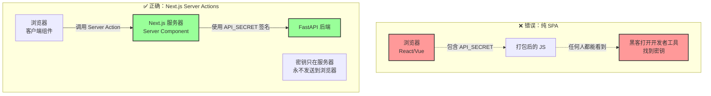

## nextjs 的流程

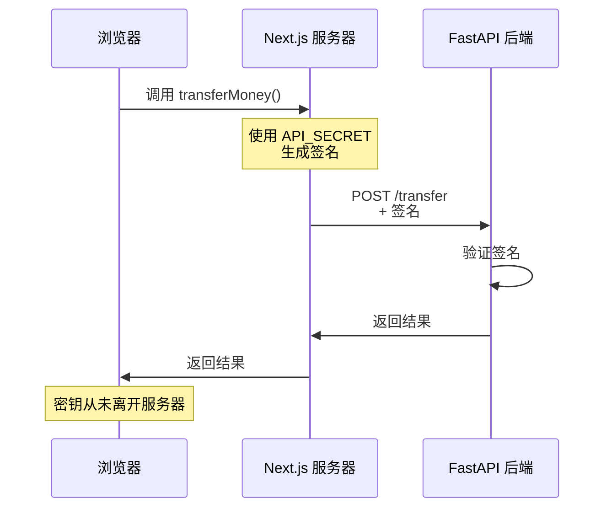

## 传统 spa+bff 层

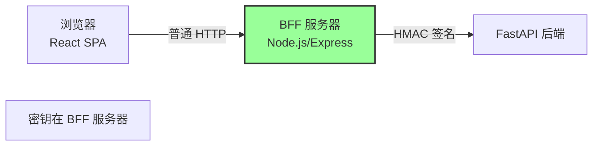

## 纯 spa+会话令牌

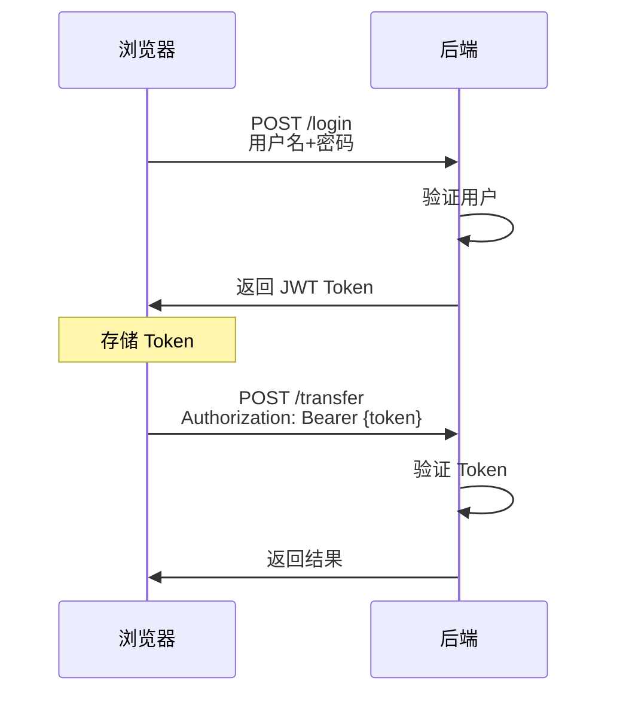

## 传统 spa 的安全方案

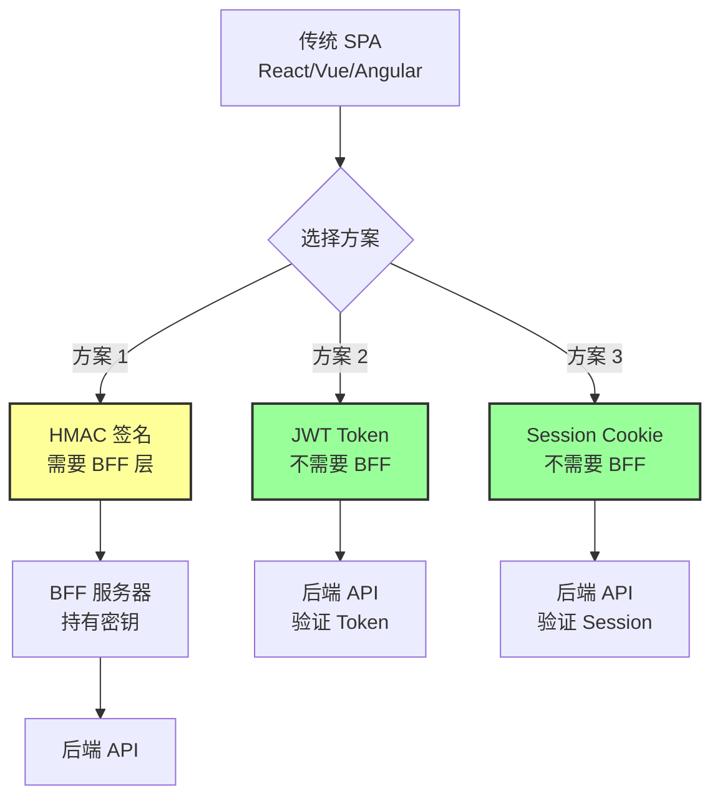

## 方案 1：HMAC + BFF（需要 BFF）

适用场景：服务器到服务器的通信

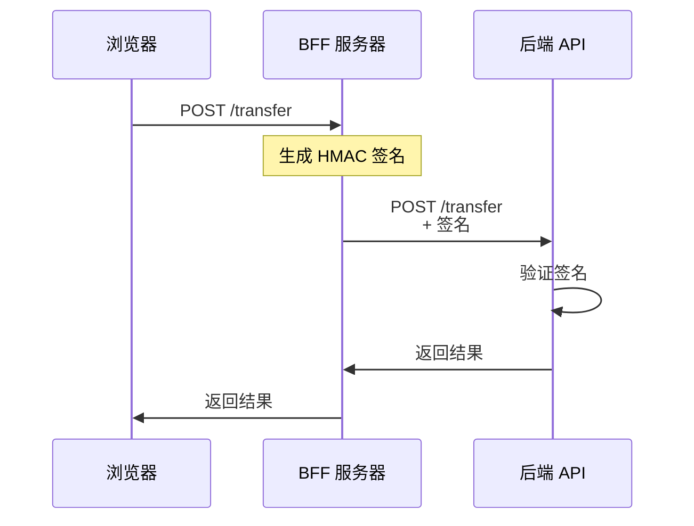

## 方案 2：JWT Token（不需要 BFF）⭐ 推荐

适用场景：用户登录后的操作（大多数场景）

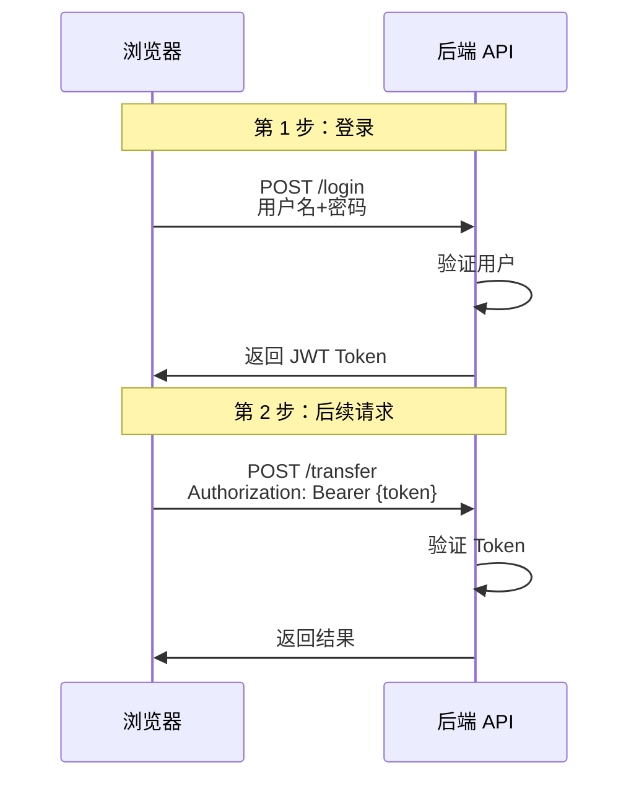

## 方案 3：Session Cookie（不需要 BFF）

适用场景：传统 Web 应用

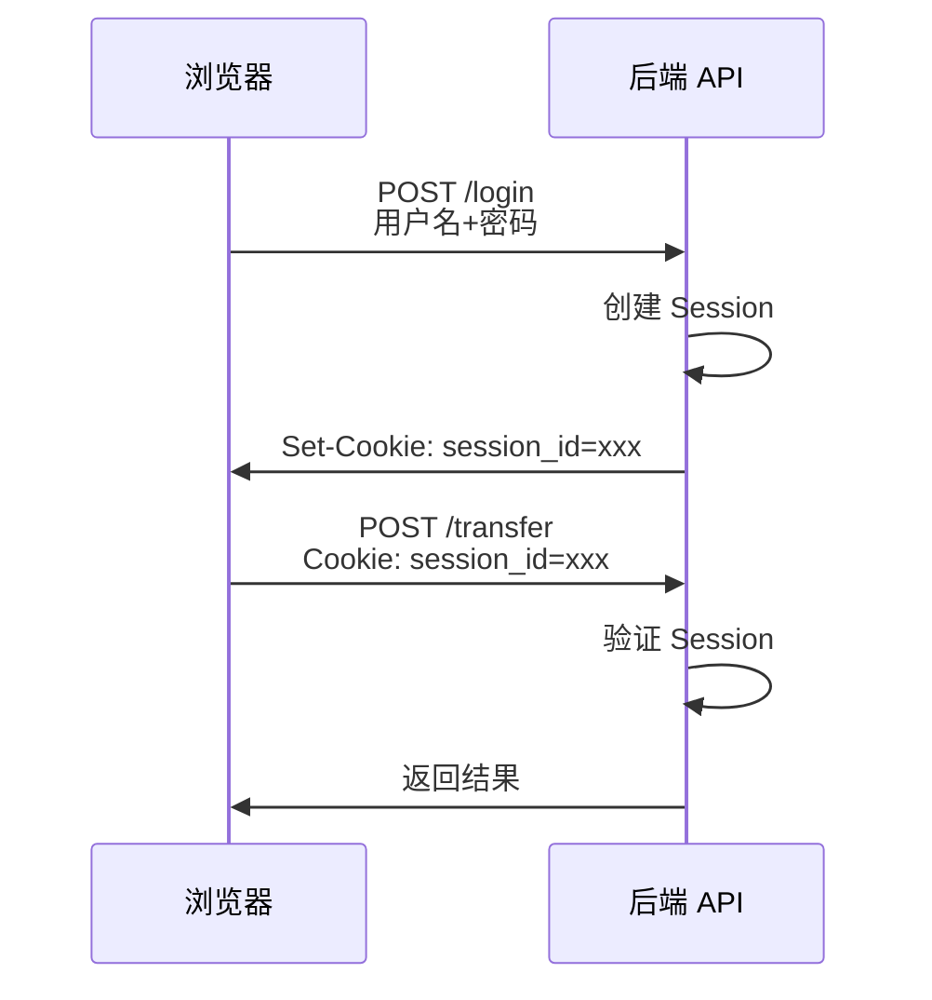

## 传统 SPA 的安全方案选择：

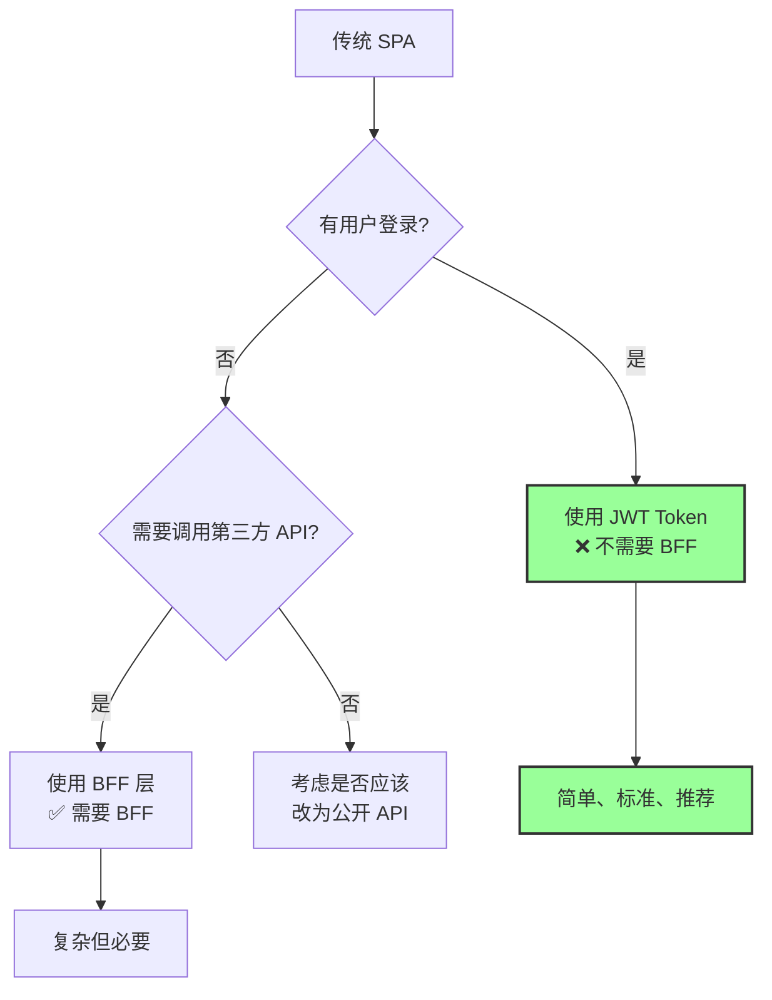

## 🎯 安全需求分级

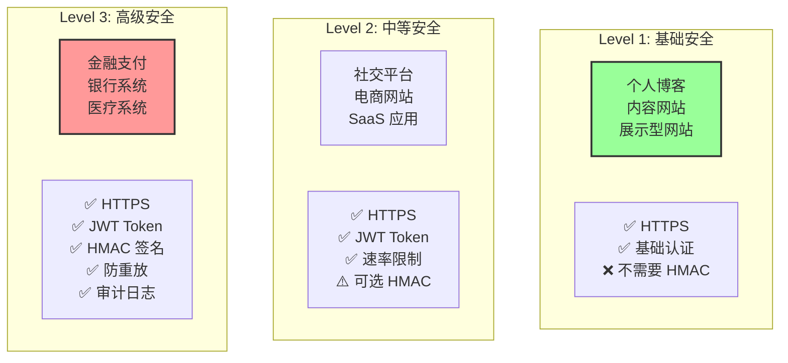

## 💡 你的博客项目应该用什么？

推荐方案：JWT Token

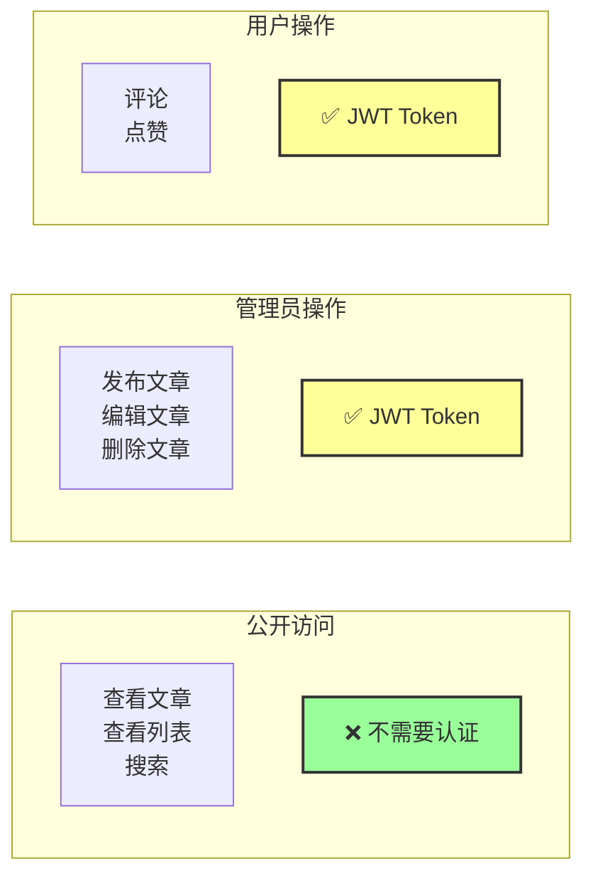

## 如何选择

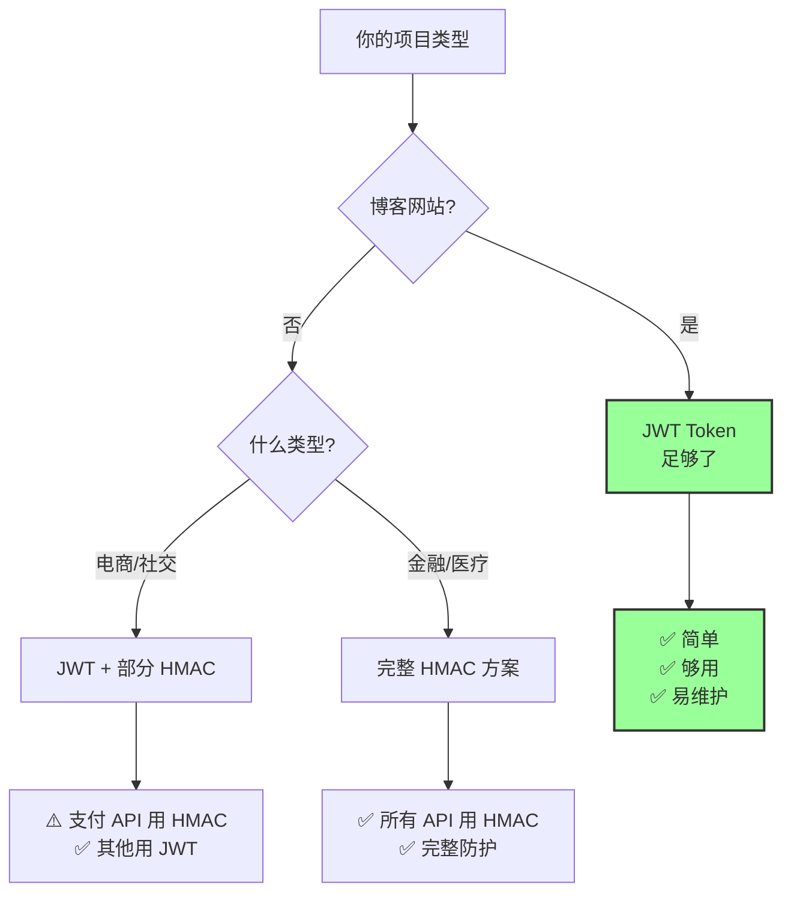
