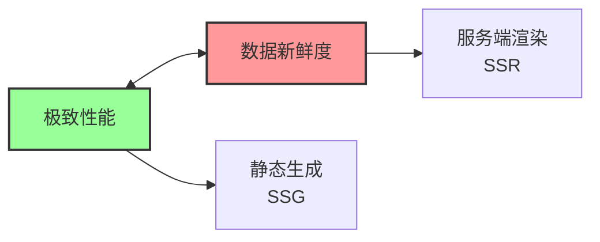
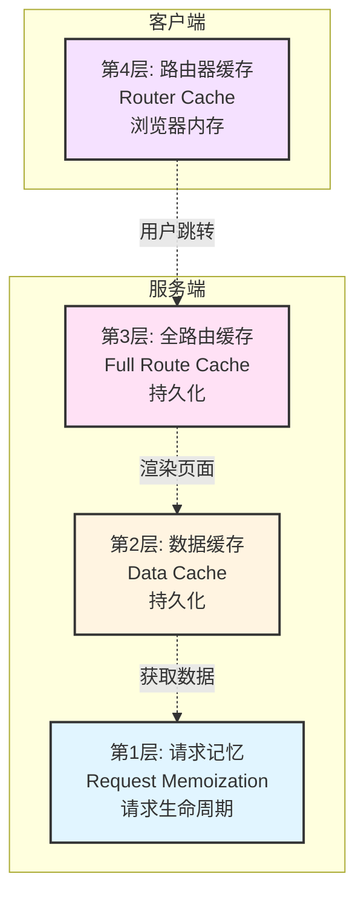
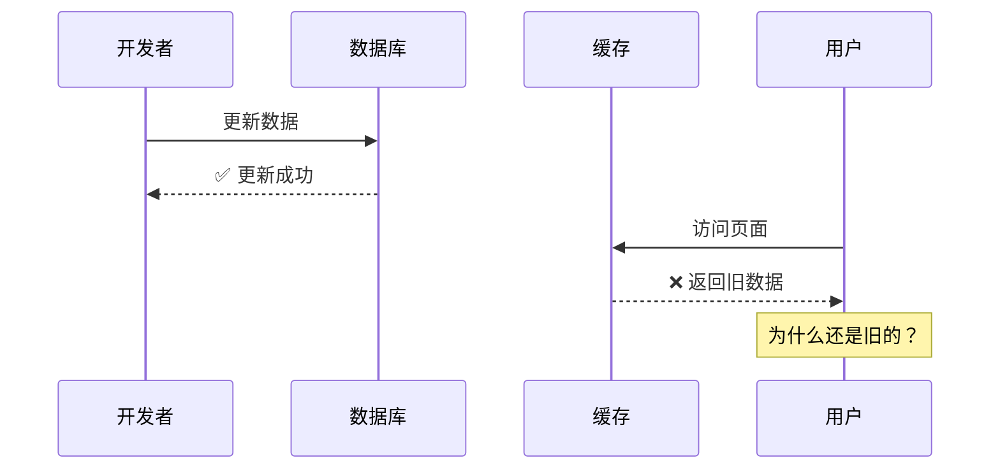
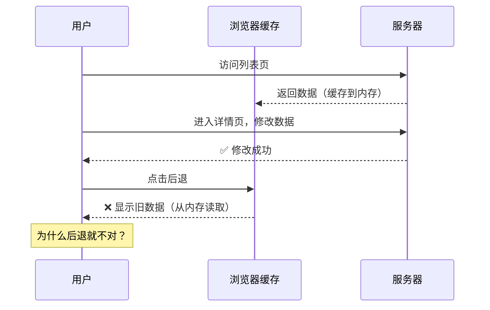
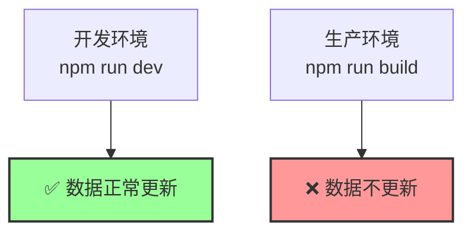

# Next.js 缓存机制 - 背景介绍

## 为什么 Next.js 的缓存这么复杂？

这是 Next.js (App Router) 中**最难理解的部分**，也是无数开发者（包括资深架构师）在深夜里抓狂的原因：

> **"为什么我的数据更新了，页面还是旧的？！"**

## 核心矛盾

Next.js 的缓存系统设计得极其激进且复杂，因为它试图在两个目标之间寻找平衡：

### 极致性能 vs 数据新鲜度

| 目标           | 实现方式         | 优点             | 缺点             |
| -------------- | ---------------- | ---------------- | ---------------- |
| **极致性能**   | 静态生成 (SSG)   | 速度快，CDN 友好 | 数据可能过期     |
| **数据新鲜度** | 服务端渲染 (SSR) | 数据永远最新     | 每次请求都要计算 |

## Next.js 的解决方案：四层缓存

Next.js 设计了一个**四层缓存模型**，每一层都有不同的作用和生命周期：

## 常见问题场景

### 场景 1：数据库更新了，但页面没变

**原因**：可能是第 2 层（数据缓存）或第 3 层（全路由缓存）在作祟。

---

### 场景 2：刷新页面正常，点后退按钮就不对

**原因**：第 4 层（路由器缓存）在浏览器内存中缓存了旧数据。

---

### 场景 3：开发环境正常，生产环境就不对

**原因**：开发环境和生产环境的缓存策略不同，生产环境会启用第 3 层（全路由缓存）。

---

## 为什么要理解这四层？

### 掌握四层缓存后，你能做到：

1. ✅ **快速定位问题**：数据不更新？立刻知道是哪一层的问题
2. ✅ **精准控制缓存**：知道何时该缓存，何时不该缓存
3. ✅ **优化性能**：合理使用缓存，让应用飞起来
4. ✅ **避免踩坑**：不再被"数据不更新"困扰

---

## 四层缓存概览

| 层级        | 名称       | 位置       | 生命周期 | 主要作用           |
| ----------- | ---------- | ---------- | -------- | ------------------ |
| **第 1 层** | 请求记忆   | 服务端内存 | 单次请求 | 去重，避免重复请求 |
| **第 2 层** | 数据缓存   | 服务端文件 | 持久化   | 缓存 API 数据      |
| **第 3 层** | 全路由缓存 | 服务端文件 | 持久化   | 缓存渲染结果       |
| **第 4 层** | 路由器缓存 | 浏览器内存 | 会话期间 | 客户端导航优化     |

---

## 学习路径

接下来，我们将逐层深入，彻底搞懂 Next.js 的缓存机制！

---

## 核心建议

在学习过程中，请记住：

1. **不要害怕**：缓存虽然复杂，但有规律可循
2. **逐层理解**：一次只关注一层，不要混淆
3. **动手实践**：看完每一层后，写代码验证
4. **查表排查**：遇到问题时，按四层顺序排查

让我们开始吧！
