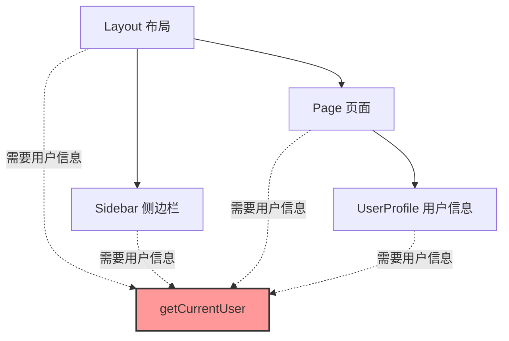
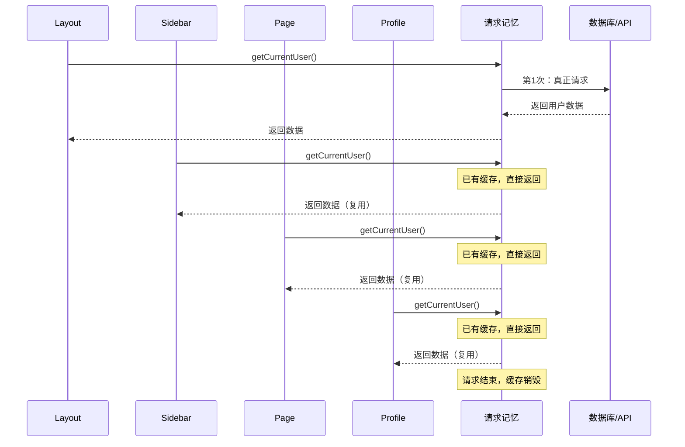
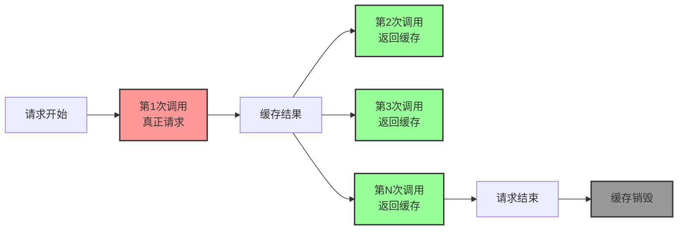
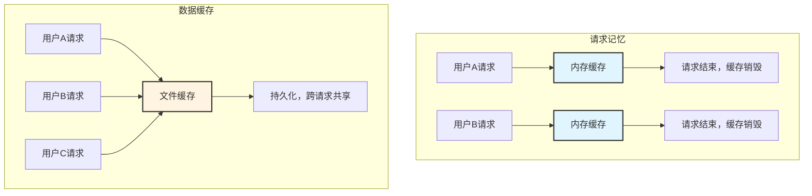
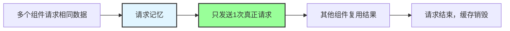

# 第 1 层：请求记忆 (Request Memoization)

## 基本信息

| 属性         | 值                 |
| ------------ | ------------------ |
| **位置**     | 服务端（内存）     |
| **持续时间** | 仅当前请求生命周期 |
| **缓存内容** | 函数返回值         |
| **失效时机** | 请求处理完成时     |

---

## 这是什么？

**请求记忆（Request Memoization）** 本质上是一个**去重机制**。

想象一下，你的页面结构是这样的：



这 4 个组件都需要获取"当前用户信息"，你可能会写 4 次 `await getCurrentUser()`。

---

## 问题：会发 4 次请求吗？

### 传统做法（React）

```typescript
// ❌ 传统 React 做法：Prop Drilling（属性钻取）
function Layout() {
  const user = await getCurrentUser(); // 第 1 次请求

  return (
    <>
      <Sidebar user={user} /> {/* 通过 props 传递 */}
      <Page user={user} /> {/* 通过 props 传递 */}
    </>
  );
}

function Sidebar({ user }) {
  return <div>{user.name}</div>;
}

function Page({ user }) {
  return <UserProfile user={user} />;
  {
    /* 继续传递 */
  }
}
```

**问题**：

- ❌ 代码冗长，需要一层层传递
- ❌ 中间组件被迫接收不需要的 props
- ❌ 难以维护

---

### Next.js 的做法（请求记忆）

```typescript
// ✅ Next.js 做法：直接在每个组件请求
async function Layout() {
  const user = await getCurrentUser(); // 第 1 次：真正请求
  return (
    <>
      <Sidebar />
      <Page />
    </>
  );
}

async function Sidebar() {
  const user = await getCurrentUser(); // 第 2 次：复用第 1 次的结果
  return <div>{user.name}</div>;
}

async function Page() {
  const user = await getCurrentUser(); // 第 3 次：复用第 1 次的结果
  return <UserProfile />;
}

async function UserProfile() {
  const user = await getCurrentUser(); // 第 4 次：复用第 1 次的结果
  return <div>{user.email}</div>;
}
```

**优势**：

- ✅ 代码简洁，每个组件独立获取数据
- ✅ 不需要 Prop Drilling
- ✅ 只发送 1 次真正的请求

---

## 工作原理



---

## 代码示例

### 示例 1：多个组件请求相同数据

```typescript
// lib/api.ts
export async function getCurrentUser() {
  console.log("🔍 真正发送请求到数据库");

  const res = await fetch("https://api.example.com/user", {
    headers: { Authorization: `Bearer ${token}` },
  });

  return res.json();
}

// app/layout.tsx
export default async function Layout({ children }) {
  const user = await getCurrentUser(); // 🔍 第 1 次：真正请求
  console.log("Layout:", user.name);

  return (
    <html>
      <body>
        <Sidebar />
        {children}
      </body>
    </html>
  );
}

// components/sidebar.tsx
export default async function Sidebar() {
  const user = await getCurrentUser(); // ✅ 第 2 次：复用
  console.log("Sidebar:", user.name);

  return <div>{user.name}</div>;
}

// app/page.tsx
export default async function Page() {
  const user = await getCurrentUser(); // ✅ 第 3 次：复用
  console.log("Page:", user.name);

  return <div>{user.email}</div>;
}
```

**控制台输出**：

```
🔍 真正发送请求到数据库  ← 只有这一次真正请求
Layout: John Doe
Sidebar: John Doe
Page: John Doe
```

---

### 示例 2：不同参数的请求

```typescript
// 相同函数，相同参数 → 复用
await getPost(1); // 第 1 次：真正请求
await getPost(1); // 第 2 次：复用
await getPost(1); // 第 3 次：复用

// 相同函数，不同参数 → 不复用
await getPost(1); // 真正请求
await getPost(2); // 真正请求（参数不同）
await getPost(3); // 真正请求（参数不同）
```

---

## 适用范围

### ✅ 自动生效的场景

```typescript
// 1. 使用 fetch（自动记忆）
await fetch("https://api.example.com/data");

// 2. 使用 React cache（手动记忆）
import { cache } from "react";

const getUser = cache(async (id: number) => {
  return await db.user.findUnique({ where: { id } });
});
```

### ❌ 不生效的场景

```typescript
// 1. 使用 axios（不会自动记忆）
await axios.get("https://api.example.com/data");

// 2. 直接使用数据库客户端（不会自动记忆）
await prisma.user.findMany();

// 3. 使用其他 HTTP 库
await got("https://api.example.com/data");
```

---

## 如何让非 fetch 请求也支持记忆？

### 使用 React cache

```typescript
import { cache } from "react";
import { prisma } from "@/lib/prisma";

// ✅ 包裹数据库查询
export const getUser = cache(async (id: number) => {
  console.log("🔍 真正查询数据库");
  return await prisma.user.findUnique({
    where: { id },
  });
});

// 使用
async function Component1() {
  const user = await getUser(1); // 🔍 第 1 次：真正查询
  return <div>{user.name}</div>;
}

async function Component2() {
  const user = await getUser(1); // ✅ 第 2 次：复用
  return <div>{user.email}</div>;
}
```

---

## 生命周期



**关键点**：

- ✅ 缓存只在**单次请求**内有效
- ✅ 请求结束后，缓存自动销毁
- ✅ 下一个用户的请求会重新开始

---

## 常见问题

### Q1: 会不会导致数据不一致？

**不会**。因为缓存只在单次请求内有效。

```typescript
// 用户 A 的请求
await getUser(1); // 查询数据库，得到 { name: 'Alice' }
await getUser(1); // 复用，返回 { name: 'Alice' }
// 请求结束，缓存销毁

// 用户 B 的请求（此时数据库中的数据已更新）
await getUser(1); // 重新查询数据库，得到 { name: 'Alice Updated' }
await getUser(1); // 复用，返回 { name: 'Alice Updated' }
// 请求结束，缓存销毁
```

---

### Q2: 如何禁用请求记忆？

**通常不需要禁用**，因为它只在单次请求内有效，不会导致数据过期。

如果确实需要禁用：

```typescript
// 方法 1：使用 AbortController（每次创建新的信号）
await fetch(url, { signal: AbortSignal.timeout(5000) });

// 方法 2：添加随机参数
await fetch(`${url}?_=${Date.now()}`);

// 方法 3：使用 cache: 'no-store'
await fetch(url, { cache: "no-store" });
```

---

### Q3: 请求记忆和数据缓存有什么区别？

| 特性         | 请求记忆（第 1 层） | 数据缓存（第 2 层） |
| ------------ | ------------------- | ------------------- |
| **生命周期** | 单次请求            | 持久化（跨请求）    |
| **存储位置** | 内存                | 文件系统            |
| **作用范围** | 当前请求的所有组件  | 所有用户的所有请求  |
| **失效时机** | 请求结束            | 手动失效或过期      |



---

## 架构师视点

### 优势

1. ✅ **性能优化**：避免重复请求，减少数据库压力
2. ✅ **代码简洁**：不需要 Prop Drilling
3. ✅ **组件独立**：每个组件可以独立获取数据
4. ✅ **自动化**：无需手动管理缓存

### 注意事项

1. ⚠️ **只对 fetch 自动生效**：其他 HTTP 库需要手动使用 `cache()`
2. ⚠️ **参数必须相同**：不同参数会触发新请求
3. ⚠️ **仅限服务端**：客户端组件不支持

---

## 总结

**请求记忆（Request Memoization）** 是 Next.js 缓存的第一层，它的作用是：



**核心要点**：

- ✅ 自动去重，避免重复请求
- ✅ 只在单次请求内有效
- ✅ 请求结束后自动销毁
- ✅ 不会导致数据过期问题

**下一步**：了解第 2 层 - 数据缓存（Data Cache），它会跨请求持久化数据。
