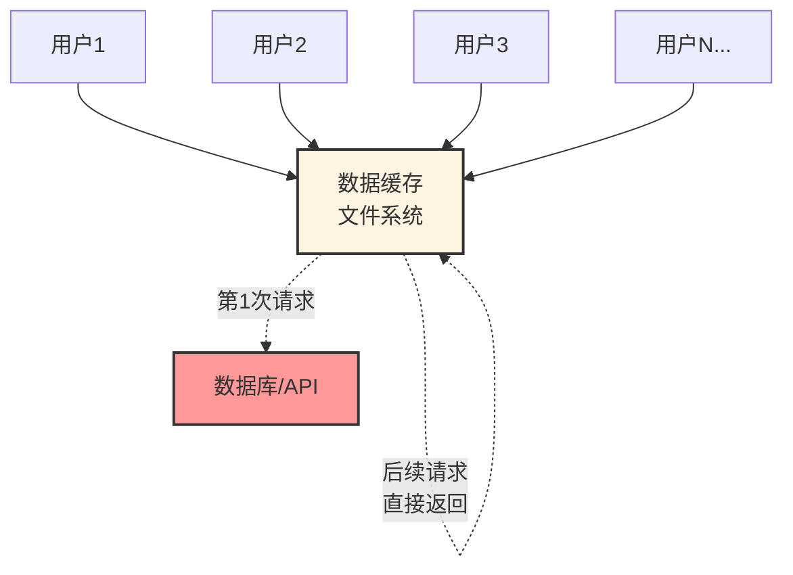
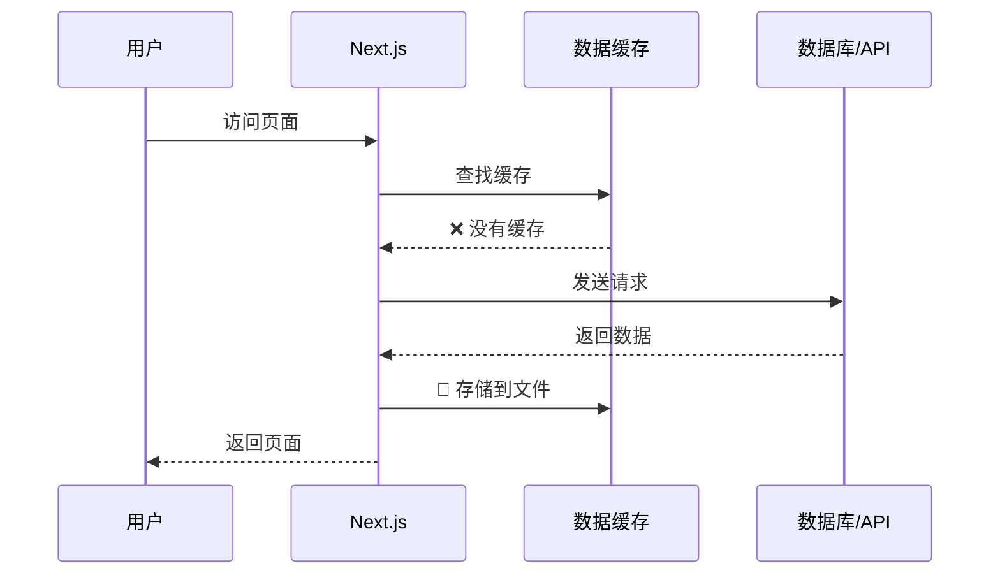
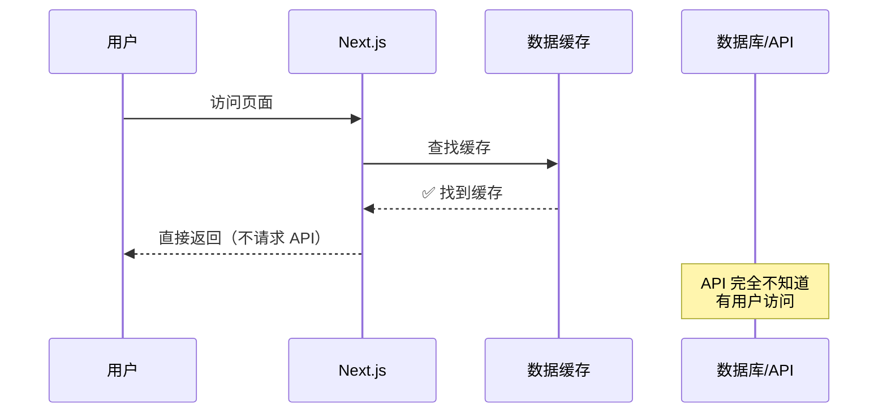
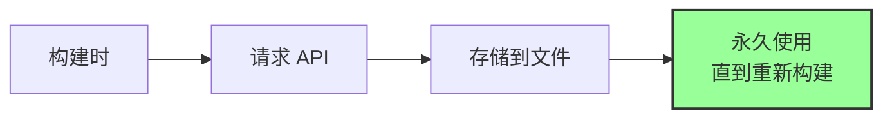
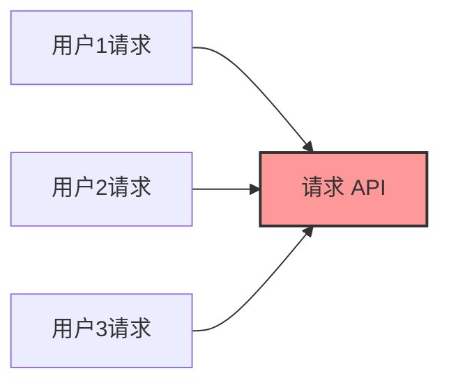
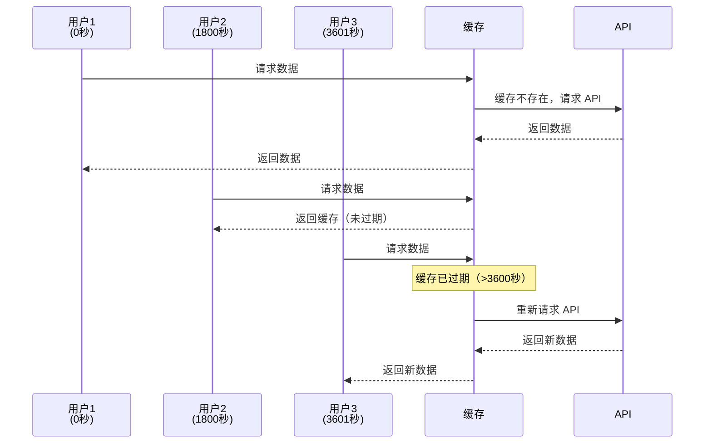
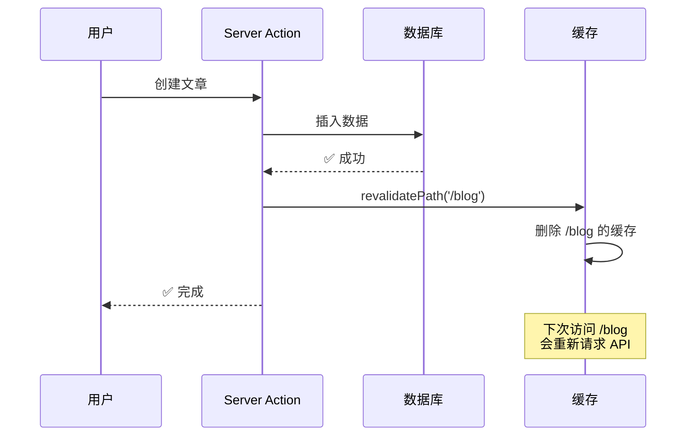
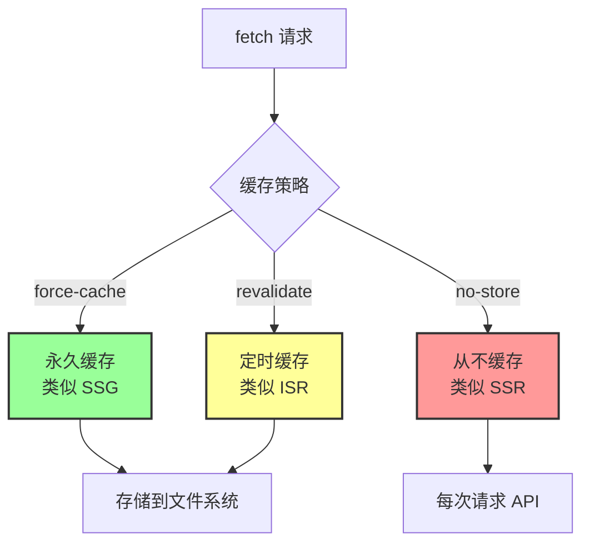

# 第 2 层：数据缓存 (Data Cache)

## 基本信息

| 属性         | 值                                            |
| ------------ | --------------------------------------------- |
| **位置**     | 服务端（文件系统）                            |
| **持续时间** | 持久化（跨请求、跨部署）                      |
| **缓存内容** | API 响应数据 (JSON)                           |
| **失效时机** | `revalidate` 时间到 或 `revalidateTag` 被调用 |

---

## 这是什么？

**数据缓存（Data Cache）** 是 Next.js **魔改 `fetch`** 的核心产物。

它把外部 API 的响应结果存成文件。即便 1000 个用户来访问，如果缓存没过期，Next.js 甚至不会向你的数据库发请求，直接读文件返回。



---

## 工作原理

### 第一次请求



### 后续请求



---

## 三种缓存策略

### 1. 永久缓存（默认）

```typescript
// ✅ 默认行为：永久缓存
const res = await fetch("https://api.example.com/posts");

// 等价于
const res = await fetch("https://api.example.com/posts", {
  cache: "force-cache", // 默认值
});
```

**效果**：类似 SSG（静态站点生成）



**适用场景**：

- ✅ 博客文章（很少更新）
- ✅ 产品文档
- ✅ 静态内容

---

### 2. 从不缓存

```typescript
// ❌ 禁用缓存
const res = await fetch("https://api.example.com/posts", {
  cache: "no-store",
});
```

**效果**：类似 SSR（服务端渲染）



**适用场景**：

- ✅ 实时数据（股票价格）
- ✅ 用户个人信息
- ✅ 购物车

---

### 3. 定时缓存（推荐）

```typescript
// ✅ 推荐：定时重新验证
const res = await fetch("https://api.example.com/posts", {
  next: { revalidate: 3600 }, // 每小时更新一次
});
```

**效果**：类似 ISR（增量静态再生成）



**适用场景**：

- ✅ 新闻列表（每小时更新）
- ✅ 产品列表（每天更新）
- ✅ 评论列表（每分钟更新）

---

## 代码示例

### 示例 1：博客文章列表（定时缓存）

```typescript
// app/blog/page.tsx
export default async function BlogPage() {
  // 每小时重新验证一次
  const res = await fetch("https://api.example.com/posts", {
    next: { revalidate: 3600 },
  });

  const posts = await res.json();

  return (
    <div>
      {posts.map((post) => (
        <article key={post.id}>
          <h2>{post.title}</h2>
          <p>{post.excerpt}</p>
        </article>
      ))}
    </div>
  );
}
```

---

### 示例 2：用户个人信息（从不缓存）

```typescript
// app/profile/page.tsx
export default async function ProfilePage() {
  // 每次都重新获取
  const res = await fetch("https://api.example.com/user/me", {
    cache: "no-store",
    headers: {
      Authorization: `Bearer ${token}`,
    },
  });

  const user = await res.json();

  return (
    <div>
      <h1>{user.name}</h1>
      <p>{user.email}</p>
    </div>
  );
}
```

---

### 示例 3：产品列表（永久缓存）

```typescript
// app/products/page.tsx
export default async function ProductsPage() {
  // 永久缓存（默认）
  const res = await fetch("https://api.example.com/products");

  const products = await res.json();

  return (
    <div>
      {products.map((product) => (
        <div key={product.id}>
          <h3>{product.name}</h3>
          <p>${product.price}</p>
        </div>
      ))}
    </div>
  );
}
```

---

## 手动失效缓存

### 方法 1：按路径失效（revalidatePath）

```typescript
// app/actions.ts
"use server";

import { revalidatePath } from "next/cache";

export async function createPost(formData: FormData) {
  // 1. 创建文章
  await db.post.create({
    data: {
      title: formData.get("title"),
      content: formData.get("content"),
    },
  });

  // 2. 失效缓存
  revalidatePath("/blog"); // 失效博客列表页
  revalidatePath("/"); // 失效首页
}
```

**效果**：



---

### 方法 2：按标签失效（revalidateTag）- 推荐

```typescript
// 1. 请求时打标签
const res = await fetch('https://api.example.com/posts', {
  next: {
    revalidate: 3600,
    tags: ['posts'] // 打标签
  }
});

// 2. 更新时失效标签
'use server';

import { revalidateTag } from 'next/cache';

export async function createPost(formData: FormData) {
  await db.post.create({ data: { ... } });

  // 失效所有带 'posts' 标签的缓存
  revalidateTag('posts');
}
```

**优势**：

```mermaid
graph TB
    Tag[标签: posts]

    API1[/api/posts] -.打标签.-> Tag
    API2[/api/posts/featured] -.打标签.-> Tag
    API3[/api/posts/recent] -.打标签.-> Tag

    Action[revalidateTag] --> Tag
    Tag -.失效.-> API1
    Tag -.失效.-> API2
    Tag -.失效.-> API3

    style Tag fill:#f99,stroke:#333,stroke-width:2px
    style Action fill:#9f9,stroke:#333,stroke-width:2px
```

**一次失效多个相关缓存**！

---

## 架构陷阱

### ⚠️ 非 fetch 请求不会自动缓存

```typescript
// ❌ 这些不会被缓存
import axios from "axios";
import { prisma } from "@/lib/prisma";

// 1. axios
const res = await axios.get("https://api.example.com/posts");

// 2. Prisma
const posts = await prisma.post.findMany();

// 3. 其他 HTTP 库
const res = await got("https://api.example.com/posts");
```

---

### ✅ 解决方案：使用 unstable_cache

```typescript
import { unstable_cache } from "next/cache";
import { prisma } from "@/lib/prisma";

// 包裹数据库查询
export const getPosts = unstable_cache(
  async () => {
    return await prisma.post.findMany();
  },
  ["posts"], // 缓存键
  {
    revalidate: 3600, // 每小时更新
    tags: ["posts"], // 标签
  }
);

// 使用
const posts = await getPosts();
```

---

## 常见问题

### Q1: 如何查看缓存是否生效？

**方法 1：查看日志**

```typescript
export default async function Page() {
  console.log("🔍 开始请求 API");

  const res = await fetch("https://api.example.com/posts", {
    next: { revalidate: 60 },
  });

  console.log("✅ 请求完成");

  return <div>...</div>;
}
```

**如果缓存生效**：

- 第 1 次访问：看到两条日志
- 第 2 次访问：看不到日志（使用缓存）

---

**方法 2：查看 .next 目录**

```bash
# 构建后查看缓存文件
npm run build

# 查看缓存目录
ls -la .next/cache/fetch-cache/
```

---

### Q2: 开发环境和生产环境的缓存行为一样吗？

**不一样！**

| 环境                           | 默认行为           |
| ------------------------------ | ------------------ |
| **开发环境** (`npm run dev`)   | 不缓存（方便调试） |
| **生产环境** (`npm run build`) | 完全缓存           |

**建议**：

- 开发时不用担心缓存
- 部署前一定要测试生产构建：`npm run build && npm start`

---

### Q3: 如何在整个页面禁用数据缓存？

```typescript
// app/page.tsx
export const dynamic = "force-dynamic";

export default async function Page() {
  // 这个页面的所有 fetch 都不会缓存
  const res = await fetch("https://api.example.com/posts");
  return <div>...</div>;
}
```

---

### Q4: revalidatePath 和 revalidateTag 有什么区别？

| 特性       | revalidatePath  | revalidateTag |
| ---------- | --------------- | ------------- |
| **粒度**   | 按页面路径      | 按数据标签    |
| **精准度** | 粗糙            | 精准          |
| **推荐度** | ⚠️ 适合简单场景 | ✅ 推荐       |

**示例**：

```typescript
// revalidatePath：失效整个页面
revalidatePath("/blog"); // 失效 /blog 页面的所有数据

// revalidateTag：只失效特定数据
revalidateTag("posts"); // 只失效带 'posts' 标签的数据
```

---

## 实战案例

### 案例：博客系统

```typescript
// lib/api.ts
export async function getPosts() {
  const res = await fetch('https://api.example.com/posts', {
    next: {
      revalidate: 3600, // 每小时更新
      tags: ['posts'] // 打标签
    }
  });
  return res.json();
}

export async function getPost(id: string) {
  const res = await fetch(`https://api.example.com/posts/${id}`, {
    next: {
      revalidate: 3600,
      tags: ['posts', `post-${id}`] // 多个标签
    }
  });
  return res.json();
}

// app/actions.ts
'use server';

import { revalidateTag } from 'next/cache';

export async function createPost(formData: FormData) {
  // 1. 创建文章
  await db.post.create({ data: { ... } });

  // 2. 失效列表缓存
  revalidateTag('posts');
}

export async function updatePost(id: string, formData: FormData) {
  // 1. 更新文章
  await db.post.update({ where: { id }, data: { ... } });

  // 2. 失效列表和详情缓存
  revalidateTag('posts');
  revalidateTag(`post-${id}`);
}
```

---

## 总结

**数据缓存（Data Cache）** 是 Next.js 缓存的第二层：



**核心要点**：

- ✅ 持久化缓存，跨请求共享
- ✅ 三种策略：永久、从不、定时
- ✅ 使用 `revalidateTag` 精准失效
- ⚠️ 只对 `fetch` 自动生效

**下一步**：了解第 3 层 - 全路由缓存（Full Route Cache），它会缓存整个页面的渲染结果。
