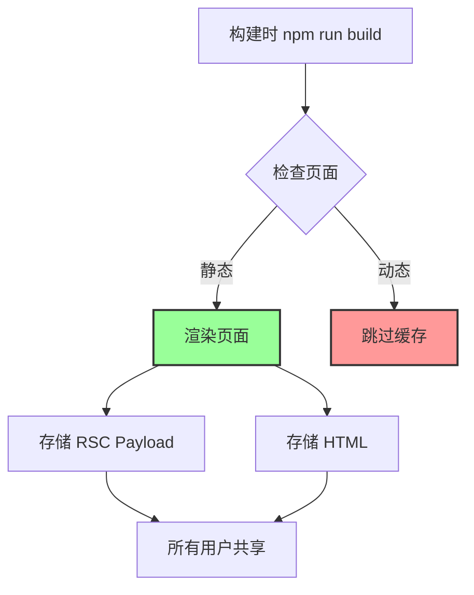
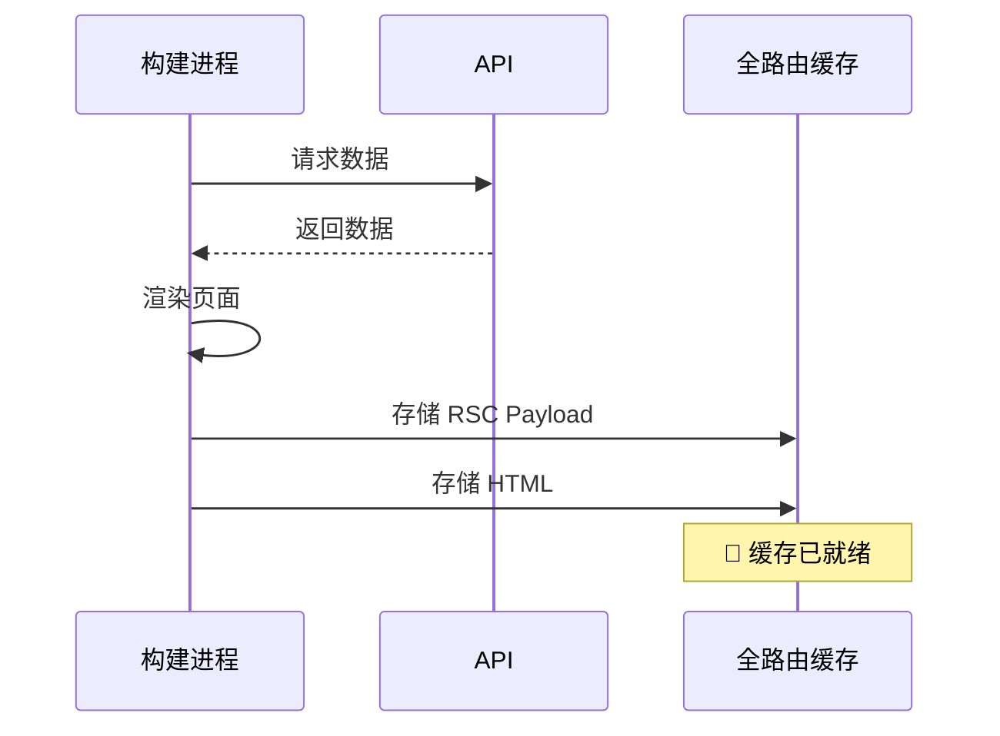
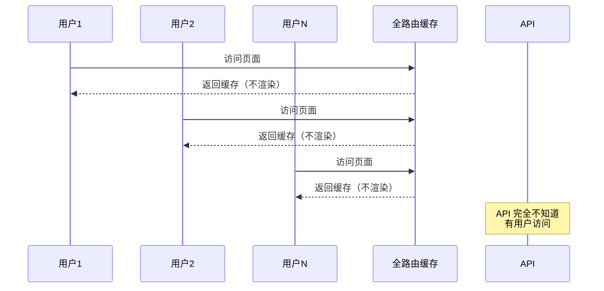
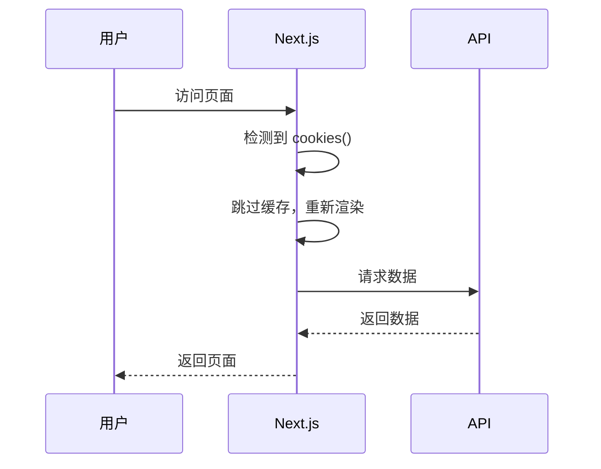
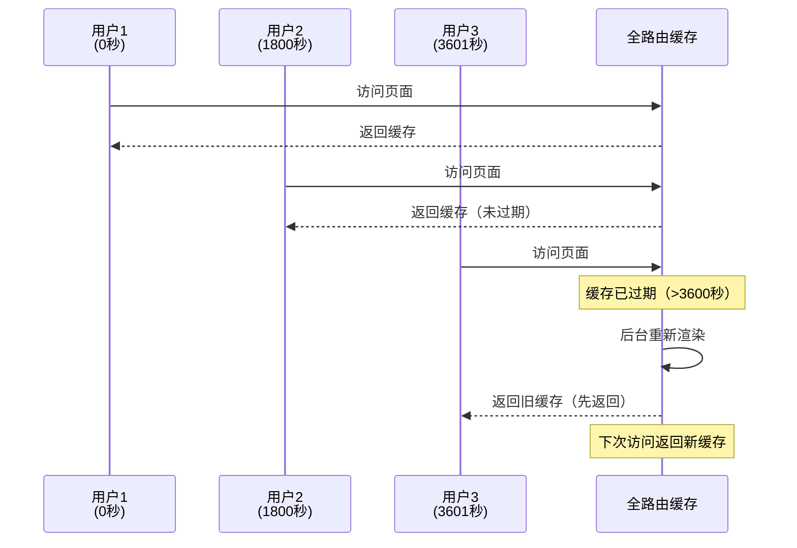
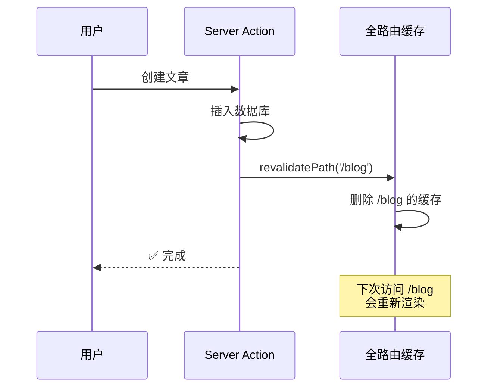
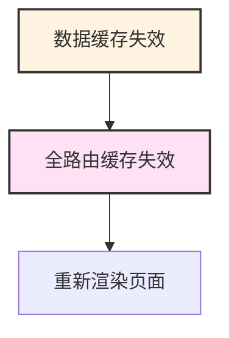
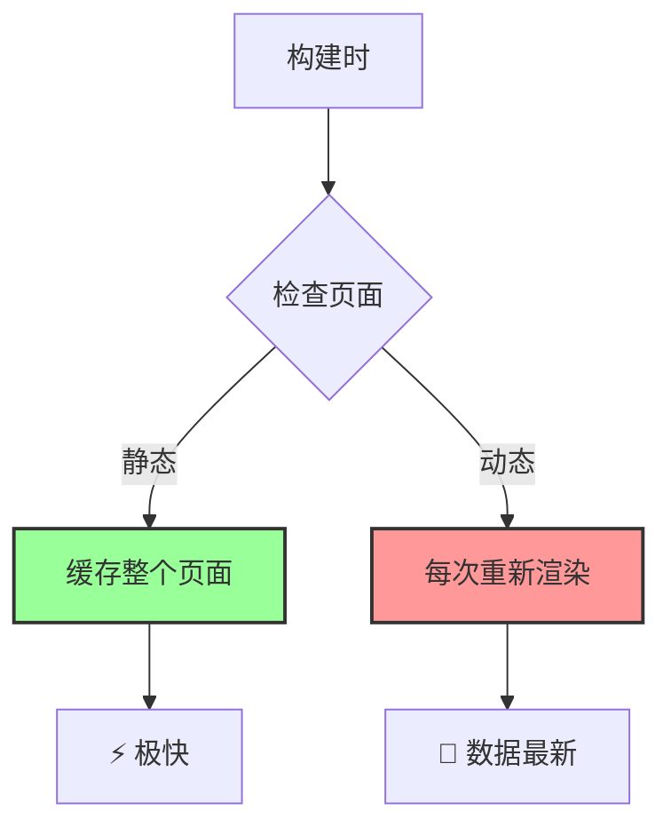

# 第 3 层：全路由缓存 (Full Route Cache)

## 基本信息

| 属性         | 值                                  |
| ------------ | ----------------------------------- |
| **位置**     | 服务端（文件系统）                  |
| **持续时间** | 持久化（直到重新构建或再验证）      |
| **缓存内容** | RSC Payload + HTML                  |
| **失效时机** | 重新部署 (Build) 或 Data Cache 失效 |

---

## 这是什么？

**全路由缓存（Full Route Cache）** 缓存的是**整个页面的渲染结果**。

Next.js 在构建（Build）时，如果发现你的页面：

1. 没有使用动态函数（如 `cookies()`, `headers()`, `searchParams`）
2. 数据也是静态的（或有 `revalidate`）

它就会把整个页面渲染好存起来，包括：

- **RSC Payload**：React 服务端组件的序列化数据
- **HTML**：最终的 HTML 页面



---

## 工作原理

### 静态页面（会被缓存）

```typescript
// app/blog/page.tsx
export default async function BlogPage() {
  // 没有使用动态函数
  const res = await fetch("https://api.example.com/posts", {
    next: { revalidate: 3600 },
  });

  const posts = await res.json();

  return (
    <div>
      {posts.map((post) => (
        <article key={post.id}>
          <h2>{post.title}</h2>
        </article>
      ))}
    </div>
  );
}
```

**构建时**：



**用户访问时**：



---

### 动态页面（不会被缓存）

```typescript
// app/profile/page.tsx
import { cookies } from "next/headers";

export default async function ProfilePage() {
  // ✅ 使用了动态函数
  const token = cookies().get("token")?.value;

  const res = await fetch("https://api.example.com/user/me", {
    headers: { Authorization: `Bearer ${token}` },
  });

  const user = await res.json();

  return <div>{user.name}</div>;
}
```

**每次访问都会重新渲染**：



---

## 如何判断页面是否被缓存？

### 方法 1：查看构建日志

```bash
npm run build
```

**输出示例**：

```
Route (app)                              Size     First Load JS
┌ ○ /                                    5 kB       87.2 kB
├ ○ /blog                                3 kB       85.2 kB
├ ƒ /profile                             2 kB       84.2 kB
└ ○ /about                               1 kB       83.2 kB

○  (Static)  automatically rendered as static HTML (uses no initial props)
ƒ  (Dynamic) server-rendered on demand
```

**图标含义**：

- `○` (Static)：**被缓存**，构建时渲染
- `ƒ` (Dynamic)：**不缓存**，每次请求时渲染

---

### 方法 2：查看 .next 目录

```bash
# 构建后查看
ls -la .next/server/app/

# 静态页面会有 .html 和 .rsc 文件
blog.html          # HTML 缓存
blog.rsc           # RSC Payload 缓存

# 动态页面只有 .js 文件
profile.js         # 运行时代码（无缓存）
```

---

## 动态函数列表

使用以下任何函数，页面都会变成动态的（不缓存）：

```typescript
// 1. cookies
import { cookies } from "next/headers";
const token = cookies().get("token");

// 2. headers
import { headers } from "next/headers";
const userAgent = headers().get("user-agent");

// 3. searchParams (Page 组件)
export default function Page({ searchParams }) {
  const query = searchParams.q;
}

// 4. 动态路由参数 (没有 generateStaticParams)
export default function Page({ params }) {
  const id = params.id;
}
```

---

## 如何控制缓存？

### 方法 1：使用动态函数

```typescript
// app/blog/page.tsx
import { cookies } from "next/headers";

export default async function BlogPage() {
  // ✅ 读取 cookies，页面变成动态的
  cookies();

  const res = await fetch("https://api.example.com/posts");
  const posts = await res.json();

  return <div>...</div>;
}
```

---

### 方法 2：配置 dynamic

```typescript
// app/blog/page.tsx

// ✅ 强制动态渲染
export const dynamic = "force-dynamic";

export default async function BlogPage() {
  // 即使没有使用动态函数，也会每次重新渲染
  const res = await fetch("https://api.example.com/posts");
  const posts = await res.json();

  return <div>...</div>;
}
```

**配置选项**：

| 值                | 说明                 |
| ----------------- | -------------------- |
| `'auto'`          | 默认，自动判断       |
| `'force-dynamic'` | 强制动态（不缓存）   |
| `'force-static'`  | 强制静态（缓存）     |
| `'error'`         | 如果有动态函数就报错 |

---

### 方法 3：配置 revalidate

```typescript
// app/blog/page.tsx

// ✅ 定时重新验证
export const revalidate = 3600; // 每小时

export default async function BlogPage() {
  const res = await fetch("https://api.example.com/posts");
  const posts = await res.json();

  return <div>...</div>;
}
```

**效果**：



---

## 常见问题场景

### 场景 1：部署后页面不更新

**问题**：

```typescript
// app/blog/page.tsx
export default async function BlogPage() {
  const res = await fetch("https://api.example.com/posts");
  const posts = await res.json();

  return <div>...</div>;
}
```

**现象**：

1. 在数据库添加新文章
2. 刷新页面，还是看不到新文章
3. 重新部署（`npm run build`），才能看到

**原因**：页面被全路由缓存了，构建时渲染的结果一直在用。

**解决方案**：

```typescript
// 方案 1：添加 revalidate
export const revalidate = 60; // 每分钟更新

// 方案 2：使用 no-store
const res = await fetch("https://api.example.com/posts", {
  cache: "no-store",
});

// 方案 3：强制动态
export const dynamic = "force-dynamic";
```

---

### 场景 2：开发环境正常，生产环境不对

**问题**：

```typescript
// app/posts/[id]/page.tsx
export default async function PostPage({ params }) {
  const res = await fetch(`https://api.example.com/posts/${params.id}`);
  const post = await res.json();

  return <div>{post.title}</div>;
}
```

**现象**：

- 开发环境（`npm run dev`）：数据正常更新
- 生产环境（`npm run build`）：数据不更新

**原因**：

- 开发环境不缓存
- 生产环境会缓存所有静态路由

**解决方案**：

```typescript
// 方案 1：添加 generateStaticParams（预渲染部分页面）
export async function generateStaticParams() {
  const posts = await fetch("https://api.example.com/posts").then((r) =>
    r.json()
  );

  return posts.slice(0, 10).map((post) => ({
    id: post.id,
  }));
}

// 方案 2：强制动态
export const dynamic = "force-dynamic";

// 方案 3：添加 revalidate
export const revalidate = 60;
```

---

## 手动失效缓存

### 使用 revalidatePath

```typescript
// app/actions.ts
'use server';

import { revalidatePath } from 'next/cache';

export async function createPost(formData: FormData) {
  // 1. 创建文章
  await db.post.create({ data: { ... } });

  // 2. 失效全路由缓存
  revalidatePath('/blog'); // 失效 /blog 页面
  revalidatePath('/'); // 失效首页
}
```

**效果**：



---

## 与数据缓存的关系

**全路由缓存依赖数据缓存**：



**示例**：

```typescript
// 1. 数据缓存
const res = await fetch("https://api.example.com/posts", {
  next: {
    revalidate: 3600,
    tags: ["posts"],
  },
});

// 2. 失效数据缓存
revalidateTag("posts");

// 3. 数据缓存失效 → 全路由缓存也失效
// 下次访问页面会重新渲染
```

---

## 实战建议

### 对于博客/文档站（内容不常更新）

```typescript
// ✅ 使用静态生成 + 定时重新验证
export const revalidate = 3600; // 每小时

export default async function BlogPage() {
  const res = await fetch("https://api.example.com/posts");
  const posts = await res.json();

  return <div>...</div>;
}
```

---

### 对于管理后台（内容频繁更新）

```typescript
// ✅ 强制动态渲染
export const dynamic = "force-dynamic";

export default async function AdminPage() {
  const res = await fetch("https://api.example.com/posts");
  const posts = await res.json();

  return <div>...</div>;
}
```

---

### 对于电商网站（部分静态，部分动态）

```typescript
// 产品列表：静态 + 定时更新
// app/products/page.tsx
export const revalidate = 3600;

export default async function ProductsPage() {
  const res = await fetch("https://api.example.com/products");
  const products = await res.json();

  return <div>...</div>;
}

// 购物车：动态
// app/cart/page.tsx
export const dynamic = "force-dynamic";

export default async function CartPage() {
  const res = await fetch("https://api.example.com/cart", {
    cache: "no-store",
  });
  const cart = await res.json();

  return <div>...</div>;
}
```

---

## 总结

**全路由缓存（Full Route Cache）** 是 Next.js 缓存的第三层：



**核心要点**：

- ✅ 缓存整个页面的渲染结果
- ✅ 使用动态函数会跳过缓存
- ✅ 使用 `revalidate` 定时更新
- ⚠️ 开发环境和生产环境行为不同

**下一步**：了解第 4 层 - 路由器缓存（Router Cache），它在浏览器端缓存页面。
