# 第 4 层：路由器缓存 (Router Cache)

## 基本信息

| 属性         | 值                                     |
| ------------ | -------------------------------------- |
| **位置**     | 客户端（浏览器内存）                   |
| **持续时间** | 用户会话期间（30 秒 - 5 分钟）         |
| **缓存内容** | RSC Payload                            |
| **失效时机** | 页面刷新、时间过期、`router.refresh()` |

---

## 这是什么？

**路由器缓存（Router Cache）** 是导致 **"我明明更新了数据库，页面也没报错，但数据就是没变"** 的罪魁祸首。

当用户在你的网站内跳转（点击 `<Link>`）时，Next.js 会把访问过的页面 Payload 存在浏览器的内存里。

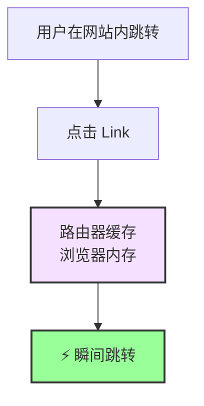

---

## 工作原理

### 第一次访问

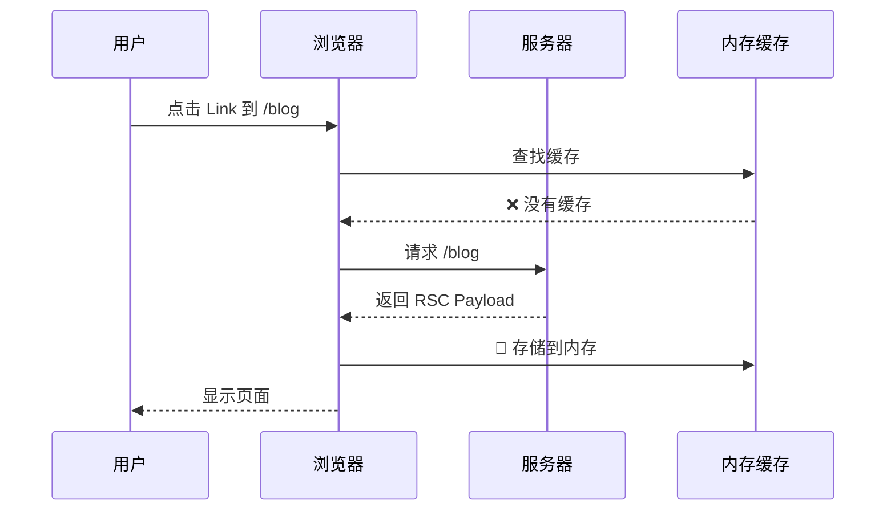

### 后续访问（30 秒内）

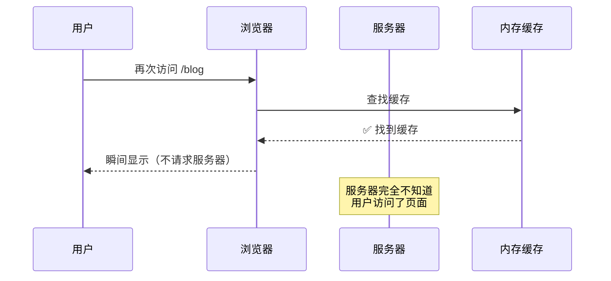

---

## 缓存时长

| 页面类型     | 缓存时长 |
| ------------ | -------- |
| **静态页面** | 5 分钟   |
| **动态页面** | 30 秒    |

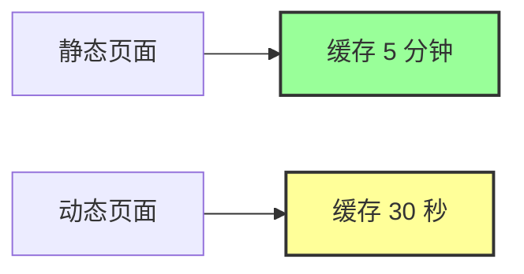

---

## 经典问题场景

### 场景 1：点击后退，数据是旧的

**操作流程**：

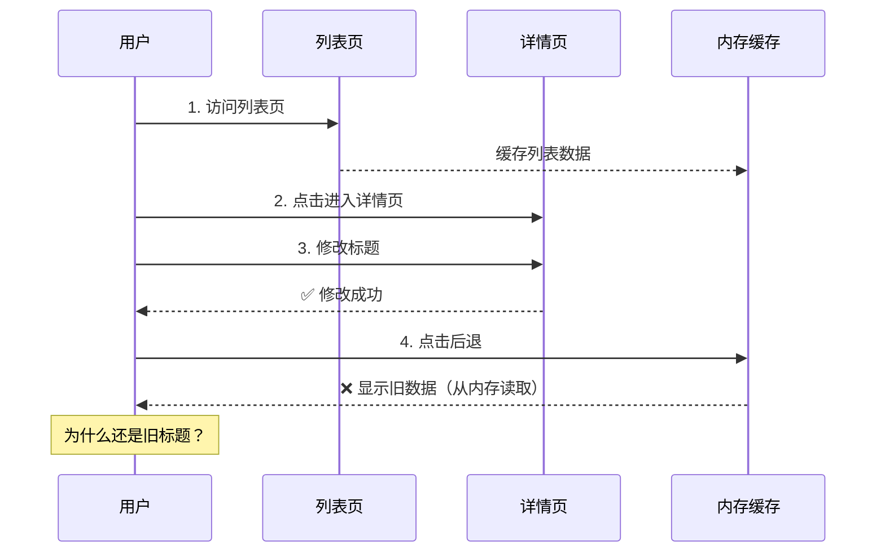

**代码示例**：

```typescript
// app/posts/page.tsx - 列表页
export default async function PostsPage() {
  const res = await fetch("https://api.example.com/posts");
  const posts = await res.json();

  return (
    <div>
      {posts.map((post) => (
        <Link key={post.id} href={`/posts/${post.id}`}>
          <h2>{post.title}</h2> {/* 旧标题 */}
        </Link>
      ))}
    </div>
  );
}

// app/posts/[id]/page.tsx - 详情页
export default async function PostPage({ params }) {
  const res = await fetch(`https://api.example.com/posts/${params.id}`);
  const post = await res.json();

  return <div>{post.title}</div>;
}

// app/posts/[id]/edit/page.tsx - 编辑页
("use client");

export default function EditPage() {
  const router = useRouter();

  async function handleSubmit(formData: FormData) {
    // 1. 更新文章
    await fetch(`/api/posts/${id}`, {
      method: "PUT",
      body: formData,
    });

    // 2. 返回列表页
    router.back(); // ❌ 问题：列表页显示旧数据
  }

  return <form onSubmit={handleSubmit}>...</form>;
}
```

**问题**：

- 列表页的数据被缓存在浏览器内存中
- 点击后退时，直接从内存读取，不请求服务器
- 所以看到的还是旧标题

---

### 场景 2：在新标签页打开正常，在当前页跳转就不对

**操作流程**：

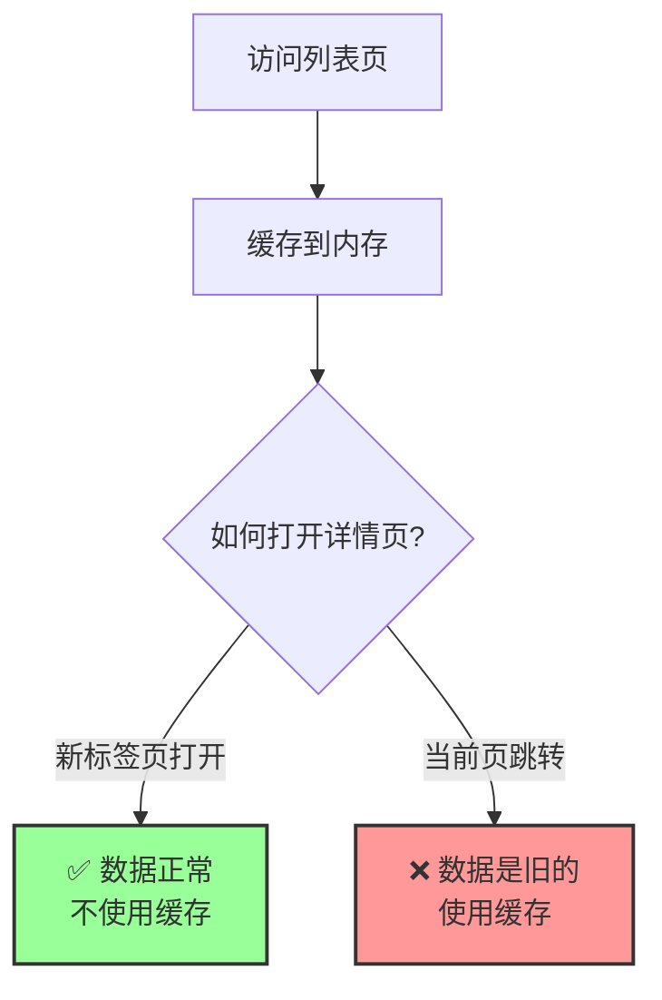

**原因**：

- 新标签页：全新的浏览器上下文，没有缓存
- 当前页跳转：使用 `<Link>`，会使用路由器缓存

---

## 解决方案

### 方案 1：使用 router.refresh()

```typescript
"use client";

import { useRouter } from "next/navigation";

export default function EditPage() {
  const router = useRouter();

  async function handleSubmit(formData: FormData) {
    // 1. 更新文章
    await fetch(`/api/posts/${id}`, {
      method: "PUT",
      body: formData,
    });

    // 2. ✅ 刷新路由器缓存
    router.refresh();

    // 3. 返回列表页
    router.back();
  }

  return <form onSubmit={handleSubmit}>...</form>;
}
```

**效果**：

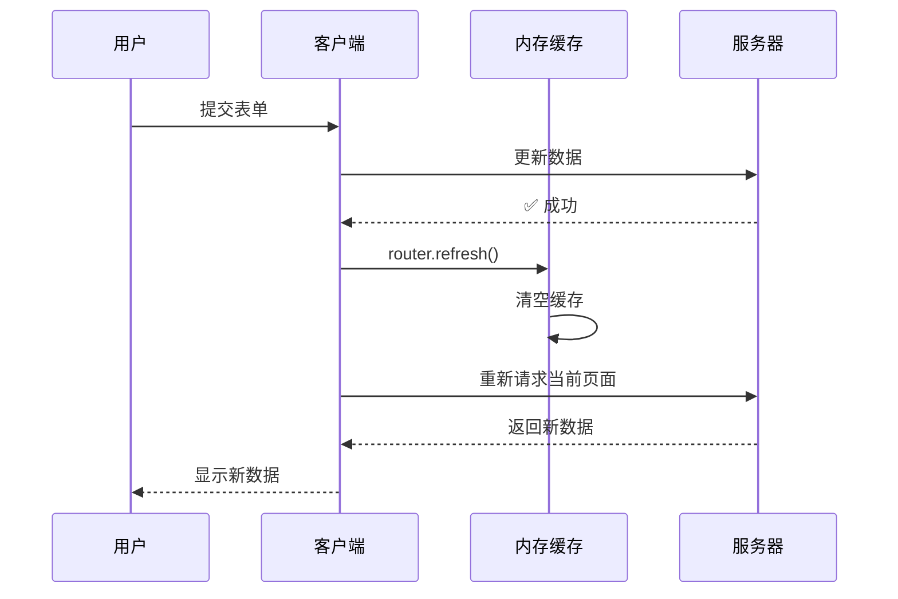

---

### 方案 2：使用 revalidatePath (Server Action)

```typescript
// app/actions.ts
"use server";

import { revalidatePath } from "next/cache";

export async function updatePost(id: string, formData: FormData) {
  // 1. 更新文章
  await db.post.update({
    where: { id },
    data: {
      title: formData.get("title"),
      content: formData.get("content"),
    },
  });

  // 2. ✅ 失效缓存
  revalidatePath("/posts"); // 失效列表页
  revalidatePath(`/posts/${id}`); // 失效详情页
}

// app/posts/[id]/edit/page.tsx
("use client");

import { updatePost } from "@/app/actions";
import { useRouter } from "next/navigation";

export default function EditPage({ params }) {
  const router = useRouter();

  async function handleSubmit(formData: FormData) {
    // 调用 Server Action
    await updatePost(params.id, formData);

    // 返回列表页（缓存已失效）
    router.push("/posts");
  }

  return <form action={handleSubmit}>...</form>;
}
```

**优势**：

- ✅ 同时失效服务端缓存和客户端缓存
- ✅ 更彻底的解决方案

---

### 方案 3：使用 revalidateTag

```typescript
// 1. 请求时打标签
const res = await fetch('https://api.example.com/posts', {
  next: { tags: ['posts'] }
});

// 2. 更新时失效标签
'use server';

import { revalidateTag } from 'next/cache';

export async function updatePost(id: string, formData: FormData) {
  await db.post.update({ where: { id }, data: { ... } });

  // ✅ 失效所有带 'posts' 标签的缓存
  revalidateTag('posts');
}
```

---

## 如何禁用路由器缓存？

### 方法 1：使用 prefetch={false}

```typescript
// ❌ 默认：会预取和缓存
<Link href="/posts">文章列表</Link>

// ✅ 禁用预取和缓存
<Link href="/posts" prefetch={false}>
  文章列表
</Link>
```

---

### 方法 2：使用 window.location

```typescript
"use client";

export default function Component() {
  function handleClick() {
    // ✅ 完全绕过路由器缓存
    window.location.href = "/posts";
  }

  return <button onClick={handleClick}>跳转</button>;
}
```

**缺点**：

- ❌ 会刷新整个页面（失去 SPA 体验）
- ❌ 失去 Next.js 的优化

---

### 方法 3：配置 staleTimes（实验性）

```typescript
// next.config.js
module.exports = {
  experimental: {
    staleTimes: {
      dynamic: 0, // 动态页面不缓存
      static: 0, // 静态页面也不缓存
    },
  },
};
```

---

## 路由器缓存 vs 浏览器缓存

| 特性         | 路由器缓存         | 浏览器缓存     |
| ------------ | ------------------ | -------------- |
| **位置**     | 浏览器内存         | 浏览器磁盘     |
| **触发方式** | `<Link>` 跳转      | 直接访问 URL   |
| **缓存内容** | RSC Payload        | HTML + 资源    |
| **生命周期** | 30 秒 - 5 分钟     | 根据 HTTP 头   |
| **清除方式** | `router.refresh()` | 清除浏览器缓存 |

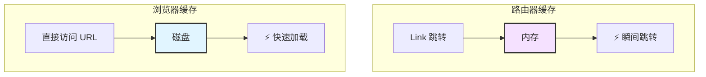

---

## 实战案例

### 案例：博客系统完整解决方案

```typescript
// app/posts/page.tsx - 列表页
export default async function PostsPage() {
  const res = await fetch("https://api.example.com/posts", {
    next: {
      revalidate: 60,
      tags: ["posts"],
    },
  });

  const posts = await res.json();

  return (
    <div>
      {posts.map((post) => (
        <Link key={post.id} href={`/posts/${post.id}`}>
          <h2>{post.title}</h2>
        </Link>
      ))}
    </div>
  );
}

// app/posts/[id]/page.tsx - 详情页
export default async function PostPage({ params }) {
  const res = await fetch(`https://api.example.com/posts/${params.id}`, {
    next: {
      revalidate: 60,
      tags: ["posts", `post-${params.id}`],
    },
  });

  const post = await res.json();

  return (
    <div>
      <h1>{post.title}</h1>
      <p>{post.content}</p>
      <Link href={`/posts/${params.id}/edit`}>编辑</Link>
    </div>
  );
}

// app/actions.ts - Server Actions
("use server");

import { revalidateTag } from "next/cache";
import { redirect } from "next/navigation";

export async function updatePost(id: string, formData: FormData) {
  // 1. 更新数据库
  await db.post.update({
    where: { id },
    data: {
      title: formData.get("title"),
      content: formData.get("content"),
    },
  });

  // 2. 失效缓存
  revalidateTag("posts"); // 失效列表页
  revalidateTag(`post-${id}`); // 失效详情页

  // 3. 重定向
  redirect(`/posts/${id}`);
}

// app/posts/[id]/edit/page.tsx - 编辑页
import { updatePost } from "@/app/actions";

export default function EditPage({ params }) {
  return (
    <form action={updatePost.bind(null, params.id)}>
      <input name="title" />
      <textarea name="content" />
      <button type="submit">保存</button>
    </form>
  );
}
```

**流程**：

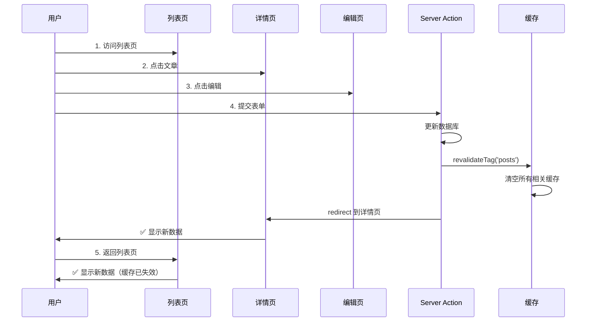

---

## 常见问题

### Q1: 为什么刷新页面就正常了？

**原因**：刷新页面会清空路由器缓存。

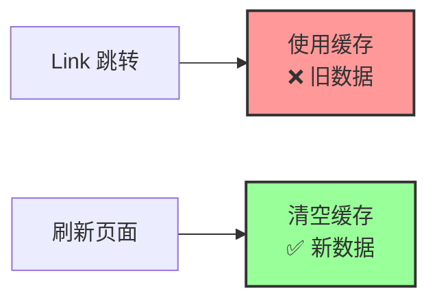

---

### Q2: 如何在开发时禁用路由器缓存？

```typescript
// next.config.js
module.exports = {
  experimental: {
    staleTimes: {
      dynamic: 0,
      static: 0,
    },
  },
};
```

**注意**：这会影响性能，只在开发时使用。

---

### Q3: router.refresh() 和 revalidatePath 有什么区别？

| 特性         | router.refresh()      | revalidatePath() |
| ------------ | --------------------- | ---------------- |
| **位置**     | 客户端                | 服务端           |
| **作用范围** | 当前页面              | 指定路径         |
| **失效层级** | 第 4 层（路由器缓存） | 第 2、3、4 层    |
| **推荐度**   | ⚠️ 临时方案           | ✅ 推荐          |

---

## 总结

**路由器缓存（Router Cache）** 是 Next.js 缓存的第四层：

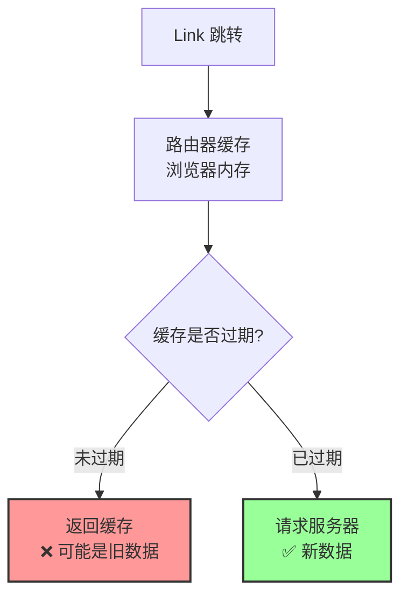

**核心要点**：

- ✅ 在浏览器内存中缓存页面
- ✅ 缓存时长：30 秒 - 5 分钟
- ✅ 使用 `revalidatePath` 或 `router.refresh()` 失效
- ⚠️ 最容易被忽视的缓存层

**下一步**：查看总结文档，了解如何综合运用四层缓存。
