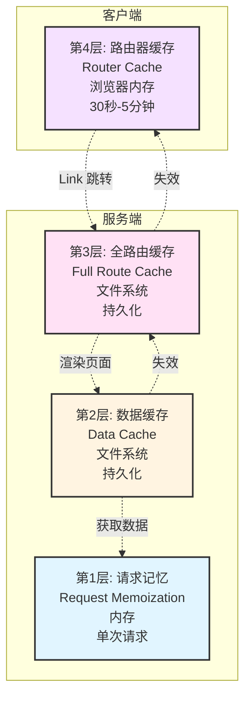
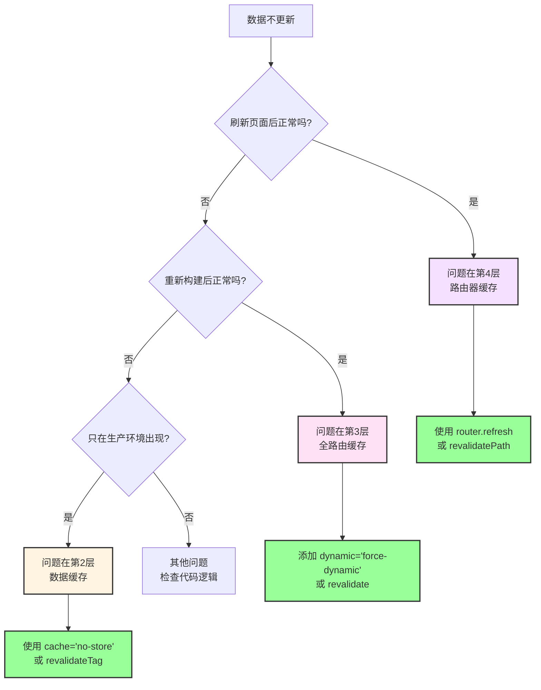
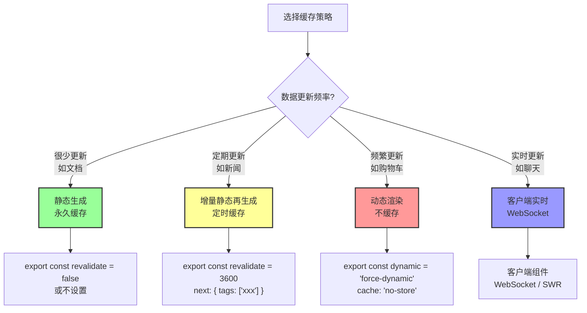

# Next.js 缓存机制 - 总结与实战

## 四层缓存速查表

当出现缓存问题时，按这个顺序排查：

| 层级        | 名称       | 位置       | 生命周期     | 缓存内容    | 失效方式                           | 常见问题                             |
| ----------- | ---------- | ---------- | ------------ | ----------- | ---------------------------------- | ------------------------------------ |
| **第 1 层** | 请求记忆   | 服务端内存 | 单次请求     | 函数返回值  | 请求结束自动失效                   | 组件多次调用只发一次请求（这是好事） |
| **第 2 层** | 数据缓存   | 服务端文件 | 持久化       | API 数据    | `revalidateTag` / `revalidatePath` | 数据库改了，所有用户看到的都是旧数据 |
| **第 3 层** | 全路由缓存 | 服务端文件 | 持久化       | HTML + RSC  | 重新构建 / Data Cache 失效         | 部署后页面内容是静态的，像个死页面   |
| **第 4 层** | 路由器缓存 | 浏览器内存 | 30 秒-5 分钟 | RSC Payload | `router.refresh()` / 刷新页面      | 点"后退"或跳转时，看到的还是旧数据   |

---

## 四层缓存关系图



**关键关系**：

- 数据缓存失效 → 全路由缓存失效
- 全路由缓存失效 → 路由器缓存失效
- 请求记忆独立，不影响其他层

---

## 常见问题诊断流程



---

## 实战场景与解决方案

### 场景 1：博客系统

**需求**：

- 文章列表：不需要实时更新，每小时更新一次即可
- 文章详情：同上
- 评论：需要实时更新

**解决方案**：

```typescript
// app/posts/page.tsx - 文章列表
export const revalidate = 3600; // 每小时更新

export default async function PostsPage() {
  const res = await fetch('https://api.example.com/posts', {
    next: { tags: ['posts'] }
  });

  const posts = await res.json();
  return <div>...</div>;
}

// app/posts/[id]/page.tsx - 文章详情
export const revalidate = 3600;

export default async function PostPage({ params }) {
  const res = await fetch(`https://api.example.com/posts/${params.id}`, {
    next: { tags: ['posts', `post-${params.id}`] }
  });

  const post = await res.json();
  return <div>...</div>;
}

// components/comments.tsx - 评论（客户端组件）
'use client';

export default function Comments({ postId }) {
  const { data: comments } = useSWR(
    `/api/posts/${postId}/comments`,
    fetcher,
    { refreshInterval: 5000 } // 每5秒刷新
  );

  return <div>...</div>;
}

// app/actions.ts - 创建文章
'use server';

export async function createPost(formData: FormData) {
  await db.post.create({ data: { ... } });
  revalidateTag('posts'); // 失效文章列表
}

// app/actions.ts - 更新文章
'use server';

export async function updatePost(id: string, formData: FormData) {
  await db.post.update({ where: { id }, data: { ... } });
  revalidateTag('posts'); // 失效列表
  revalidateTag(`post-${id}`); // 失效详情
}
```

---

### 场景 2：电商网站

**需求**：

- 产品列表：每小时更新
- 产品详情：每小时更新
- 购物车：实时
- 订单：实时

**解决方案**：

```typescript
// app/products/page.tsx - 产品列表（静态）
export const revalidate = 3600;

export default async function ProductsPage() {
  const res = await fetch("https://api.example.com/products", {
    next: { tags: ["products"] },
  });

  const products = await res.json();
  return <div>...</div>;
}

// app/products/[id]/page.tsx - 产品详情（静态）
export const revalidate = 3600;

export default async function ProductPage({ params }) {
  const res = await fetch(`https://api.example.com/products/${params.id}`, {
    next: { tags: ["products", `product-${params.id}`] },
  });

  const product = await res.json();
  return <div>...</div>;
}

// app/cart/page.tsx - 购物车（动态）
export const dynamic = "force-dynamic";

export default async function CartPage() {
  const res = await fetch("https://api.example.com/cart", {
    cache: "no-store",
  });

  const cart = await res.json();
  return <div>...</div>;
}

// app/orders/page.tsx - 订单（动态）
export const dynamic = "force-dynamic";

export default async function OrdersPage() {
  const res = await fetch("https://api.example.com/orders", {
    cache: "no-store",
  });

  const orders = await res.json();
  return <div>...</div>;
}
```

---

### 场景 3：管理后台

**需求**：

- 所有数据都需要实时更新
- 不需要缓存

**解决方案**：

```typescript
// app/(admin)/layout.tsx - 全局禁用缓存
export const dynamic = "force-dynamic";

export default function AdminLayout({ children }) {
  return <div>{children}</div>;
}

// 或者在每个页面单独设置
// app/(admin)/posts/page.tsx
export const dynamic = "force-dynamic";

export default async function AdminPostsPage() {
  const res = await fetch("https://api.example.com/admin/posts", {
    cache: "no-store",
  });

  const posts = await res.json();
  return <div>...</div>;
}
```

---

### 场景 4：实时数据（股票、聊天）

**需求**：

- 数据需要实时更新
- 使用 WebSocket 或轮询

**解决方案**：

```typescript
// app/stocks/page.tsx - 服务端组件（初始数据）
export const dynamic = "force-dynamic";

export default async function StocksPage() {
  const res = await fetch("https://api.example.com/stocks", {
    cache: "no-store",
  });

  const initialStocks = await res.json();

  return <StockList initialData={initialStocks} />;
}

// components/stock-list.tsx - 客户端组件（实时更新）
("use client");

import { useEffect, useState } from "react";

export default function StockList({ initialData }) {
  const [stocks, setStocks] = useState(initialData);

  useEffect(() => {
    // WebSocket 连接
    const ws = new WebSocket("wss://api.example.com/stocks");

    ws.onmessage = (event) => {
      const newData = JSON.parse(event.data);
      setStocks(newData);
    };

    return () => ws.close();
  }, []);

  return <div>...</div>;
}
```

---

## 缓存策略决策树



---

## 最佳实践

### 1. 默认策略

```typescript
// ✅ 推荐：使用定时缓存 + 标签
const res = await fetch("https://api.example.com/data", {
  next: {
    revalidate: 3600, // 根据实际需求调整
    tags: ["data"], // 方便失效
  },
});
```

**优势**：

- 性能好（大部分时间使用缓存）
- 数据新鲜（定时更新）
- 可控（可以手动失效）

---

### 2. 使用标签系统

```typescript
// ✅ 推荐：为所有请求打标签
const posts = await fetch("/api/posts", {
  next: { tags: ["posts"] },
});

const post = await fetch(`/api/posts/${id}`, {
  next: { tags: ["posts", `post-${id}`] },
});

const comments = await fetch(`/api/posts/${id}/comments`, {
  next: { tags: ["posts", `post-${id}`, "comments"] },
});

// 更新时精准失效
revalidateTag("posts"); // 失效所有文章相关
revalidateTag(`post-${id}`); // 只失效特定文章
revalidateTag("comments"); // 只失效评论
```

---

### 3. 分层处理

```typescript
// 服务端组件：获取初始数据（可缓存）
export default async function Page() {
  const initialData = await fetch("/api/data", {
    next: { revalidate: 60 },
  });

  return <ClientComponent initialData={initialData} />;
}

// 客户端组件：实时更新（不缓存）
("use client");

export default function ClientComponent({ initialData }) {
  const { data } = useSWR("/api/data", fetcher, {
    fallbackData: initialData,
    refreshInterval: 5000,
  });

  return <div>{data}</div>;
}
```

---

### 4. 开发环境配置

```typescript
// next.config.js
module.exports = {
  // 开发时禁用缓存（方便调试）
  ...(process.env.NODE_ENV === "development" && {
    experimental: {
      staleTimes: {
        dynamic: 0,
        static: 0,
      },
    },
  }),
};
```

---

## 常见错误

### ❌ 错误 1：过度缓存

```typescript
// ❌ 错误：用户数据使用永久缓存
const res = await fetch("/api/user/me"); // 默认永久缓存
```

**问题**：用户更新信息后，看到的还是旧数据。

**解决**：

```typescript
// ✅ 正确：用户数据不缓存
const res = await fetch("/api/user/me", {
  cache: "no-store",
});
```

---

### ❌ 错误 2：忘记失效缓存

```typescript
// ❌ 错误：更新数据后不失效缓存
export async function updatePost(id: string, data: any) {
  await db.post.update({ where: { id }, data });
  // 忘记失效缓存
}
```

**问题**：数据库更新了，但页面还是旧数据。

**解决**：

```typescript
// ✅ 正确：更新后失效缓存
export async function updatePost(id: string, data: any) {
  await db.post.update({ where: { id }, data });
  revalidateTag("posts");
  revalidateTag(`post-${id}`);
}
```

---

### ❌ 错误 3：混淆开发和生产环境

```typescript
// ❌ 错误：只在开发环境测试
// 开发环境默认不缓存，看起来正常
// 部署到生产环境后，发现数据不更新
```

**解决**：

```bash
# ✅ 正确：测试生产构建
npm run build
npm start

# 或使用
npx serve@latest out
```

---

## 调试技巧

### 1. 查看构建日志

```bash
npm run build
```

查看每个页面的渲染类型：

- `○` (Static)：静态，会被缓存
- `ƒ` (Dynamic)：动态，不会被缓存

---

### 2. 添加日志

```typescript
export default async function Page() {
  console.log("🔍 页面开始渲染", new Date().toISOString());

  const res = await fetch("/api/data");
  console.log("✅ 数据获取完成");

  return <div>...</div>;
}
```

**如果缓存生效**：

- 第 1 次访问：看到日志
- 第 2 次访问：看不到日志（使用缓存）

---

### 3. 使用 React DevTools

安装 React DevTools，查看组件的渲染次数。

---

### 4. 使用 Network 面板

打开浏览器的 Network 面板，查看请求：

- 如果没有请求：使用了缓存
- 如果有请求：没有使用缓存

---

## 总结

### 核心原则

1. **默认使用缓存**：性能优先
2. **按需禁用**：动态数据不缓存
3. **精准失效**：使用标签系统
4. **分层处理**：服务端 + 客户端结合

---

### 记忆口诀

```
请求记忆在内存，单次请求就失效
数据缓存在文件，持久化但可控制
全路由缓存也在文件，构建时就生成
路由器缓存在浏览器，Link 跳转会使用
```

---

### 快速参考

```typescript
// 永久缓存（默认）
fetch("/api/data");

// 不缓存
fetch("/api/data", { cache: "no-store" });

// 定时缓存
fetch("/api/data", { next: { revalidate: 60 } });

// 打标签
fetch("/api/data", { next: { tags: ["data"] } });

// 失效标签
revalidateTag("data");

// 失效路径
revalidatePath("/page");

// 强制动态
export const dynamic = "force-dynamic";

// 定时重新验证
export const revalidate = 60;

// 刷新路由器缓存
router.refresh();
```

---

## 下一步

现在你已经完全掌握了 Next.js 的四层缓存机制！

建议：

1. ✅ 在实际项目中应用这些知识
2. ✅ 遇到问题时查看速查表
3. ✅ 使用标签系统管理缓存
4. ✅ 定期检查缓存策略是否合理

祝你在 Next.js 开发中游刃有余！🚀
