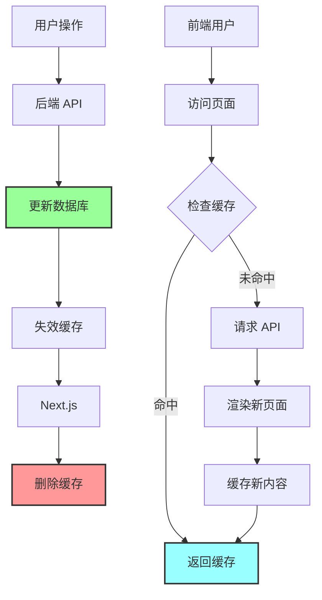
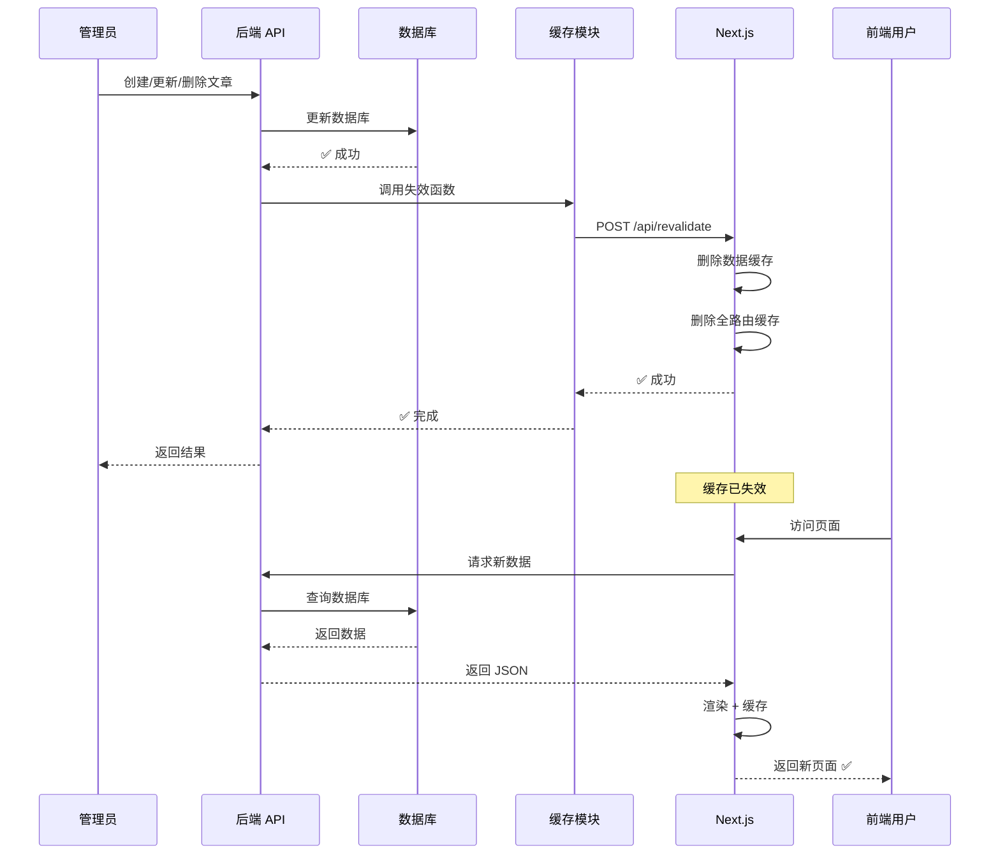
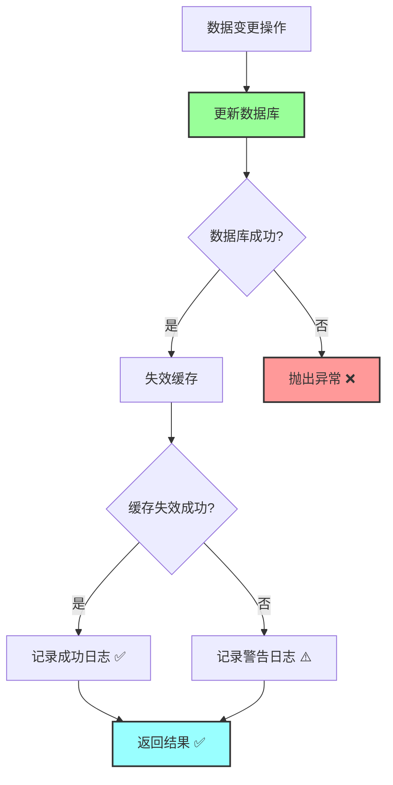
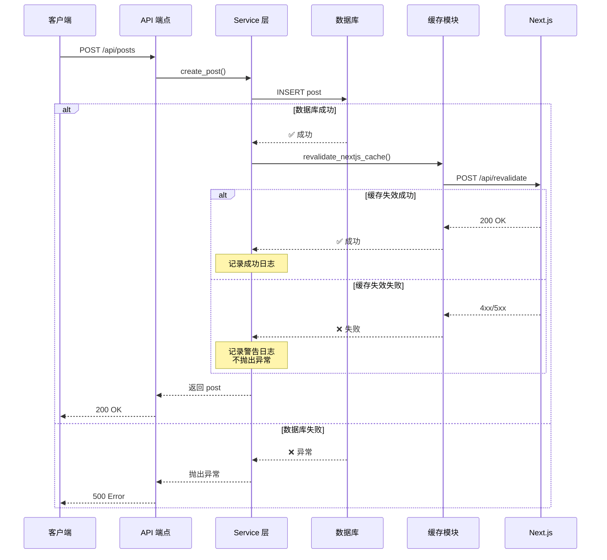

# 后端缓存失效集成方案

## 📋 概述

本文档说明如何在后端数据变更时，自动失效 Next.js 前端缓存，确保用户始终看到最新内容。

## 🎯 核心原则

```
数据变更 → 失效缓存 → 用户看到最新内容
```

**标准操作模式**：

- ✅ 创建（Create）→ 失效缓存
- ✅ 更新（Update）→ 失效缓存
- ✅ 删除（Delete）→ 失效缓存
- ✅ 批量操作（Batch）→ 失效缓存
- ✅ Git 同步（Sync）→ 失效缓存

## 🏗️ 架构设计

### 整体流程



### 缓存失效流程



## 📝 实现方案

### 方案 1：通用函数（推荐）

**优点**：

- ✅ 简单直接
- ✅ 易于理解
- ✅ 适合中小型项目

**实现**：

```python
# backend/app/core/cache.py
"""
Next.js 缓存失效模块

提供统一的缓存失效接口，在数据变更时自动失效前端缓存。
"""
import httpx
from app.core.config import settings
import logging
from typing import List, Optional

logger = logging.getLogger(__name__)


async def revalidate_nextjs_cache(
    tags: Optional[List[str]] = None,
    paths: Optional[List[str]] = None
) -> bool:
    """
    失效 Next.js 缓存

    Args:
        tags: 要失效的缓存标签列表（如 ['posts', 'posts-list']）
        paths: 要失效的路径列表（如 ['/posts', '/']）

    Returns:
        bool: 是否成功失效缓存

    Examples:
        # 失效文章相关缓存
        await revalidate_nextjs_cache(tags=['posts', 'posts-list'])

        # 失效特定文章
        await revalidate_nextjs_cache(tags=[f'post-{slug}'])

        # 失效路径
        await revalidate_nextjs_cache(paths=['/posts'])

        # 同时失效 tags 和 paths
        await revalidate_nextjs_cache(
            tags=['posts'],
            paths=['/posts']
        )

    Note:
        - 此函数的异常应该在调用方捕获
        - 失败不应该中断主业务流程
        - 会自动记录日志
    """
    # 检查配置
    if not settings.FRONTEND_URL or not settings.REVALIDATE_SECRET:
        logger.warning(
            "⚠️ FRONTEND_URL or REVALIDATE_SECRET not configured, "
            "skipping cache revalidation"
        )
        return False

    # 调用 Next.js API
    async with httpx.AsyncClient() as client:
        response = await client.post(
            f"{settings.FRONTEND_URL}/api/revalidate",
            headers={
                "Authorization": f"Bearer {settings.REVALIDATE_SECRET}",
                "Content-Type": "application/json"
            },
            json={
                "tags": tags or [],
                "paths": paths or []
            },
            timeout=10.0
        )

        if response.status_code == 200:
            data = response.json()
            logger.info(
                f"✅ Next.js cache revalidated: tags={tags}, paths={paths}"
            )
            return True
        else:
            logger.warning(
                f"❌ Failed to revalidate cache: "
                f"{response.status_code} {response.text}"
            )
            return False
```

**使用示例**：

```python
# backend/app/posts/service.py
from app.core.cache import revalidate_nextjs_cache

async def create_post(session, post_in, author_id):
    """创建文章"""
    # 1. 创建文章
    post = Post(**post_in.dict(), author_id=author_id)
    session.add(post)
    await session.commit()
    await session.refresh(post)

    # 2. 失效缓存（错误不影响主流程）
    try:
        await revalidate_nextjs_cache(
            tags=['posts', 'posts-list'],
            paths=['/posts']
        )
    except Exception as e:
        logger.warning(f"Cache revalidation failed: {e}")

    return post


async def update_post(session, post_id, post_in, current_user):
    """更新文章"""
    # 1. 更新文章
    post = await session.get(Post, post_id)
    if not post:
        raise PostNotFoundError(post_id)

    for key, value in post_in.dict(exclude_unset=True).items():
        setattr(post, key, value)

    await session.commit()
    await session.refresh(post)

    # 2. 失效缓存
    try:
        await revalidate_nextjs_cache(
            tags=['posts', f'post-{post.slug}'],
            paths=['/posts', f'/posts/{post.slug}']
        )
    except Exception as e:
        logger.warning(f"Cache revalidation failed: {e}")

    return post


async def delete_post(session, post_id, current_user):
    """删除文章"""
    # 1. 删除文章
    post = await session.get(Post, post_id)
    if not post:
        raise PostNotFoundError(post_id)

    slug = post.slug
    await session.delete(post)
    await session.commit()

    # 2. 失效缓存
    try:
        await revalidate_nextjs_cache(
            tags=['posts', 'posts-list', f'post-{slug}'],
            paths=['/posts', f'/posts/{slug}']
        )
    except Exception as e:
        logger.warning(f"Cache revalidation failed: {e}")

    return True
```

### 方案 2：装饰器（优雅）

**优点**：

- ✅ 代码简洁
- ✅ 声明式
- ✅ 易于维护

**实现**：

```python
# backend/app/core/cache.py
from functools import wraps
from typing import Callable, List

def invalidate_cache(
    tags: List[str] = None,
    paths: List[str] = None
):
    """
    装饰器：自动失效缓存

    Args:
        tags: 要失效的缓存标签
        paths: 要失效的路径

    Examples:
        @invalidate_cache(tags=['posts', 'posts-list'])
        async def create_post(session, post_in):
            # 创建文章
            return post
    """
    def decorator(func: Callable):
        @wraps(func)
        async def wrapper(*args, **kwargs):
            # 执行原函数
            result = await func(*args, **kwargs)

            # 失效缓存（错误不影响主流程）
            try:
                await revalidate_nextjs_cache(tags=tags, paths=paths)
            except Exception as e:
                logger.warning(f"Cache revalidation failed: {e}")

            return result
        return wrapper
    return decorator
```

**使用示例**：

```python
# backend/app/posts/service.py
from app.core.cache import invalidate_cache

@invalidate_cache(tags=['posts', 'posts-list'], paths=['/posts'])
async def create_post(session, post_in, author_id):
    """创建文章"""
    post = Post(**post_in.dict(), author_id=author_id)
    session.add(post)
    await session.commit()
    return post


@invalidate_cache(tags=['posts'])
async def update_post(session, post_id, post_in):
    """更新文章"""
    post = await session.get(Post, post_id)
    for key, value in post_in.dict(exclude_unset=True).items():
        setattr(post, key, value)
    await session.commit()
    return post
```

### 方案 3：事件系统（灵活）

**优点**：

- ✅ 解耦
- ✅ 可扩展
- ✅ 适合大型项目

**实现**：

```python
# backend/app/core/events.py
from typing import Callable, Dict, List
from collections import defaultdict
import logging

logger = logging.getLogger(__name__)


class EventBus:
    """事件总线"""

    def __init__(self):
        self._listeners: Dict[str, List[Callable]] = defaultdict(list)

    def on(self, event: str):
        """注册事件监听器（装饰器）"""
        def decorator(handler: Callable):
            self._listeners[event].append(handler)
            logger.info(f"Registered handler for event: {event}")
            return handler
        return decorator

    async def emit(self, event: str, **data):
        """触发事件"""
        logger.debug(f"Emitting event: {event} with data: {data}")

        for handler in self._listeners[event]:
            try:
                await handler(**data)
            except Exception as e:
                logger.error(f"Error in event handler for {event}: {e}")


# 全局事件总线
event_bus = EventBus()


# 注册缓存失效监听器
@event_bus.on('post.created')
async def on_post_created(post, **kwargs):
    """文章创建后失效缓存"""
    from app.core.cache import revalidate_nextjs_cache
    await revalidate_nextjs_cache(
        tags=['posts', 'posts-list'],
        paths=['/posts']
    )


@event_bus.on('post.updated')
async def on_post_updated(post, **kwargs):
    """文章更新后失效缓存"""
    from app.core.cache import revalidate_nextjs_cache
    await revalidate_nextjs_cache(
        tags=['posts', f'post-{post.slug}'],
        paths=['/posts', f'/posts/{post.slug}']
    )


@event_bus.on('post.deleted')
async def on_post_deleted(slug, **kwargs):
    """文章删除后失效缓存"""
    from app.core.cache import revalidate_nextjs_cache
    await revalidate_nextjs_cache(
        tags=['posts', 'posts-list', f'post-{slug}'],
        paths=['/posts', f'/posts/{slug}']
    )
```

**使用示例**：

```python
# backend/app/posts/service.py
from app.core.events import event_bus

async def create_post(session, post_in, author_id):
    """创建文章"""
    post = Post(**post_in.dict(), author_id=author_id)
    session.add(post)
    await session.commit()

    # 触发事件
    await event_bus.emit('post.created', post=post)

    return post


async def update_post(session, post_id, post_in):
    """更新文章"""
    post = await session.get(Post, post_id)
    for key, value in post_in.dict(exclude_unset=True).items():
        setattr(post, key, value)
    await session.commit()

    # 触发事件
    await event_bus.emit('post.updated', post=post)

    return post
```

## 🔧 错误处理策略

### 原则



### 关键原则

1. **数据库操作失败 → 抛出异常**

   ```python
   # ❌ 数据库失败必须中断
   await session.commit()  # 如果失败，抛出异常
   ```

2. **缓存失效失败 → 记录日志，不中断**
   ```python
   # ✅ 缓存失败不影响主流程
   try:
       await revalidate_nextjs_cache(...)
   except Exception as e:
       logger.warning(f"Cache revalidation failed: {e}")
       # 继续执行，不抛出异常
   ```

### 错误处理位置

#### ❌ 不推荐：在缓存模块内部处理

```python
# backend/app/core/cache.py
async def revalidate_nextjs_cache(tags, paths):
    try:
        # 调用 Next.js API
        ...
    except Exception as e:
        # ❌ 在这里处理，调用方不知道是否成功
        logger.warning(f"Failed: {e}")
        return False
```

**问题**：

- 调用方无法决定如何处理错误
- 失去了灵活性

#### ✅ 推荐：在调用方处理

```python
# backend/app/core/cache.py
async def revalidate_nextjs_cache(tags, paths):
    # ✅ 让异常自然抛出
    async with httpx.AsyncClient() as client:
        response = await client.post(...)

        if response.status_code == 200:
            logger.info("✅ Success")
            return True
        else:
            logger.warning(f"❌ Failed: {response.status_code}")
            return False
    # httpx 的异常会自然抛出


# backend/app/posts/service.py
async def create_post(session, post_in):
    # 数据库操作
    post = Post(**post_in.dict())
    await session.commit()  # 失败会抛出异常 ✅

    # 缓存失效（调用方决定如何处理）
    try:
        await revalidate_nextjs_cache(...)
    except Exception as e:
        # ✅ 在这里决定：记录日志但不中断
        logger.warning(f"Cache revalidation failed: {e}")

    return post
```

### 完整的错误处理流程



## 📊 缓存失效策略表

### 文章（Posts）

| 操作     | Tags                                 | Paths                     | 说明           |
| -------- | ------------------------------------ | ------------------------- | -------------- |
| 创建文章 | `posts`, `posts-list`                | `/posts`                  | 影响列表页     |
| 更新文章 | `posts`, `post-{slug}`               | `/posts`, `/posts/{slug}` | 影响列表和详情 |
| 删除文章 | `posts`, `posts-list`, `post-{slug}` | `/posts`, `/posts/{slug}` | 影响列表和详情 |
| 发布文章 | `posts`, `posts-list`, `post-{slug}` | `/posts`, `/posts/{slug}` | 状态变更       |
| 批量发布 | `posts`, `posts-list`                | `/posts`                  | 多篇文章       |

### 分类（Categories）

| 操作     | Tags                                   | Paths    | 说明         |
| -------- | -------------------------------------- | -------- | ------------ |
| 创建分类 | `categories`                           | `/posts` | 影响筛选     |
| 更新分类 | `categories`, `category-{id}`          | `/posts` | 影响筛选     |
| 删除分类 | `categories`, `category-{id}`, `posts` | `/posts` | 影响关联文章 |

### 标签（Tags）

| 操作     | Tags                        | Paths    | 说明         |
| -------- | --------------------------- | -------- | ------------ |
| 创建标签 | `tags`                      | -        | 不影响页面   |
| 更新标签 | `tags`, `tag-{id}`          | -        | 标签名变更   |
| 删除标签 | `tags`, `tag-{id}`, `posts` | `/posts` | 影响关联文章 |

### 用户（Users）

| 操作         | Tags                   | Paths | 说明         |
| ------------ | ---------------------- | ----- | ------------ |
| 更新作者信息 | `author-{id}`, `posts` | -     | 影响作者显示 |

### Git 同步（Git Sync）

| 操作     | Tags                                | Paths    | 说明     |
| -------- | ----------------------------------- | -------- | -------- |
| 同步完成 | `posts`, `posts-list`, `categories` | `/posts` | 全量更新 |

## 🧪 测试

### 单元测试

```python
# backend/tests/test_cache.py
import pytest
from unittest.mock import AsyncMock, patch
from app.core.cache import revalidate_nextjs_cache


@pytest.mark.asyncio
async def test_revalidate_success():
    """测试缓存失效成功"""
    with patch('httpx.AsyncClient.post') as mock_post:
        mock_post.return_value.status_code = 200
        mock_post.return_value.json.return_value = {"success": True}

        result = await revalidate_nextjs_cache(tags=['posts'])

        assert result is True
        mock_post.assert_called_once()


@pytest.mark.asyncio
async def test_revalidate_failure():
    """测试缓存失效失败"""
    with patch('httpx.AsyncClient.post') as mock_post:
        mock_post.return_value.status_code = 500

        result = await revalidate_nextjs_cache(tags=['posts'])

        assert result is False


@pytest.mark.asyncio
async def test_revalidate_network_error():
    """测试网络错误"""
    with patch('httpx.AsyncClient.post') as mock_post:
        mock_post.side_effect = Exception("Network error")

        with pytest.raises(Exception):
            await revalidate_nextjs_cache(tags=['posts'])
```

### 集成测试

```python
# backend/tests/test_posts_integration.py
import pytest
from app.posts.service import create_post
from app.core.cache import revalidate_nextjs_cache


@pytest.mark.asyncio
async def test_create_post_invalidates_cache(session, admin_user):
    """测试创建文章后失效缓存"""
    with patch('app.core.cache.revalidate_nextjs_cache') as mock_revalidate:
        mock_revalidate.return_value = True

        post_in = PostCreate(title="Test", content="Content")
        post = await create_post(session, post_in, admin_user.id)

        # 验证缓存失效被调用
        mock_revalidate.assert_called_once_with(
            tags=['posts', 'posts-list'],
            paths=['/posts']
        )
```

## 📚 最佳实践

### 1. 统一使用通用函数

```python
# ✅ 推荐
from app.core.cache import revalidate_nextjs_cache

await revalidate_nextjs_cache(tags=['posts'])
```

```python
# ❌ 不推荐：直接调用 httpx
async with httpx.AsyncClient() as client:
    await client.post(...)
```

### 2. 始终捕获异常

```python
# ✅ 推荐
try:
    await revalidate_nextjs_cache(...)
except Exception as e:
    logger.warning(f"Cache revalidation failed: {e}")
```

```python
# ❌ 不推荐：不捕获异常
await revalidate_nextjs_cache(...)  # 可能中断主流程
```

### 3. 使用精确的 tags

```python
# ✅ 推荐：精确控制
await revalidate_nextjs_cache(
    tags=['posts', f'post-{slug}']
)
```

```python
# ❌ 不推荐：过于宽泛
await revalidate_nextjs_cache(tags=['all'])
```

### 4. 记录详细日志

```python
# ✅ 推荐
logger.info(f"✅ Cache revalidated: tags={tags}, paths={paths}")
logger.warning(f"❌ Cache revalidation failed: {e}")
```

### 5. 配置检查

```python
# ✅ 推荐：检查配置
if not settings.FRONTEND_URL:
    logger.warning("FRONTEND_URL not configured")
    return False
```

## 🔍 监控和调试

### 日志示例

```
# 成功
2025-01-14 10:30:00 INFO ✅ Next.js cache revalidated: tags=['posts', 'posts-list'], paths=['/posts']

# 失败
2025-01-14 10:30:00 WARNING ❌ Failed to revalidate cache: 500 Internal Server Error

# 配置缺失
2025-01-14 10:30:00 WARNING ⚠️ FRONTEND_URL not configured, skipping cache revalidation
```

### 调试技巧

1. **检查配置**

   ```bash
   # 后端
   echo $FRONTEND_URL
   echo $REVALIDATE_SECRET

   # 前端
   echo $REVALIDATE_SECRET
   ```

2. **查看日志**

   ```bash
   # 后端日志
   docker-compose logs -f backend | grep "cache"

   # 前端日志
   docker-compose logs -f frontend | grep "Revalidated"
   ```

3. **手动测试**
   ```bash
   # 测试 Next.js API
   curl -X POST http://localhost:3000/api/revalidate \
     -H "Authorization: Bearer your-secret" \
     -H "Content-Type: application/json" \
     -d '{"tags": ["posts"]}'
   ```

## 📖 相关文档

- [Next.js 缓存机制总结](./06-summary.md)
- [全路由缓存](./04-layer3-full-route-cache.md)
- [数据缓存](./03-layer2-data-cache.md)
- [缓存失效配置指南](../../CACHE_REVALIDATION_GUIDE.md)

---

**最后更新**：2025-01-14
**维护者**：Blog Platform Team
