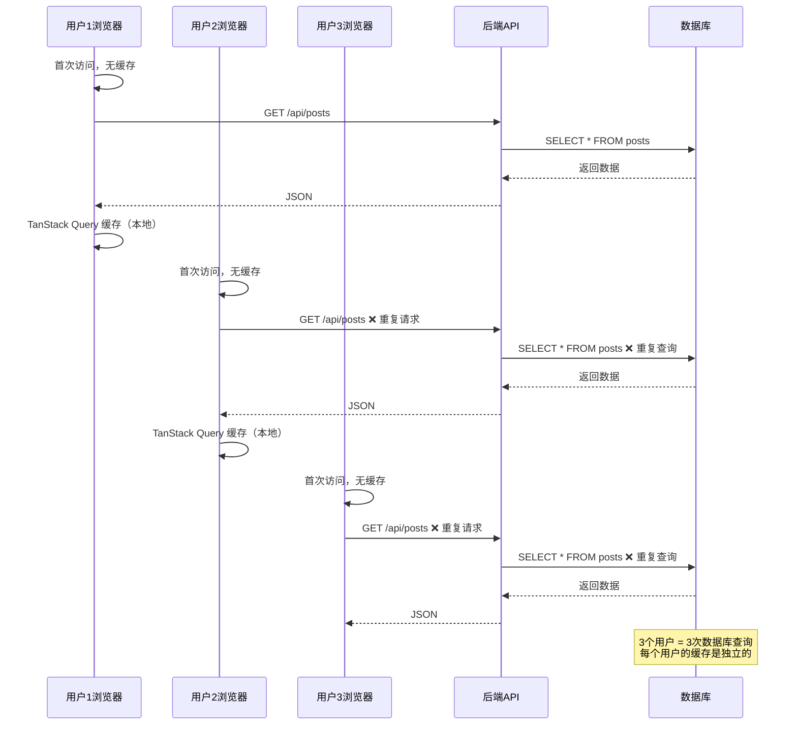
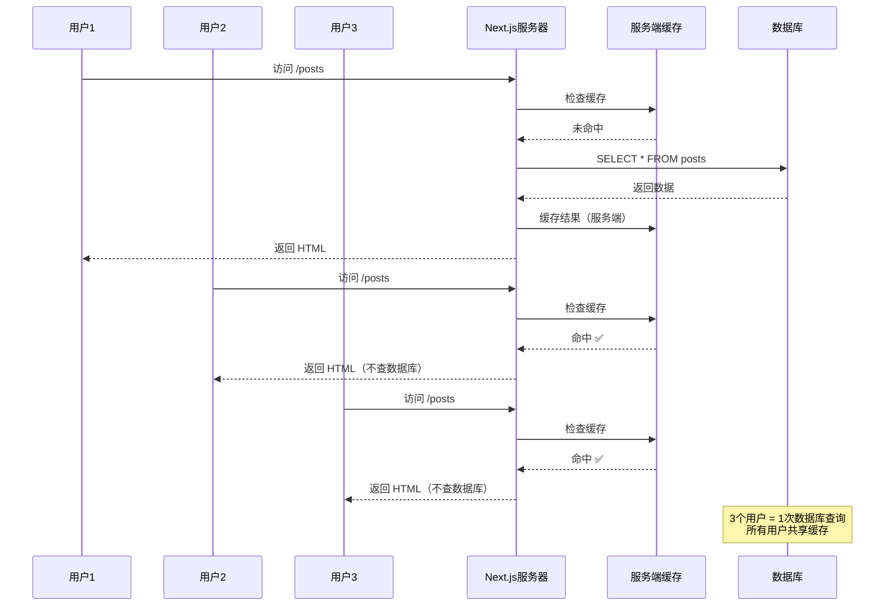
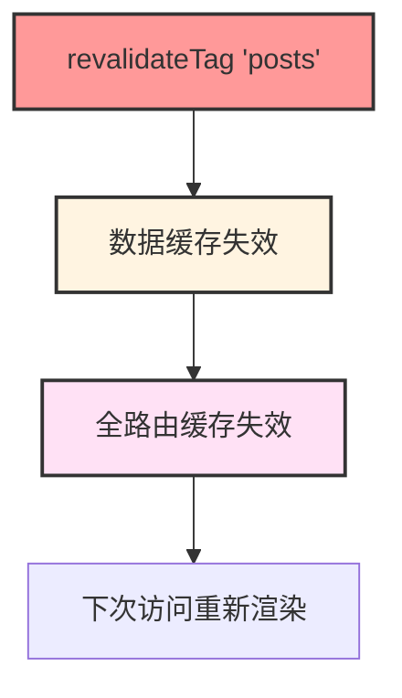
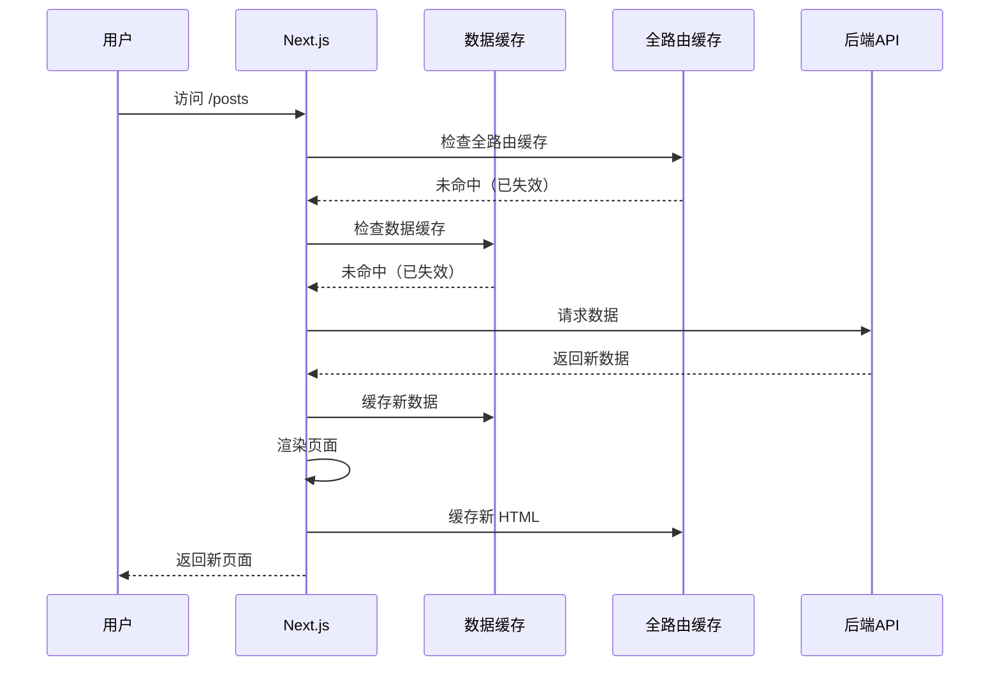
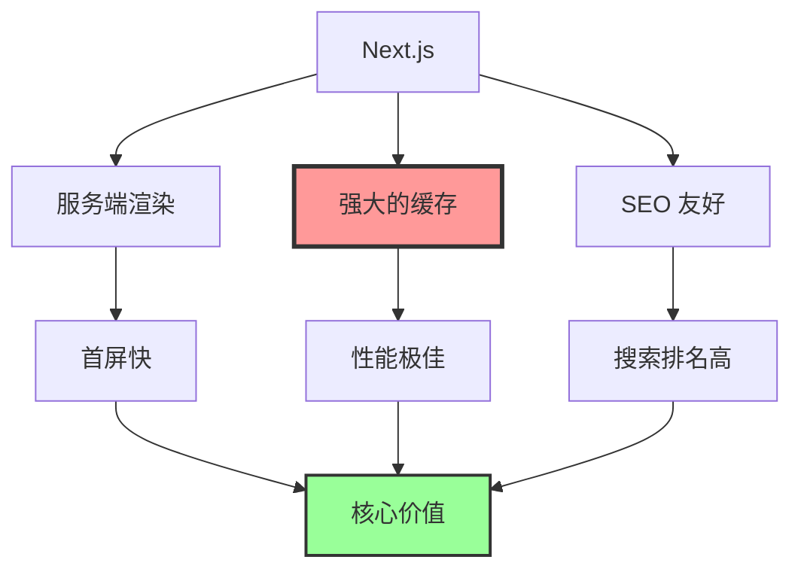
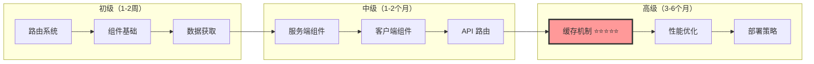

## React + TanStack Query（客户端缓存）

## Next.js（服务端缓存）

## revalidateTag() 的作用范围

答案：同时刷新数据缓存和全路由缓存

## revalidateTag("posts");

这一行会：

✅ 失效所有带 tags: ["posts"] 的数据缓存
✅ 失效依赖这些数据的全路由缓存
工作原理
缓存依赖关系

## 用户访问流程

## 完整的缓存流程

```mermaid
graph TB
    subgraph "正常访问（99%的情况）"
        U1[用户访问] --> C1{检查缓存}
        C1 -->|命中| R1[返回缓存 1ms ⚡]
    end

    subgraph "发布新文章（1%的情况）"
        Admin[管理员] --> Git[Git Push]
        Git --> Sync[后端同步]
        Sync --> DB[更新数据库]
        DB --> Invalid[失效缓存]
        Invalid --> Next[Next.js]
        Next --> Clear[清除缓存]
    end

    subgraph "缓存失效后首次访问"
        U2[用户访问] --> C2{检查缓存}
        C2 -->|未命中| API[请求API]
        API --> Render[渲染页面]
        Render --> Cache[缓存结果]
        Cache --> R2[返回页面]
    end

    style R1 fill:#9f9,stroke:#333,stroke-width:2px
    style Clear fill:#f99,stroke:#333,stroke-width:2px
    style Cache fill:#9ff,stroke:#333,stroke-width:2px
```

## nextjs 的核心价值

## nextjs 的学习曲线

