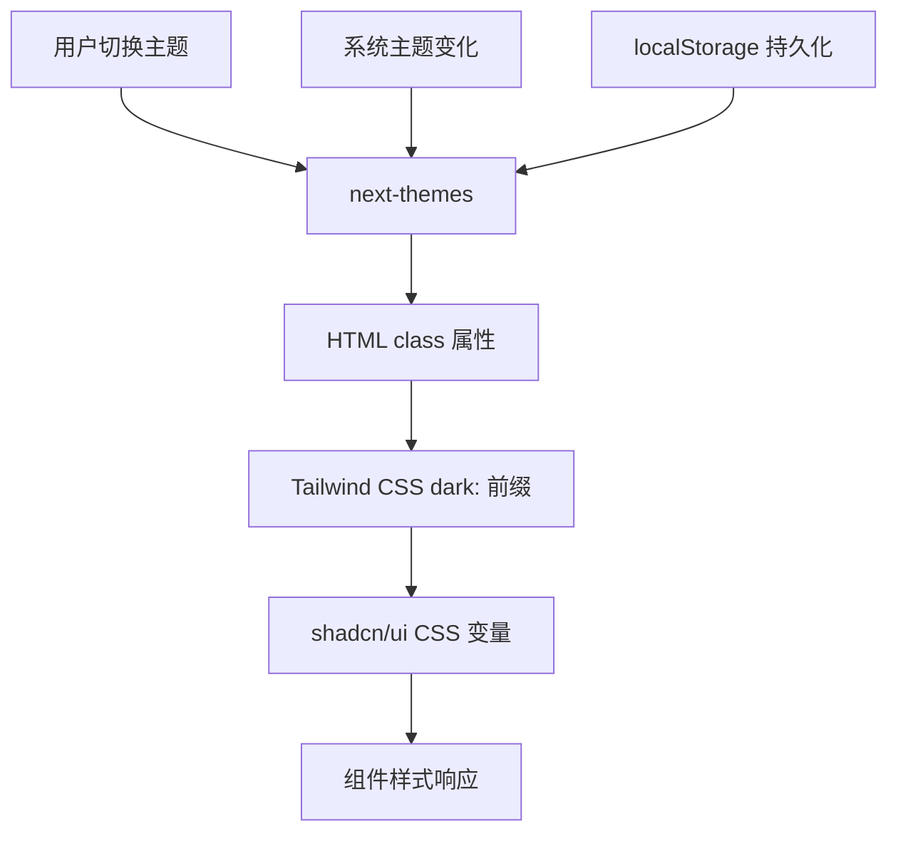

# 主题定制化指南

## 概述

本项目使用 `next-themes` 作为主题管理解决方案，结合 shadcn/ui 和 Tailwind CSS 实现了完整的暗色/浅色主题切换功能。

## 主题定制化原理

### 1. 技术栈协作原理



### 2. 核心工作流程

#### 步骤1：主题状态管理

```tsx
// next-themes 管理三种状态
type Theme = "light" | "dark" | "system";

// 状态持久化到 localStorage
localStorage.setItem("my-blog-theme", theme);
```

#### 步骤2：DOM 类名控制

```tsx
// next-themes 自动管理 HTML 根元素的 class
<html class="dark">  <!-- 暗色主题时 -->
<html class="">      <!-- 浅色主题时 -->
```

#### 步骤3：CSS 响应式设计

```css
/* Tailwind CSS 的 dark: 前缀自动响应 */
.bg-background {
  background-color: hsl(var(--background));
}

.dark .bg-background {
  background-color: hsl(var(--background)); /* 不同的 CSS 变量值 */
}
```

#### 步骤4：shadcn/ui 变量系统

```css
/* 浅色主题变量 */
:root {
  --background: 0 0% 100%;
  --foreground: 222.2 84% 4.9%;
}

/* 暗色主题变量 */
.dark {
  --background: 222.2 84% 4.9%;
  --foreground: 210 40% 98%;
}
```

## 为什么选择 next-themes？

### 1. 技术优势对比

| 特性             | next-themes | 自定义实现 | use-dark-mode | usehooks-ts |
| ---------------- | ----------- | ---------- | ------------- | ----------- |
| **包大小**       | ~2KB        | 0KB        | ~1KB          | ~3KB        |
| **SSR 支持**     | ✅ 完美     | ❌ 需手动  | ❌ 有问题     | ❌ 有问题   |
| **系统主题监听** | ✅ 自动     | ❌ 手动    | ✅ 支持       | ✅ 支持     |
| **闪烁防护**     | ✅ 内置     | ❌ 需处理  | ❌ 有闪烁     | ❌ 有闪烁   |
| **TypeScript**   | ✅ 完整     | ✅ 自定义  | ⚠️ 基础       | ✅ 完整     |
| **维护成本**     | ✅ 零维护   | ❌ 需维护  | ⚠️ 社区       | ⚠️ 社区     |
| **生态兼容**     | ✅ 广泛     | ✅ 完全    | ⚠️ 有限       | ⚠️ 有限     |

### 2. 选择 next-themes 的核心理由

#### 理由1：成熟稳定

```tsx
// 经过数万个项目验证，处理了各种边缘情况
// GitHub: 5.8k+ stars, 每周 500k+ 下载量
```

#### 理由2：零配置 SSR 支持

```tsx
// 自动处理服务端渲染的主题同步问题
// 防止 hydration 不匹配和主题闪烁
```

#### 理由3：完美的 shadcn/ui 集成

```tsx
// shadcn/ui 官方推荐，API 设计完全匹配
// 无缝集成，零额外配置
```

#### 理由4：强大的定制能力

```tsx
<ThemeProvider
  attribute="class" // 支持 class/data-theme/style
  themes={["light", "dark", "blue"]} // 自定义主题列表
  defaultTheme="system" // 默认主题
  enableSystem // 系统主题检测
  disableTransitionOnChange // 防闪烁
  storageKey="custom-theme" // 自定义存储键
  value={{ light: "day", dark: "night" }} // 自定义属性值
/>
```

## 其他主题管理方案

### 1. 自定义 Context 实现

```tsx
// 优点：完全控制，零依赖
// 缺点：需要处理 SSR、系统主题监听、闪烁防护等问题
const ThemeContext = createContext<ThemeState>(initialState);
```

### 2. use-dark-mode

```tsx
// 优点：专注暗色模式，API 简单
// 缺点：不支持 system 主题，SSR 支持有限
import useDarkMode from "use-dark-mode";
const darkMode = useDarkMode(false);
```

### 3. usehooks-ts

```tsx
// 优点：TypeScript 友好，功能丰富
// 缺点：包含很多不需要的功能，体积较大
import { useLocalStorage } from "usehooks-ts";
```

### 4. Zustand + 持久化

```tsx
// 优点：状态管理强大，可扩展性好
// 缺点：过度设计，主题管理不需要这么复杂
const useThemeStore = create(persist(...))
```

### 5. Jotai 原子化状态

```tsx
// 优点：细粒度状态管理，性能好
// 缺点：学习成本高，主题场景下优势不明显
const themeAtom = atom("light");
```

## 定制化实现详解

### 1. 基础配置定制

```tsx
// 在 ThemeProvider 中配置
export function ThemeProvider({ children, ...props }: ThemeProviderProps) {
  return (
    <NextThemesProvider
      attribute="class" // 使用 class 控制主题
      defaultTheme="system" // 默认跟随系统
      enableSystem // 启用系统主题检测
      disableTransitionOnChange // 禁用切换动画防闪烁
      storageKey="my-blog-theme" // localStorage 键名
      themes={["light", "dark", "system"]} // 可用主题列表
      {...props}
    >
      {children}
    </NextThemesProvider>
  );
}
```

### 2. 增强 Hook 定制

```tsx
// useEnhancedTheme 提供额外功能
export function useEnhancedTheme() {
  const { theme, setTheme, resolvedTheme } = useNextTheme();

  // 主题切换动画
  const setThemeWithTransition = (newTheme: string) => {
    document.documentElement.classList.add("theme-transitioning");
    setTheme(newTheme);
    setTimeout(() => {
      document.documentElement.classList.remove("theme-transitioning");
    }, 300);
  };

  // 循环切换主题
  const toggleTheme = () => {
    const themes = ["light", "dark", "system"];
    const currentIndex = themes.indexOf(theme || "system");
    const nextIndex = (currentIndex + 1) % themes.length;
    setTheme(themes[nextIndex]);
  };

  return {
    theme,
    setTheme,
    setThemeWithTransition,
    toggleTheme,
    isDark: resolvedTheme === "dark",
    isLight: resolvedTheme === "light",
    isSystem: theme === "system",
  };
}
```

### 3. 动画效果定制

```css
/* theme-transitions.css */
.theme-transitioning,
.theme-transitioning *,
.theme-transitioning *:before,
.theme-transitioning *:after {
  transition:
    background-color 0.3s ease,
    border-color 0.3s ease,
    color 0.3s ease,
    fill 0.3s ease,
    stroke 0.3s ease !important;
}

/* 尊重用户的动画偏好 */
@media (prefers-reduced-motion: reduce) {
  .theme-transitioning,
  .theme-transitioning * {
    transition: none !important;
  }
}
```

### 4. 高级组件定制

```tsx
// AdvancedThemeToggle 提供丰富的 UI 交互
export function AdvancedThemeToggle() {
  const { theme, setThemeWithTransition, isDark, isSystem } =
    useEnhancedTheme();

  return (
    <DropdownMenu>
      <DropdownMenuTrigger asChild>
        <Button variant="outline" size="icon" className="relative">
          {/* 动态图标 */}
          <Sun className="h-[1.2rem] w-[1.2rem] scale-100 rotate-0 transition-all dark:scale-0 dark:-rotate-90" />
          <Moon className="absolute h-[1.2rem] w-[1.2rem] scale-0 rotate-90 transition-all dark:scale-100 dark:rotate-0" />

          {/* 系统主题指示器 */}
          {isSystem && (
            <div className="absolute -top-1 -right-1 h-2 w-2 rounded-full bg-blue-500" />
          )}
        </Button>
      </DropdownMenuTrigger>

      <DropdownMenuContent>{/* 主题选项列表 */}</DropdownMenuContent>
    </DropdownMenu>
  );
}
```

## 最佳实践

### 1. 防止 Hydration 不匹配

```tsx
// 使用 mounted 状态防止服务端渲染不匹配
const [mounted, setMounted] = useState(false);

useEffect(() => {
  setMounted(true);
}, []);

if (!mounted) {
  return <div>Loading...</div>; // 或者返回占位符
}
```

### 2. 性能优化

```tsx
// 使用 resolvedTheme 而不是 theme 来获取实际主题
const { resolvedTheme } = useTheme();
const isDark = resolvedTheme === "dark";
```

### 3. 可访问性考虑

```tsx
// 为主题切换按钮添加适当的 ARIA 标签
<Button aria-label="切换主题">
  <span className="sr-only">切换主题</span>
</Button>
```

### 4. 响应式设计

```tsx
// 结合 Tailwind CSS 的响应式前缀
<div className="bg-white md:bg-gray-50 dark:bg-gray-900 md:dark:bg-gray-800">
  响应式 + 主题响应
</div>
```

## 总结

选择 `next-themes` 的核心原因：

1. **技术成熟**：经过大量项目验证，稳定可靠
2. **功能完整**：内置 SSR 支持、系统主题监听、闪烁防护
3. **生态兼容**：与 shadcn/ui、Tailwind CSS 完美集成
4. **维护成本低**：社区维护，无需自己处理边缘情况
5. **定制能力强**：支持丰富的配置选项和扩展功能

通过本项目的实现，你可以在享受 `next-themes` 稳定性的同时，获得丰富的定制化功能。
