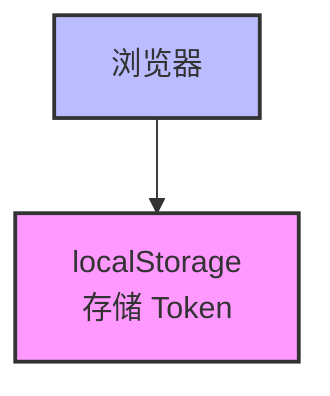
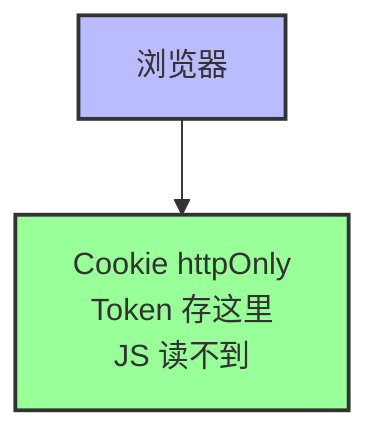
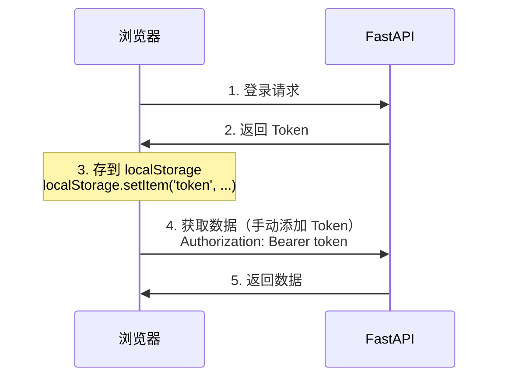
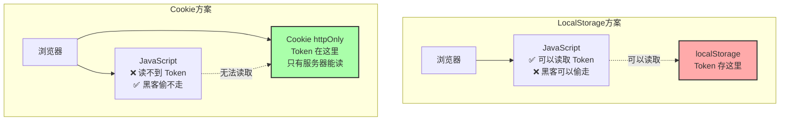
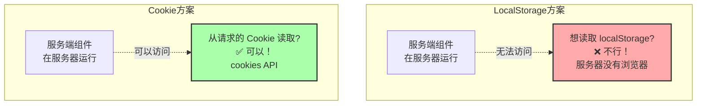

# question.md 详细解释

## 这个文件在讲什么？

这个文件讲的是：**在 Next.js + FastAPI 架构中，如何安全地处理用户登录和认证**。

## 核心问题

### 问题：Token（登录凭证）应该放在哪里？

想象一下，你去银行办业务，银行给你一个号码牌（Token），你拿着这个号码牌才能办业务。

**问题是：这个号码牌应该放在哪里？**

## 两种方案对比

### 方案 1：LocalStorage（你的项目当前用的）

**登录流程**：

1. 用户输入账号密码
2. 后端返回 Token
3. 前端把 Token 存到 localStorage
4. 每次请求时，前端从 localStorage 读取 Token，手动添加到请求头



**类比**：

- 就像你把号码牌放在口袋里
- 每次办业务都要自己掏出来给工作人员看

**优点**：

- ✅ 简单直接
- ✅ 前端完全控制

**缺点**：

- ❌ **不安全**：JavaScript 可以读取，容易被黑客偷走（XSS 攻击）
- ❌ **服务端组件无法使用**：Next.js 的服务端组件在服务器运行，读不到浏览器的 localStorage

### 方案 2：HTTP-only Cookie（推荐方案）

**登录流程**：

1. 用户输入账号密码
2. 后端返回 Token
3. Next.js 把 Token 存到 Cookie（设置 httpOnly）
4. 浏览器每次请求自动携带 Cookie
5. Next.js 从 Cookie 读取 Token，转发给后端



**类比**：

- 就像银行给你一个手环（Cookie）
- 手环自动识别，你不需要掏出来
- 而且手环是锁死的，你自己都打不开（httpOnly）

**优点**：

- ✅ **安全**：JavaScript 读不到，防止 XSS 攻击
- ✅ **自动携带**：浏览器自动在每次请求中带上 Cookie
- ✅ **服务端组件可用**：Next.js 服务端可以读取 Cookie

**缺点**：

- ❌ 需要 Next.js 作为中间层（BFF）

## 详细流程图解

### 当前架构（LocalStorage）



**问题**：

- Token 暴露在 JavaScript 中（不安全）
- 服务端组件无法使用（读不到 localStorage）

### 推荐架构（Cookie + BFF）

```mermaid
sequenceDiagram
    participant Browser as 浏览器
    participant NextJS as Next.js (BFF)
    participant FastAPI as FastAPI

    Browser->>NextJS: 1. 登录请求
    NextJS->>FastAPI: 2. 转发登录请求
    FastAPI->>NextJS: 3. 返回 Token
    Note over NextJS: 4. 把 Token 存到<br/>Cookie (httpOnly)
    NextJS->>Browser: 5. 返回 Cookie<br/>Set-Cookie: token=xxx; httpOnly

    Browser->>NextJS: 6. 访问页面<br/>（自动携带 Cookie）
    Note over NextJS: 7. 从 Cookie 读取 Token
    NextJS->>FastAPI: 8. 转发请求（带 Token）<br/>Authorization: Bearer xxx
    FastAPI->>NextJS: 9. 返回数据
    NextJS->>Browser: 10. 返回页面
```

**优势**：

- Token 存在 Cookie 中，JavaScript 读不到（安全）
- 浏览器自动携带 Cookie（方便）
- Next.js 可以在服务端读取 Cookie（支持服务端组件）

## 核心代码解释

### 1. 登录时：把 Token 存到 Cookie

```typescript
// 登录 Server Action
export async function loginAction(formData: FormData) {
  // 1. 向 FastAPI 发送登录请求
  const res = await fetch("http://api.com/token", {
    method: "POST",
    body: formData,
  });

  const data = await res.json();
  const token = data.access_token;

  // 2. 【关键】把 Token 存到 Cookie
  cookies().set("session_token", token, {
    httpOnly: true, // ← JavaScript 读不到（安全）
    secure: true, // ← 只在 HTTPS 下传输
    maxAge: 7 * 24 * 60 * 60, // ← 7 天过期
  });

  redirect("/dashboard");
}
```

**类比**：

- FastAPI 给了你一个号码牌（Token）
- Next.js 把号码牌锁在一个保险箱里（Cookie with httpOnly）
- 保险箱只有 Next.js 能打开，JavaScript 打不开

### 2. 访问数据时：从 Cookie 读取 Token

```typescript
// 服务端组件
export default async function DashboardPage() {
  // 1. 从 Cookie 读取 Token
  const token = cookies().get("session_token")?.value;

  if (!token) {
    return <div>请先登录</div>;
  }

  // 2. 【关键】用 Token 请求 FastAPI
  const res = await fetch("http://api.com/users/me", {
    headers: {
      Authorization: `Bearer ${token}`, // ← 把 Token 加到请求头
    },
  });

  const user = await res.json();

  return <div>欢迎, {user.username}</div>;
}
```

**类比**：

- 用户访问页面时，浏览器自动带上保险箱（Cookie）
- Next.js 打开保险箱，拿出号码牌（Token）
- Next.js 拿着号码牌去 FastAPI 办业务

## 为什么这个架构更好？

### 1. 安全性



### 2. 支持服务端组件



### 3. 自动携带

```
LocalStorage 方案：
每次请求都要手动添加：
fetch('/api', {
  headers: {
    Authorization: 'Bearer ' + localStorage.getItem('token')
  }
})

Cookie 方案：
浏览器自动携带：
fetch('/api')  // ← Cookie 自动带上，不需要手动添加
```

## 你的项目当前的问题

你的项目使用的是 **LocalStorage 方案**：

```typescript
// frontend/src/hooks/use-auth.ts
const token = localStorage.getItem("access_token"); // ← 存在 localStorage
```

**问题**：

1. ❌ Token 暴露在 JavaScript 中（不安全）
2. ❌ 管理后台必须是客户端组件（因为需要读取 localStorage）
3. ❌ 无法使用服务端组件的优势

## 如何改进？

如果要改用 Cookie 方案，需要：

1. **创建 Next.js API Route 处理登录**

   ```typescript
   // app/api/auth/login/route.ts
   export async function POST(request: Request) {
     const body = await request.json();

     // 调用 FastAPI
     const res = await fetch("http://api.com/token", {
       method: "POST",
       body: JSON.stringify(body),
     });

     const data = await res.json();

     // 设置 Cookie
     const response = NextResponse.json({ success: true });
     response.cookies.set("session_token", data.access_token, {
       httpOnly: true,
       secure: true,
       maxAge: 7 * 24 * 60 * 60,
     });

     return response;
   }
   ```

2. **创建中间件自动添加 Token**

   ```typescript
   // middleware.ts
   export function middleware(request: NextRequest) {
     const token = request.cookies.get("session_token")?.value;

     // 转发请求时自动添加 Token
     const requestHeaders = new Headers(request.headers);
     if (token) {
       requestHeaders.set("Authorization", `Bearer ${token}`);
     }

     return NextResponse.next({
       request: {
         headers: requestHeaders,
       },
     });
   }
   ```

3. **服务端组件可以直接获取数据**

   ```typescript
   // app/dashboard/page.tsx
   export default async function DashboardPage() {
     const token = cookies().get("session_token")?.value;

     const res = await fetch("http://api.com/users/me", {
       headers: { Authorization: `Bearer ${token}` },
     });

     const user = await res.json();

     return <div>欢迎, {user.username}</div>;
   }
   ```

## 总结

**question.md 讲的核心内容**：

1. **问题**：Token 应该放在哪里？
2. **答案**：放在 HTTP-only Cookie 中
3. **原因**：
   - 更安全（JavaScript 读不到）
   - 支持服务端组件
   - 浏览器自动携带
4. **实现**：Next.js 作为 BFF 中间层，负责 Cookie 和 Token 的转换

**你的项目**：

- 当前使用 LocalStorage（简单但不够安全）
- 如果要改进，可以考虑 Cookie 方案
- 但需要重构认证系统（工作量较大）

**建议**：

- 如果项目规模不大，当前方案可以接受
- 如果是生产环境或大型项目，建议改用 Cookie 方案
- 改造时机：下次重构认证系统时一起改

这就是 question.md 想要传达的核心架构思想！
