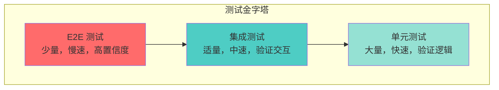
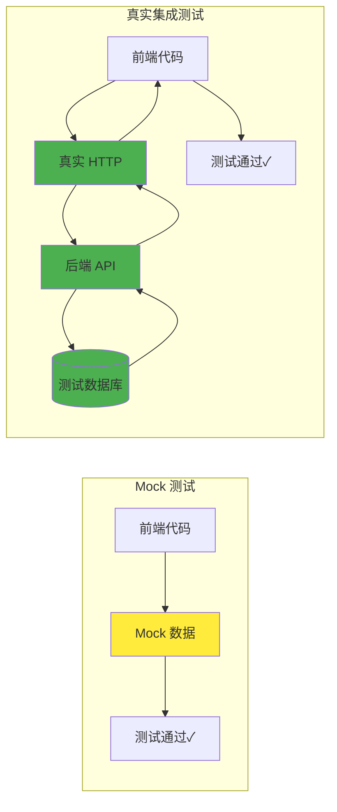
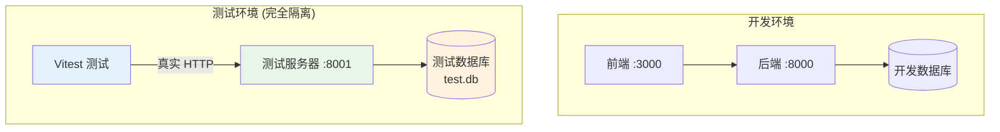
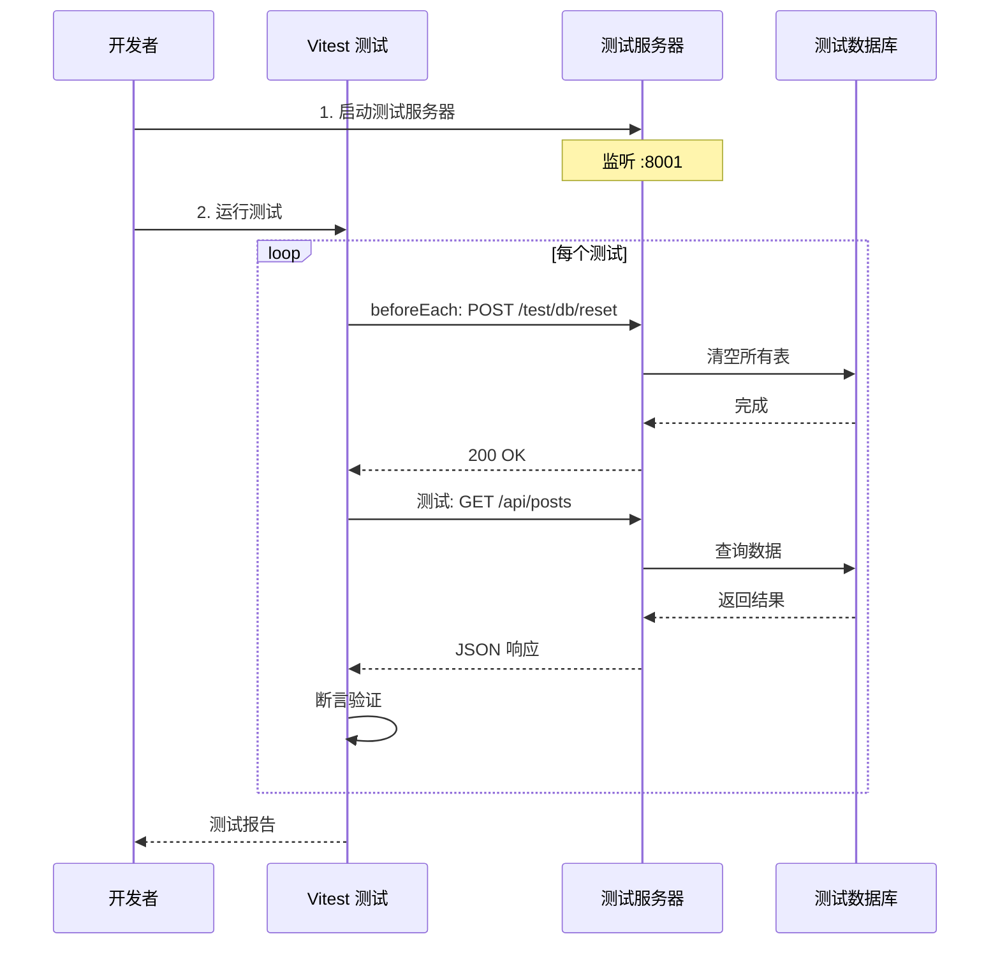

# 前端集成测试方案概览

## 什么是集成测试？

集成测试位于测试金字塔的中间层，介于单元测试和端到端测试之间。它验证多个模块协同工作时的行为，特别是前端与后端 API 的交互。

## 测试金字塔



## 为什么需要真实的集成测试？

### 传统 Mock 方案的问题

```typescript
// ❌ 传统 Mock 方式
vi.mock("@/shared/api", () => ({
  useGetPosts: () => ({
    data: { items: [], total: 0 },
    isLoading: false,
  }),
}));
```

**问题**：

1. **假阳性**：测试通过，但真实 API 可能返回不同的数据结构
2. **维护成本高**：API 变更时需要同步更新所有 Mock
3. **无法测试边界情况**：网络错误、超时、认证失败等
4. **类型不匹配**：Mock 数据可能与实际类型定义不一致

### 真实集成测试的优势



**优势**：

1. **真实性**：测试真实的 HTTP 请求、序列化、中间件
2. **契约验证**：自动验证前后端接口契约
3. **端到端信心**：覆盖整个数据流
4. **重构安全**：后端重构时测试能及时发现问题

## 我们的方案：Test Server + Isolated DB

### 核心理念

**不使用 Mock，而是运行一个真实的后端测试服务器**



### 关键特性

1. **完全隔离**：测试环境与开发环境零交叉
2. **真实 API**：使用真实的 FastAPI 应用
3. **可控状态**：通过测试后门 API 控制数据库状态
4. **快速重置**：每个测试前快速清空数据库

## 适用场景

### ✅ 适合集成测试

- React Query/SWR Hooks 的数据获取逻辑
- 认证流程（登录、Token 刷新、权限验证）
- 复杂的表单提交和验证
- 分页、筛选、排序等查询参数
- 文件上传和下载
- WebSocket 连接

### ❌ 不适合集成测试

- 纯 UI 组件（用单元测试）
- 工具函数（用单元测试）
- 用户交互流程（用 E2E 测试）
- 性能测试（用专门的性能测试工具）

## 测试流程概览



## 与其他测试方案对比

| 特性     | Mock 测试   | 集成测试   | E2E 测试     |
| -------- | ----------- | ---------- | ------------ |
| 速度     | ⚡⚡⚡ 极快 | ⚡⚡ 较快  | ⚡ 慢        |
| 真实性   | ❌ 低       | ✅ 高      | ✅✅ 极高    |
| 维护成本 | 🔧🔧 中等   | 🔧 低      | 🔧🔧🔧 高    |
| 调试难度 | 😊 简单     | 😐 中等    | 😰 困难      |
| 覆盖范围 | 前端逻辑    | 前后端交互 | 完整用户流程 |
| 适用数量 | 大量        | 适量       | 少量         |

## 下一步

- [02-test-server-architecture.md](./02-test-server-architecture.md) - 测试服务器架构详解
- [03-frontend-test-setup.md](./03-frontend-test-setup.md) - 前端测试配置
- [04-writing-tests.md](./04-writing-tests.md) - 编写测试用例
- [05-best-practices.md](./05-best-practices.md) - 最佳实践
