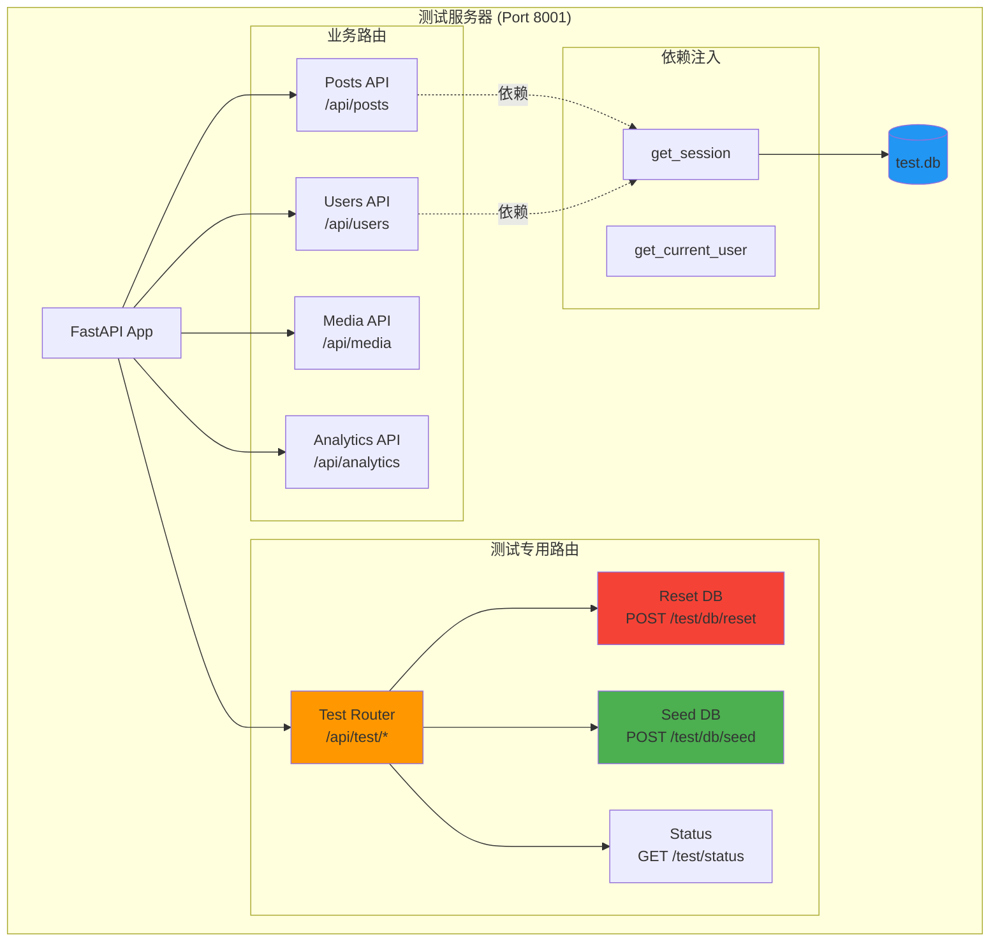
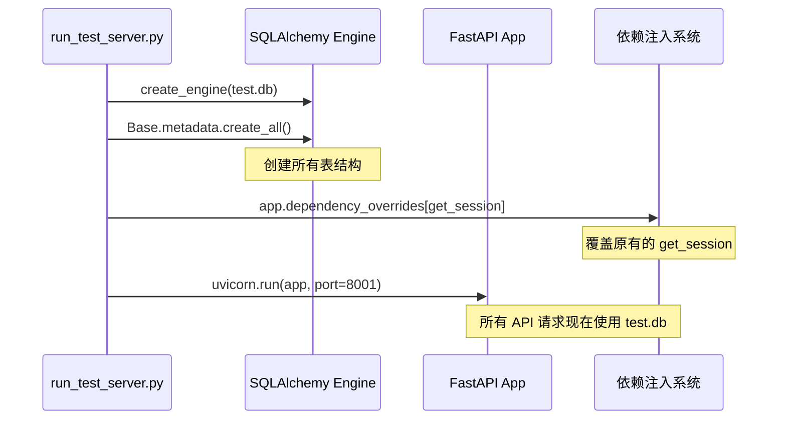
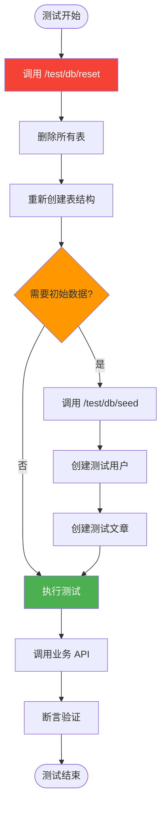
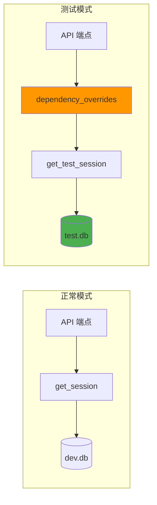

# 测试服务器架构详解

## 整体架构

测试服务器是一个独立运行的 FastAPI 实例，专门为前端集成测试提供服务。



## 核心组件

### 1. 数据库隔离

**关键点**：测试服务器必须使用独立的数据库，避免污染开发数据。

```python
# backend/scripts/run_test_server.py
from sqlalchemy import create_engine
from app.core.db import Base, get_session

# 创建测试数据库引擎
TEST_DATABASE_URL = "sqlite:///./test_server.db"
test_engine = create_engine(
    TEST_DATABASE_URL,
    connect_args={"check_same_thread": False}
)

# 创建所有表
Base.metadata.create_all(bind=test_engine)

# 覆盖依赖注入
def get_test_session():
    TestSessionLocal = sessionmaker(bind=test_engine)
    db = TestSessionLocal()
    try:
        yield db
    finally:
        db.close()

# 应用到 FastAPI
app.dependency_overrides[get_session] = get_test_session
```

**数据库隔离流程**：



### 2. 测试后门 API

测试后门提供了控制测试环境的能力，这是集成测试的核心。

```python
# backend/app/api/test_router.py
from fastapi import APIRouter, Depends
from sqlalchemy.orm import Session
from app.core.db import get_session, Base, engine

router = APIRouter(prefix="/test", tags=["Testing"])

@router.post("/db/reset")
async def reset_database(db: Session = Depends(get_session)):
    """
    清空所有表并重新创建 Schema

    ⚠️ 警告：此操作会删除所有数据！
    """
    # 删除所有表
    Base.metadata.drop_all(bind=engine)

    # 重新创建所有表
    Base.metadata.create_all(bind=engine)

    return {"status": "success", "message": "Database reset complete"}

@router.post("/db/seed")
async def seed_database(db: Session = Depends(get_session)):
    """
    注入测试数据
    """
    from app.users.model import User
    from app.core.security import get_password_hash

    # 创建测试用户
    test_user = User(
        username="testuser",
        email="test@example.com",
        hashed_password=get_password_hash("testpass123"),
        is_active=True
    )
    db.add(test_user)
    db.commit()

    return {
        "status": "success",
        "data": {
            "users_created": 1
        }
    }

@router.get("/status")
async def test_server_status():
    """
    检查测试服务器状态
    """
    return {
        "status": "running",
        "database": "test.db",
        "port": 8001
    }
```

**测试后门工作流程**：



### 3. 启动脚本

```python
# backend/scripts/run_test_server.py
import uvicorn
from app.main import app
from sqlalchemy import create_engine
from sqlalchemy.orm import sessionmaker
from app.core.db import Base, get_session
from app.api.test_router import router as test_router

# 1. 创建测试数据库
TEST_DATABASE_URL = "sqlite:///./test_server.db"
test_engine = create_engine(
    TEST_DATABASE_URL,
    connect_args={"check_same_thread": False}
)

# 2. 创建表结构
Base.metadata.create_all(bind=test_engine)

# 3. 覆盖依赖注入
TestSessionLocal = sessionmaker(
    autocommit=False,
    autoflush=False,
    bind=test_engine
)

def get_test_session():
    db = TestSessionLocal()
    try:
        yield db
    finally:
        db.close()

app.dependency_overrides[get_session] = get_test_session

# 4. 挂载测试路由
app.include_router(test_router, prefix="/api")

# 5. 启动服务器
if __name__ == "__main__":
    print("🧪 Starting Test Server on http://localhost:8001")
    print("📊 Database: test_server.db")
    print("🔧 Test API: http://localhost:8001/api/test/status")

    uvicorn.run(
        app,
        host="0.0.0.0",
        port=8001,
        log_level="info"
    )
```

## 依赖注入覆盖原理

FastAPI 的依赖注入系统允许我们在运行时替换依赖，这是实现数据库隔离的关键。



**代码示例**：

```python
# 原始依赖
def get_session():
    db = SessionLocal()  # 连接到 dev.db
    try:
        yield db
    finally:
        db.close()

# API 端点使用依赖
@app.get("/api/posts")
def get_posts(db: Session = Depends(get_session)):
    return db.query(Post).all()

# 测试模式：覆盖依赖
app.dependency_overrides[get_session] = get_test_session

# 现在所有使用 get_session 的端点都会使用 test.db
```

## 安全性考虑

### 防止测试路由泄露到生产环境

```python
# backend/app/main.py
from app.core.config import settings

# 只在非生产环境挂载测试路由
if settings.ENVIRONMENT != "production":
    from app.api.test_router import router as test_router
    app.include_router(test_router, prefix="/api")
else:
    # 生产环境：测试路由不存在
    pass
```

### 测试服务器访问控制

```python
# 可选：添加简单的认证
TEST_SECRET = "test-server-secret-key"

@router.post("/db/reset")
async def reset_database(
    secret: str = Header(...),
    db: Session = Depends(get_session)
):
    if secret != TEST_SECRET:
        raise HTTPException(status_code=403, detail="Invalid secret")

    # 执行重置...
```

## 性能优化

### 1. 使用内存数据库

```python
# 更快的测试执行
TEST_DATABASE_URL = "sqlite:///:memory:"
```

### 2. 禁用不必要的中间件

```python
# 测试服务器可以禁用某些中间件
if not settings.IS_TEST_SERVER:
    app.add_middleware(SomeSlowMiddleware)
```

### 3. 批量重置

```python
@router.post("/db/reset-fast")
async def reset_database_fast(db: Session = Depends(get_session)):
    """
    快速重置：只删除数据，不重建表结构
    """
    for table in reversed(Base.metadata.sorted_tables):
        db.execute(table.delete())
    db.commit()

    return {"status": "success"}
```

## 故障排查

### 常见问题

1. **端口冲突**：确保 8001 端口未被占用
2. **数据库锁定**：SQLite 并发限制，考虑使用 PostgreSQL
3. **依赖注入未生效**：检查 `dependency_overrides` 的时机

### 调试技巧

```python
# 添加详细日志
import logging
logging.basicConfig(level=logging.DEBUG)

# 检查当前使用的数据库
@router.get("/debug/db-info")
async def debug_db_info(db: Session = Depends(get_session)):
    return {
        "engine": str(db.get_bind().url),
        "tables": [table.name for table in Base.metadata.sorted_tables]
    }
```

## 下一步

- [03-frontend-test-setup.md](./03-frontend-test-setup.md) - 前端测试配置
- [04-writing-tests.md](./04-writing-tests.md) - 编写测试用例
