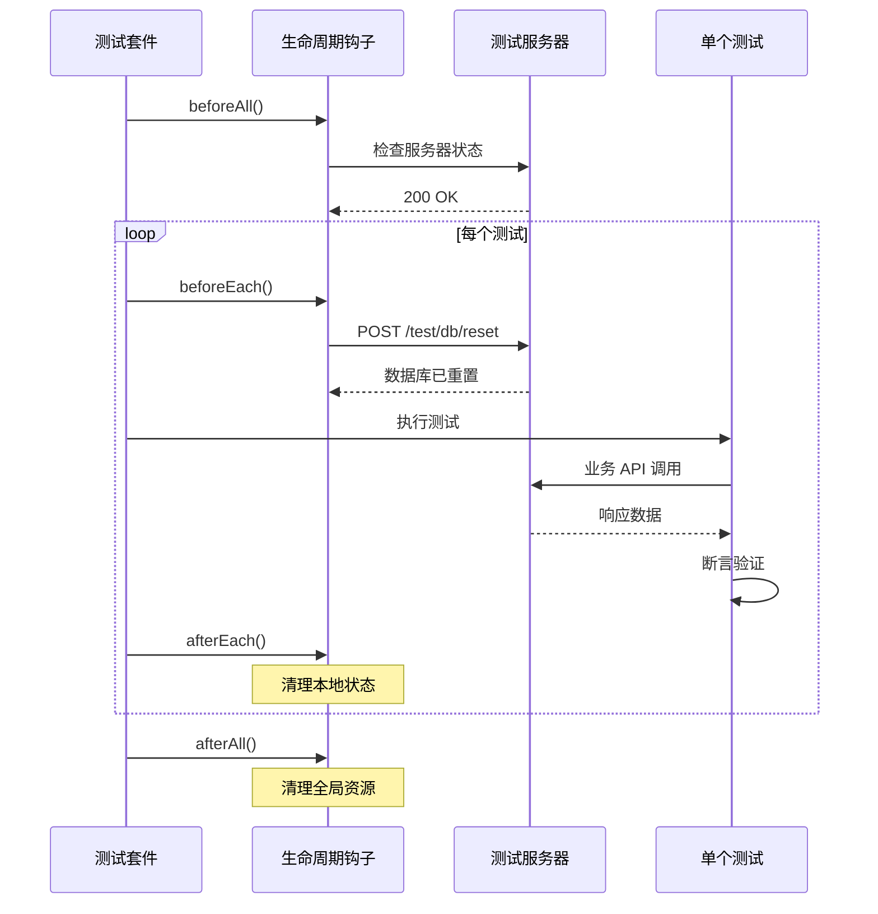

# 前端测试配置详解

## Vitest 配置改造

### 移除 Mock，启用真实 HTTP

```typescript
// frontend/vitest.config.ts
import { defineConfig } from "vitest/config";
import react from "@vitejs/plugin-react";
import path from "path";

export default defineConfig({
  plugins: [react()],
  test: {
    environment: "jsdom",
    setupFiles: ["./src/lib/test-setup.ts"],

    // 环境变量：指向测试服务器
    env: {
      VITE_API_BASE_URL: "http://localhost:8001",
      NODE_ENV: "test",
    },

    // 不再 mock api-client
    // globals: true,
    // mockReset: true, // ❌ 移除
  },
  resolve: {
    alias: {
      "@": path.resolve(__dirname, "./src"),
    },
  },
});
```

## 测试工具函数

创建统一的测试工具库，封装常用操作。

```typescript
// frontend/src/lib/test-utils.ts
import { QueryClient, QueryClientProvider } from "@tanstack/react-query";
import { render, RenderOptions } from "@testing-library/react";
import { ReactElement } from "react";

const TEST_SERVER_URL = "http://localhost:8001";

/**
 * 重置测试数据库
 */
export async function resetTestDB() {
  const response = await fetch(`${TEST_SERVER_URL}/api/test/db/reset`, {
    method: "POST",
  });

  if (!response.ok) {
    throw new Error("Failed to reset test database");
  }

  return response.json();
}

/**
 * 注入测试数据
 */
export async function seedTestDB() {
  const response = await fetch(`${TEST_SERVER_URL}/api/test/db/seed`, {
    method: "POST",
  });

  return response.json();
}

/**
 * 创建测试用户并返回 Token
 */
export async function createTestUser(userData = {}) {
  const defaultUser = {
    username: "testuser",
    email: "test@example.com",
    password: "testpass123",
  };

  const user = { ...defaultUser, ...userData };

  // 注册用户
  const registerRes = await fetch(`${TEST_SERVER_URL}/api/users/register`, {
    method: "POST",
    headers: { "Content-Type": "application/json" },
    body: JSON.stringify(user),
  });

  // 登录获取 Token
  const loginRes = await fetch(`${TEST_SERVER_URL}/api/users/login`, {
    method: "POST",
    headers: { "Content-Type": "application/json" },
    body: JSON.stringify({
      username: user.username,
      password: user.password,
    }),
  });

  const { access_token } = await loginRes.json();

  return {
    user,
    token: access_token,
  };
}

/**
 * 自定义 render 函数，包含 QueryClient
 */
export function renderWithProviders(ui: ReactElement, options?: RenderOptions) {
  const queryClient = new QueryClient({
    defaultOptions: {
      queries: {
        retry: false, // 测试中不重试
        cacheTime: 0, // 不缓存
      },
    },
  });

  function Wrapper({ children }: { children: React.ReactNode }) {
    return (
      <QueryClientProvider client={queryClient}>{children}</QueryClientProvider>
    );
  }

  return render(ui, { wrapper: Wrapper, ...options });
}
```

## 测试生命周期管理



### 实现示例

```typescript
// frontend/src/lib/test-setup.ts
import { beforeAll, beforeEach, afterEach } from "vitest";
import { resetTestDB } from "./test-utils";

// 全局设置
beforeAll(async () => {
  // 检查测试服务器是否运行
  try {
    const response = await fetch("http://localhost:8001/api/test/status");
    if (!response.ok) {
      throw new Error("Test server not responding");
    }
  } catch (error) {
    console.error("❌ Test server is not running!");
    console.error(
      "Please start it with: python backend/scripts/run_test_server.py"
    );
    process.exit(1);
  }
});

// 每个测试前重置数据库
beforeEach(async () => {
  await resetTestDB();

  // 清理 localStorage
  localStorage.clear();

  // 清理 sessionStorage
  sessionStorage.clear();
});

// 每个测试后清理
afterEach(() => {
  // 清理任何全局状态
});
```

## 测试文件结构

```
frontend/src/
├── hooks/
│   ├── useAuth.ts
│   └── __tests__/
│       └── useAuth.integration.test.ts  ← 集成测试
├── components/
│   ├── PostList.tsx
│   └── __tests__/
│       ├── PostList.test.tsx            ← 单元测试
│       └── PostList.integration.test.ts ← 集成测试
└── lib/
    ├── test-utils.ts
    └── test-setup.ts
```

## API 客户端配置

确保 API 客户端使用环境变量中的 URL。

```typescript
// frontend/src/shared/api/client.ts
import { createClient } from "@hey-api/client-fetch";

const baseURL = import.meta.env.VITE_API_BASE_URL || "http://localhost:8000";

export const client = createClient({
  baseURL: `${baseURL}/api`,
});

// 测试环境会自动使用 http://localhost:8001
```

## 认证状态管理

```typescript
// frontend/src/lib/test-auth.ts
import { createTestUser } from "./test-utils";

/**
 * 测试中的认证辅助函数
 */
export class TestAuth {
  private token: string | null = null;

  async login(userData?: any) {
    const { token } = await createTestUser(userData);
    this.token = token;

    // 存储到 localStorage（模拟真实登录）
    localStorage.setItem("auth_token", token);

    return token;
  }

  logout() {
    this.token = null;
    localStorage.removeItem("auth_token");
  }

  getToken() {
    return this.token;
  }

  getAuthHeader() {
    return {
      Authorization: `Bearer ${this.token}`,
    };
  }
}

// 使用示例
export const testAuth = new TestAuth();
```

## 下一步

- [04-writing-tests.md](./04-writing-tests.md) - 编写测试用例
- [05-best-practices.md](./05-best-practices.md) - 最佳实践
