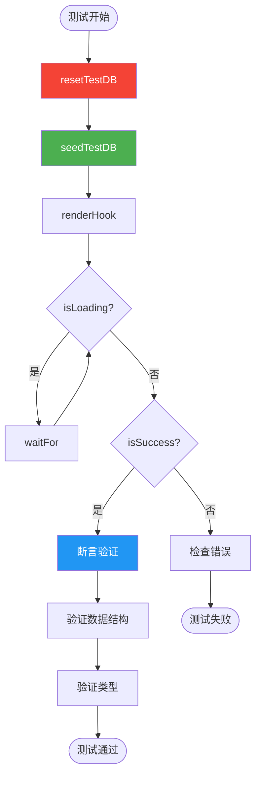

# 编写集成测试用例

## 测试 React Query Hooks

### 基础数据获取测试

```typescript
// frontend/src/hooks/__tests__/usePosts.integration.test.ts
import { describe, it, expect, beforeEach } from "vitest";
import { renderHook, waitFor } from "@testing-library/react";
import { QueryClient, QueryClientProvider } from "@tanstack/react-query";
import { useGetPosts } from "@/shared/api";
import { resetTestDB, seedTestDB } from "@/lib/test-utils";

describe("useGetPosts Integration", () => {
  let queryClient: QueryClient;

  beforeEach(async () => {
    await resetTestDB();

    queryClient = new QueryClient({
      defaultOptions: {
        queries: { retry: false },
      },
    });
  });

  it("should fetch posts from real API", async () => {
    // 注入测试数据
    await seedTestDB();

    const wrapper = ({ children }: any) => (
      <QueryClientProvider client={queryClient}>{children}</QueryClientProvider>
    );

    const { result } = renderHook(() => useGetPosts(), { wrapper });

    // 等待数据加载
    await waitFor(() => {
      expect(result.current.isSuccess).toBe(true);
    });

    // 验证数据结构
    expect(result.current.data).toBeDefined();
    expect(result.current.data?.items).toBeInstanceOf(Array);
    expect(result.current.data?.total).toBeGreaterThanOrEqual(0);
  });

  it("should handle pagination parameters", async () => {
    const wrapper = ({ children }: any) => (
      <QueryClientProvider client={queryClient}>{children}</QueryClientProvider>
    );

    const { result } = renderHook(
      () => useGetPosts({ page: 2, page_size: 10 }),
      { wrapper }
    );

    await waitFor(() => {
      expect(result.current.isSuccess).toBe(true);
    });

    // 验证分页参数被正确传递
    expect(result.current.data?.items.length).toBeLessThanOrEqual(10);
  });
});
```

### 测试流程图



## 测试认证流程

```typescript
// frontend/src/hooks/__tests__/useAuth.integration.test.ts
import { describe, it, expect, beforeEach } from "vitest";
import { renderHook, waitFor, act } from "@testing-library/react";
import { useAuth } from "@/hooks/useAuth";
import { resetTestDB } from "@/lib/test-utils";

describe("useAuth Integration", () => {
  beforeEach(async () => {
    await resetTestDB();
    localStorage.clear();
  });

  it("should register and login user", async () => {
    const { result } = renderHook(() => useAuth());

    // 1. 注册
    await act(async () => {
      await result.current.register({
        username: "newuser",
        email: "new@example.com",
        password: "password123",
      });
    });

    expect(result.current.isAuthenticated).toBe(true);
    expect(result.current.user).toBeDefined();
    expect(result.current.user?.username).toBe("newuser");

    // 2. 登出
    act(() => {
      result.current.logout();
    });

    expect(result.current.isAuthenticated).toBe(false);

    // 3. 重新登录
    await act(async () => {
      await result.current.login({
        username: "newuser",
        password: "password123",
      });
    });

    expect(result.current.isAuthenticated).toBe(true);
  });

  it("should handle invalid credentials", async () => {
    const { result } = renderHook(() => useAuth());

    await act(async () => {
      try {
        await result.current.login({
          username: "nonexistent",
          password: "wrongpass",
        });
      } catch (error: any) {
        expect(error.message).toContain("Invalid credentials");
      }
    });

    expect(result.current.isAuthenticated).toBe(false);
  });
});
```

## 测试复杂查询参数

```typescript
// frontend/src/hooks/__tests__/usePostsFilter.integration.test.ts
import { describe, it, expect } from "vitest";
import { renderHook, waitFor } from "@testing-library/react";
import { useGetPosts } from "@/shared/api";
import { seedTestDB } from "@/lib/test-utils";

describe("Posts Filtering Integration", () => {
  it("should filter by category", async () => {
    await seedTestDB();

    const { result } = renderHook(() => useGetPosts({ category: "tech" }));

    await waitFor(() => expect(result.current.isSuccess).toBe(true));

    // 验证所有返回的文章都属于 tech 分类
    result.current.data?.items.forEach((post) => {
      expect(post.category).toBe("tech");
    });
  });

  it("should sort by date", async () => {
    await seedTestDB();

    const { result } = renderHook(() =>
      useGetPosts({ sort: "created_at", order: "desc" })
    );

    await waitFor(() => expect(result.current.isSuccess).toBe(true));

    const items = result.current.data?.items || [];

    // 验证排序
    for (let i = 0; i < items.length - 1; i++) {
      const current = new Date(items[i].created_at);
      const next = new Date(items[i + 1].created_at);
      expect(current.getTime()).toBeGreaterThanOrEqual(next.getTime());
    }
  });
});
```

## 测试 Mutation 操作

```typescript
// frontend/src/hooks/__tests__/useCreatePost.integration.test.ts
import { describe, it, expect, beforeEach } from "vitest";
import { renderHook, waitFor, act } from "@testing-library/react";
import { useCreatePost, useGetPosts } from "@/shared/api";
import { resetTestDB, testAuth } from "@/lib/test-utils";

describe("useCreatePost Integration", () => {
  beforeEach(async () => {
    await resetTestDB();
    await testAuth.login();
  });

  it("should create a new post", async () => {
    const { result: createResult } = renderHook(() => useCreatePost());
    const { result: listResult } = renderHook(() => useGetPosts());

    // 创建文章
    await act(async () => {
      await createResult.current.mutateAsync({
        title: "Test Post",
        content: "Test content",
        category: "tech",
      });
    });

    expect(createResult.current.isSuccess).toBe(true);

    // 验证文章已创建
    await waitFor(() => {
      expect(listResult.current.data?.items).toContainEqual(
        expect.objectContaining({
          title: "Test Post",
        })
      );
    });
  });

  it("should handle validation errors", async () => {
    const { result } = renderHook(() => useCreatePost());

    await act(async () => {
      try {
        await result.current.mutateAsync({
          title: "", // 空标题应该失败
          content: "Test",
        });
      } catch (error: any) {
        expect(error.message).toContain("title");
      }
    });

    expect(result.current.isError).toBe(true);
  });
});
```

## 测试文件上传

```typescript
// frontend/src/hooks/__tests__/useUploadMedia.integration.test.ts
import { describe, it, expect } from "vitest";
import { renderHook, act } from "@testing-library/react";
import { useUploadMedia } from "@/hooks/useUploadMedia";
import { testAuth } from "@/lib/test-utils";

describe("useUploadMedia Integration", () => {
  it("should upload file successfully", async () => {
    await testAuth.login();

    const { result } = renderHook(() => useUploadMedia());

    // 创建测试文件
    const file = new File(["test content"], "test.txt", {
      type: "text/plain",
    });

    await act(async () => {
      await result.current.mutateAsync({ file });
    });

    expect(result.current.isSuccess).toBe(true);
    expect(result.current.data).toHaveProperty("url");
    expect(result.current.data?.filename).toBe("test.txt");
  });
});
```

## 下一步

- [05-best-practices.md](./05-best-practices.md) - 最佳实践和常见问题
