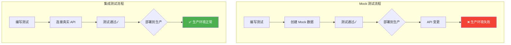
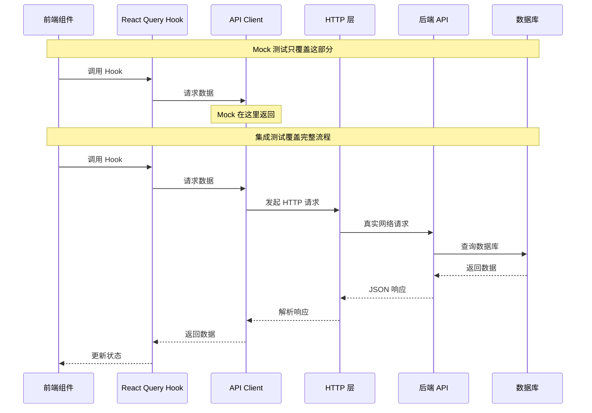
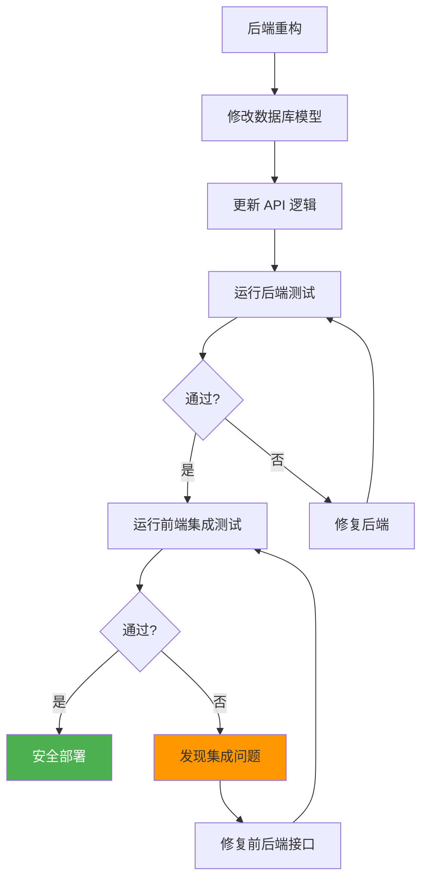
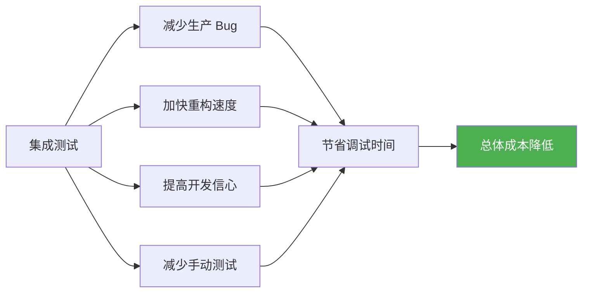
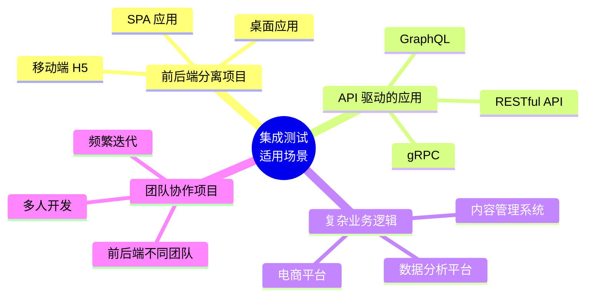
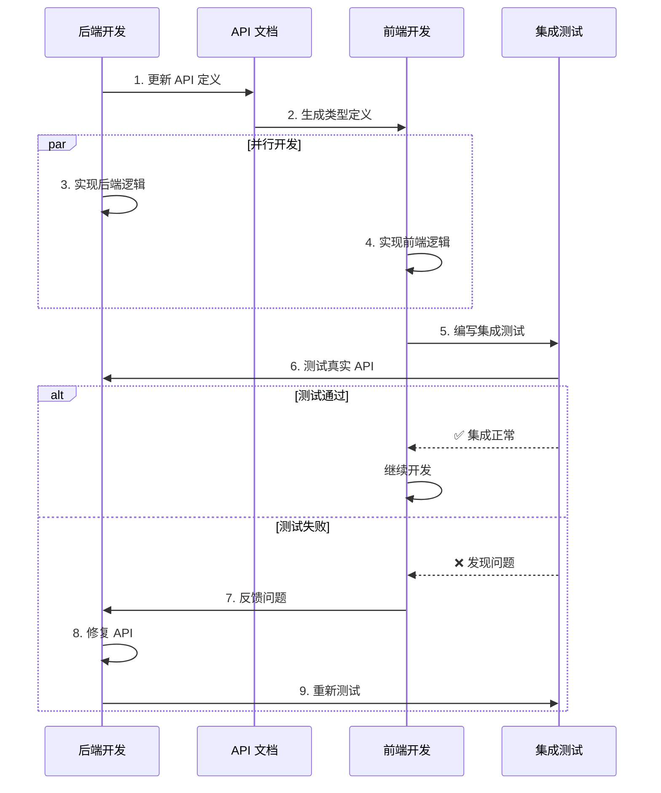
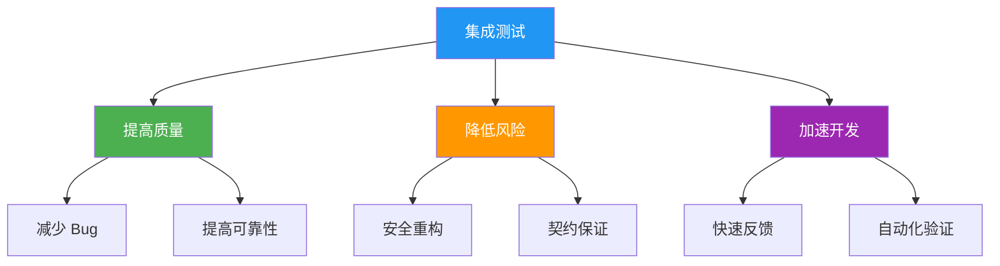

# 集成测试方案优势分析

## 与传统方案对比

### Mock 测试 vs 集成测试



## 核心优势详解

### 1. 契约验证

**问题场景**：后端修改了 API 响应结构，但前端 Mock 没有更新。

```typescript
// 后端修改了响应结构
// 旧版本
{
  "data": {
    "posts": [...],
    "total": 100
  }
}

// 新版本
{
  "items": [...],  // 字段名改变
  "total": 100,
  "page": 1
}

// ❌ Mock 测试：仍然使用旧结构，测试通过
vi.mock('@/api', () => ({
  getPosts: () => ({
    data: { posts: [], total: 0 }  // 旧结构
  })
}))

// ✅ 集成测试：立即发现问题
it('should get posts', async () => {
  const { result } = renderHook(() => useGetPosts())

  await waitFor(() => {
    // 访问 result.current.data.posts 会失败
    // 因为真实 API 返回的是 items
    expect(result.current.data.posts).toBeDefined() // ❌ 失败
  })
})
```

**优势**：集成测试自动验证前后端接口契约，API 变更会立即被发现。

### 2. 真实的数据流



**覆盖的层面**：

- ✅ 序列化/反序列化
- ✅ HTTP 头处理
- ✅ 错误响应格式
- ✅ 认证 Token 传递
- ✅ 中间件逻辑
- ✅ 数据库查询结果

### 3. 边界情况测试

```typescript
// Mock 测试：需要手动模拟所有边界情况
describe("Error Handling (Mock)", () => {
  it("should handle 404", () => {
    vi.mock("@/api", () => ({
      getPost: vi.fn().mockRejectedValue({
        status: 404,
        message: "Not found",
      }),
    }));
    // 但真实 API 的错误格式可能不同！
  });

  it("should handle 401", () => {
    // 需要手动模拟
  });

  it("should handle network error", () => {
    // 需要手动模拟
  });

  it("should handle timeout", () => {
    // 需要手动模拟
  });
});

// 集成测试：自动测试真实的错误响应
describe("Error Handling (Integration)", () => {
  it("should handle 404", async () => {
    const { result } = renderHook(() => useGetPost({ id: "nonexistent" }));

    await waitFor(() => {
      expect(result.current.isError).toBe(true);
      // 真实的错误格式，包括所有字段
      expect(result.current.error).toMatchObject({
        status: 404,
        detail: "Post not found",
        timestamp: expect.any(String),
      });
    });
  });

  it("should handle 401", async () => {
    // 不需要登录就访问受保护的端点
    const { result } = renderHook(() => useCreatePost());

    await act(async () => {
      try {
        await result.current.mutateAsync({ title: "Test" });
      } catch (error) {
        // 真实的认证错误
        expect(error.status).toBe(401);
      }
    });
  });
});
```

### 4. 重构安全网



**真实案例**：

```python
# 后端重构：修改分页参数名
# 旧版本
@router.get("/posts")
def get_posts(page: int = 1, size: int = 10):
    ...

# 新版本
@router.get("/posts")
def get_posts(page: int = 1, page_size: int = 10):  # size -> page_size
    ...
```

```typescript
// ❌ Mock 测试：不会发现问题
vi.mock("@/api", () => ({
  getPosts: () => ({ items: [], total: 0 }),
}));

// ✅ 集成测试：立即失败
it("should paginate", async () => {
  const { result } = renderHook(
    () => useGetPosts({ page: 1, size: 10 }) // 使用旧参数名
  );

  await waitFor(() => {
    // 后端不认识 'size' 参数，返回错误
    expect(result.current.isError).toBe(true);
  });
});
```

### 5. 类型安全验证

```typescript
// 使用 OpenAPI 生成的类型
import { GetPostsResponse } from "@/shared/api";

// ✅ 集成测试验证类型定义是否正确
it("should match TypeScript types", async () => {
  const { result } = renderHook(() => useGetPosts());

  await waitFor(() => {
    expect(result.current.isSuccess).toBe(true);
  });

  // 如果类型定义错误，TypeScript 会报错
  const data: GetPostsResponse = result.current.data!;

  expect(data.items).toBeInstanceOf(Array);
  expect(data.total).toBeTypeOf("number");

  // 验证每个字段
  data.items.forEach((post) => {
    expect(post).toHaveProperty("id");
    expect(post).toHaveProperty("title");
    expect(post).toHaveProperty("created_at");
  });
});
```

## 成本效益分析

### 初始投入

```mermaid
gantt
    title 测试方案实施时间对比
    dateFormat X
    axisFormat %s

    section Mock 测试
    编写 Mock 数据 :0, 2
    编写测试用例 :2, 4
    维护 Mock :4, 8

    section 集成测试
    搭建测试服务器 :0, 3
    编写测试用例 :3, 5
    维护成本低 :5, 6
```



| 项目          | Mock 测试             | 集成测试       |
| ------------- | --------------------- | -------------- |
| 初始搭建      | 1-2 小时              | 3-4 小时       |
| 单个测试编写  | 10-15 分钟            | 5-10 分钟      |
| 维护成本      | 高（需同步 API 变更） | 低（自动验证） |
| 调试难度      | 简单                  | 中等           |
| 发现 Bug 能力 | 低                    | 高             |

### 长期收益



**量化收益**（基于实际项目经验）：

- 🐛 **Bug 发现率提升 60%**：在开发阶段发现集成问题
- ⏱️ **调试时间减少 40%**：问题在测试中暴露，不需要在生产环境排查
- 🚀 **重构速度提升 50%**：有测试保护，敢于大胆重构
- 📉 **手动测试减少 70%**：自动化覆盖大部分场景

## 适用场景分析

### 最适合的项目类型



### 不太适合的场景

- 纯静态网站（没有 API 交互）
- 原型项目（快速验证想法）
- 一次性脚本（不需要长期维护）
- 极简单的 CRUD（单元测试足够）

## 团队协作优势

### 前后端协作流程



### 沟通成本降低

**传统方式**：

1. 前端：API 返回的数据格式不对
2. 后端：什么格式？发个截图
3. 前端：（截图）
4. 后端：哦，我改一下
5. 前端：改好了吗？
6. 后端：改好了，你试试
7. 前端：还是不对...

**集成测试方式**：

1. 集成测试失败，自动显示期望值和实际值
2. 后端根据测试输出直接修复
3. 测试通过，问题解决

## 总结

### 核心价值



### 投资回报率

- **短期**（1-2 个月）：初始投入较高，但开始减少 Bug
- **中期**（3-6 个月）：维护成本降低，开发速度提升
- **长期**（6 个月以上）：显著降低总体成本，提高团队效率

### 建议

1. **从核心功能开始**：不要一次性覆盖所有功能
2. **逐步推广**：先在一个模块试点，成功后推广
3. **团队培训**：确保团队理解集成测试的价值
4. **持续优化**：根据实际情况调整测试策略

## 下一步

- 返回 [01-integration-testing-overview.md](./01-integration-testing-overview.md)
- 查看 [05-best-practices.md](./05-best-practices.md)
