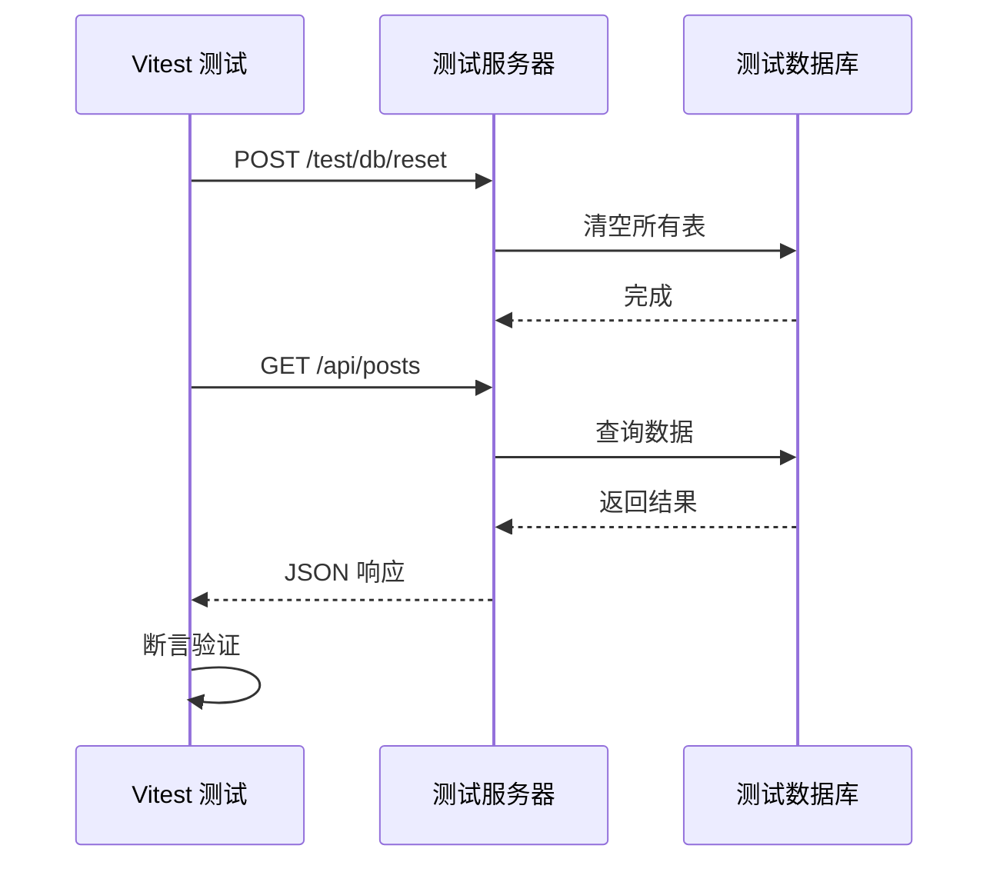

# 前端集成测试文档

这是一套完整的前端集成测试方案文档，介绍如何使用真实的后端 API 进行前端测试，而不是依赖 Mock。

## 📚 文档目录

### 1. [集成测试概览](./01-integration-testing-overview.md)

- 什么是集成测试？
- 为什么需要真实的集成测试？
- 我们的方案：Test Server + Isolated DB
- 与其他测试方案对比

### 2. [测试服务器架构](./02-test-server-architecture.md)

- 整体架构设计
- 数据库隔离原理
- 测试后门 API
- 依赖注入覆盖
- 安全性考虑

### 3. [前端测试配置](./03-frontend-test-setup.md)

- Vitest 配置改造
- 测试工具函数
- 测试生命周期管理
- API 客户端配置
- 认证状态管理

### 4. [编写测试用例](./04-writing-tests.md)

- 测试 React Query Hooks
- 测试认证流程
- 测试复杂查询参数
- 测试 Mutation 操作
- 测试文件上传

### 5. [最佳实践](./05-best-practices.md)

- 测试隔离原则
- 数据准备策略
- 异步测试技巧
- 错误处理测试
- 性能优化
- 调试技巧
- 常见陷阱

### 6. [优势分析](./06-benefits-analysis.md)

- 与传统方案对比
- 核心优势详解
- 成本效益分析
- 适用场景分析
- 团队协作优势

## 🚀 快速开始

### 1. 启动测试服务器

```bash
# 终端 A
cd backend
python scripts/run_test_server.py
```

### 2. 运行前端测试

```bash
# 终端 B
cd frontend
pnpm test
```

## 🎯 核心理念

**不使用 Mock，而是连接真实的后端 API**

```
前端测试 → 真实 HTTP 请求 → 测试服务器 (:8001) → 测试数据库 (test.db)
```

## ✨ 主要优势

- ✅ **真实性**：测试真实的 HTTP 请求、序列化、中间件
- ✅ **契约验证**：自动验证前后端接口契约
- ✅ **端到端信心**：覆盖整个数据流
- ✅ **重构安全**：后端重构时测试能及时发现问题
- ✅ **零污染**：完全隔离的测试环境

## 📊 测试流程



## 🛠️ 技术栈

- **前端测试**：Vitest + React Testing Library
- **后端**：FastAPI + SQLAlchemy
- **数据库**：SQLite (测试) / PostgreSQL (生产)
- **HTTP 客户端**：@hey-api/client-fetch

## 📖 相关资源

- [PLAN.md](../../../PLAN.md) - 项目计划
- [后端测试文档](../../../backend/docs/TESTING_STRATEGY.md)
- [API 文档](../../api/)

## 🤝 贡献

欢迎提出改进建议和最佳实践！

## 📝 许可

MIT License
