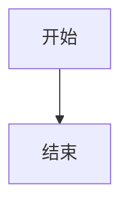

# 调试测试页面

这是一个简单的测试页面，用于验证修复后的功能。

## 简单的 Mermaid 测试



## 文本内容测试

这是一个普通的段落，用于测试是否还有嵌套问题。

这是另一个段落。

## 代码块测试

```javascript
console.log("Hello World");
```

## React Flow 测试

<SimpleFlowExample />
