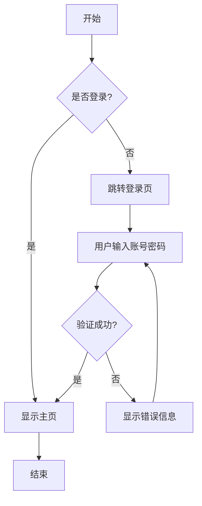
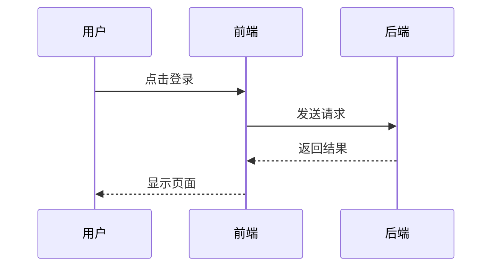

# 流程图测试页面

这是一个简单的测试页面，用于验证流程图功能是否正常工作。

## Mermaid 流程图测试

### 基本流程图

### 时序图测试

## React Flow 交互式图表测试

### 简单流程图

<SimpleFlowExample />

### 系统架构图

<SystemArchExample />

## 测试结果

如果你能看到上面的图表正常显示，说明流程图功能配置成功！

- ✅ Mermaid 静态图表
- ✅ React Flow 交互式图表
- ✅ MDX 组件集成
