# MDX 完整功能展示

欢迎来到 **MDX 完整功能展示页面**！这里展示了 MDX 的所有强大功能。

## 📝 Markdown 基础语法

### 文本格式

这是**粗体文本**，这是*斜体文本*，这是***粗斜体文本***。

这是~~删除线文本~~，这是`行内代码`。

### 引用块

> "The only way to do great work is to love what you do."
>
> — Steve Jobs

### 列表

#### 无序列表

- 第一项
- 第二项
  - 嵌套项 2.1
  - 嵌套项 2.2
- 第三项

#### 有序列表

1. 第一步：安装依赖
2. 第二步：配置环境
3. 第三步：运行项目

### 任务列表

- [x] 完成 MDX 配置
- [x] 添加代码高亮
- [ ] 编写文档
- [ ] 部署上线

---

## 💻 编程语言代码展示

### Python 示例

```python
# Python 数据分析示例
import numpy as np
import pandas as pd
from sklearn.linear_model import LinearRegression

class DataAnalyzer:
    """数据分析器类"""

    def __init__(self, data):
        self.data = data
        self.model = LinearRegression()

    def preprocess(self):
        """数据预处理"""
        # 处理缺失值
        self.data = self.data.dropna()
        return self

    def train(self, X, y):
        """训练模型"""
        self.model.fit(X, y)
        return self.model.score(X, y)

# 使用示例
df = pd.read_csv('data.csv')
analyzer = DataAnalyzer(df)
accuracy = analyzer.preprocess().train(X_train, y_train)
print(f"模型准确率: {accuracy:.2%}")
```

### Java 示例

```java
// Java Spring Boot 控制器示例
package com.example.blog.controller;

import org.springframework.beans.factory.annotation.Autowired;
import org.springframework.web.bind.annotation.*;
import java.util.List;

/**
 * 博客文章控制器
 * @author Developer
 * @version 1.0
 */
@RestController
@RequestMapping("/api/posts")
public class PostController {

    @Autowired
    private PostService postService;

    /**
     * 获取所有文章
     * @return 文章列表
     */
    @GetMapping
    public List<Post> getAllPosts() {
        return postService.findAll();
    }

    /**
     * 根据ID获取文章
     * @param id 文章ID
     * @return 文章对象
     */
    @GetMapping("/{id}")
    public Post getPostById(@PathVariable Long id) {
        return postService.findById(id)
            .orElseThrow(() -> new ResourceNotFoundException("Post not found"));
    }

    /**
     * 创建新文章
     * @param post 文章对象
     * @return 创建的文章
     */
    @PostMapping
    public Post createPost(@RequestBody Post post) {
        return postService.save(post);
    }
}
```

### C++ 示例

```cpp
// C++ 模板元编程和智能指针示例
#include <iostream>
#include <memory>
#include <vector>
#include <algorithm>

/**
 * 泛型二叉搜索树实现
 */
template<typename T>
class BinarySearchTree {
private:
    struct Node {
        T data;
        std::unique_ptr<Node> left;
        std::unique_ptr<Node> right;

        Node(const T& value) : data(value), left(nullptr), right(nullptr) {}
    };

    std::unique_ptr<Node> root;

    // 递归插入
    void insert(std::unique_ptr<Node>& node, const T& value) {
        if (!node) {
            node = std::make_unique<Node>(value);
            return;
        }

        if (value < node->data)
            insert(node->left, value);
        else if (value > node->data)
            insert(node->right, value);
    }

public:
    BinarySearchTree() : root(nullptr) {}

    void insert(const T& value) {
        insert(root, value);
    }

    // 中序遍历
    template<typename Func>
    void inorder(const std::unique_ptr<Node>& node, Func func) const {
        if (!node) return;
        inorder(node->left, func);
        func(node->data);
        inorder(node->right, func);
    }
};

int main() {
    BinarySearchTree<int> bst;
    std::vector<int> values = {5, 3, 7, 1, 9, 4, 6};

    for (const auto& val : values) {
        bst.insert(val);
    }

    bst.inorder(bst.root, [](int val) {
        std::cout << val << " ";
    });

    return 0;
}
```

### Rust 示例

```rust
// Rust 异步编程和所有权示例
use std::sync::Arc;
use tokio::sync::Mutex;
use serde::{Deserialize, Serialize};

/// 用户结构体
#[derive(Debug, Clone, Serialize, Deserialize)]
struct User {
    id: u64,
    name: String,
    email: String,
}

/// 用户仓库trait
#[async_trait::async_trait]
trait UserRepository {
    async fn find_by_id(&self, id: u64) -> Option<User>;
    async fn save(&self, user: User) -> Result<(), String>;
}

/// 内存用户仓库实现
struct InMemoryUserRepository {
    users: Arc<Mutex<Vec<User>>>,
}

impl InMemoryUserRepository {
    fn new() -> Self {
        Self {
            users: Arc::new(Mutex::new(Vec::new())),
        }
    }
}

#[async_trait::async_trait]
impl UserRepository for InMemoryUserRepository {
    async fn find_by_id(&self, id: u64) -> Option<User> {
        let users = self.users.lock().await;
        users.iter().find(|u| u.id == id).cloned()
    }

    async fn save(&self, user: User) -> Result<(), String> {
        let mut users = self.users.lock().await;
        users.push(user);
        Ok(())
    }
}

#[tokio::main]
async fn main() -> Result<(), Box<dyn std::error::Error>> {
    let repo = InMemoryUserRepository::new();

    let user = User {
        id: 1,
        name: "Alice".to_string(),
        email: "alice@example.com".to_string(),
    };

    repo.save(user).await?;

    if let Some(found_user) = repo.find_by_id(1).await {
        println!("Found user: {:?}", found_user);
    }

    Ok(())
}
```

### TypeScript 示例

```typescript
// TypeScript 高级类型和装饰器示例
import { Request, Response, NextFunction } from "express";

/**
 * 泛型仓储接口
 */
interface Repository<T> {
  findById(id: string): Promise<T | null>;
  findAll(): Promise<T[]>;
  create(entity: Omit<T, "id">): Promise<T>;
  update(id: string, entity: Partial<T>): Promise<T>;
  delete(id: string): Promise<void>;
}

/**
 * 实体基类
 */
abstract class BaseEntity {
  id!: string;
  createdAt!: Date;
  updatedAt!: Date;
}

/**
 * 用户实体
 */
class User extends BaseEntity {
  email!: string;
  name!: string;
  role!: "admin" | "user" | "guest";
}

/**
 * 装饰器：日志记录
 */
function Log(target: any, propertyKey: string, descriptor: PropertyDescriptor) {
  const originalMethod = descriptor.value;

  descriptor.value = async function (...args: any[]) {
    console.log(`Calling ${propertyKey} with args:`, args);
    const result = await originalMethod.apply(this, args);
    console.log(`${propertyKey} returned:`, result);
    return result;
  };

  return descriptor;
}

/**
 * 用户服务类
 */
class UserService {
  constructor(private repository: Repository<User>) {}

  @Log
  async getUserById(id: string): Promise<User | null> {
    return this.repository.findById(id);
  }

  @Log
  async createUser(
    data: Omit<User, "id" | "createdAt" | "updatedAt">,
  ): Promise<User> {
    return this.repository.create(data);
  }
}

// Express 中间件类型
type AsyncHandler = (
  req: Request,
  res: Response,
  next: NextFunction,
) => Promise<void>;

const asyncHandler = (fn: AsyncHandler): AsyncHandler => {
  return async (req, res, next) => {
    try {
      await fn(req, res, next);
    } catch (error) {
      next(error);
    }
  };
};
```

### Scala 示例

```scala
sealed trait Tree[+A]
case object Leaf extends Tree[Nothing]
case class Branch[A](value: A, left: Tree[A], right: Tree[A]) extends Tree[A]

object TreeOps {
  // 纯函数式的树遍历
  def depth[A](t: Tree[A]): Int = t match {
    case Leaf => 0
    case Branch(_, l, r) => 1 + (depth(l) max depth(r))
  }

  def main(args: Array[String]): Unit = {
    val tree = Branch(1, Branch(2, Leaf, Leaf), Leaf)
    println(s"Tree Depth: ${depth(tree)}")
  }
}
```

### JavaScript 示例

```javascript
// JavaScript ES6+ 高级特性示例
class EventEmitter {
  constructor() {
    this.events = new Map();
  }

  /**
   * 注册事件监听器
   * @param {string} event - 事件名称
   * @param {Function} listener - 监听器函数
   */
  on(event, listener) {
    if (!this.events.has(event)) {
      this.events.set(event, new Set());
    }
    this.events.get(event).add(listener);
    return this;
  }

  /**
   * 触发事件
   * @param {string} event - 事件名称
   * @param {...any} args - 传递给监听器的参数
   */
  emit(event, ...args) {
    if (!this.events.has(event)) return false;

    for (const listener of this.events.get(event)) {
      listener(...args);
    }
    return true;
  }

  /**
   * 移除事件监听器
   */
  off(event, listener) {
    if (!this.events.has(event)) return this;
    this.events.get(event).delete(listener);
    return this;
  }
}

// 使用 Proxy 实现响应式数据
function reactive(target) {
  return new Proxy(target, {
    get(obj, prop) {
      console.log(`Getting ${prop}`);
      return Reflect.get(obj, prop);
    },
    set(obj, prop, value) {
      console.log(`Setting ${prop} to ${value}`);
      return Reflect.set(obj, prop, value);
    },
  });
}

// 异步迭代器示例
async function* fetchPages(url, maxPages = 5) {
  for (let page = 1; page <= maxPages; page++) {
    const response = await fetch(`${url}?page=${page}`);
    const data = await response.json();
    yield data;
  }
}

// 使用
(async () => {
  for await (const page of fetchPages("/api/posts")) {
    console.log("Page data:", page);
  }
})();
```

---

## 🧮 数学公式展示

### 基本运算

行内公式：质能方程 $E = mc^2$，勾股定理 $a^2 + b^2 = c^2$

### 复杂代数式

二次方程求根公式：

$$
x = \frac{-b \pm \sqrt{b^2 - 4ac}}{2a}
$$

多项式展开：

$$
(a + b)^n = \sum_{k=0}^{n} \binom{n}{k} a^{n-k} b^k
$$

### 麦克斯韦方程组

$$
\begin{aligned}
\nabla \cdot \mathbf{E} &= \frac{\rho}{\epsilon_0} \\
\nabla \cdot \mathbf{B} &= 0 \\
\nabla \times \mathbf{E} &= -\frac{\partial \mathbf{B}}{\partial t} \\
\nabla \times \mathbf{B} &= \mu_0 \mathbf{J} + \mu_0 \epsilon_0 \frac{\partial \mathbf{E}}{\partial t}
\end{aligned}
$$

### 偏微分方程

热传导方程：

$$
\frac{\partial u}{\partial t} = \alpha \nabla^2 u = \alpha \left(\frac{\partial^2 u}{\partial x^2} + \frac{\partial^2 u}{\partial y^2} + \frac{\partial^2 u}{\partial z^2}\right)
$$

薛定谔方程：

$$
i\hbar\frac{\partial}{\partial t}\Psi(\mathbf{r},t) = \hat{H}\Psi(\mathbf{r},t)
$$

### 积分

#### 基本积分

$$
\int x^n \, dx = \frac{x^{n+1}}{n+1} + C, \quad n \neq -1
$$

$$
\int e^x \, dx = e^x + C
$$

$$
\int \frac{1}{x} \, dx = \ln|x| + C
$$

#### 定积分

高斯积分：

$$
\int_{-\infty}^{\infty} e^{-x^2} \, dx = \sqrt{\pi}
$$

#### 二重积分

$$
\iint_D f(x,y) \, dA = \int_a^b \int_{g_1(x)}^{g_2(x)} f(x,y) \, dy \, dx
$$

#### 三重积分

$$
\iiint_V f(x,y,z) \, dV = \int_a^b \int_{g_1(x)}^{g_2(x)} \int_{h_1(x,y)}^{h_2(x,y)} f(x,y,z) \, dz \, dy \, dx
$$

#### 曲线积分

$$
\int_C \mathbf{F} \cdot d\mathbf{r} = \int_a^b \mathbf{F}(\mathbf{r}(t)) \cdot \mathbf{r}'(t) \, dt
$$

#### 曲面积分

$$
\iint_S \mathbf{F} \cdot d\mathbf{S} = \iint_D \mathbf{F}(\mathbf{r}(u,v)) \cdot (\mathbf{r}_u \times \mathbf{r}_v) \, du \, dv
$$

### 求和与求积

#### 求和符号

$$
\sum_{i=1}^{n} i = \frac{n(n+1)}{2}
$$

$$
\sum_{i=0}^{n} x^i = \frac{1-x^{n+1}}{1-x}, \quad x \neq 1
$$

#### 求积符号

$$
\prod_{i=1}^{n} i = n!
$$

### 线性代数

#### 矩阵

$$
\mathbf{A} = \begin{pmatrix}
a_{11} & a_{12} & \cdots & a_{1n} \\
a_{21} & a_{22} & \cdots & a_{2n} \\
\vdots & \vdots & \ddots & \vdots \\
a_{m1} & a_{m2} & \cdots & a_{mn}
\end{pmatrix}
$$

#### 行列式

$$
\det(\mathbf{A}) = \begin{vmatrix}
a_{11} & a_{12} & a_{13} \\
a_{21} & a_{22} & a_{23} \\
a_{31} & a_{32} & a_{33}
\end{vmatrix}
$$

#### 向量

列向量：

$$
\mathbf{v} = \begin{pmatrix} v_1 \\ v_2 \\ v_3 \end{pmatrix}
$$

向量点积：

$$
\mathbf{a} \cdot \mathbf{b} = \sum_{i=1}^{n} a_i b_i = |\mathbf{a}||\mathbf{b}|\cos\theta
$$

向量叉积：

$$
\mathbf{a} \times \mathbf{b} = \begin{vmatrix}
\mathbf{i} & \mathbf{j} & \mathbf{k} \\
a_1 & a_2 & a_3 \\
b_1 & b_2 & b_3
\end{vmatrix}
$$

#### 特征值和特征向量

$$
\mathbf{A}\mathbf{v} = \lambda\mathbf{v}
$$

特征多项式：

$$
\det(\mathbf{A} - \lambda\mathbf{I}) = 0
$$

#### 二次型

$$
Q(\mathbf{x}) = \mathbf{x}^T \mathbf{A} \mathbf{x} = \sum_{i=1}^{n} \sum_{j=1}^{n} a_{ij} x_i x_j
$$

标准形式：

$$
Q(\mathbf{x}) = \lambda_1 y_1^2 + \lambda_2 y_2^2 + \cdots + \lambda_n y_n^2
$$

### 概率论与统计

正态分布概率密度函数：

$$
f(x) = \frac{1}{\sigma\sqrt{2\pi}} e^{-\frac{(x-\mu)^2}{2\sigma^2}}
$$

贝叶斯定理：

$$
P(A|B) = \frac{P(B|A)P(A)}{P(B)}
$$

期望值：

$$
E[X] = \sum_{i=1}^{n} x_i p_i
$$

方差：

$$
\text{Var}(X) = E[(X - E[X])^2] = E[X^2] - (E[X])^2
$$

---

## 📊 表格展示

### 基础表格

| 语言       | 类型 | 用途         |    难度    |
| ---------- | :--: | ------------ | :--------: |
| Python     | 动态 | 数据分析、AI |    ⭐⭐    |
| Java       | 静态 | 企业应用     |   ⭐⭐⭐   |
| C++        | 静态 | 系统编程     |  ⭐⭐⭐⭐  |
| Rust       | 静态 | 系统编程     | ⭐⭐⭐⭐⭐ |
| TypeScript | 静态 | Web 开发     |   ⭐⭐⭐   |

### 复杂表格

| 框架    | 语言                  | 特点             |    性能    |    生态    | 学习曲线 |
| ------- | --------------------- | ---------------- | :--------: | :--------: | :------: |
| React   | JavaScript/TypeScript | 组件化、虚拟DOM  |  ⭐⭐⭐⭐  | ⭐⭐⭐⭐⭐ |   中等   |
| Vue     | JavaScript/TypeScript | 渐进式、易上手   |  ⭐⭐⭐⭐  |  ⭐⭐⭐⭐  |   简单   |
| Angular | TypeScript            | 完整框架、企业级 |   ⭐⭐⭐   |  ⭐⭐⭐⭐  |   困难   |
| Svelte  | JavaScript            | 编译时优化       | ⭐⭐⭐⭐⭐ |   ⭐⭐⭐   |   简单   |

---

## 🎨 React 组件集成

import { Button } from "@/shared/components/ui/button";
import { Card, CardContent } from "@/shared/components/ui/card";
import { Alert } from "@/shared/components/ui/alert";

### 按钮组件

<div className="my-6 flex flex-wrap gap-3">
  <Button className="transition-all duration-300 ease-out hover:shadow-lg hover:-translate-y-0.5 active:translate-y-0">默认按钮</Button>
  <Button variant="secondary" className="transition-all duration-300 ease-out hover:shadow-lg hover:-translate-y-0.5 active:translate-y-0">次要按钮</Button>
  <Button variant="outline" className="transition-all duration-300 ease-out hover:shadow-lg hover:-translate-y-0.5 active:translate-y-0">轮廓按钮</Button>
  <Button variant="ghost" className="transition-all duration-300 ease-out hover:shadow-lg hover:-translate-y-0.5 active:translate-y-0">幽灵按钮</Button>
  <Button variant="destructive" className="transition-all duration-300 ease-out hover:shadow-lg hover:-translate-y-0.5 active:translate-y-0">危险按钮</Button>
</div>

### 卡片组件

<Card className="my-6 transition-all duration-500 ease-out shadow-sm hover:shadow-lg hover:border-primary/30 hover:-translate-y-1">
  <CardContent className="p-6">
    <h3 className="mb-2 text-xl font-bold">这是一个卡片组件</h3>
    <div className="text-muted-foreground">
      卡片组件可以用来展示各种内容，比如文章摘要、用户信息等。
    </div>
  </CardContent>
</Card>

### 提示组件

<Alert className="my-6 grid grid-cols-[auto_1fr] items-start gap-3 transition-all duration-500 ease-out shadow-sm hover:shadow-lg hover:border-primary/30 hover:-translate-y-1">
  <span className="text-2xl">💡</span>
  <div className="space-y-1">
    <h4 className="font-semibold leading-6">提示</h4>
    <div className="text-sm text-muted-foreground leading-relaxed">
      这是一个提示组件，可以用来显示重要信息。
    </div>
  </div>
</Alert>

---

## 🔗 链接和图片

### 链接

访问 [MDX 官方文档](https://mdxjs.com) 了解更多信息。

访问 [React 官方文档](https://react.dev) 学习 React。

### 图片

外部图片示例：


---

## 📋 更多列表示例

### 嵌套列表

1. 第一级
   - 第二级 A
   - 第二级 B
     - 第三级 1
     - 第三级 2
       - 第四级 α
       - 第四级 β
   - 第二级 C
2. 继续第一级
   1. 第二级数字 1
   2. 第二级数字 2
   3. 第二级数字 3

### 定义列表（使用引用块模拟）

> **React**
>
> 用于构建用户界面的 JavaScript 库

> **TypeScript**
>
> JavaScript 的超集，添加了类型系统

> **Vite**
>
> 下一代前端构建工具

---

## 💬 更多引用块示例

### 简单引用

> 这是一个简单的引用块。

### 多段落引用

> 第一段引用内容。
>
> 第二段引用内容。
>
> 第三段引用内容。

### 嵌套引用

> 外层引用
>
> > 嵌套引用
> >
> > > 更深层的嵌套引用

### 引用中包含代码

> 在引用块中也可以包含代码：
>
> ```javascript
> const greeting = "Hello from quote!";
> console.log(greeting);
> ```

---

## 📊 更多表格示例

### 对齐表格

| 左对齐 | 居中对齐 | 右对齐 |
| :----- | :------: | -----: |
| 左     |    中    |     右 |
| AAA    |   BBB    |    CCC |
| 1      |    2     |      3 |

### 包含代码的表格

| 方法        | 语法                  | 说明     |
| ----------- | --------------------- | -------- |
| `map()`     | `array.map(fn)`       | 映射数组 |
| `filter()`  | `array.filter(fn)`    | 过滤数组 |
| `reduce()`  | `array.reduce(fn, 0)` | 归约数组 |
| `forEach()` | `array.forEach(fn)`   | 遍历数组 |

### 包含链接的表格

| 资源  | 链接                             | 说明           |
| ----- | -------------------------------- | -------------- |
| MDX   | [mdxjs.com](https://mdxjs.com)   | MDX 官方文档   |
| React | [react.dev](https://react.dev)   | React 官方文档 |
| Vite  | [vitejs.dev](https://vitejs.dev) | Vite 官方文档  |

---

## 📝 总结

这个页面展示了 MDX 的强大功能：

1. ✅ **Markdown 语法**：完整支持所有 Markdown 语法
2. ✅ **代码高亮**：支持多种编程语言的语法高亮
3. ✅ **数学公式**：使用 KaTeX 渲染复杂的数学公式
4. ✅ **React 组件**：可以在 Markdown 中直接使用 React 组件
5. ✅ **表格**：支持 GFM 表格语法
6. ✅ **图片**：支持外部图片链接
7. ✅ **列表**：支持多层嵌套列表
8. ✅ **引用块**：支持嵌套引用和引用中的代码
9. ✅ **自定义样式**：通过 MDXProvider 自定义所有元素的样式

**MDX = Markdown + JSX**，让文档编写变得更加强大和灵活！

---

## 📊 流程图和图表展示

### Mermaid 流程图

#### 基本流程图

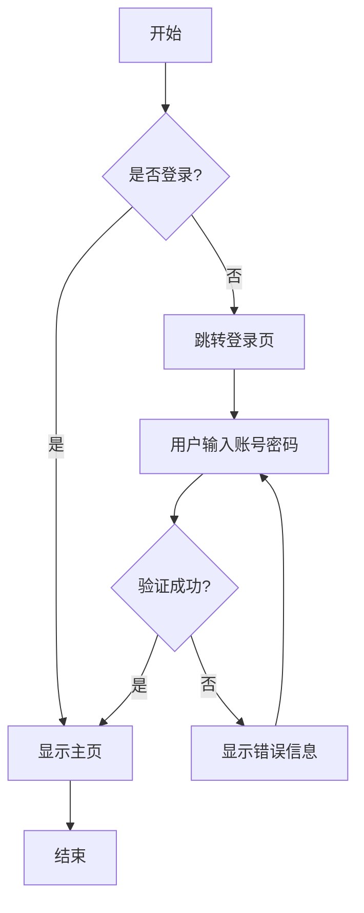

#### 时序图

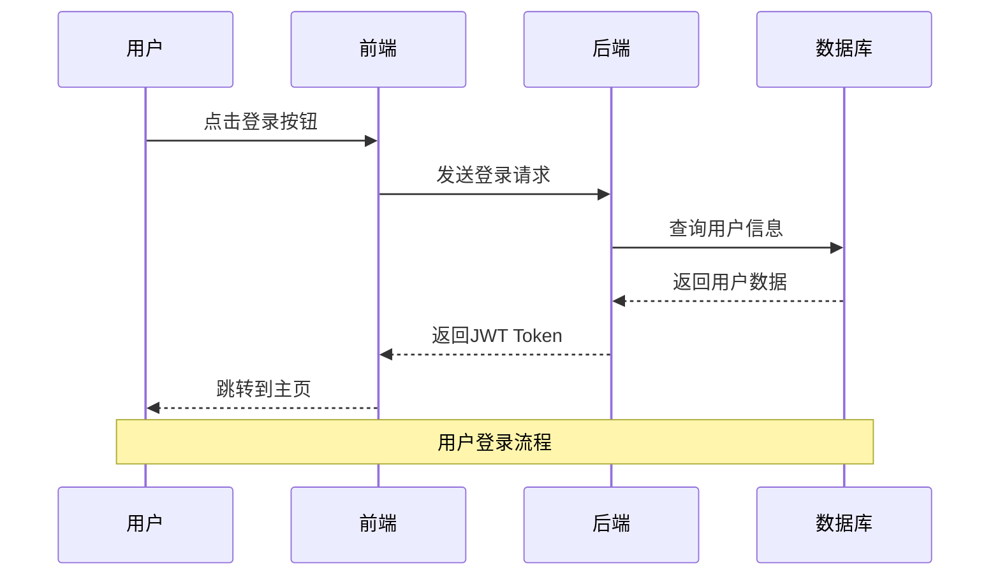

#### 甘特图

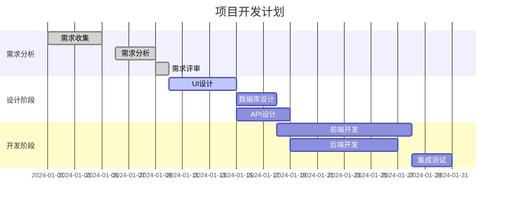

#### 类图

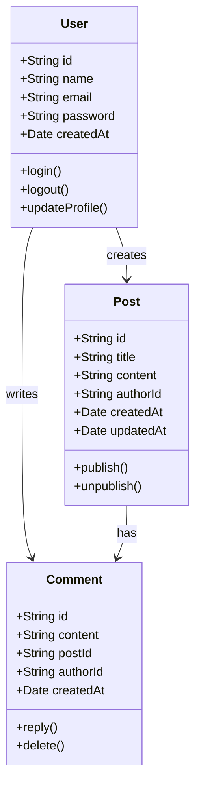

#### 状态图

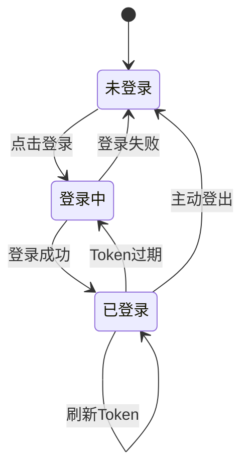

#### 饼图

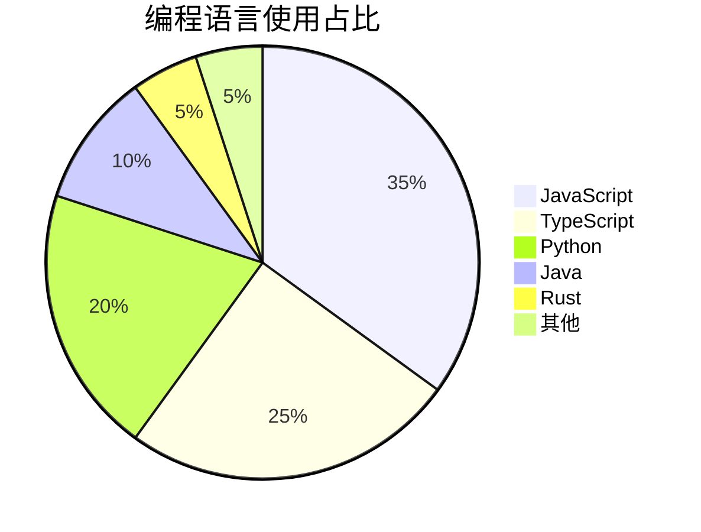

#### Git 流程图

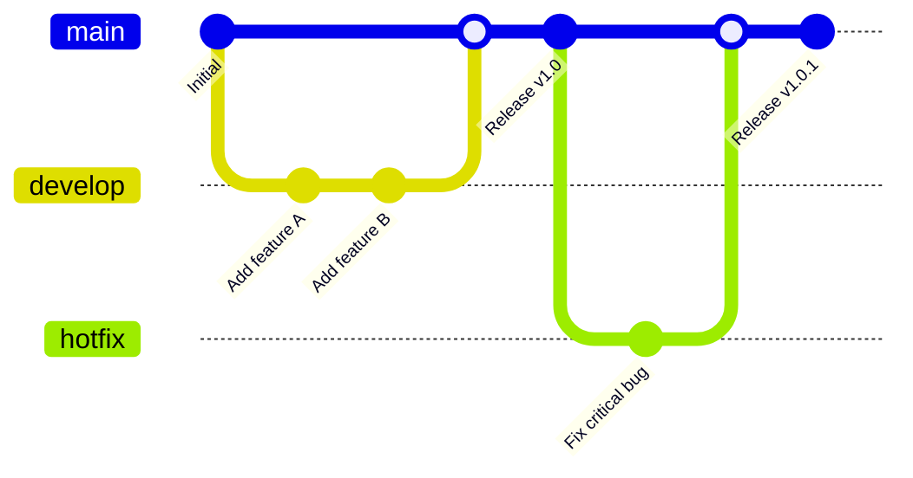

#### 实体关系图

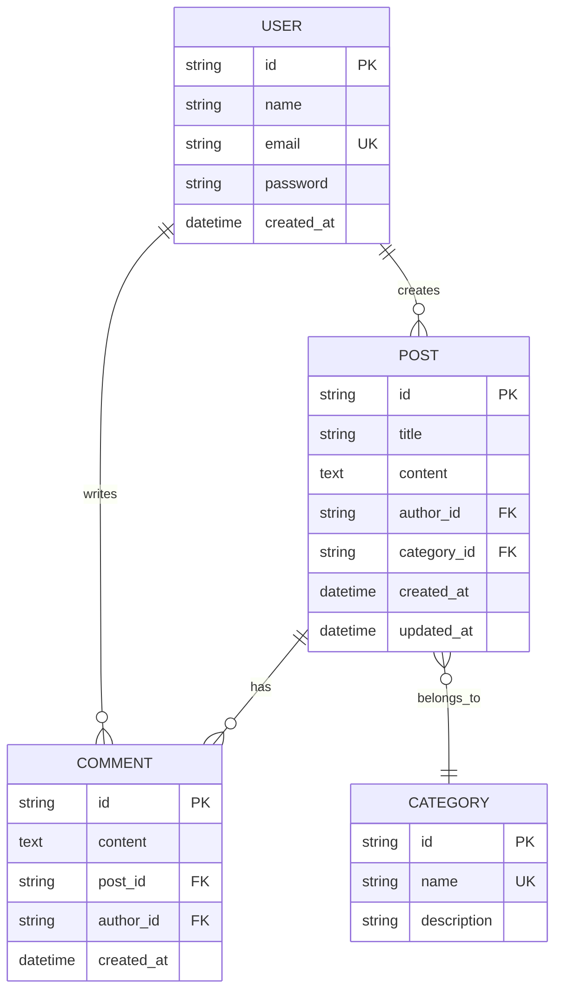

#### 用户旅程图

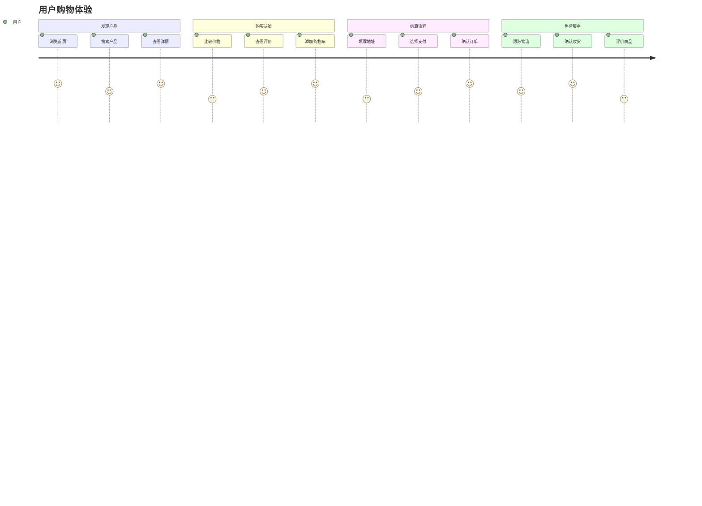


### PlantUML 图表

#### 用例图

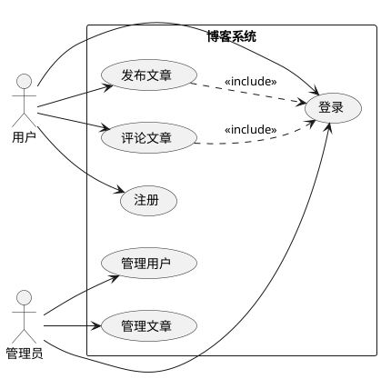

#### 活动图

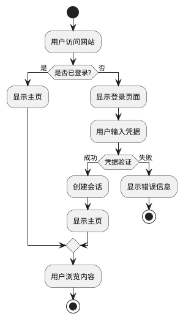

### Graphviz DOT 图

#### 系统架构图

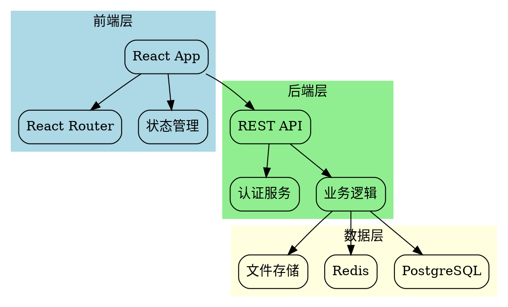

### D3.js 图表

#### 力导向图

```javascript
// D3.js 力导向图示例
const nodes = [
  {id: "React", group: 1},
  {id: "Vue", group: 1},
  {id: "Angular", group: 1},
  {id: "JavaScript", group: 2},
  {id: "TypeScript", group: 2},
  {id: "Node.js", group: 3},
  {id: "Express", group: 3},
  {id: "MongoDB", group: 4},
  {id: "PostgreSQL", group: 4}
];

const links = [
  {source: "React", target: "JavaScript"},
  {source: "Vue", target: "JavaScript"},
  {source: "Angular", target: "TypeScript"},
  {source: "Node.js", target: "JavaScript"},
  {source: "Express", target: "Node.js"},
  {source: "MongoDB", target: "Node.js"},
  {source: "PostgreSQL", target: "Node.js"}
];
```

### ASCII 流程图

```
用户请求流程：

┌─────────┐    HTTP请求    ┌─────────┐    查询数据    ┌─────────┐
│  用户   │ ──────────────> │  服务器  │ ──────────────> │ 数据库  │
└─────────┘                └─────────┘                └─────────┘
     ^                           │                           │
     │         HTTP响应          │                           │
     └───────────────────────────┘                           │
                                 │         返回结果          │
                                 └───────────────────────────┘

API 调用链：

Client ──> Gateway ──> Auth Service ──> Business Service ──> Database
   │                        │                    │               │
   │                        │                    │               │
   └── Response ←─── Token ←─── Validation ←──── Data ←─────────┘
```

### 思维导图

```
前端技术栈
├── 框架
│   ├── React
│   │   ├── Hooks
│   │   ├── Context
│   │   └── Suspense
│   ├── Vue
│   │   ├── Composition API
│   │   ├── Vuex/Pinia
│   │   └── Vue Router
│   └── Angular
│       ├── Components
│       ├── Services
│       └── RxJS
├── 构建工具
│   ├── Vite
│   ├── Webpack
│   └── Rollup
├── 样式
│   ├── CSS
│   ├── Sass/SCSS
│   ├── Tailwind CSS
│   └── Styled Components
└── 测试
    ├── Jest
    ├── Vitest
    ├── Cypress
    └── Playwright
```

### React Flow 交互式图表

#### 简单流程图

<SimpleFlowExample />

#### 系统架构图

<SystemArchExample />
