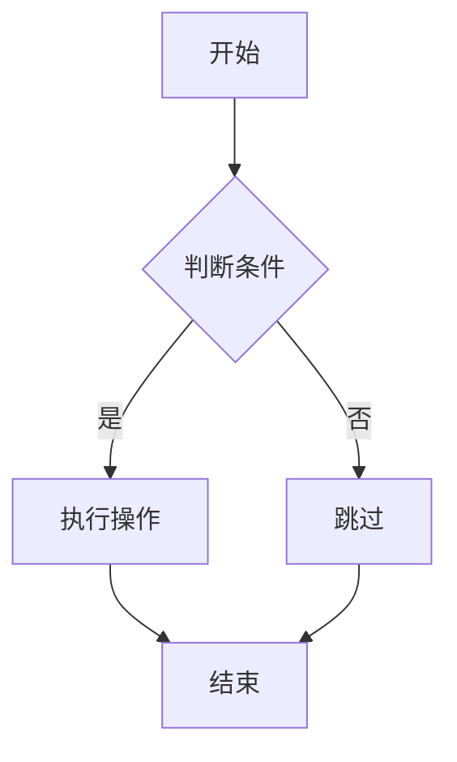
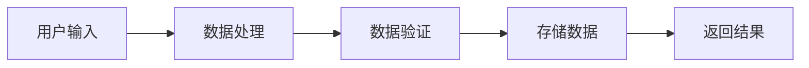
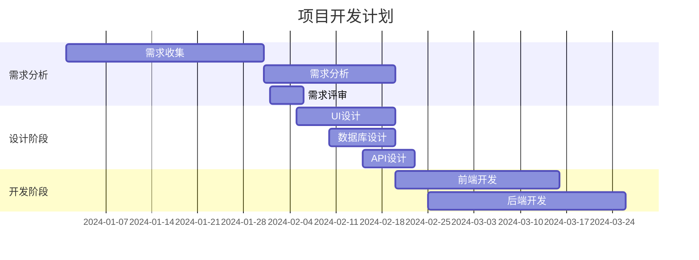
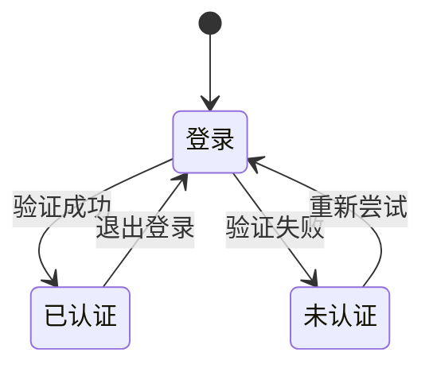

# 清理测试

这是一个简单的段落，用来测试我们的MDX渲染系统。

## 基础功能测试

这里我们测试基本的 Markdown 功能。

### 文本格式

这是**粗体**文本和*斜体*文本的示例。

### 列表测试

1. 第一个项目
2. 第二个项目
3. 第三个项目

## 代码块测试

下面是一个JavaScript代码示例：

```javascript
function hello() {
    console.log("Hello World");
    return "Hello";
}
```

## Mermaid 图表测试

这里测试Mermaid图表的渲染：



## 高级功能

### 数据流图



### 甘特图测试



### 状态图



## 总结

这个测试页面展示了我们MDX系统的各种功能，包括文本渲染、代码高亮和图表生成。
