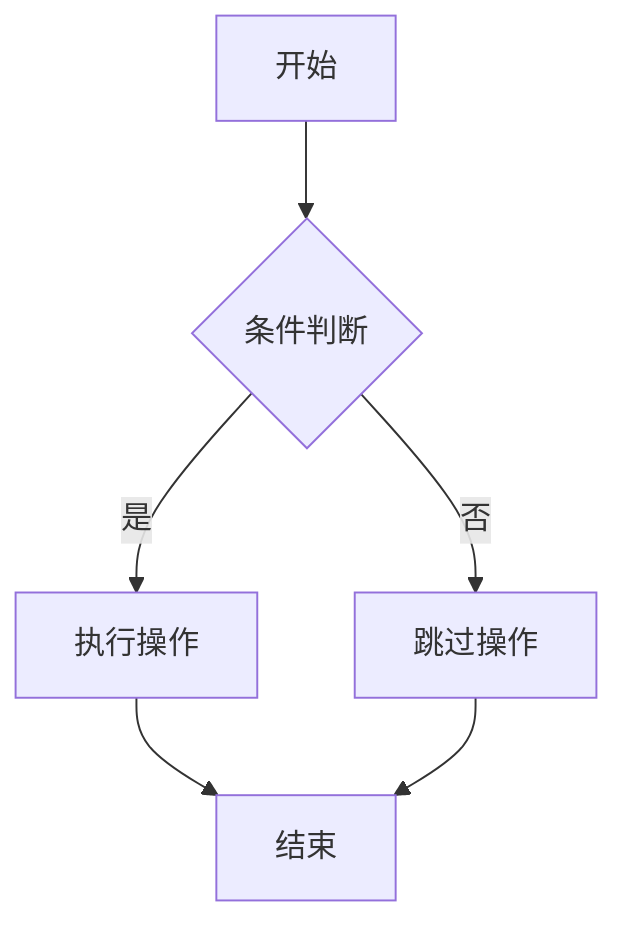
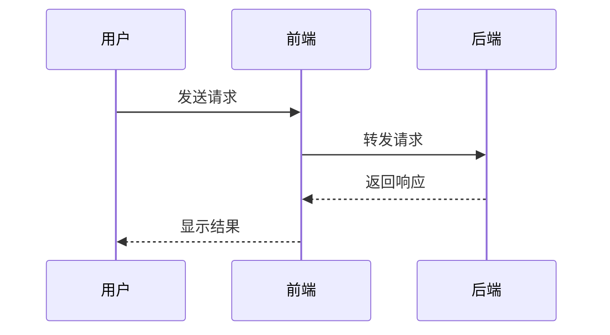
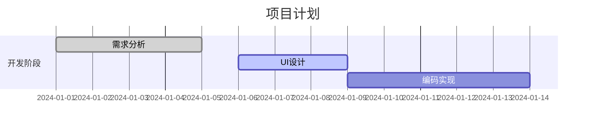
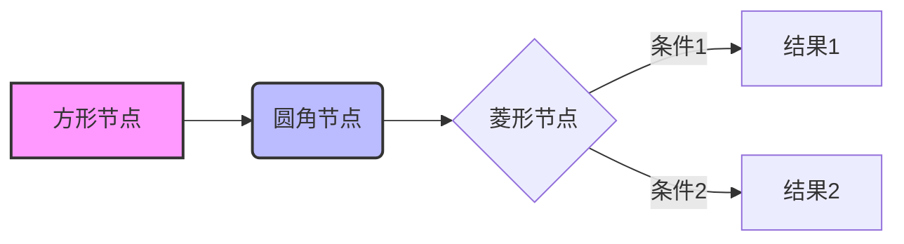

# 流程图和图表支持

本项目支持多种流程图和图表渲染方案，让你可以在 MDX 文档中创建丰富的可视化内容。

## 🎯 支持的图表类型

### 1. Mermaid 图表（静态）

Mermaid 是最流行的文本到图表工具，支持多种图表类型：

#### 基本流程图



#### 时序图



#### 甘特图



#### 类图

```mermaid
classDiagram
    class User {
        +String name
        +String email
        +login()
        +logout()
    }

    class Post {
        +String title
        +String content
        +publish()
    }

    User ||--o{ Post : creates
```

### 2. React Flow 图表（交互式）

React Flow 提供交互式的流程图组件，支持拖拽、缩放等操作。

#### 使用方式

在 MDX 文件中直接使用组件：

```mdx
<SimpleFlowExample />
<SystemArchExample />
```

#### 自定义 React Flow 图表

你可以创建自定义的 React Flow 组件：

```tsx
import { ReactFlowChart } from "@/components/mdx/ReactFlowChart";
import type { Node, Edge } from "reactflow";

const customNodes: Node[] = [
  {
    id: "1",
    data: { label: "自定义节点" },
    position: { x: 100, y: 100 },
  },
];

const customEdges: Edge[] = [{ id: "e1-2", source: "1", target: "2" }];

export function CustomFlowChart() {
  return <ReactFlowChart nodes={customNodes} edges={customEdges} />;
}
```

## 🔧 配置说明

### Mermaid 配置

Mermaid 图表通过 `MermaidChart` 组件渲染，配置在 `frontend/src/components/mdx/MermaidChart.tsx` 中：

```tsx
mermaid.initialize({
  theme: "default",
  themeVariables: {
    primaryColor: "#3b82f6",
    primaryTextColor: "#1f2937",
    // ... 更多主题变量
  },
});
```

### React Flow 配置

React Flow 组件配置在 `frontend/src/components/mdx/ReactFlowChart.tsx` 中，包含：

- 控制面板（Controls）
- 小地图（MiniMap）
- 背景网格（Background）
- 自动适应视图（fitView）

## 📝 最佳实践

### 1. 选择合适的图表类型

- **静态图表**：使用 Mermaid，适合文档说明
- **交互式图表**：使用 React Flow，适合复杂的系统架构展示

### 2. Mermaid 语法技巧



### 3. React Flow 节点样式

```tsx
const styledNode: Node = {
  id: "styled",
  data: { label: "样式化节点" },
  position: { x: 100, y: 100 },
  style: {
    backgroundColor: "#e1f5fe",
    border: "2px solid #0277bd",
    borderRadius: "8px",
    padding: "10px",
  },
};
```

## 🎨 主题定制

### Mermaid 主题

可以通过修改 `MermaidChart.tsx` 中的主题变量来定制外观：

```tsx
themeVariables: {
  primaryColor: "#your-color",
  primaryTextColor: "#your-text-color",
  primaryBorderColor: "#your-border-color",
  // ... 更多变量
}
```

### React Flow 主题

React Flow 使用 CSS 变量进行主题定制，可以在全局 CSS 中覆盖：

```css
.react-flow {
  --rf-node-bg: #ffffff;
  --rf-node-border: #e2e8f0;
  --rf-edge-stroke: #64748b;
}
```

## 🚀 扩展功能

### 添加新的图表类型

1. 安装相应的图表库
2. 创建新的组件文件
3. 在 `mdx-components.tsx` 中注册组件
4. 在 MDX 文件中使用

### 自定义节点类型

对于 React Flow，可以创建自定义节点类型：

```tsx
const customNodeTypes = {
  customNode: CustomNodeComponent,
};

// 在 ReactFlowChart 中使用
<ReactFlow nodeTypes={customNodeTypes} />;
```

## 📚 参考资源

- [Mermaid 官方文档](https://mermaid.js.org/)
- [React Flow 官方文档](https://reactflow.dev/)
- [MDX 组件集成指南](./05-import-and-components.md)
